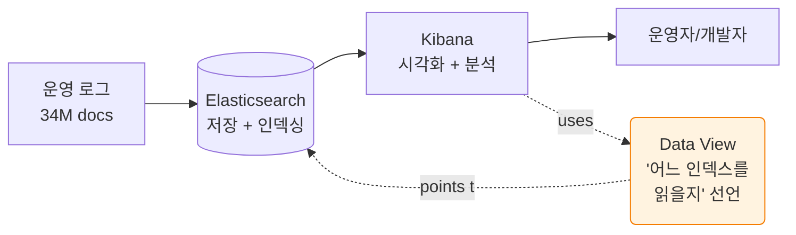

# 00. 사전 준비 (5분)

> **목표**: Kibana 에 로그인하고 우리 데이터를 볼 수 있는 **Data view** 까지 만든다.
> 모든 후속 문서는 여기까지 끝났다는 가정으로 시작합니다.

---

## 0.1 Kibana 가 무엇이고 왜 Data View 가 먼저인가



**Kibana** = ES 위의 GUI. 직접 ES 에 쿼리해도 되지만 일상은 Kibana 가 편함.
**Data View** = "어느 인덱스 패턴을 다룰지" 한 번 선언해 두면 Discover/Lens/Dashboard 가 모두 그걸 가리킴.

> **Oracle 비유**: Data View ≈ Oracle 의 **VIEW** 또는 **synonym**.
> 매번 `SELECT FROM api_logs_2026_04_19` 쓰지 않고, `api_logs_*` 라는 가상 테이블을 한 번 만들고 모든 query 에서 그걸 사용.

---

## 0.2 접속

### 1단계: 비밀번호 확인

```bash
grep ELASTIC_PASSWORD /home/ubuntu/workspace/specfromlog/elastic/.env
# → ELASTIC_PASSWORD=<본인 환경의 실제 비밀번호>
```

### 2단계: Kibana 열기

브라우저 **http://localhost:5601** 접속.

> 원격 호스트면 SSH 터널 먼저:
> ```
> ssh -L 5601:localhost:5601 -L 9200:localhost:9200 ubuntu@<host>
> ```

### 3단계: 로그인

- Username: `elastic`
- Password: 위 1단계 값

✅ **검증**: 좌측 햄버거 메뉴 (≡) 가 보이면 성공.

---

## 0.3 Kibana 메뉴 구조 (3분 통독)

```
≡ 메뉴
├─ 📊 Analytics      ← 가장 많이 씀
│   ├─ ⭐⭐⭐ Discover    (자유 탐색·KQL)
│   ├─ ⭐⭐⭐ Dashboard   (시각화 조합)
│   └─ ⭐⭐ Visualize Library  (Lens 차트 만들기)
├─ 🩺 Observability  ← 알람·SLO·Logs streaming
│   └─ ⭐⭐ Alerts
├─ 🔍 Search         ← 운영 로그엔 안 씀
├─ 🛡️ Security       ← 보안팀 한정
└─ ⚙️ Management
    ├─ ⭐⭐⭐ Stack Management → Data Views ⭐ (지금 갈 곳)
    └─ ⭐⭐⭐ Dev Tools (ES 쿼리 직접)
```

📌 **이번 가이드 동선**: 대부분 **Analytics** + **Dev Tools**.

> 📚 **사이드바의 모든 메뉴 의미·용도·실무 빈도** 가 궁금하면 [00b-kibana-sidebar.md](00b-kibana-sidebar.md) (10분) 통독 추천. 이후 reference 로 다시 펼쳐 보기 좋음.

---

## 0.4 Data View 만들기

### 단계

1. ≡ → **Stack Management** → 좌측 **Kibana 섹션 → Data Views**
2. 우상단 **`Create data view`** 버튼
3. 입력:
   - **Name**: `api-logs`
   - **Index pattern**: `api-logs-*` ← 끝의 `*` 필수 (와일드카드)
   - **Timestamp field**: `@timestamp` ← 자동 감지될 것
4. **Save data view to Kibana** 클릭

⚠️ **주의**: `api-logs-*` 입력 후 우측에 매칭 인덱스 목록이 50개 가량 나타나야 합니다 (`api-logs-account-2026.04.19` 등). 0개면 ES 데이터가 없거나 이름 오타.

5. 같은 방식으로 한 번 더:
   - Name: `legacy-api-logs`
   - Pattern: `legacy-api-logs-*`
   - Timestamp: `@timestamp`

### ✅ 검증

Data Views 목록에 둘 다 보이면 OK:

```
api-logs           api-logs-*           Index pattern  ⋯
legacy-api-logs    legacy-api-logs-*    Index pattern  ⋯
```

---

## 0.5 첫 데이터 확인 (30초)

### Discover 로 가기

≡ → **Analytics → Discover**

좌측 상단 data view 드롭다운에서 `api-logs` 선택.

### 시간 범위 설정

우상단 시간 피커:
- **Last 30 days** 또는
- **Absolute → 2026-04-19 ~ 2026-04-26**

### 화면 구조

```
┌─ KQL 검색창 ─────────────────────────────────────┐ [시간 피커]
│ filter your data using KQL syntax              │ Last 30 days  ↻
└──────────────────────────────────────────────────┘
┌─ 사이드바: 필드 목록 ┐ ┌─ 메인: 결과 + 차트 ─────────┐
│ ☆ @timestamp        │ │  📊 시간별 문서 수 막대그래프  │
│ ☆ api_path          │ │  ▼                          │
│ ☆ http_method       │ │  Time         | _source     │
│ ☆ service_name      │ │  Apr 26 12:40 | {…}         │
│ ☆ data.resultCode   │ │  Apr 26 12:40 | {…}         │
│ ☆ elapsed_ms        │ │  ⋯                          │
│ ⋯                    │ │                             │
└──────────────────────┘ └─────────────────────────────┘
```

### ✅ 검증

상단 막대그래프에 7개 막대 (각 일자) 가 보이고, 우상단 hit count 가 **9,000,000+ docs** 표기.

> 안 보이면 [99-troubleshooting.md](99-troubleshooting.md) §"hit count 0 일 때".

---

## 0.6 Worked Example: "지금 데이터의 가장 빠른/늦은 timestamp는?"

이 케이스를 3가지 방법으로 풀어 보면 Discover / Dev Tools / aggregation 의 차이가 한눈에 들어옵니다.

### 방법 ① Discover (UI 만)

1. data view: `api-logs`
2. 시간 피커: `Last 30 days`
3. 결과 테이블 헤더에서 **`@timestamp`** 컬럼 옆 ▲▼ 클릭 → **Sort old → new**
4. 첫 행이 가장 빠른 시각

> **Oracle 비유**: `SELECT * FROM api_logs ORDER BY ts ASC FETCH FIRST 1 ROW`

### 방법 ② Dev Tools — `min`/`max` aggregation (권장 학습)

≡ → **Management → Dev Tools** → 좌측 콘솔에 입력:

```
GET api-logs-*/_search
{
  "size": 0,
  "aggs": {
    "earliest": { "min": { "field": "@timestamp" } },
    "latest":   { "max": { "field": "@timestamp" } }
  }
}
```

▶︎ 실행. 응답:

```json
"aggregations": {
  "earliest": {
    "value": 1776358800000,
    "value_as_string": "2026-04-19T15:00:00.000Z"
  },
  "latest":   {
    "value": 1777179596756,
    "value_as_string": "2026-04-26T14:59:56.756Z"
  }
}
```

> **Oracle 비유**:
> ```sql
> SELECT MIN(ts) AS earliest, MAX(ts) AS latest FROM api_logs
> ```

📌 핵심 매핑:
- `"size": 0` ↔ 결과 ROW 안 가져옴 (집계만)
- `"aggs"` ↔ `GROUP BY ... HAVING ... + AGGREGATE FUNCTIONS`
- `"min"/"max"` ↔ `MIN()`/`MAX()`

### 방법 ③ Dev Tools — 정렬 + size:1 (원본 문서까지 보고 싶을 때)

```
GET api-logs-*/_search
{
  "size": 1,
  "_source": ["@timestamp", "service_name", "api_path"],
  "sort": [{ "@timestamp": "asc" }]
}
```

응답:
```json
"hits": {
  "hits": [{
    "_index": "api-logs-account-2026.04.19",
    "_source": {
      "@timestamp": "2026-04-19T15:00:00.000Z",
      "service_name": "account-service",
      "api_path": "/api/v1/accounts/inquiry"
    }
  }]
}
```

> **Oracle 비유**:
> ```sql
> SELECT ts, service_name, api_path FROM api_logs
> ORDER BY ts ASC FETCH FIRST 1 ROW
> ```

### 어느 방법을 언제?

| 상황 | 권장 |
|----|----|
| 빠르게 확인만 | ① Discover |
| 다른 통계도 같이 (count/avg/sum) | ② aggregation |
| 그 시점의 원본 문서까지 | ③ sort+size:1 |

---

## 0.7 ✅ 사전 준비 완료 체크리스트

- [ ] Kibana 로그인 성공
- [ ] Data View 2개 생성 (`api-logs`, `legacy-api-logs`)
- [ ] Discover 에서 데이터 보임 (히트 count 9M+)
- [ ] Dev Tools 에서 위 ① / ② / ③ 중 최소 1개 실행 성공

---

## ❓ Self-check

1. **Q.** Data View 와 Index 의 차이는?
   <details><summary>A</summary>Index = ES의 실제 저장 단위(테이블처럼). Data View = Kibana 에서 여러 인덱스를 묶어 가리키는 가상 핸들 (Oracle 의 VIEW/synonym).</details>

2. **Q.** Discover 에서 `service_name : "account-service"` 라고 검색하면 무슨 뜻?
   <details><summary>A</summary>KQL 문법: `<field> : <value>`. Oracle `WHERE service_name = 'account-service'` 와 동일.</details>

3. **Q.** `"size": 0` 을 쓰는 이유?
   <details><summary>A</summary>"실제 문서 본문은 필요 없고 aggregation 결과만 받는다" — 네트워크/메모리 절약.</details>

---

다음: **[01-quickwin.md](01-quickwin.md)** — 30분 안에 실제 동작하는 dashboard 1개를 만듭니다.
