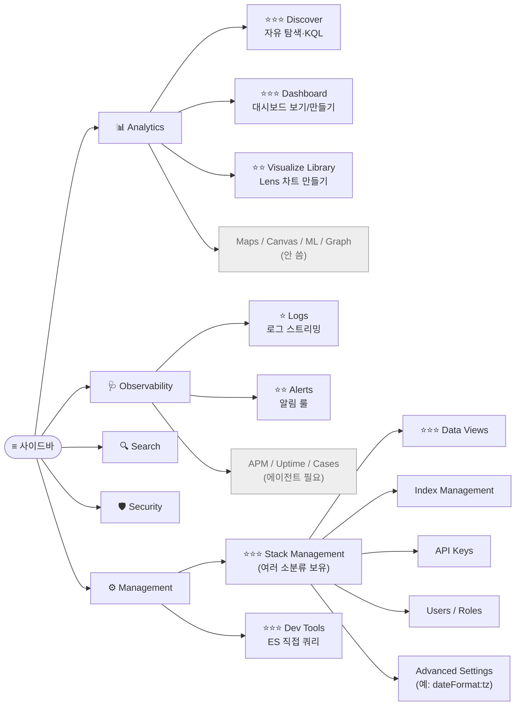

# 00b. Kibana 사이드바 — 대분류·소분류 길잡이

> **목표**: Kibana 좌측 사이드바(≡) 의 모든 메뉴가 **무엇을 위한 것이고**, **실무에서 자주 쓰이는 것은 무엇인지** 한 눈에 파악.
> **용도**: 처음 한 번 통독 → 이후 reference 로 검색.
> **선수**: [00-prerequisites.md](00-prerequisites.md) 까지 (Kibana 로그인)

---

## 사이드바 전체 구조 (한 화면 정리)



**별 등급 의미** (실무 사용 빈도):

| 표기 | 의미 | 일주일에 |
|------|------|---------|
| ⭐⭐⭐ | 거의 매일 | 매번 |
| ⭐⭐ | 주에 몇 번 | 1~3회 |
| ⭐ | 가끔 (운영 사고/특수 분석) | 가끔 |
| (없음) | 거의 안 씀 / 별도 에이전트 필요 | — |

---

## 대분류 1. 📊 Analytics

> **언제**: "데이터 보고 싶다, 차트 그리고 싶다, dashboard 보고 싶다" — 일상 분석의 본진.

| 소분류 | 빈도 | 용도 | 실무 예시 |
|--------|------|------|----------|
| **Discover** | ⭐⭐⭐ | 자유 탐색·KQL 검색·필드 분포·원본 문서 | "어제 오후 3시 결제 실패한 traceId 가 뭐였지?" → KQL 한 줄로 즉시 확인 |
| **Dashboard** | ⭐⭐⭐ | 시각화 조합 보기·만들기 | 매일 아침 "API 운영 현황" dashboard 한 번 훑어 보고 회의 시작 |
| **Visualize Library** | ⭐⭐ | Lens / TSVB / Maps 등 시각화를 만들고 저장 | "Top 10 에러 코드" 차트 한 번 만들고 저장 → 여러 dashboard 에서 재사용 |
| **Canvas** | (없음) | 인포그래픽 슬라이드 | 임원 보고 슬라이드 (보통 안 씀) |
| **Maps** | (없음) | 지리 시각화 | 매장별 지도 (위경도 데이터 있어야) |
| **Machine Learning** | ⭐ | 이상치 자동 탐지 (anomaly) | "API 응답시간 평소와 다르게 튀는 시점 자동 감지" — 라이선스/리소스 부담 |
| **Graph** | (없음) | 관계 분석 | 사기 조사 등 특수 (보통 안 씀) |

📌 **우선 학습**: **Discover → Dashboard → Visualize Library** 3개만 익히면 80% 해결.

### Discover 예시 KQL

```
service_name : "payment-service" and not data.resultCode : "0000"
```
→ 결제 서비스의 에러 응답만 즉시 추출

```
elapsed_ms > 1000 and api_path : *transfer*
```
→ 1초 이상 걸린 transfer 호출

---

## 대분류 2. 🩺 Observability

> **언제**: "운영 상태가 정상인지 확인, 알람 만들고 싶다, 이상 감지하고 싶다" — SRE/DevOps 영역.

| 소분류 | 빈도 | 용도 | 실무 예시 |
|--------|------|------|----------|
| **Overview** | ⭐ | 운영 KPI 한 화면 (시스템 상태/에러/latency/로그) | 출근하면 한 번 슬쩍 |
| **Logs (Stream)** | ⭐ | 시간 흐름 따라 로그 streaming 보기 (tail -f 같은) | "지금 무슨 일이 일어나고 있는지" 실시간 확인 |
| **Infrastructure** | (없음) | 호스트·컨테이너 메트릭 | Metricbeat agent 설치되어 있으면 |
| **APM (Services)** | ⭐ | 애플리케이션 성능 모니터링 (분산 추적, error tracking) | APM agent 가 설치된 경우 — Spring Boot 등 |
| **Uptime** | (없음) | 외부 헬스체크 (Heartbeat) | URL 외부에서 ping |
| **Synthetics** | (없음) | 합성 모니터링 (브라우저 시뮬레이션) | 결제 flow E2E |
| **Alerts** | ⭐⭐ | 알림 룰 만들기/관리 | "에러율 5% 초과 시 Slack" 알람 룰 등록 |
| **Cases** | ⭐ | 인시던트 case 관리 | 사고 발생 시 timeline 기록 |
| **SLOs** | ⭐ | Service Level Objective 설정 | "월 99.9% 가용성" 목표 추적 |

📌 **운영자 우선**: **Alerts** ⭐⭐. 나머지는 Beats/APM agent 설치 필요해서 사내 인프라 따라 다름.

### Alerts 예시

```
Rule type: Elasticsearch query
Query:     log_type:"out" and not data.resultCode:"0000"
Condition: count > 100 in last 5 minutes
Action:    Slack #alerts 채널로 알림
```
→ 5분간 에러 100건 넘으면 자동 알림

---

## 대분류 3. 🔍 Search (Enterprise Search)

> **언제**: 전사 검색엔진·웹사이트 검색 만들 때. **운영 로그 분석에는 거의 안 씀**.

| 소분류 | 빈도 | 용도 |
|--------|------|------|
| Overview | (없음) | Search 솔루션 진입점 |
| Content | (없음) | 검색 대상 컨텐츠 관리 |
| Engines (App Search) | (없음) | 검색엔진 인스턴스 |
| Web Crawler | (없음) | 사이트 크롤링 |
| Search Applications | (없음) | 앱별 검색 |

📌 **결론**: SpecFromLog 같은 운영 로그 분석에서는 **이 대분류 무시**.

---

## 대분류 4. 🛡️ Security (옵션)

> **언제**: SIEM 식 보안 모니터링 / 위협 탐지. ES Security 모듈을 활성화한 환경.

| 소분류 | 빈도 | 용도 |
|--------|------|------|
| Overview | ⭐ | 보안 KPI |
| Alerts (Detections) | ⭐ | 위협 탐지 룰 |
| Hosts / Users / Network | (없음) | 객체별 분석 |
| Investigations | (없음) | 사건 분석 |

📌 **결론**: 보안 전담팀이 아니면 **이 대분류도 잘 안 씀**.

---

## 대분류 5. ⚙️ Management

> **언제**: "Kibana/ES 의 설정·자원을 관리하고 싶다". **하지만 그 안의 Data Views / Dev Tools 는 매일 씀.**

| 소분류 | 빈도 | 용도 | 실무 예시 |
|--------|------|------|---------|
| **Stack Management** | ⭐⭐⭐ | 컨테이너 (아래 다시 분기) | 데이터 view, 인덱스, 사용자 관리 |
| **Dev Tools** | ⭐⭐⭐ | ES REST API 직접 호출 | `GET _cat/indices` 즉시 실행 |
| Integrations | ⭐ | Beats / Agent 통합 추가 | 새 데이터 소스 연결 |

### Stack Management 의 소분류 (자주 쓰는 것만)

```
Stack Management
├─ ⭐⭐⭐ Kibana / Data Views    ← 가장 많이 씀
├─ ⭐⭐ Kibana / Saved Objects   ← dashboard/visual export·import
├─ ⭐⭐ Kibana / Advanced Settings  ← timezone, formats
├─ ⭐⭐ Kibana / Spaces           ← 환경별 공간 분리
├─ ⭐ Data / Index Management   ← 인덱스 보기/삭제
├─ ⭐ Data / Index Lifecycle    ← 보존 기간 정책
├─ ⭐⭐ Security / API Keys      ← API key 발급
├─ ⭐ Security / Users           ← 사용자 추가
├─ ⭐ Security / Roles           ← 권한 정의
└─ Stack / License Management    ← (거의 안 씀)
```

### Dev Tools 사용 예시

```
GET _cat/indices/api-logs-*?v
```
→ 인덱스 목록 + docs.count + size

```
GET api-logs-*/_count
{ "query": { "term": { "service_name": "payment-service" } } }
```
→ 결제 서비스 호출 총 건수

```
POST _security/api_key
{
  "name": "specfromlog-readonly",
  "role_descriptors": { ... }
}
```
→ API Key 발급

📌 **포인트**: Dev Tools 는 **ES REST API 학습장이자 운영 도구**. SQL Developer 의 worksheet 같은 위치.

---

## 실무 빈도 TOP 7 (꼭 익히기)

```
🥇 ⭐⭐⭐ Analytics → Discover                  자유 탐색
🥈 ⭐⭐⭐ Analytics → Dashboard                 모니터링 보드
🥉 ⭐⭐⭐ Management → Dev Tools                ES 쿼리 직접
   ⭐⭐⭐ Stack Management → Data Views         쿼리 대상 정의
   ⭐⭐  Analytics → Visualize Library          차트 만들기
   ⭐⭐  Observability → Alerts                 알림 룰
   ⭐⭐  Stack Management → Saved Objects       export/import
```

이 7개만 능숙하면 **실무 95% 해결**. 나머지는 필요할 때 그때 그때 reference 보면 됨.

---

## ASCII 사이드바 미니 맵 (스크롤 없이 한 화면)

```
┌────────────────────────────────────────────────────────────────┐
│ ≡  KIBANA 사이드바                                              │
├────────────────────────────────────────────────────────────────┤
│  📊 Analytics                                                   │
│  ├─ ⭐⭐⭐ Discover         ← 시작점                              │
│  ├─ ⭐⭐⭐ Dashboard         ← 운영 모니터링                       │
│  ├─ ⭐⭐  Visualize Library  ← 차트 만들기 (Lens)                │
│  └─ Maps · Canvas · ML · Graph ........... (보통 안 씀)         │
│                                                                  │
│  🩺 Observability                                               │
│  ├─ ⭐  Logs / APM / Uptime ............... (agent 필요)        │
│  ├─ ⭐⭐ Alerts              ← 알림 룰                           │
│  ├─ ⭐  Cases / SLOs                                            │
│  └─ Synthetics / Infrastructure ............ (보통 안 씀)        │
│                                                                  │
│  🔍 Search ........................... (운영 로그엔 거의 안 씀)   │
│                                                                  │
│  🛡️ Security ......................... (보안팀 한정)            │
│                                                                  │
│  ⚙️ Management                                                  │
│  ├─ ⭐⭐⭐ Stack Management                                       │
│  │   ├─ ⭐⭐⭐ Data Views                                        │
│  │   ├─ ⭐⭐ Saved Objects                                      │
│  │   ├─ ⭐⭐ Advanced Settings                                  │
│  │   ├─ ⭐⭐ Spaces                                             │
│  │   ├─ ⭐  Index Management / ILM                             │
│  │   └─ ⭐  Security (API Keys / Users / Roles)                │
│  └─ ⭐⭐⭐ Dev Tools                                            │
└────────────────────────────────────────────────────────────────┘
```

---

## "어디서 ___ 하지?" 빠른 답

| 하고 싶은 것 | 가야 할 곳 |
|--------------|----------|
| 어제 8시 에러 로그 보기 | Analytics → **Discover** + KQL filter |
| 운영 현황 매일 아침 확인 | Analytics → **Dashboard** (저장된 것 열기) |
| 새 차트 만들기 | Analytics → **Visualize Library → Create** |
| 빠르게 ES 쿼리 한 번 | Management → **Dev Tools** |
| 새 인덱스 패턴 추가 | Stack Management → **Data Views** |
| 인덱스 용량/문서 수 보기 | Dev Tools 에서 `GET _cat/indices?v` |
| 인덱스 통째로 삭제 | Stack Management → **Index Management** |
| API Key 발급 | Stack Management → **Security → API Keys** |
| 비밀번호 초기화 | Stack Management → **Security → Users** (또는 ES CLI) |
| dashboard 백업 | Stack Management → **Saved Objects → Export** |
| dashboard 다른 환경에 옮기기 | Saved Objects export/import (.ndjson) |
| 시간대 KST 로 표시 | Stack Management → **Advanced Settings → dateFormat:tz** |
| 알림 룰 만들기 | Observability → **Alerts → Create rule** |
| ES 클러스터 health | Dev Tools `GET _cluster/health` |
| Kibana 자체 health | (보통 직접 안 봄) |

---

## ❓ Self-check

1. **Q.** 매일 아침 회의 전에 "어제 운영 어땠나" 한 화면 보고 싶다. 어디?
   <details><summary>A</summary>Analytics → Dashboard 에 만든 "API 운영 현황" 대시보드 열기.</details>

2. **Q.** 어떤 사용자가 비밀번호 잊어버렸다. 어디?
   <details><summary>A</summary>Stack Management → Security → Users → 해당 사용자 → Reset password (또는 ES CLI `bin/elasticsearch-reset-password`).</details>

3. **Q.** "전체 인덱스 중 가장 큰 거?" 를 한 줄로 알고 싶다. 어디서 어떻게?
   <details><summary>A</summary>Management → Dev Tools → `GET _cat/indices?v&s=store.size:desc`.</details>

4. **Q.** 사내 팀에 "이 dashboard 그대로 만들어 줘" 요청이 왔을 때 가장 빠른 방법?
   <details><summary>A</summary>Stack Management → Saved Objects → Export 로 .ndjson 파일을 받아 보낸 뒤 상대가 같은 화면에서 Import.</details>

---

다음: 익숙한 메뉴 알았으니 **[01-quickwin.md](01-quickwin.md)** 으로 첫 dashboard 만들기 (이미 했다면 [02-lens-charts.md](02-lens-charts.md) 시각화 8종 레시피).
