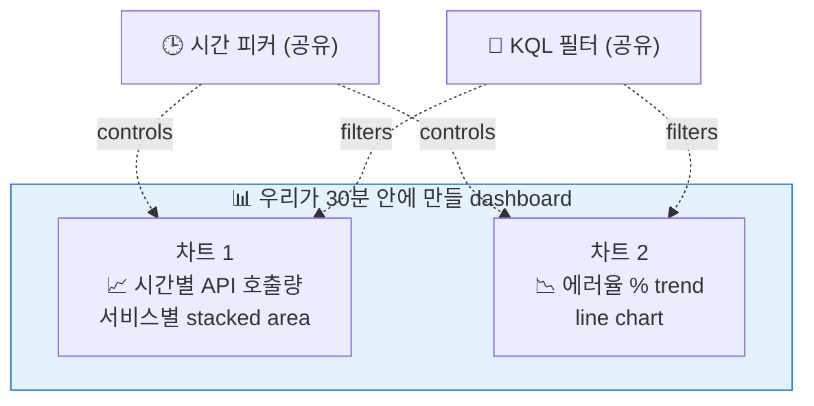
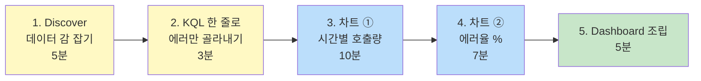

# 01. Quick Win — 30분 안에 첫 Dashboard 1개 만들기

> **목표**: 두 개의 차트를 만들고, 한 dashboard 에 묶어, 시간 피커 하나로 둘 다 동시 갱신되는 구조까지.
> **선수**: [00-prerequisites.md](00-prerequisites.md) 완료 (Data view 2개 + Discover 데이터 보임)

---

## 무엇을 만들 것인가



**완성 모습**:

```
┌─ Dashboard: My First API Dashboard ────────────────────┐
│ 🔎 [KQL filter]              🕒 [Last 7 days ▼] [↻]   │
├────────────────────────────────────────────────────────┤
│  📈 Hourly API Calls by Service        📉 Error Rate %  │
│  ┌──────────────────────────────┐      ┌─────────────┐ │
│  │ █▆▆▆▇▇█  ▆▆▇▇▇▇█             │      │ ─╲    ╱─    │ │
│  │ ▆▅▅▆▇▇█  ▅▅▆▆▇▇█  (stacked)  │      │   ╲__╱      │ │
│  │ █▆▆▆▇▇█  ▆▆▇▇▇▇█             │      │             │ │
│  └──────────────────────────────┘      └─────────────┘ │
│  Apr 20  21  22  23  24  25  26       Apr 20    Apr 26 │
└────────────────────────────────────────────────────────┘
```

---

## 학습 흐름 (30분)



---

## Step 1 — Discover 에서 데이터 감 잡기 (5분)

### Why
시각화 만들기 전에 **데이터가 어떻게 생겼는지 손으로 만져 봐야** 차트 설정이 직관적.

### Do

1. ≡ → **Analytics → Discover**
2. data view: **`api-logs`** 선택
3. 시간 피커: **Last 7 days**
4. 좌측 사이드바에서 다음 필드들 클릭하며 분포 미리보기:
   - `service_name` → 8개 서비스 나옴
   - `api_path` → 35개 path
   - `http_method` → GET/POST/PUT/DELETE
   - `data.resultCode` → "0000", "9999", ...
   - `log_type` → "in", "out"
   - `elapsed_ms` → 분포 (out 만)

📌 **Oracle 비유**: Discover 의 사이드바 = `SELECT DISTINCT <column>, COUNT(*) FROM table GROUP BY <column>` 을 GUI 로 미리 보여주는 셈.

### ✅ Verify

- 막대그래프에 ~7개 막대 (각 일자)
- 우상단 hit count 가 9~10M
- 사이드바 클릭 → 분포 popup 이 즉시 뜸

---

## Step 2 — KQL 한 줄로 "에러만" 추출 (3분)

### Why
시각화에서 "에러" 라는 개념을 일관되게 쓰려면 먼저 **filter 식을 손에 익혀야** 함.

### Do

검색창(KQL)에 입력:

```
log_type : "out" and not data.resultCode : "0000"
```

✅ 결과: hit count 가 ~1.7M (전체의 ~17%) 로 줄어듬. 이게 "에러 응답" 정의.

### Oracle 비교

```
KQL                                                        Oracle SQL
log_type : "out"                                           log_type = 'out'
not data.resultCode : "0000"                               data.resultCode <> '0000'
log_type : "out" and not data.resultCode : "0000"          AND, OR 조합 그대로
http_method : ("GET" or "POST")                            http_method IN ('GET','POST')
api_path : *accounts*                                      api_path LIKE '%accounts%'
elapsed_ms > 500                                           elapsed_ms > 500
elapsed_ms : [100 to 500]                                  elapsed_ms BETWEEN 100 AND 500
```

📌 **포인트**:
- KQL 은 `:` 가 `=`
- 문자열 큰따옴표 `"…"` 권장 (소문자 `or` `and` `not`)
- 와일드카드 `*` 는 LIKE 의 `%` 와 같음

### Save 해 두기 (선택 30초)

오른쪽 디스크 아이콘 → **Save current query** → 이름 `errors-only` → Save.
나중에 dashboard 에서 이 이름으로 즉시 적용 가능.

---

## Step 3 — 차트 ① 시간별 API 호출량 (서비스별) — Lens (10분)

### Why
**"트래픽이 평소대로인가?"** — 가장 자주 묻는 1번 질문. 시간축 + 서비스별 stacked area 면 한눈에 보임.

### Do

#### 3.1 Lens 열기

≡ → **Analytics → Visualize Library** → 우상단 **`Create new visualization`** → **`Lens`**

#### 3.2 기본 설정

좌측 상단:
- Data view: **`api-logs`**

우상단 시간 피커: **Last 7 days**

#### 3.3 차트 타입 선택

우측 상단 차트 타입 드롭다운에서 **"Area stacked"** 선택.

#### 3.4 필드 드래그

좌측 사이드바에서 캔버스로 드래그:

| 필드 | 어디로 | 자동 설정되는 것 |
|------|--------|------------------|
| `@timestamp` | **Horizontal axis** | Date histogram, interval Auto |
| `Records` (가상 카운트) | **Vertical axis** | Count of records — 자동 |
| `service_name` | **Breakdown** | Top values 8 |

> 💡 `Records` 라는 필드는 사이드바에 따로 있음 — "총 행 수" 의미. Oracle 의 `COUNT(*)`.

#### 3.5 추가 미세조정

- 우측 패널에서 vertical axis 클릭 → 표시 옵션 확인
- breakdown (서비스) 의 색상 자동 할당됨

✅ **Verify**:
- X축에 7일치 시간 (Apr 20 ~ Apr 26 KST)
- Y축에 호출 수
- 8 가지 색상 stack 으로 서비스별 비중

#### 3.6 저장

우상단 **`Save and return`** 또는 **`Save`** → 이름 `Hourly API Calls by Service` → Save.

### Oracle 비유

```sql
SELECT
  TRUNC(ts, 'HH24')        AS hour,
  service_name             AS svc,
  COUNT(*)                 AS calls
FROM api_logs
WHERE ts BETWEEN <시작> AND <끝>
GROUP BY TRUNC(ts, 'HH24'), service_name
ORDER BY hour
```

→ Lens 가 위 query 를 GUI 로 빌드해 주는 셈.

📌 **트러블**: 차트가 비어 있으면? 시간 피커가 데이터 범위 밖일 가능성. **Last 30 days** 로 넓혀 보세요.

---

## Step 4 — 차트 ② 에러율 % trend — Formula 사용 (7분)

### Why
호출량이 늘어도 정상이면 OK 이지만 **에러율** 이 튀면 문제. % 비율이 KPI.

### Do

#### 4.1 새 Lens 시각화

다시 **Visualize Library → Create new → Lens**.

#### 4.2 차트 타입

**Line** (선그래프)

#### 4.3 필드 드래그

| 필드 | 어디로 |
|------|--------|
| `@timestamp` | Horizontal axis |
| **Vertical axis** ← 직접 추가 | "Add or drag-and-drop a field" 클릭 |

#### 4.4 Vertical axis 를 Formula 로

Vertical axis 의 작은 메뉴에서:
1. Function 영역에서 **`Formula`** 검색 / 선택
2. Formula 입력란에 다음 입력:

```
count(kql='log_type : "out" and not data.resultCode : "0000"')
  / count(kql='log_type : "out"')
```

3. Display 의 **Format** 을 **Percent** 로 (또는 Number → multiplier 100, suffix %)

✅ **Verify**:
- Y축이 0~50% 정도 사이를 오감
- 평균이 ~17% 근처 (우리 데이터의 에러 비율)

#### 4.5 저장

이름: `Error Rate %`. Save.

### Oracle 비유

```sql
SELECT
  TRUNC(ts, 'HH24') AS hour,
  COUNT(CASE WHEN log_type='out'
              AND data.resultCode <> '0000'
              THEN 1 END) * 100.0
    / COUNT(CASE WHEN log_type='out' THEN 1 END) AS error_rate_pct
FROM api_logs
GROUP BY TRUNC(ts,'HH24')
```

→ Formula `count(kql=...) / count(kql=...)` 가 위 `CASE WHEN ... / CASE WHEN ...` 와 1:1.

📌 **포인트**:
- Formula 는 **하위 쿼리 비슷한 표현식** 만들 때 강력
- `count(kql='…')` = 그 KQL 조건에 매칭되는 문서만 카운트 → 분자/분모 잡기 쉬움

---

## Step 5 — Dashboard 로 묶기 (5분)

### Why
시간 피커, KQL 필터를 두 차트에 **공유** 시키려면 같은 dashboard 에 올려야 함.

### Do

#### 5.1 새 Dashboard 만들기

≡ → **Analytics → Dashboard** → 우상단 **`Create dashboard`**

#### 5.2 패널 추가

상단 **`Add from library`** → 방금 저장한 두 visualizations 모두 선택 → **Add to dashboard**

> 또는 **`Create visualization`** 으로 dashboard 안에서 직접 만들 수도 있음.

#### 5.3 배치

마우스로 두 패널을 좌/우로 배치:

```
┌──────────────────┬──────────────────┐
│ Hourly API Calls │ Error Rate %     │
│   by Service     │                  │
│ (왼쪽 60%)       │ (오른쪽 40%)     │
└──────────────────┴──────────────────┘
```

각 패널 우상단 ⋮ → **Edit** 로 미세조정.

#### 5.4 시간 피커 / 필터 추가

상단:
- 시간 피커는 자동 (Last 7 days)
- 좌측 **`+ Add filter`** → field `service_name`, operator `is`, value `account-service` 같이 시범 추가
- 또는 KQL 검색창에 `service_name : "account-service"` → Enter

✅ **Verify**: 두 차트가 동시에 갱신되어 account-service 만 보임. 필터 제거 시 모두 보임.

#### 5.5 저장

**`Save`** → 이름 `My First API Dashboard` → Save.

---

## Step 6 — 동작 확인 (2분)

다음 시나리오로 직접 검증:

| 시도 | 기대 결과 |
|------|----------|
| 시간 피커 → "Last 24 hours" | 두 차트 모두 어제 ~ 오늘로 zoom in |
| KQL: `service_name : "account-service"` | 두 차트가 account-service 만 표시 |
| KQL: `service_name : "user-service" and not data.resultCode : "0000"` | 트래픽 차트는 user-service 만, 에러율 차트도 user-service 의 비율 |
| 차트 ② 위로 마우스 hover | 시각별 정확한 % 가 tooltip 으로 |
| 차트 ① 의 한 영역 클릭 → "Filter for value" | 그 서비스만 자동 필터 |

---

## ✅ Quick Win 완료 체크리스트

- [ ] Discover 에서 데이터 감 잡고 KQL 한 줄(에러만) 적용 가능
- [ ] Lens 로 stacked area chart 1개 만들어 저장
- [ ] Lens 로 Formula 기반 % chart 1개 만들어 저장
- [ ] 두 차트를 dashboard 에 묶고 시간 피커 / 필터 공유 동작 확인
- [ ] 자기 손으로 dashboard URL 복사 → 새 탭에서 같은 화면 보임

---

## ❓ Self-check

1. **Q.** dashboard 의 시간 피커 가 "Last 7 days" 일 때 차트는 정확히 어느 시각 데이터를 표시?
   <details><summary>A</summary>
   브라우저 timezone(KST) 기준 "지금"에서 -7일 = 168시간 윈도우. 내부적으로는 Kibana 가 KST → UTC 변환해 ES 에 `range` 쿼리. ES 의 @timestamp(UTC) 와 비교.
   </details>

2. **Q.** 차트 ② 의 분모(`count(kql='log_type : "out"')`) 를 빼면 어떻게 될까?
   <details><summary>A</summary>
   "에러율" 이 아니라 "에러 절대 카운트" 가 됨. 트래픽 자체가 늘면 자동으로 올라감 — KPI 로는 부적절.
   </details>

3. **Q.** Oracle 의 `LIKE '%accounts%'` 에 해당하는 KQL?
   <details><summary>A</summary>
   `api_path : *accounts*` (와일드카드는 `*`).
   </details>

4. **Q.** dashboard 에 `service_name : "account-service"` 필터를 추가했는데 차트 ② 만 적용되고 ① 은 안 바뀐다면 원인은?
   <details><summary>A</summary>
   ① 은 dashboard panel level 의 자체 필터가 따로 걸려 있을 수 있음. 패널 우상단 ⋮ → Edit → filter 확인. Dashboard 레벨 필터는 모든 패널에 자동 적용되는 게 정상.
   </details>

---

## 다음 단계

| 원하는 것 | 추천 |
|----------|------|
| 차트 더 만들고 싶다 | **[02-lens-charts.md](02-lens-charts.md)** — 8종 레시피 |
| 본격 dashboard 3종 | **[03-dashboards.md](03-dashboards.md)** |
| Oracle SQL → ES 매핑 종합 | **[99-oracle-to-es.md](99-oracle-to-es.md)** |
| Discover/KQL 더 깊게 | **[99-kql-cheatsheet.md](99-kql-cheatsheet.md)** |
| 잘 안 됨 | **[99-troubleshooting.md](99-troubleshooting.md)** |

---

🎉 **여기까지 끝났다면**: 폐쇄망 가서 동일 절차 반복 가능. 단, 폐쇄망의 (1) 인덱스 패턴, (2) timestamp 필드명, (3) 데이터 기간만 달라질 뿐 모든 절차가 동일합니다.
