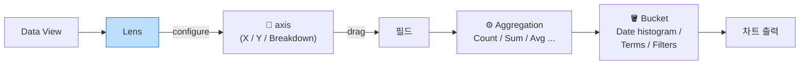

# 02. Lens 시각화 8종 레시피

> **목표**: 운영 현장에서 자주 쓰는 시각화 패턴 8종을 직접 만들 수 있다.
> **선수**: [01-quickwin.md](01-quickwin.md) — 한 번이라도 Lens 로 차트 만들어 저장한 경험
> **소요**: 각 레시피 5~10분 × 8 = 60분 (다 안 해도 됨, 필요한 것만)

---

## Lens 의 핵심 개념 30초



**Lens** 는 GUI drag&drop 으로 차트 설정 → 내부적으로 ES aggregation query 를 빌드해 보여주는 도구.

📌 **Oracle 비유**:
- **axis** = `SELECT` 의 컬럼 위치 (X/Y/색상 분리)
- **aggregation** = `COUNT/SUM/AVG/MIN/MAX`
- **bucket** = `GROUP BY` (시간 구간 / terms / range / filter)

---

## 레시피 인덱스

| # | 차트 | 차트 타입 | 핵심 학습 |
|--|------|---------|---------|
| **B1** | [시간별 API 호출량 (서비스별)](#b1-시간별-api-호출량-서비스별) | Stacked area | Date histogram, breakdown |
| **B2** | [Top 10 API 호출량](#b2-top-10-api-호출량) | Horizontal bar | Terms aggregation |
| **B3** | [메소드 분포](#b3-메소드-분포) | Donut | Pie/donut + 작은 카디널리티 |
| **B4** | [요일×시간 heatmap](#b4-요일시간-heatmap) | Heatmap | 2-dimension grouping |
| **B5** | [API별 p50/p95/p99 latency](#b5-api별-p50p95p99-latency) | Bar + multi-metric | Percentile aggregation |
| **B6** | [에러율 % trend](#b6-에러율--trend) | Line + Formula | Formula (분자/분모) |
| **B7** | [Top 에러 코드](#b7-top-에러-코드) | Horizontal bar | KQL filter + terms |
| **B8** | [서비스별 에러 분포](#b8-서비스별-에러-분포) | Stacked bar | Filter+breakdown 조합 |

---

## 공통 출발점

각 레시피 시작 전 한 번씩:
1. **Analytics → Visualize Library → Create new visualization → Lens**
2. Data view: **`api-logs`**
3. 시간 피커: **Last 7 days** (Last 30 days 도 OK)

---

## B1. 시간별 API 호출량 (서비스별)

### Why
가장 자주 보는 1번 차트. **트래픽 패턴 + 서비스별 비중** 을 한 화면에. peak/trough 가 시각적으로 즉시 보임.

### 차트 타입
**Area stacked**

### 설정

```
Horizontal axis  ←  @timestamp (Date histogram, Auto interval)
Vertical axis    ←  Records (Count of records)
Breakdown        ←  service_name (Top 10)
```

### Oracle SQL 등가
```sql
SELECT
  TRUNC(ts, 'HH24')   AS hour_bucket,
  service_name,
  COUNT(*)            AS calls
FROM api_logs
WHERE ts >= SYSDATE - 7
GROUP BY TRUNC(ts,'HH24'), service_name
ORDER BY hour_bucket
```

### ✅ Verify
- 8 색상 stack
- 7일 분량 막대 (시간 단위로 더 잘게)
- 마우스 hover 시 시각별 서비스별 정확한 카운트

### Variations / Tips
| 원하는 변형 | 방법 |
|----|----|
| Stacked → 100% 정규화 (비중 비교) | Vertical axis 의 ⋯ → "Normalize by unit" 또는 Lens의 "Percentage" 옵션 |
| 서비스 너무 많아서 어수선 | Breakdown 의 "Number of values" 5로 줄이기 + "Other" 활성 |
| 시간 그루핑 굵게/얇게 | Horizontal axis interval 을 `1h`/`30m`/`1d` 명시 |

---

## B2. Top 10 API 호출량

### Why
**"가장 많이 쓰는 API 가 뭐지?"** 를 즉시 답. 사용 빈도 ↔ 중요도 추정.

### 차트 타입
**Bar horizontal**

### 설정

```
Vertical axis    ←  api_path (Terms, Top 10, Order by Count desc)
Horizontal axis  ←  Records (Count of records)
```

### Oracle SQL 등가
```sql
SELECT api_path, COUNT(*) AS calls
FROM api_logs
GROUP BY api_path
ORDER BY calls DESC
FETCH FIRST 10 ROWS ONLY
```

### ✅ Verify
- 막대가 10개
- 가장 위가 가장 많이 호출된 path

### Tips
- legacy 의 `header.uri` 를 쓰는 인덱스에선 data view 를 `legacy-api-logs` 로 바꾸고 필드 이름만 다름
- terms aggregation 은 정확값이 아닌 근사값 (shard 별 top → coordinator 합산) — 정확하려면 size 키우기

---

## B3. 메소드 분포

### Why
GET / POST / PUT / DELETE 비율. **읽기 vs 쓰기 트래픽 비중** 추정.

### 차트 타입
**Donut** (Pie 도 OK)

### 설정

```
Slice by         ←  http_method (Terms, Top 5)
Size by          ←  Records (Count)
```

### Oracle SQL 등가
```sql
SELECT http_method, COUNT(*) FROM api_logs GROUP BY http_method
```

### ✅ Verify
- 색상 4종 (GET, POST, PUT, DELETE)
- POST 가 가장 큼

📌 **언제 안 쓰나**: 카디널리티 (서로 다른 값의 개수) 가 10개 넘으면 donut 은 가독성 떨어짐 → bar chart 가 낫다.

---

## B4. 요일 × 시간 heatmap

### Why
**peak 시간대 패턴**. "월요일 9시가 가장 바쁘다" 같은 비즈니스 통찰.

### 차트 타입
**Heatmap**

### 설정

```
Horizontal axis  ←  @timestamp (Date histogram, interval = 1 hour, formatter "HH")
Vertical axis    ←  @timestamp (Date histogram, interval = 1 day, formatter "EEE" or "yyyy-MM-dd")
Cell value       ←  Records (Count)
```

> ⚠️ Lens 가 같은 필드(`@timestamp`) 두 번 사용은 가능하지만 다른 interval 로 명시 필요.

### 더 쉬운 대안 (시각화 라이브러리 제약 시)

요일 + 시간을 직접 추출하기 어렵다면:
- 우선 시간 축만 쓰는 hourly histogram 을 만든 뒤
- 시간 피커로 1주를 7번 보면서 패턴 비교
- 또는 Vega/Vega-Lite 시각화로 직접 (고급)

### Oracle SQL 등가
```sql
SELECT
  TO_CHAR(ts, 'D')  AS dow,    -- 요일
  TO_CHAR(ts, 'HH24') AS hr,
  COUNT(*)
FROM api_logs
GROUP BY TO_CHAR(ts,'D'), TO_CHAR(ts,'HH24')
```

### ✅ Verify
- 24열 × 7행 grid
- 색상 농도 차이로 peak 가시화

---

## B5. API별 p50 / p95 / p99 latency

### Why
**평균 latency 만 보면 outlier 가 가려짐**. p95/p99 가 진짜 사용자 경험. SLI/SLO 의 핵심 지표.

### 차트 타입
**Bar vertical** (또는 horizontal)

### 설정

```
Horizontal axis  ←  api_path (Terms, Top 10)
Vertical axis    ←  3개 metric 추가:
                     1. Percentile of elapsed_ms, percentile = 50
                     2. Percentile of elapsed_ms, percentile = 95
                     3. Percentile of elapsed_ms, percentile = 99

(KQL filter)     ←  log_type : "out"      ← 이 필터 꼭!
```

### KQL 필터 추가법

좌상단 검색창에 입력 또는 차트 위 filter:
```
log_type : "out"
```

(elapsed_ms 는 응답 시점에만 기록되므로 in 로그까지 합치면 0 이 섞임 → percentile 왜곡)

### Oracle SQL 등가
```sql
SELECT
  api_path,
  PERCENTILE_DISC(0.50) WITHIN GROUP (ORDER BY elapsed_ms) AS p50,
  PERCENTILE_DISC(0.95) WITHIN GROUP (ORDER BY elapsed_ms) AS p95,
  PERCENTILE_DISC(0.99) WITHIN GROUP (ORDER BY elapsed_ms) AS p99
FROM api_logs
WHERE log_type = 'out'
GROUP BY api_path
ORDER BY COUNT(*) DESC
FETCH FIRST 10 ROWS ONLY
```

### ✅ Verify
- API 마다 막대 3개 (p50, p95, p99)
- p50 < p95 < p99 (당연)
- 단위 ms

📌 **Tip**: 하나의 정수가 아니라 분포가 궁금하면 **B5 변형**: histogram (`Distribution` chart, X=elapsed_ms, Y=count).

---

## B6. 에러율 % trend

### Why
**KPI**. 트래픽 절대량과 무관하게 품질을 측정.

### 차트 타입
**Line**

### 설정

```
Horizontal axis  ←  @timestamp (Date histogram)
Vertical axis    ←  Formula:
```

```
count(kql='log_type : "out" and not data.resultCode : "0000"')
  / count(kql='log_type : "out"')
```

Vertical axis 의 **Format** = **Percent** (또는 Number * 100, suffix `%`)

### Oracle SQL 등가
```sql
SELECT
  TRUNC(ts,'HH24') AS hr,
  COUNT(CASE WHEN log_type='out' AND data.resultCode <> '0000' THEN 1 END) * 100.0
    / NULLIF(COUNT(CASE WHEN log_type='out' THEN 1 END), 0) AS error_pct
FROM api_logs
GROUP BY TRUNC(ts,'HH24')
```

### ✅ Verify
- Y축 % 단위
- 평균 ~17% (우리 mock 데이터)

📌 **응용**: 분모를 `count()` (모든 레코드) 로 바꾸면 "전체 트래픽 대비 에러" 가 됨. 보통 분모를 out 으로 한정해야 의미 있음 (in 은 요청이라 에러 개념 없음).

---

## B7. Top 에러 코드

### Why
**어떤 에러가 가장 많은가?** 를 즉시 답. 우선 대응 순위.

### 차트 타입
**Bar horizontal**

### 설정

```
KQL filter       ←  log_type : "out" and not data.resultCode : "0000"
Vertical axis    ←  data.resultCode (Terms, Top 10)
Horizontal axis  ←  Records (Count)
```

### Oracle SQL 등가
```sql
SELECT data.resultCode, COUNT(*)
FROM api_logs
WHERE log_type='out' AND data.resultCode <> '0000'
GROUP BY data.resultCode
ORDER BY COUNT(*) DESC
FETCH FIRST 10 ROWS ONLY
```

### ✅ Verify
- 막대 10개 (또는 데이터 적으면 그 이하)
- 9999, E001~E902, P001~P401 등이 빈도순

### Variations
- 차트 옆에 **resultMsg** 도 같이 보여 주려면: 또 하나의 visualization (table) 만들어 `data.resultCode + first(data.resultMsg)` 컬럼

---

## B8. 서비스별 에러 분포

### Why
**어느 서비스가 에러가 많이 나는가?** Top 에러 코드(B7) 와 서비스 차원으로 분리해 보면 우선순위 명확.

### 차트 타입
**Bar vertical (stacked)** 또는 horizontal

### 설정

```
KQL filter       ←  log_type : "out" and not data.resultCode : "0000"
Horizontal axis  ←  service_name (Terms, all 8)
Vertical axis    ←  Records (Count)
Breakdown        ←  data.resultCode (Top 5)   ← 서비스 안의 에러 코드 분포
```

### Oracle SQL 등가
```sql
SELECT service_name, data.resultCode, COUNT(*)
FROM api_logs
WHERE log_type='out' AND data.resultCode <> '0000'
GROUP BY service_name, data.resultCode
ORDER BY service_name
```

### ✅ Verify
- X 축 8 서비스
- 각 막대가 5색 stack (서비스별 주된 에러 코드 5종)

### 응용
- "에러율 %" 을 보고 싶으면 vertical axis 를 Formula 로 (B6 처럼)

---

## ⚙️ 모든 레시피 공통 — 핵심 설정 5개

```
1. Date histogram interval     →  적절한 단위 (Auto / 1h / 1d)
2. Terms 의 size (Top N)       →  10이 default, 너무 많으면 잘리고 너무 적으면 정보 누락
3. Order by                    →  count desc / metric / alphabetical
4. Other 처리                   →  활성화 시 잘린 항목 합산
5. Missing values              →  null/missing field 처리
```

---

## ❓ Self-check

1. **Q.** Lens 의 `Records` 필드는 무엇?
   <details><summary>A</summary>
   "전체 행 수" 를 의미하는 가상 필드 = Oracle 의 `COUNT(*)`. 어떤 실제 필드도 가리키지 않음.
   </details>

2. **Q.** B5 (latency) 에서 `log_type : "out"` 필터를 빼면 왜 안 됨?
   <details><summary>A</summary>
   in 로그에는 `elapsed_ms` 가 없음 (응답 시점에만 기록). 0 또는 missing 으로 처리되어 percentile 이 왜곡됨.
   </details>

3. **Q.** B6 (error rate) 의 분모를 `count()` (모든 docs) 로 바꾸면?
   <details><summary>A</summary>
   에러율이 약 절반으로 보임 (in 도 분모에 들어감). 보통 분모를 out 으로 한정해야 의미 있음.
   </details>

4. **Q.** Terms aggregation 의 결과가 정확하지 않을 수 있다는 이유?
   <details><summary>A</summary>
   샤드별 local top → coordinator 합산 방식이라 카디널리티 큰 필드는 근사값. 정확한 top N 이 필요하면 size 를 의심스러운 값보다 충분히 크게 설정.
   </details>

---

다음: **[03-dashboards.md](03-dashboards.md)** — 위 8개 차트를 3개의 의미 있는 dashboard 로 조립.
