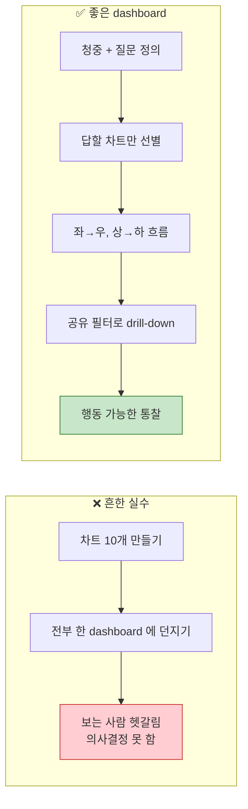
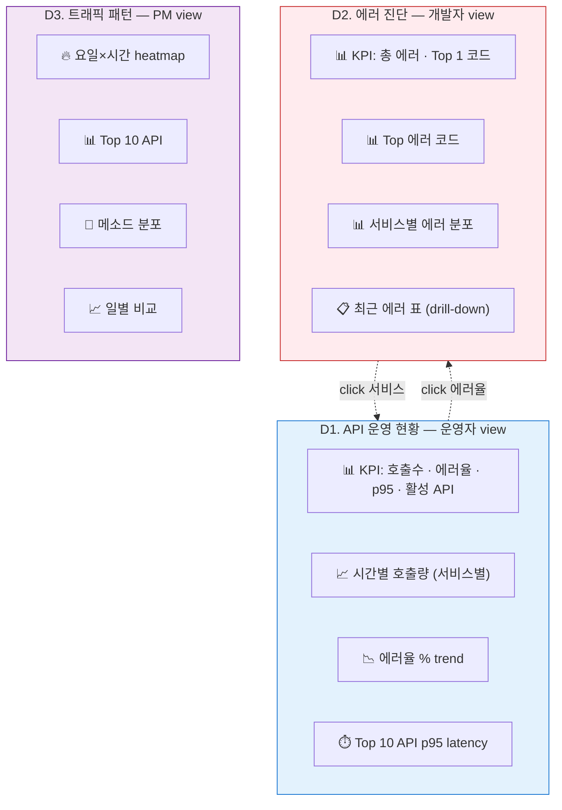
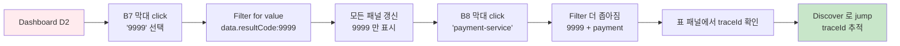

# 03. Dashboard 3종 조립

> **목표**: [02-lens-charts.md](02-lens-charts.md) 의 8개 차트를 의미 있는 **운영 대시보드 3개** 로 조립.
> **선수**: 02 의 차트 6~8개 저장됨
> **소요**: 각 dashboard 20~30분

---

## 왜 dashboard 가 별도 단계인가



**Dashboard 디자인 3원칙**:

1. **청중을 먼저** — 운영자 / 개발자 / PM 마다 보고 싶은 게 다름
2. **답할 질문 명시** — "트래픽 정상인가?", "어떤 에러가 가장 시급한가?"
3. **drill-down 흐름** — 상위 KPI → 분포 → 상세 → 원본 문서 순으로

---

## 만들 dashboard 3종

| # | 이름 | 청중 | 답할 질문 | 사용 차트 |
|---|------|----|--------|---------|
| **D1** | API 운영 현황 | 운영자, 팀리더 | "지금 운영 정상인가?" | KPI 4종 + B1 + B6 + B5 |
| **D2** | 에러 진단 | 개발자, QA | "어떤 에러가 시급한가?" | KPI 2종 + B7 + B8 + 에러 표 |
| **D3** | 트래픽 패턴 분석 | 분석자, PM | "주간 사용 패턴이 어떤가?" | B4 + B2 + B3 + 일별 비교 |



---

## 공통 절차 — 새 Dashboard 만들기

매번 동일:

1. **Analytics → Dashboard → Create dashboard**
2. **`Add from library`** 로 저장된 visualization 추가, 또는 **`Create visualization`** 으로 직접 만들기
3. 패널 마우스 드래그로 위치 / 크기 조정
4. 상단 **`Save`** → 이름 + 설명 + tag(선택)

📌 **시간 피커 / KQL 검색창 / +Add filter** 는 dashboard 레벨에서 모든 패널에 자동 공유.

---

## D1. API 운영 현황 (운영자 view)

### 답할 질문
1. 지금 호출 트래픽이 평소 수준인가?
2. 에러율이 임계치(예: 5%) 이하인가?
3. 어떤 API 가 느린가?

### 레이아웃 (12-column 그리드 기준)

```
┌─────────────────────────────────────────────────────────────────┐
│ 🕒 [Last 24 hours ▼]   🔎 [filter: service is …]              │
├─────────────────────────────────────────────────────────────────┤
│ ┌─────────┬─────────┬─────────┬─────────┐                       │
│ │ 호출수  │ 에러율  │ p95 ms  │ 활성API │  ← KPI 4 (위 4 col)   │
│ │  9.2M   │  17.3%  │  742    │   39    │                       │
│ └─────────┴─────────┴─────────┴─────────┘                       │
├─────────────────────────────────────────────────────────────────┤
│ ┌─────────────────────────────┐ ┌─────────────────────────────┐ │
│ │ 📈 시간별 호출량 (B1)        │ │ 📉 에러율 % trend (B6)      │ │
│ │ stacked area                │ │ line                         │ │
│ │ 8 col, 4 row                │ │ 4 col, 4 row                 │ │
│ └─────────────────────────────┘ └─────────────────────────────┘ │
├─────────────────────────────────────────────────────────────────┤
│ ┌─────────────────────────────────────────────────────────────┐ │
│ │ ⏱️ Top 10 API p95 latency (B5)                               │ │
│ │ horizontal bar, 12 col                                        │ │
│ └─────────────────────────────────────────────────────────────┘ │
└─────────────────────────────────────────────────────────────────┘
```

### 단계

#### KPI 4개 만들기 (각 패널 = 단일 metric Lens)

각 KPI 는 **Lens 의 Metric chart 타입** 으로 만듦.

**KPI 1: 총 호출수**
```
Add visualization → Lens → Metric
Primary metric: count(records)
KQL filter: log_type : "out"
Title: "📊 호출수"
```

**KPI 2: 에러율 %**
```
Lens → Metric
Primary metric: Formula
  count(kql='log_type:"out" and not data.resultCode:"0000"')
    / count(kql='log_type:"out"')
Format: Percent
Color: 5% 초과 시 빨강 (Conditional formatting)
```

> 📌 **Conditional coloring**: Metric 패널 우측 패널에서 thresholds 설정 가능. 0~5% 초록, 5~10% 주황, 10%+ 빨강.

**KPI 3: p95 latency**
```
Lens → Metric
Primary metric: Percentile of elapsed_ms (95)
KQL filter: log_type : "out"
Title: "⏱️ p95 ms"
```

**KPI 4: 활성 API 수**
```
Lens → Metric
Primary metric: Unique count of api_path
Title: "🟢 활성 API"
```

#### 메인 차트 추가

- B1 (시간별 호출량) → `Add from library`
- B6 (에러율 trend) → `Add from library`
- B5 (Top 10 p95) → `Add from library`

#### 패널 배치

위 ASCII 레이아웃 그대로:
- KPI 4개 한 줄 (각 3 col 폭)
- B1, B6 두 패널 한 줄 (8:4)
- B5 한 줄 전체

#### 저장

이름: `D1. API 운영 현황`. Description: "운영자/팀리더 일일 모니터링".

### 사용 시나리오

| 상황 | 어떻게 |
|------|------|
| 매일 아침 정상 확인 | 시간 피커 = "Last 24h" → KPI 색상 확인 |
| 특정 서비스만 보기 | 상단 + Add filter → service_name = X |
| 에러 spike 발견 | KPI 의 에러율 빨강 → B6 차트로 spike 시점 확인 → D2 로 drill-down |

### Oracle 비유
이 dashboard 는 다음 5개 query 를 한 화면에 띄우는 셈:
```sql
SELECT COUNT(*) FROM api_logs WHERE log_type='out'                        -- KPI1
SELECT (errors*100.0/total) FROM (...)                                    -- KPI2
SELECT PERCENTILE_DISC(0.95) WITHIN GROUP (ORDER BY elapsed_ms) FROM ...  -- KPI3
SELECT COUNT(DISTINCT api_path) FROM api_logs                             -- KPI4
SELECT TRUNC(ts,'HH24'), service, COUNT(*) GROUP BY ...                   -- B1
... etc
```

---

## D2. 에러 진단 (개발자 view)

### 답할 질문
1. 지금 가장 많은 에러 코드는?
2. 어느 서비스가 에러를 양산하나?
3. 그 에러를 일으킨 실제 요청은 무엇이었나?

### 레이아웃

```
┌─────────────────────────────────────────────────────────────────┐
│ 🕒 [Last 1 hour ▼]   🔎 [filter: errors only]                  │
│ Saved query: errors-only                                        │
├─────────────────────────────────────────────────────────────────┤
│ ┌─────────┬─────────┐                                           │
│ │ 총 에러  │ Top 1   │  ← KPI 2                                 │
│ │  321    │  9999   │                                           │
│ └─────────┴─────────┘                                           │
├─────────────────────────────────────────────────────────────────┤
│ ┌────────────────────────┐ ┌─────────────────────────────────┐  │
│ │ 📊 Top 에러 코드 (B7) │ │ 📊 서비스별 에러 분포 (B8)        │  │
│ └────────────────────────┘ └─────────────────────────────────┘  │
├─────────────────────────────────────────────────────────────────┤
│ ┌─────────────────────────────────────────────────────────────┐ │
│ │ 📋 최근 에러 표 (lens table 또는 saved search)                │ │
│ │ - @timestamp, service, api_path, resultCode, resultMsg       │ │
│ │ - sort by ts desc                                              │ │
│ └─────────────────────────────────────────────────────────────┘ │
└─────────────────────────────────────────────────────────────────┘
```

### 핵심: Saved Query 로 dashboard 전체에 "에러만" 적용

dashboard 전체에 **항상 "에러" 컨텍스트** 를 깔아 두려면:

1. Discover 에서 KQL `log_type : "out" and not data.resultCode : "0000"` 입력
2. 검색창 우측 디스크 아이콘 → **Save current query** → 이름 `errors-only`
3. Dashboard 의 검색창 옆 디스크 → **Load query → errors-only** 선택

✅ 모든 패널이 자동으로 에러만 필터링.

### "최근 에러 표" 만들기

**Lens → Table** 차트 타입:

```
Rows:
  - @timestamp (Date histogram, interval = none, individual)
  - service_name
  - api_path
  - data.resultCode
  - data.resultMsg
Order by: @timestamp desc
Limit: 50
```

> 또는 더 쉬운 방법: **Discover 에 KQL 적용 → Save** → dashboard 에 **`Add from library`** 로 saved search 추가. Discover 의 컬럼 설정이 그대로 임베드됨.

### Drill-down 패턴

dashboard 사용자가:
1. **Top 에러 코드 (B7)** 막대 하나 클릭
2. 메뉴에서 **"Filter for value"**
3. dashboard 전체가 그 코드만 필터
4. 우측 **"Inspect → View in Discover"** 로 원본 문서 확인



### 저장
이름: `D2. 에러 진단`. Description: "에러 발생 시 drill-down 분석".

---

## D3. 트래픽 패턴 분석 (PM view)

### 답할 질문
1. 어느 시간대 / 요일 이 가장 바쁜가?
2. Top API 가 어떻게 변하고 있나?
3. 메소드 비중이 정상인가?

### 레이아웃

```
┌─────────────────────────────────────────────────────────────────┐
│ 🕒 [Last 7 days ▼]                                             │
├─────────────────────────────────────────────────────────────────┤
│ ┌─────────────────────────┐ ┌─────────────────────────────────┐ │
│ │ 🔥 요일×시간 heatmap     │ │ 🍩 메소드 분포 (B3)             │ │
│ │ (B4) — 8 col              │ │ — 4 col                          │ │
│ └─────────────────────────┘ └─────────────────────────────────┘ │
├─────────────────────────────────────────────────────────────────┤
│ ┌─────────────────────────────────────────────────────────────┐ │
│ │ 📊 Top 10 API (B2)                                            │ │
│ │ horizontal bar — 12 col                                       │ │
│ └─────────────────────────────────────────────────────────────┘ │
├─────────────────────────────────────────────────────────────────┤
│ ┌─────────────────────────────────────────────────────────────┐ │
│ │ 📈 일별 호출 비교 — line chart                                  │ │
│ │ 이번주 vs 지난주 비교 (Lens 의 timeshift 활용)                  │ │
│ └─────────────────────────────────────────────────────────────┘ │
└─────────────────────────────────────────────────────────────────┘
```

### "이번 주 vs 지난 주" 비교 — Lens timeshift

Lens 의 **timeshift** 기능: 같은 metric 을 시간차 두고 두 번 그리기.

```
Vertical axis (1): count(records)                        ← 이번 주
Vertical axis (2): count(records), Time shift = 1w       ← 지난 주
Horizontal axis: @timestamp (Date histogram, interval = 1d)
```

✅ 결과: 두 라인이 같은 X 축에 그려져 wow! 비교 가능.

### 저장
이름: `D3. 트래픽 패턴`. Description: "주간 패턴 + 비교 분석".

---

## 추가 팁 — Dashboard 만들 때 자주 쓰는 패턴

### Markdown 패널로 컨텍스트/안내

`Add panel → Markdown`:
```markdown
# API 운영 현황 (D1)

- **새로 고침**: 5분 자동 (우상단 ↻)
- **에러율 임계**: 5% (KPI 색상)
- **drill-down**: 차트 클릭 → Filter for value
- **문의**: #observability
```

운영자 / 신규 입사자가 dashboard 의미를 즉시 파악.

### Drilldowns (고급)

차트 클릭 시 다른 dashboard 로 jump:
- 패널 ⋮ → **Create drilldown** → "Go to dashboard" → D1 → D2 chain

### 자동 새로고침

상단 시간 피커 옆 **↻ Refresh every 30s** 설정 → 운영센터 TV 같이 항상 최신.

### Saved Object 로 export

dashboard 백업/공유:
```
Stack Management → Saved Objects
→ Type: Dashboard 필터
→ 선택 → Export (.ndjson)
→ 다른 환경에서 Import
```

→ **폐쇄망 동료에게 dashboard 옮길 때 그대로 사용**.

---

## ✅ Dashboard 단계 완료 체크리스트

- [ ] D1 (운영 현황) 만들고 KPI thresholds 색상 작동
- [ ] D2 (에러 진단) — saved query `errors-only` 로 전체 필터
- [ ] D2 에서 차트 → 표 → Discover drill-down 한 번 시도
- [ ] D3 — timeshift 로 주간 비교 차트 1개
- [ ] 3개 dashboard 모두 Saved Object export 한 번 받아 봄

---

## ❓ Self-check

1. **Q.** 같은 dashboard 에 visualization 10개를 두는 게 안 좋은 이유?
   <details><summary>A</summary>인지 부담 ↑, 청중이 어디부터 봐야 할지 모름. "한 dashboard = 한 청중 = 한 질문 묶음" 원칙.</details>

2. **Q.** D2 의 saved query `errors-only` 와 dashboard filter 의 차이는?
   <details><summary>A</summary>Saved query 는 KQL 로 저장된 검색 표현 (텍스트). 우상단 검색창에 적용. dashboard filter (+Add filter) 는 GUI 단위 필터로 누구나 토글 가능. 동일 효과지만 saved query 는 "이 dashboard 의 정체성" 처럼 무조건 적용, filter 는 사용자가 끄거나 추가하기 좋음.</details>

3. **Q.** dashboard 가 너무 무거워서 로딩 느릴 때 가장 먼저 살펴볼 것?
   <details><summary>A</summary>(1) 시간 범위 너무 넓은가, (2) 패널마다 "max bucket size" 가 큰가, (3) 같은 데이터 같은 차트 중복 패널이 있나, (4) ES heap / shard 수 충분한가.</details>

4. **Q.** dashboard 에서 차트 막대 클릭 시 모든 패널이 갱신되는데 한 패널만 영향 안 주는 방법?
   <details><summary>A</summary>그 패널의 ⋮ → Edit → "Apply filters globally" 끄거나, Embeddable 옵션에서 "Disable filters from dashboard" 설정.</details>

---

## 다음 단계

| 원하는 것 | 추천 |
|----------|------|
| 알람 설정 | **[04-alerts.md](04-alerts.md)** — Observability Alerts |
| Oracle SQL → ES 전환 정리 | **[99-oracle-to-es.md](99-oracle-to-es.md)** |
| 잘 안 됨 | **[99-troubleshooting.md](99-troubleshooting.md)** |
