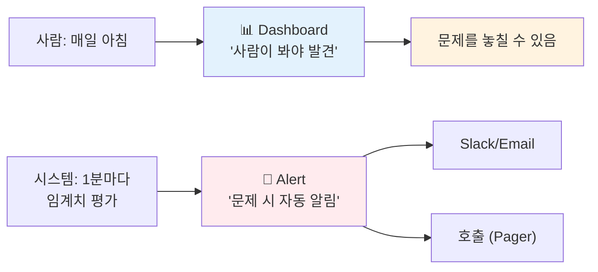
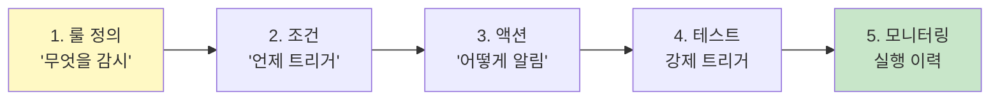
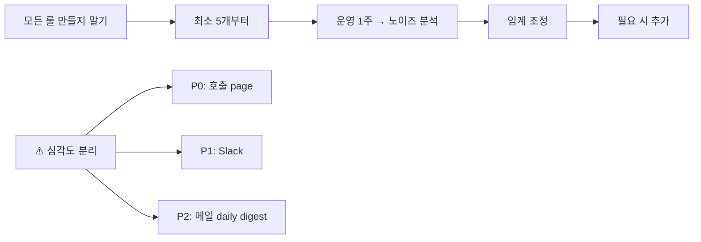

# 04. Observability Alerts — 알림 룰 만들기 (옵션)

> **목표**: ES 데이터 기반 임계치/이상 감지 알람 룰을 직접 만들고 트리거되는 것까지 확인.
> **선수**: Dashboard 까지 익숙해진 후 (03 단계). 운영자/SRE 역할이라면 필수.
> **소요**: 30분

---

## 알람이 dashboard 와 다른 점



**Dashboard** = 사람의 능동적 관찰. **Alert** = 시스템의 자동 감시.
운영 환경에선 **두 개 다** 필요.

---

## Alert 4 종류 (자주 쓰는 순)

| 룰 종류 | 언제 | 예시 |
|--------|------|------|
| **Elasticsearch query** | KQL/DSL 결과 카운트가 임계 초과 | "5분간 에러 100건 초과" |
| **Index threshold** | 특정 인덱스의 필드 값이 임계 | "p95 latency > 1초" |
| **Anomaly detection** | ML 기반 이상 감지 | "평소 패턴 대비 spike" (Platinum 라이선스) |
| **Custom logs threshold** | 특정 로그 텍스트 매칭 | "ERROR 'OutOfMemory' 발생" |

📌 **Basic 라이선스 (우리 환경)**: Elasticsearch query + Index threshold 룰만 사용 가능.

---

## 학습 흐름



---

## 룰 1 — 에러 spike 알람 (실습)

### 시나리오
"최근 5분 에러 응답이 100건을 넘으면 알린다."

### 단계

#### 1. 룰 진입

≡ → **Observability → Alerts → Manage rules** → **Create rule**

#### 2. Rule type

**`Elasticsearch query`** 선택.

#### 3. Define query

**Index**: `api-logs-*`
**Time field**: `@timestamp`
**Query (DSL)**:

```json
{
  "query": {
    "bool": {
      "filter": [
        { "term": { "log_type": "out" } },
        { "bool": { "must_not": { "term": { "data.resultCode": "0000" } } } }
      ]
    }
  }
}
```

> 또는 KQL 모드로 전환: `log_type : "out" and not data.resultCode : "0000"`

#### 4. Define condition

```
WHEN  count
IS ABOVE  100
FOR THE LAST  5 minutes
```

📌 **검사 주기**: "Check every" → 1 minute (기본).
"For the last" 윈도우와 다른 개념 — 1분마다 최근 5분 데이터를 체크.

#### 5. Actions (알림)

기본은 None (트리거만 기록). 실제 알림을 받으려면:

##### 5.1 Slack (제일 흔함)

1. Stack Management → **Connectors** → **Create connector** → **Slack**
2. Webhook URL 입력 (Slack 앱에서 incoming webhook 생성)
3. 룰의 Actions 에 → "Slack" 선택 → 메시지 템플릿 작성:

```
🚨 *에러 spike 감지*
- Rule: {{rule.name}}
- 트리거 시각: {{date}}
- 조건: 5분간 에러 {{context.value}}건 (임계 100)
- 보러가기: {{kibanaBaseUrl}}/app/dashboards
```

##### 5.2 Email

Connectors → **Email** → SMTP 설정. 동일 방식.

##### 5.3 Webhook (커스텀)

PagerDuty / OpsGenie / 사내 메신저 → Webhook connector.

#### 6. 저장 + 활성화

**Name**: `error-spike-5min-100`
**Tags**: `production`, `errors`
**Save**

✅ 즉시 활성화. 1분 내 첫 평가 실행.

### 검증 — 강제 트리거

대량 에러가 자연 발생하길 기다리기 어려움 → 임계 일시 낮춰 테스트:

```
임계: 100 → 1
저장 → 다음 평가에서 트리거
→ Slack/email 도착 확인
→ 임계 복원
```

또는 룰 상세 페이지의 **`Run test`** 버튼.

---

## 룰 2 — Latency degradation (Index threshold)

### 시나리오
"p95 응답시간이 1초 초과"

### 단계

≡ → Observability → Alerts → **Create rule**

**Rule type**: **`Index threshold`** (Elasticsearch query 보다 GUI 친화적)

```
Index:           api-logs-*
Time field:      @timestamp
WHEN aggregation: 95th percentile of elapsed_ms
OVER all documents
GROUPED OVER:    Top 10 of api_path
WHEN value:      IS ABOVE 1000
FOR THE LAST:    5 minutes
```

📌 `GROUPED OVER` = api 별 임계 → API 단위로 알람.

**Action**: 위와 동일.

이름: `latency-p95-degradation`. Save.

---

## 룰 3 — API 트래픽 0 (장애 의심)

### 시나리오
"30분간 특정 서비스 호출이 0건"

```
Index:           api-logs-*
Time field:      @timestamp
Query (KQL):     service_name : "payment-service"
WHEN:            count
IS BELOW:        1
FOR THE LAST:    30 minutes
```

→ payment-service 가 30분간 침묵하면 호출되어야 할 게 안 옴 → 장애 가능성.

📌 **응용**: 시간대별 정상 트래픽이 다르면 단순 임계로 부족 → ML anomaly detection (라이선스 필요) 또는 cron schedule 로 시간대별 룰 분리.

---

## 룰 관리 — 모니터링/디버깅

### 룰 목록 보기

≡ → Observability → Alerts → **Manage rules**

각 룰마다:
- ✅ **Active** / **Disabled** 토글
- **Last response**: OK / Failed / Active alert
- **Active alerts**: 현재 트리거 상태 instances

### 실행 이력

룰 행 클릭 → **Execution history** 탭. 각 평가의 status / duration / 결과 확인.

### 알람 발생 시

≡ → Observability → Alerts → **Alerts** 탭 → 활성 알람 목록.

각 alert:
- View in Discover (원본 문서)
- Add to case (Case 생성)
- Snooze (일시 음소거)

---

## 자주 쓰는 룰 패턴 (운영 보조 체크리스트)

| 룰 | KQL/조건 | 임계 권장 |
|-----|---------|---------|
| 전체 에러율 | `log_type:"out" and not data.resultCode:"0000"` | count > 100 / 5min |
| API별 latency | `index threshold` p95 of elapsed_ms | > 1초 / 5min |
| Dead API 감지 | `service_name:"X"` | count = 0 / 30min |
| 특정 에러 코드 | `data.resultCode:"P001"` | count > 10 / 5min |
| 인증 실패 spike | `data.resultCode:"E501"` | count > 50 / 1min |
| 디스크 사용 (요구 라이선스) | metricbeat → disk usage | > 85% |

---

## 룰 정책 — 실무 권장



**alert fatigue** (알람 피로) 방지가 핵심:
- 모든 룰이 같은 채널 → 사람이 무시함
- 심각도별 채널 분리
- 자주 false-positive 면 임계 / 윈도우 조정
- "처음 N건만 알림 + 그 후는 silent" 같은 패턴

---

## ✅ Alerts 단계 완료 체크리스트

- [ ] Elasticsearch query 룰 1개 만들고 강제 트리거 성공
- [ ] Index threshold 룰 1개 (latency)
- [ ] Slack 또는 Email connector 1개 등록 및 동작 확인
- [ ] 룰 목록에서 active/disabled 토글 + execution history 확인

---

## ❓ Self-check

1. **Q.** Dashboard 만 있고 Alert 안 두면 무엇이 위험?
   <details><summary>A</summary>사람이 dashboard 를 안 보는 시간 (밤, 주말, 휴가) 에 발생한 문제는 한참 후에 발견됨.</details>

2. **Q.** "Check every 1 minute" 와 "For the last 5 minutes" 의 차이는?
   <details><summary>A</summary>전자 = 평가 빈도 (1분마다 룰을 재계산). 후자 = 데이터 윈도우 (최근 5분 데이터 합산). 즉 1분마다 최근 5분치 보면서 임계 검사.</details>

3. **Q.** alert fatigue 가 운영에 미치는 영향?
   <details><summary>A</summary>중요 알람을 사람이 무시 → 진짜 사고 발견 지연. 알람 채널/심각도 분리 + 임계 조정으로 신호 대 잡음 비율 관리.</details>

---

## 다음

알람까지 끝났다면 **Kibana 학습 사이클 1회 완료**. 다음은:
1. **운영 1주 + 회고** — 어떤 차트/룰이 실제로 도움됐나, 어떤 게 노이즈였나
2. **반복 개선** — 임계 조정, dashboard 정리
3. **팀 공유** — Saved Objects export → 동료가 import → 동일 환경 재현

폐쇄망에서도 동일. ES URL / Slack webhook / 임계만 환경에 맞게 조정.

---

[← 03. Dashboards](03-dashboards.md) | [→ 99. Oracle SQL 매핑](99-oracle-to-es.md)
