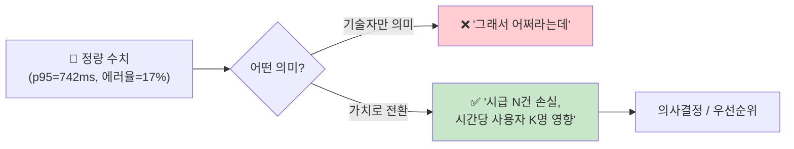
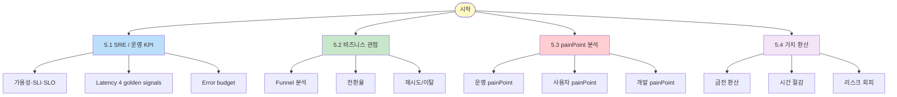
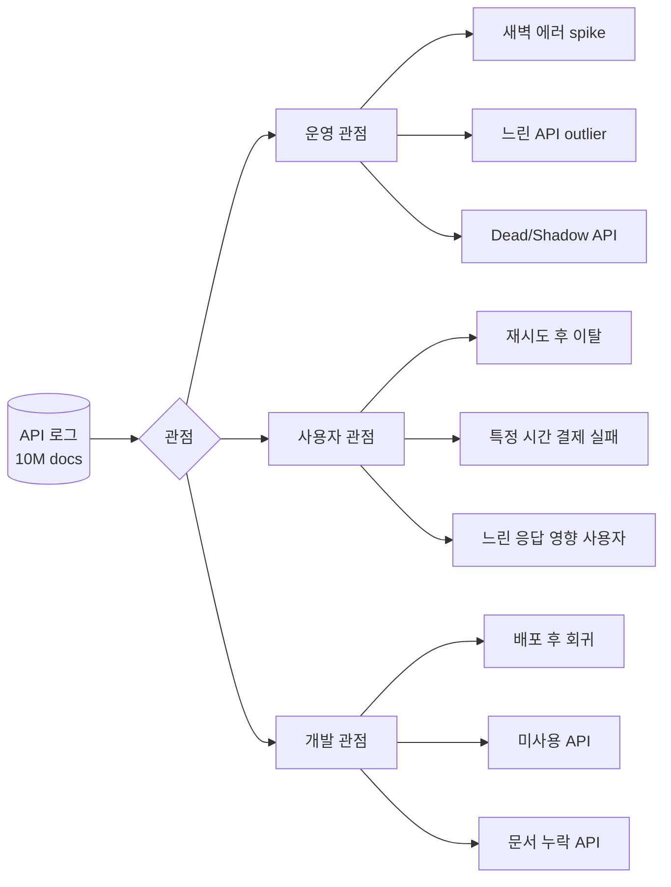
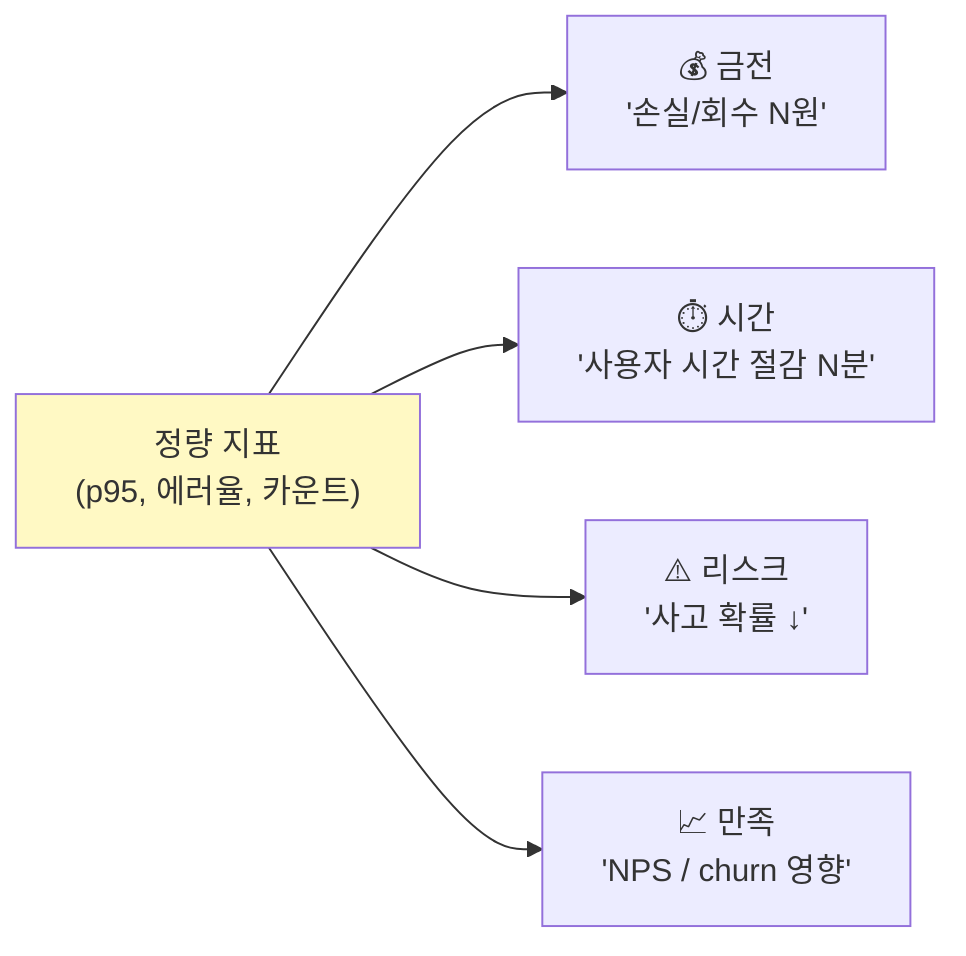

# 05. KPI · painPoint · 가치 분석 시나리오

> **목표**: ES + Kibana 데이터로 운영(SRE)/비즈니스/사용자 관점에서 **정량적 수치를 가치로 전환** 하는 시나리오 모음.
> **선수**: [02-lens-charts.md](02-lens-charts.md) + [03-dashboards.md](03-dashboards.md) — 차트/대시보드 작성 가능
> **소요**: 1~2시간 (시나리오별 30분~1시간)

---

## 왜 이 문서가 따로 있나



차트와 dashboard 만으로는 **숫자**가 보일 뿐. 이 문서는 그 숫자를 **"이만큼 손실인가/이득인가"** 로 환산하는 사고법 + 실제 KQL/쿼리.

---

## 학습 트리



---

## 5.1 SRE / 운영 KPI 시나리오

### 5.1.1 가용성 (Availability) — SLI 1번

#### 정의
"성공한 요청 / 전체 요청" — 사용자가 service 를 의도대로 쓸 수 있었던 비율.

```
가용성 = (성공 응답 수) / (전체 응답 수)
```

#### KQL · DSL

**Discover/KQL**:
```
log_type : "out"
```
→ hit count (전체 응답)

```
log_type : "out" and data.resultCode : "0000"
```
→ hit count (성공)

비율은 Lens Formula:
```
count(kql='log_type:"out" and data.resultCode:"0000"')
  / count(kql='log_type:"out"')
```

**Dev Tools (Oracle 스타일 한 번에)**:
```json
GET api-logs-*/_search
{
  "size": 0,
  "query": { "term": { "log_type": "out" } },
  "aggs": {
    "by_service": {
      "terms": { "field": "service_name", "size": 20 },
      "aggs": {
        "ok":   { "filter": { "term": { "data.resultCode": "0000" } } },
        "availability": {
          "bucket_script": {
            "buckets_path": { "ok": "ok._count" },
            "script": "params.ok / _count"
          }
        }
      }
    }
  }
}
```

> **Oracle 비유**:
> ```sql
> SELECT service_name,
>   COUNT(CASE WHEN data.resultCode='0000' THEN 1 END) * 1.0 / COUNT(*) AS availability
> FROM api_logs
> WHERE log_type='out'
> GROUP BY service_name
> ```

#### SLO 와 비교

비즈니스적 합의 = **SLO**. 흔한 값:

| 가용성 SLO | 의미 | 월 다운타임 허용 |
|----------|----|--------------|
| 99.9% (three nines) | "괜찮은" 소프트웨어 | 43분/월 |
| 99.95% | 일반 SaaS | 22분/월 |
| 99.99% (four nines) | 미션 크리티컬 | 4.3분/월 |
| 99.999% (five nines) | 통신/금융 코어 | 26초/월 |

#### Dashboard 패널

Lens **Metric** 위젯에 위 Formula + **Conditional formatting**:
- ≥ 99.9% : 🟢 초록
- 99.0~99.9% : 🟡 주황
- < 99.0% : 🔴 빨강 + 알람

#### Error Budget

> "100% 가용성은 없다. 우리는 0.1% 까지 실패해도 OK." 라는 합의가 SLO. 이 0.1% = **에러 버짓**.

```
한 달 에러 버짓 = (1 - SLO) × 총 요청 수
                = 0.001 × 30,000,000 = 30,000 실패 허용

지금 누적 = (실패 응답 수) — Discover 에서 KQL 한 줄로 즉시
남은 버짓 = 30,000 - 누적
```

남은 버짓이 0 이 되면 → **신규 배포 동결, 안정화 우선**. 자동화하려면 [04-alerts.md](04-alerts.md) 의 임계 룰.

---

### 5.1.2 Latency — 4 Golden Signals

Google SRE 가 정의한 4 핵심 신호 중 latency 가 첫 번째.

| 지표 | 의미 | 우리 데이터 |
|------|------|----------|
| **Latency** | 요청 처리 시간 | `elapsed_ms` |
| **Traffic** | 시간당 요청 수 | `count(records)` |
| **Errors** | 실패율 | `data.resultCode != "0000"` |
| **Saturation** | 자원 포화도 | (CPU/heap 등 별도 metricbeat 필요) |

#### p50 / p95 / p99 (Latency 분포)

평균만 보면 **outlier 가 가려짐**. percentile 이 진짜 사용자 경험.

```
p50 (median) = 절반의 사용자는 이보다 빠름 → "보통 경험"
p95          = 95% 가 이보다 빠름, 5% 가 더 느림 → "최악 경험 임계"
p99          = 1% 가 이보다 느림 → "꼬리 (tail latency)"
```

#### 시나리오: "p95 가 1초 넘는 API 찾기"

```json
GET api-logs-*/_search
{
  "size": 0,
  "query": { "term": { "log_type": "out" } },
  "aggs": {
    "by_api": {
      "terms": { "field": "api_path", "size": 100 },
      "aggs": {
        "p95": { "percentiles": { "field": "elapsed_ms", "percents": [95] } },
        "slow_api": {
          "bucket_selector": {
            "buckets_path": { "p95": "p95.95" },
            "script": "params.p95 > 1000"
          }
        }
      }
    }
  }
}
```

→ p95 > 1초인 API path 만 반환. 우선 개선 대상.

> **Oracle 등가**:
> ```sql
> SELECT api_path, PERCENTILE_DISC(0.95) WITHIN GROUP (ORDER BY elapsed_ms) AS p95
> FROM api_logs WHERE log_type='out'
> GROUP BY api_path
> HAVING p95 > 1000
> ```

#### 가치 환산

p95 가 500ms → 1500ms 로 회귀했을 때:
```
영향 사용자 수 = 시간당 호출 N × 5% (p95 정의: 5% 가 그 이상)
              = 100K × 5% = 5,000명/시간
체감 지연 추가 = +1초/사용자
누적 대기 시간 = 5,000 × 1초 = 1.4 사용자-시간/시간
하루            = 33 사용자-시간
```

이걸 **"하루 사용자 33명을 그냥 기다리게 한 셈"** 으로 보고서 한 줄.

---

### 5.1.3 Traffic Anomaly — 평소와 다른 패턴

#### 시나리오: "오늘 트래픽이 평소(=지난주 같은 시각) 대비 2배 이상이면 경보"

Lens timeshift 로 비교 차트:
- Vertical axis 1: `count()` 이번 주
- Vertical axis 2: `count()` 1w timeshift (지난 주)
- 차이가 200% 초과면 → Anomaly

자동화는 ML rule (Platinum) 또는 **Alerts → Index threshold** 룰에 ratio condition 작성.

---

### 5.1.4 MTTR — 평균 복구 시간

ES 데이터 자체로는 직접 안 나옴. 하지만:
- 첫 에러 발생 시각 (KQL: `not data.resultCode:"0000"` 시간 피커 좁히기)
- 마지막 에러 발생 후 정상 복귀 시각

→ Cases (Observability → Cases) 와 결합해 인시던트별 MTTR 추적.

---

## 5.2 비즈니스 관점 시나리오

### 5.2.1 결제 성공률 (Funnel)

#### 시나리오
"결제 시도 → 카드 인증 → 승인" 의 단계별 성공률.

우리 데이터엔 단계가 한 API (`/payments/charge`) 로 묶여 있지만, resultCode 별로 분류 가능:

```json
GET api-logs-*/_search
{
  "size": 0,
  "query": {
    "bool": {
      "filter": [
        { "term": { "service_name": "payment-service" } },
        { "term": { "api_path": "/api/v1/payments/charge" } },
        { "term": { "log_type": "out" } }
      ]
    }
  },
  "aggs": {
    "by_result": {
      "terms": { "field": "data.resultCode", "size": 20 }
    }
  }
}
```

응답 (예시):
```
0000 (성공) : 4,200,000
P001 (한도): 80,000
P002 (정지): 30,000
P003 (분실): 5,000
9999 (PG오류): 50,000
```

#### Funnel 시각화 (Lens Bar / Donut)

```
시도        :███████████████ 4,365,000 (100%)
정상 승인   :██████████████  4,200,000 (96.2%) ✅
한도 초과   :▎              80,000 (1.8%)    ← 비즈니스 issue
정지/분실   :▏              35,000 (0.8%)
PG 통신오류 :▎              50,000 (1.1%)    ← 외부 의존
```

#### 비즈니스 가치 환산

```
잠재 손실 = 한도초과 80K 건 × 평균 거래액 30K원
         = 24억 원/주
대응      = 한도 상향 안내 push, 자동 분할 결제 옵션 등
```

→ "기술 지표(P001 카운트)" 가 "**주당 24억 원 회수 기회**" 로 환산됨.

---

### 5.2.2 인증 통과율 (User Authentication)

```
service_name : "user-service" and api_path : "/api/v1/users/auth" and log_type : "out"
```

resultCode 분포:
```
0000 (성공)        : ~78%
E501 (비번 오류)   : ~12%
E502 (계정 잠금)   : ~3%
E503 (탈퇴 회원)   : ~7%
```

#### painPoint 분석

E501 (비번 오류) 가 12% — **회복 가능한 좌절**. 비밀번호 찾기 UX 개선 시 사용자 retention 가능.

E502 (계정 잠금) 시간대 분석:
```
service_name : "user-service" and data.resultCode : "E502"
```
→ Date histogram 으로 시간대별 분포 → 새벽 시간 비정상적 시도면 보안 이슈 의심.

---

### 5.2.3 핵심 거래 시간대 (Peak hours)

heatmap (요일×시간) 으로 결제·이체 peak 식별. 시스템 capacity planning 의 출발점.

```
service_name : ("payment-service" or "account-service")
  and api_path : (*transfer* or *charge*)
```

→ B4 (heatmap) 적용. peak 시간대 = 업무 시간 12-13, 18-20 같은 패턴.

---

### 5.2.4 시간대별 ROI

```
가치 환산:
- peak 1시간 다운 = 손실 N억
- off-peak 1시간 다운 = 손실 N/10억
→ peak 시간대 안정성 우선 투자 의사결정 근거
```

Dashboard에 결제량 × 시간 매트릭스 띄우면 임원 보고 자료 그대로.

---

## 5.3 painPoint 3 관점 시나리오



### 5.3.1 운영 painPoint

#### Case A — "새벽 에러 spike, 어느 서비스인가"

**증상**: 03:00 KST 알람.
**진단 흐름** (Discover):

```
시간 피커: Apr 25, 2026 @ 02:30 KST ~ 03:30 KST
KQL:       log_type:"out" and not data.resultCode:"0000"
```

→ 사이드바에서 `service_name` 클릭 → 어느 서비스가 spike?

```
서비스별 분포:
  payment-service: 350건
  user-service:    20건
  ...
```

→ payment 가 범인. 이어서:

```
KQL: service_name:"payment-service" and not data.resultCode:"0000"
```

→ `data.resultCode` 분포 → "P001 (한도 초과) 350건" → "악성 시도? 한도 일시 변경 사고?" → trace_id 몇 개 추출 → 패턴 분석.

#### Case B — "느린 API 가 갑자기 늘었나"

```
시간 피커: Last 7 days
KQL: log_type : "out" and elapsed_ms > 1000
```

Lens timeshift 로 이번주 vs 지난주 비교 → 어느 API 가 회귀했는지 파악.

#### Case C — Dead / Shadow API

이미 SpecFromLog 의 `--mock` 또는 `dev:serve → /api-health` 페이지가 분석. 추가로 ES 직접 쿼리:

```json
# Swagger 에 선언된 path - ES 호출된 path
# = Dead API 후보
# (specfromlog 의 fetchAllEndpoints 결과 vs ES api_path terms agg 비교)
```

---

### 5.3.2 사용자 painPoint

#### Case A — "재시도 후 이탈"

trace_id + 시간 흐름으로 재시도 패턴 식별:

```json
GET api-logs-*/_search
{
  "size": 0,
  "query": {
    "bool": {
      "filter": [
        { "term": { "log_type": "out" } },
        { "bool": { "must_not": { "term": { "data.resultCode": "0000" } } } }
      ]
    }
  },
  "aggs": {
    "by_user": {
      "terms": { "field": "data.userId.keyword", "size": 100 },
      "aggs": {
        "retry_count": { "value_count": { "field": "trace_id.keyword" } },
        "high_retry": {
          "bucket_selector": {
            "buckets_path": { "n": "retry_count" },
            "script": "params.n >= 3"
          }
        }
      }
    }
  }
}
```

→ 한 사용자가 3회 이상 재시도 → 다음 1시간 내 추가 호출 없음 = 이탈 의심.

📌 **가치 환산**: 이탈 사용자 N명 × LTV(생애가치) 평균 = 손실 추정.

#### Case B — "특정 에러를 본 사용자"

```
data.resultCode : "P002"   ← "정지된 카드"
```

→ 사이드바 `data.userId` 분포 → 어떤 사용자에게 어떤 빈도로 발생? 안내 푸시 대상 segment.

---

### 5.3.3 개발 painPoint

#### Case A — "배포 후 회귀"

배포 시각 = 2026-04-25 14:00 KST 가정.

```
시간 피커: Apr 25 13:00 ~ 17:00 KST
```

Lens timeshift 로 13시 이전 vs 14시 이후 비교 → 회귀 여부 즉시 판단.

자동화: Alerts → "배포 후 1시간 동안 에러율 평소의 1.5배" rule.

#### Case B — Shadow API (미선언 호출)

```
api_path : *
```

→ 사이드바 `api_path` 의 unique 값 (terms agg) → SpecFromLog 의 swagger paths 와 비교 → 차집합 = shadow.

#### Case C — 신규 API 안정성

시간 윈도우 좁혀서 신규 path 만 보면 (예: 어제부터 등장한 path):
```json
GET api-logs-*/_search
{
  "size": 0,
  "aggs": {
    "by_path": {
      "terms": { "field": "api_path", "size": 1000 },
      "aggs": {
        "first_seen": { "min": { "field": "@timestamp" } },
        "new": {
          "bucket_selector": {
            "buckets_path": { "first": "first_seen" },
            "script": "params.first > new Date('2026-04-24').getTime()"
          }
        }
      }
    }
  }
}
```

→ 24일 이후 처음 등장한 path 만. 신규 API 의 에러율, latency 트래킹 dashboard 추천.

---

## 5.4 정량 → 가치 환산 프레임워크

### 5.4.1 변환 공식 4가지



| 변환 | 공식 | 예시 |
|------|------|------|
| 💰 금전 | 실패건 × 평균 거래액 | "결제 P001 80K건 × 30K원 = 24억/주 회수 기회" |
| ⏱️ 시간 | 사용자 수 × 추가 지연 | "p95 +1초, 영향 5K명/시간 → 33 사용자-시간/일" |
| ⚠️ 리스크 | 사고 확률 × 영향 | "에러 spike 30분 미인지 = 평균 1억 손실 + 장애 SLA 위반" |
| 📈 만족 | retry rate × 추정 churn | "3+ retry 후 이탈 200명/일 × LTV 50만 = 1억/일" |

### 5.4.2 보고서 한 줄 패턴

```
"[기술지표] 가 [임계] 를 넘어,
 [가치환산] 만큼의 [손실/위험] 이 추정되며,
 우선 [개선 액션] 으로 [기대 효과] 를 노릴 수 있다."
```

예:
```
p95 latency 가 742ms → 1500ms 로 회귀,
하루 사용자-시간 33h 추가 대기 (≈ 사용자 200명 1일 영향) 가 추정되며,
우선 transfer API 의 DB query optimization 으로 p95 600ms 회복을 노릴 수 있다.
```

---

## 5.5 실습 — 직접 만들 dashboard 1개

### "운영 + 비즈니스 통합 KPI Board" (D4)

#### 패널 (Lens 8개)

```
┌──────────────────────────────────────────────────────────────┐
│ 🕒 [Last 7d ▼]                          🔎 [filter]         │
├──────────────────────────────────────────────────────────────┤
│ ┌────┬────┬────┬────┐                                        │
│ │가용│ p95│결제│인증│  ← KPI 4: 가용성, p95, 결제율, 인증율  │
│ │99.9│742 │96% │78% │                                        │
│ └────┴────┴────┴────┘                                        │
├──────────────────────────────────────────────────────────────┤
│ ┌─────────────┐ ┌──────────────────────────────────────────┐ │
│ │💰 결제 손실 │ │📈 가용성 trend (7일) — SLO 99.9% 라인     │ │
│ │ 24억/주     │ │                                            │ │
│ └─────────────┘ └──────────────────────────────────────────┘ │
├──────────────────────────────────────────────────────────────┤
│ ┌─────────────────────────┐ ┌───────────────────────────────┐│
│ │📊 시간대 결제 실패 분포  │ │📋 최근 retry 3+ 사용자 표      ││
│ └─────────────────────────┘ └───────────────────────────────┘│
└──────────────────────────────────────────────────────────────┘
```

각 패널의 Lens 설정은 위 5.1~5.3 의 KQL/DSL 그대로 적용.

#### 활용
매주 운영 회의에서 D4 한 화면. KPI 의 색상 + 손실 환산이 의사결정 근거.

---

## 체크리스트

- [ ] 가용성 SLI 한 번 직접 계산 (전체 + 서비스별)
- [ ] p95 > 임계 API 1개 식별
- [ ] error budget 의 남은 양 계산
- [ ] 결제 funnel 의 단계별 성공률 차트
- [ ] 새벽 에러 spike 가상 시나리오 진단
- [ ] 한 KPI 를 가치(원/시간/리스크) 로 환산하는 한 문장 작성
- [ ] D4 dashboard 하나 직접 만듦

---

## ❓ Self-check

1. **Q.** 가용성 99.9% SLO 환경에서 한 달 실제 가용성이 99.85% 라면 다음 액션?
   <details><summary>A</summary>에러 버짓 초과 → 신규 배포 동결, 안정화 우선. 동시에 RCA(원인 분석) + post-mortem 으로 재발 방지.</details>

2. **Q.** p95 와 평균 latency 가 크게 다르면 의미는?
   <details><summary>A</summary>분포가 long-tail. outlier 가 5% 사용자에게 큰 지연. 평균만 보고 안심하면 안 됨. p95/p99 가 진짜 사용자 경험.</details>

3. **Q.** "결제 P001(한도초과) 가 주당 80K건" 만으로 우선순위 정할 수 있나?
   <details><summary>A</summary>없음. 가치 환산(평균 거래액 × 건수 = 잠재 손실) 까지 가야 의사결정. 또 실제 회수 가능성(한도 상향 후 재시도율 등) 도 추가 데이터 필요.</details>

4. **Q.** Shadow API 가 발견되면 가장 큰 리스크는?
   <details><summary>A</summary>(1) 보안 — 문서화 안 된 endpoint 가 인증/권한 점검 누락 가능. (2) 운영 — 호출 패턴 모르고 운영 → 장애 시 대응 불가. (3) 컴플라이언스 — 데이터 처리 항목 누락.</details>

---

## 다음

- 신규 index/field 만들고 싶다 → **[06-index-management.md](06-index-management.md)**
- 일일 통계 인덱스 자동 생성 → **[07-batch-transform.md](07-batch-transform.md)**
- ES 8 vs 9 → **[99-es-version-comparison.md](99-es-version-comparison.md)**
