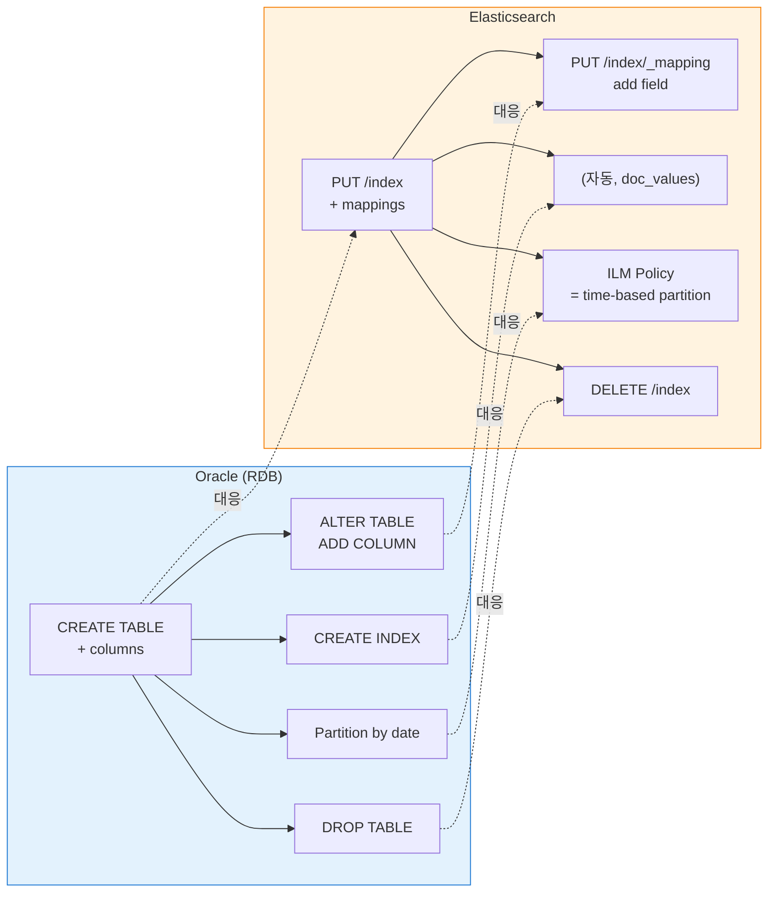
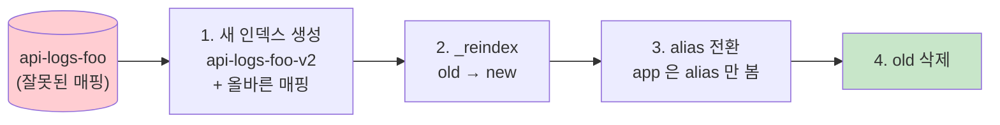
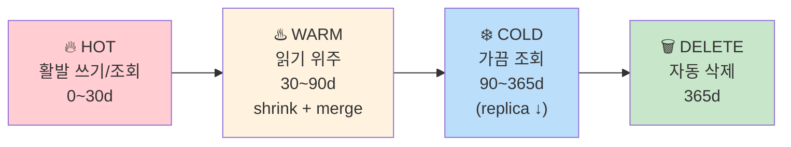
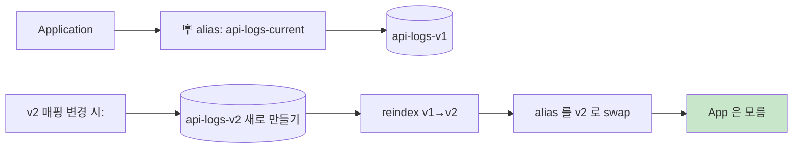

# 06. Index · Field 생성 / 수정 (Oracle DDL anchor)

> **목표**: 신규 index 만들기·매핑 정의·field 추가/타입 변경/reindex 까지. Oracle DDL 비유로 anchoring.
> **선수**: [00-prerequisites.md](00-prerequisites.md) — Dev Tools 사용 가능
> **소요**: 1시간 (실습 포함)

---

## 1. 개념 매핑 — Oracle DDL ↔ ES



| Oracle | ES | 비고 |
|--------|----|----|
| `CREATE TABLE foo (...)` | `PUT /foo { "mappings": ... }` | 인덱스 = 테이블 |
| `ALTER TABLE foo ADD col VARCHAR(50)` | `PUT /foo/_mapping { ... }` | 필드 추가 (단방향만) |
| `ALTER TABLE foo MODIFY col NUMBER` | ❌ **불가** — reindex 필요 | 타입 변경 직접 못 함 |
| `ALTER TABLE foo DROP col` | ❌ **불가** — reindex 필요 | 필드 삭제 못 함 |
| `DROP TABLE foo` | `DELETE /foo` | 동일 |
| `CREATE INDEX ... ON foo(col)` | (자동) | 모든 필드 자동 색인 |
| `Partition by RANGE (ts)` | ILM + index template | 시간 기반 인덱스 분리 |
| `CREATE VIEW v AS SELECT ...` | Data View (Kibana) 또는 Alias | 가상 핸들 |
| `CREATE SYNONYM` | Index alias | 다른 이름으로 가리키기 |

🔑 **핵심 차이 한 줄**: Oracle 의 `ALTER TABLE MODIFY` / `DROP COLUMN` 이 ES 에는 없음. **타입 변경/필드 삭제는 reindex** 가 필요.

---

## 2. 모든 작업 — 한 화면 cheatsheet

```
============ 인덱스 라이프사이클 ============

CREATE TABLE       PUT /<index>             { mappings, settings }
SELECT * FROM      GET /<index>/_search
DESCRIBE TABLE     GET /<index>/_mapping
                   GET /<index>/_settings
ALTER ADD COLUMN   PUT /<index>/_mapping    (필드 추가만)
DROP TABLE         DELETE /<index>
TRUNCATE TABLE     DELETE + PUT (또는 _delete_by_query 로 데이터만)

============ 데이터 라이프사이클 ============

INSERT             POST /<index>/_doc       { ... }
INSERT id 명시     PUT  /<index>/_doc/<id>  { ... }
UPDATE             POST /<index>/_update/<id> { "doc": { ... } }
DELETE             DELETE /<index>/_doc/<id>
DELETE WHERE       POST /<index>/_delete_by_query { "query": ... }

============ 메타·관리 ============

CREATE VIEW        PUT /<index>/_alias/<name>
ANALYZE TABLE      POST /<index>/_refresh    (검색 가시성)
                   POST /<index>/_forcemerge (compact)
RENAME             alias 두 개 + 점진 전환

============ 매핑 변경 (필드 변형) ============

타입 변경 (예: text → keyword)
  ① 새 인덱스 (다른 이름) 만들기 + 새 매핑 정의
  ② POST _reindex { "source": {old}, "dest": {new} }
  ③ alias 전환
  ④ 옛 인덱스 삭제

============ 자동화 ============

Index Template     매칭 패턴의 새 인덱스 생성 시 매핑 자동 부여
Component Template 재사용 가능한 매핑 조각
ILM Policy         hot → warm → cold → delete 자동 전환
```

---

## 3. 실습 ① — 신규 index 생성 (CREATE TABLE 등가)

### 3.1 시나리오
"일일 KPI 통계를 저장할 새 인덱스 `api-stats-daily-2026.04.20` 만들기."

### 3.2 명시적 매핑 정의

Dev Tools 에서:

```json
PUT /api-stats-daily-2026.04.20
{
  "settings": {
    "number_of_shards": 1,
    "number_of_replicas": 0,
    "index.lifecycle.name": "kpi-stats-policy"
  },
  "mappings": {
    "properties": {
      "@timestamp":     { "type": "date" },
      "stats_date":     { "type": "date", "format": "yyyy-MM-dd" },
      "service_name":   { "type": "keyword" },
      "api_path":       { "type": "keyword" },
      "http_method":    { "type": "keyword" },
      "calls_total":    { "type": "long" },
      "calls_success":  { "type": "long" },
      "calls_error":    { "type": "long" },
      "error_rate":     { "type": "float" },
      "p50_ms":         { "type": "long" },
      "p95_ms":         { "type": "long" },
      "p99_ms":         { "type": "long" },
      "top_error_codes": {
        "type": "nested",
        "properties": {
          "code":  { "type": "keyword" },
          "count": { "type": "long" }
        }
      }
    }
  }
}
```

> **Oracle 등가**:
> ```sql
> CREATE TABLE api_stats_daily_2026_04_20 (
>   ts             TIMESTAMP,
>   stats_date     DATE,
>   service_name   VARCHAR2(100),
>   api_path       VARCHAR2(500),
>   http_method    VARCHAR2(10),
>   calls_total    NUMBER,
>   calls_success  NUMBER,
>   calls_error    NUMBER,
>   error_rate     NUMBER(5,2),
>   p50_ms         NUMBER,
>   p95_ms         NUMBER,
>   p99_ms         NUMBER
> );
> ```

### 3.3 검증

```json
GET /api-stats-daily-2026.04.20
GET /api-stats-daily-2026.04.20/_mapping
```

### 3.4 매핑 타입 5분 정리

자주 쓰는 ES 타입 + 언제:

| ES type | Oracle 등가 | 언제 쓰나 |
|---------|-----------|---------|
| `keyword` | VARCHAR2 (정확 매칭) | 코드값, ID, enum (분석/필터/agg 핵심) |
| `text` | CLOB | 자연어 검색 (analyzer 적용) |
| `long`, `integer`, `short`, `byte` | NUMBER | 정수 |
| `double`, `float`, `half_float` | NUMBER | 실수 |
| `boolean` | NUMBER(1) | true/false |
| `date` | TIMESTAMP / DATE | ISO 8601 또는 epoch ms |
| `ip` | VARCHAR2 | IP 주소 (전용 비교 가능) |
| `geo_point` | (Spatial) | 위경도 |
| `object` | (object/JSON) | 중첩 JSON |
| `nested` | (관련 행 배열) | 배열 안 객체를 별도 doc 처럼 검색 |
| `flattened` | (JSON CLOB) | 변동 schema 의 JSON 덩어리 |

📌 **keyword vs text 핵심**:
- 검색만? → `text`
- 정렬·집계·exact match? → `keyword`
- 둘 다? → multi-field (둘 다 매핑)

```json
"api_path": {
  "type": "keyword",
  "fields": {
    "text": { "type": "text" }
  }
}
```
→ `api_path` 로 keyword 사용, `api_path.text` 로 text 검색.

---

## 4. 실습 ② — Field 추가 (ALTER TABLE ADD COLUMN)

### 4.1 시나리오
"기존 인덱스에 `region` 필드 추가."

```json
PUT /api-logs-account-2026.04.20/_mapping
{
  "properties": {
    "region": { "type": "keyword" }
  }
}
```

✅ 즉시 적용. 기존 문서엔 값 없음 (null), 신규 문서부터 값 가능.

### 4.2 Dynamic vs Explicit mapping

ES 는 기본 **dynamic mapping**: 처음 보는 필드를 자동으로 매핑 (보통 keyword + text 멀티). 단점:
- 의도치 않은 타입 (예: 숫자 같지만 string 으로 저장됨)
- 운영 중 매핑 폭발 (수만 개 자동 필드)

production 권장: **`dynamic: strict`** 또는 **`dynamic: false`**

```json
PUT /strict-index
{
  "mappings": {
    "dynamic": "strict",
    "properties": { ... }
  }
}
```

→ 정의 안 된 필드 들어오면 reject (error). schema 보호.

### 4.3 ❌ 직접 못 하는 것

```
타입 변경                  → 필드 삭제할 수 없음
필드 삭제                  → 매핑은 immutable 단방향
```

→ Reindex (다음 §5) 가 답.

---

## 5. 실습 ③ — Reindex (타입 변경 / 매핑 재정의)

### 5.1 시나리오

기존 `api-logs-foo` 의 `data.amount` 가 `text` 로 dynamic 매핑됐는데 사실은 `long` 이어야 함. 정렬·집계가 안 됨. → 새 매핑으로 옮겨야.

### 5.2 단계



#### 5.2.1 새 인덱스 (올바른 매핑)

```json
PUT /api-logs-foo-v2
{
  "mappings": {
    "properties": {
      "data": {
        "properties": {
          "amount": { "type": "long" }
        }
      }
    }
  }
}
```

#### 5.2.2 reindex 실행

```json
POST _reindex?wait_for_completion=false
{
  "source": { "index": "api-logs-foo" },
  "dest":   { "index": "api-logs-foo-v2" }
}
```

응답에서 `task` ID 받음 → 진행 상황 추적:

```
GET _tasks/<task_id>
```

대용량은 시간 걸림. `wait_for_completion=false` 로 비동기 + task API 로 모니터링.

#### 5.2.3 alias 전환 (zero downtime 패턴)

```json
POST /_aliases
{
  "actions": [
    { "remove": { "index": "api-logs-foo",    "alias": "api-logs-foo-current" } },
    { "add":    { "index": "api-logs-foo-v2", "alias": "api-logs-foo-current" } }
  ]
}
```

App 은 `api-logs-foo-current` (alias) 만 쓰면 끊김 없이 전환.

📌 **운영 베스트 프랙티스**: 처음부터 항상 alias 로 서비스. 직접 인덱스명 노출 X.

#### 5.2.4 옛 인덱스 삭제

```
DELETE /api-logs-foo
```

### 5.3 reindex 옵션

```json
POST _reindex
{
  "source": {
    "index": "api-logs-foo",
    "query": { "range": { "@timestamp": { "gte": "2026-04-25" } } }   // 조건부
  },
  "dest": { "index": "api-logs-foo-v2" },
  "script": {
    "source": "ctx._source.region = 'KR'",                              // 변환 추가
    "lang": "painless"
  }
}
```

→ 일부만 reindex / 변환 추가 가능. ETL 스타일.

---

## 6. 실습 ④ — Index Template (자동 매핑)

### 6.1 시나리오

매일 새 인덱스 `api-stats-daily-2026.04.21`, `api-stats-daily-2026.04.22` ... 가 생기는데 **매핑을 매번 PUT** 하기 귀찮음.

### 6.2 Index Template

```json
PUT /_index_template/api-stats-daily-template
{
  "index_patterns": ["api-stats-daily-*"],
  "priority": 100,
  "template": {
    "settings": { "number_of_shards": 1, "number_of_replicas": 0 },
    "mappings": {
      "properties": {
        "@timestamp":    { "type": "date" },
        "service_name":  { "type": "keyword" },
        "api_path":      { "type": "keyword" },
        "calls_total":   { "type": "long" },
        "p95_ms":        { "type": "long" }
      }
    }
  }
}
```

이후 `api-stats-daily-2026.04.27` 인덱스가 어떤 방식으로 생기든 (자동/수동) 위 매핑 자동 적용.

> **Oracle 등가**: 직접 등가 없음. 굳이 비유하면 "PARTITION BY RANGE (ts) 의 자동 partition 생성 + 모든 partition 동일 schema". 또는 트리거+동적 SQL.

### 6.3 Component Template (재사용 조각)

```json
PUT /_component_template/common-fields
{
  "template": {
    "mappings": {
      "properties": {
        "@timestamp":   { "type": "date" },
        "service_name": { "type": "keyword" }
      }
    }
  }
}

PUT /_index_template/api-stats-daily-template
{
  "index_patterns": ["api-stats-daily-*"],
  "composed_of": ["common-fields"],
  "template": { "mappings": { "properties": { ...추가 필드... } } }
}
```

→ 공통 필드는 component 로 분리, index template 들이 조립. DRY.

---

## 7. 실습 ⑤ — ILM (자동 라이프사이클)

### 7.1 시나리오
"일일 통계 인덱스를 365일 후 자동 삭제."

### 7.2 ILM Policy 생성

```json
PUT /_ilm/policy/kpi-stats-policy
{
  "policy": {
    "phases": {
      "hot": {
        "actions": {
          "set_priority": { "priority": 100 }
        }
      },
      "warm": {
        "min_age": "30d",
        "actions": {
          "set_priority": { "priority": 50 },
          "shrink": { "number_of_shards": 1 },
          "forcemerge": { "max_num_segments": 1 }
        }
      },
      "cold": {
        "min_age": "90d",
        "actions": {
          "set_priority": { "priority": 0 }
        }
      },
      "delete": {
        "min_age": "365d",
        "actions": { "delete": {} }
      }
    }
  }
}
```

### 7.3 인덱스에 적용

위 §3.2 에서 이미 `index.lifecycle.name: "kpi-stats-policy"` 명시. 기존 인덱스에 적용:

```json
PUT /api-stats-daily-2026.04.20/_settings
{ "index.lifecycle.name": "kpi-stats-policy" }
```

### 7.4 라이프사이클 단계



> **Oracle 등가**: range partition + manual `ALTER TABLE DROP PARTITION older than 365d`. ES 는 자동.

---

## 8. Kibana GUI 로도 가능

대부분 위 작업은 **Stack Management** 메뉴에서 GUI 로:

| 작업 | GUI 위치 |
|------|--------|
| 인덱스 보기/삭제 | Stack Management → **Index Management** |
| 매핑/설정 보기 | 위 페이지 → 인덱스 클릭 → "Mappings" / "Settings" 탭 |
| 매핑 추가 | "Mappings" 탭 → "Add field" |
| Index Template 만들기 | Index Management → **Index Templates** 탭 |
| ILM Policy 만들기 | **Index Lifecycle Policies** |
| Reindex | (GUI 없음 — Dev Tools 필수) |

학습 처음에는 GUI 로 한 번 만들고 → "View JSON" 으로 DSL 보면서 익히면 빠름.

---

## 9. 흔한 실수와 대응

| 실수 | 증상 | 대응 |
|------|------|------|
| dynamic mapping 으로 number 가 string 됨 | 정렬/집계 안 됨 | 명시 매핑 + reindex |
| keyword 인 줄 알았는데 text 임 | terms aggregation `not aggregatable` 에러 | `.keyword` multi-field 추가 또는 reindex |
| 매핑 변경 시도 | "mapper [x] cannot be changed" | reindex 필수 |
| 인덱스명 대문자 사용 | "must be lowercase" | 모든 인덱스명 lowercase |
| 인덱스명 시작이 `_`, `-`, `+` | 거부됨 | 영문/숫자 시작 |
| `>1024` 필드 매핑 | "Limit of total fields exceeded" | `index.mapping.total_fields.limit` 늘리기 또는 schema 정리 |
| reindex 중 source 에 새 데이터 | 일부 누락 | `wait_for_completion=false` + 마지막에 delta 재처리 |

---

## 10. 실전 안전 패턴 — Alias-Based Indexing



원칙:
1. App 은 **alias 만** 참조 (인덱스명 직접 사용 X)
2. 매핑 변경 = 새 인덱스 + reindex + alias swap
3. ILM 으로 인덱스 라이프사이클 자동화
4. Index Template 으로 신규 인덱스 매핑 자동 부여

---

## 11. 체크리스트

- [ ] Dev Tools 에서 `PUT /test-index` 로 한 번 인덱스 만들고 매핑 확인
- [ ] `PUT /test-index/_mapping` 로 필드 한 개 추가
- [ ] dummy doc INSERT (`POST /test-index/_doc { ... }`)
- [ ] 의도적으로 다른 매핑의 새 인덱스 만들고 `_reindex` 실행
- [ ] alias 한 번 바꿔 보기
- [ ] Index Template 한 번 만들고 매칭 인덱스에 자동 매핑 부여 확인
- [ ] ILM policy 실험 (min_age 짧게 1m 정도로 → 자동 전환 관찰)
- [ ] 모두 끝나면 `DELETE /test-index*` 로 정리

---

## ❓ Self-check

1. **Q.** Oracle 의 `ALTER TABLE foo MODIFY col NUMBER` 등가 ES 절차는?
   <details><summary>A</summary>(1) 새 인덱스 + 새 매핑, (2) `_reindex`, (3) alias 전환, (4) old 삭제. 직접 ALTER 못 함.</details>

2. **Q.** `dynamic: false` 와 `dynamic: strict` 차이?
   <details><summary>A</summary>false = 정의 안 된 필드 무시 (저장은 됨, indexing 안 됨). strict = 정의 안 된 필드 reject (error). 운영은 strict 권장.</details>

3. **Q.** keyword 와 text 의 차이를 한 줄로?
   <details><summary>A</summary>keyword = 그대로 (정확 매칭/정렬/집계용), text = analyzer 거침 (full-text 검색용). 보통 multi-field 로 둘 다.</details>

4. **Q.** 일자별 인덱스 (`api-logs-2026.04.20` 등) 가 좋은 이유 3가지?
   <details><summary>A</summary>(1) 보존 정책 단순 — 옛 인덱스만 삭제하면 됨 (DROP PARTITION). (2) 검색 효율 — 시간 범위 쿼리 시 불필요 인덱스 skip. (3) 매핑 변경 유연 — 신규 일자부터만 새 매핑 적용 가능.</details>

5. **Q.** alias 의 운영 가치?
   <details><summary>A</summary>indirection 한 단계가 zero-downtime 매핑 변경 + 인덱스 분할 합산 + 권한 분리 모두 가능하게 함. App 코드를 인덱스명 변경에서 보호.</details>

---

## 다음
- 일일 배치로 통계 인덱스 만들기 → **[07-batch-transform.md](07-batch-transform.md)**
- ES 8 → 9 변경점 → **[99-es-version-comparison.md](99-es-version-comparison.md)**
