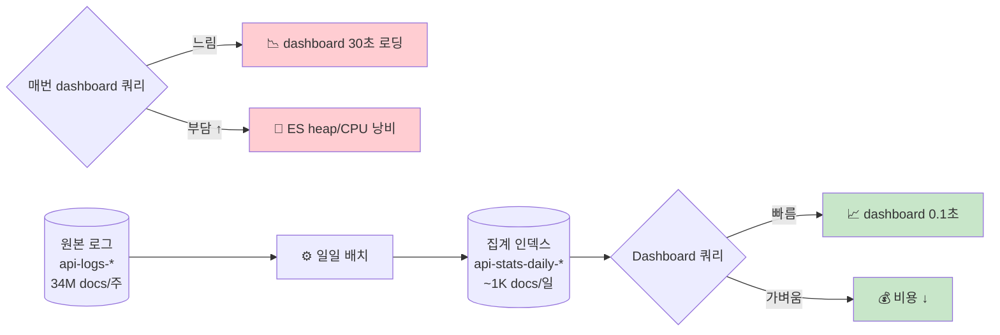
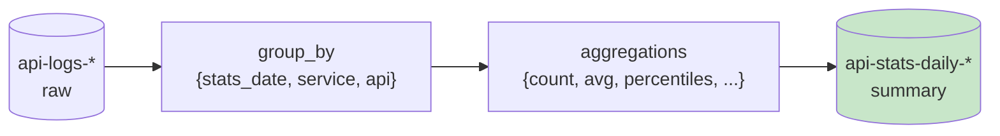

# 07. 일일 배치 통계 인덱스 — 3가지 방법 비교

> **목표**: 매일 자동으로 전일자 데이터를 집계해 새로운 통계 인덱스(`api-stats-daily-YYYY.MM.DD`) 에 저장하는 파이프라인을 구축. KPI 대시보드 / 보고서 / 장기 보존용.
> **선수**: [06-index-management.md](06-index-management.md) — 인덱스 매핑·alias·ILM 이해
> **소요**: 1.5~2시간 (3 방법 모두 손으로 시도)

---

## 왜 이게 필요한가



**원리**: raw 34M docs → 매일 1번 집계 → ~1K docs/일 → KPI dashboard 가 가벼움 + 365일 장기 보존도 부담 적음.

> **Oracle 비유**: Materialized View 또는 일일 ETL 로 만드는 summary 테이블.

---

## 3가지 방법 — 한 화면 비교

| 방법 | 특징 | 베스트 프랙티스? | 우리 시도 순서 |
|------|------|--------------|---------|
| **α Transform** | ES 내장, GUI 친화적, 자동·증분 가능 | ✅ **권장** | 1번째 |
| **β Rollup** | legacy, 단순한 시계열 합산용 | ⚠️ 8.x 유지보수 모드 (deprecated) | 2번째 |
| **γ cron + reindex(aggregations)** | 외부 스케줄러 + 직접 쿼리 | 🔧 가장 유연, 복잡 | 3번째 |

---

## 학습 흐름

```mermaid
flowchart TD
    Start([시작]) --> Spec[7.1 통계 명세 합의]
    Spec --> Idx[7.2 대상 인덱스 매핑 정의]
    Idx --> A[7.3 방법 α — Transform]
    A --> B[7.4 방법 β — Rollup]
    B --> C[7.5 방법 γ — cron + reindex]
    C --> Compare[7.6 3 방법 비교 + 선택 가이드]
    Compare --> ILM[7.7 ILM 으로 보존 자동화]
    ILM --> Closed[7.8 폐쇄망 운영 가이드]

    style A fill:#c8e6c9
    style B fill:#fff3e0
    style C fill:#bbdefb
```



---

## 7.1 통계 명세 합의 (Q3 답변 그대로)

### 매일 새 인덱스
이름 패턴: `api-stats-daily-YYYY.MM.DD` (예: `api-stats-daily-2026.04.26`)

### 수집 통계 (한 doc = 한 (서비스, API) 조합)

```json
{
  "@timestamp":      "2026-04-25T15:00:00.000Z",  // KST 04-26 00:00 (집계 기준일)
  "stats_date":      "2026-04-25",
  "service_name":    "account-service",
  "api_path":        "/api/v1/accounts/transfer",
  "http_method":     "POST",

  "calls_total":     34921,
  "calls_in":        17460,
  "calls_out":       17461,
  "calls_success":   14310,
  "calls_error":     3151,
  "error_rate":      0.180,

  "p50_ms":          320,
  "p95_ms":          742,
  "p99_ms":          1230,
  "avg_ms":          412,
  "min_ms":          22,
  "max_ms":          2841,

  "first_call_at":   "2026-04-25T15:00:00.123Z",
  "last_call_at":    "2026-04-25T14:59:56.756Z",
  "unique_traces":   17460,

  "top_error_codes": [
    { "code": "9999", "count": 1820 },
    { "code": "E001", "count":  834 },
    { "code": "P001", "count":  497 }
  ]
}
```

### 통계 인덱스 매핑

```json
PUT /_index_template/api-stats-daily-template
{
  "index_patterns": ["api-stats-daily-*"],
  "priority": 100,
  "template": {
    "settings": {
      "number_of_shards": 1,
      "number_of_replicas": 0,
      "index.lifecycle.name": "kpi-stats-policy"
    },
    "mappings": {
      "properties": {
        "@timestamp":     { "type": "date" },
        "stats_date":     { "type": "date", "format": "yyyy-MM-dd" },
        "service_name":   { "type": "keyword" },
        "api_path":       { "type": "keyword" },
        "http_method":    { "type": "keyword" },
        "calls_total":    { "type": "long" },
        "calls_in":       { "type": "long" },
        "calls_out":      { "type": "long" },
        "calls_success":  { "type": "long" },
        "calls_error":    { "type": "long" },
        "error_rate":     { "type": "float" },
        "p50_ms":         { "type": "float" },
        "p95_ms":         { "type": "float" },
        "p99_ms":         { "type": "float" },
        "avg_ms":         { "type": "float" },
        "min_ms":         { "type": "float" },
        "max_ms":         { "type": "float" },
        "first_call_at":  { "type": "date" },
        "last_call_at":   { "type": "date" },
        "unique_traces":  { "type": "long" },
        "top_error_codes": {
          "type": "nested",
          "properties": {
            "code":  { "type": "keyword" },
            "count": { "type": "long" }
          }
        }
      }
    }
  }
}
```

### ILM (다음 §7.7 에서 정의)
365일 후 자동 삭제.

---

## 7.2 ILM Policy 먼저 등록

```json
PUT /_ilm/policy/kpi-stats-policy
{
  "policy": {
    "phases": {
      "hot":   { "actions": { "set_priority": { "priority": 100 } } },
      "warm":  { "min_age": "30d",  "actions": { "shrink": { "number_of_shards": 1 } } },
      "delete":{ "min_age": "365d", "actions": { "delete": {} } }
    }
  }
}
```

(매핑에 이미 `index.lifecycle.name: kpi-stats-policy` 박혀 있음)

---

## 7.3 방법 α — Transform (✅ 베스트 프랙티스)

### 7.3.1 Transform 이 무엇인가

**ES 가 내장한 ETL 엔진**. continuous (실시간 점진) 또는 one-shot (단발 실행).



**Pivot transform** — 여러 raw doc 을 하나의 summary doc 으로.

### 7.3.2 Transform 정의 (Dev Tools)

```json
PUT _transform/api-stats-daily
{
  "source": {
    "index": "api-logs-*",
    "query": {
      "term": { "log_type": "out" }
    }
  },
  "dest": {
    "index": "api-stats-daily-2026.04.25"
  },
  "pivot": {
    "group_by": {
      "stats_date":   { "date_histogram": { "field": "@timestamp", "calendar_interval": "1d", "time_zone": "Asia/Seoul" } },
      "service_name": { "terms":  { "field": "service_name" } },
      "api_path":     { "terms":  { "field": "api_path" } },
      "http_method":  { "terms":  { "field": "http_method" } }
    },
    "aggregations": {
      "calls_total":   { "value_count": { "field": "@timestamp" } },
      "calls_success": { "filter":      { "term": { "data.resultCode": "0000" } } },
      "p50_ms":        { "percentiles": { "field": "elapsed_ms", "percents": [50] } },
      "p95_ms":        { "percentiles": { "field": "elapsed_ms", "percents": [95] } },
      "p99_ms":        { "percentiles": { "field": "elapsed_ms", "percents": [99] } },
      "avg_ms":        { "avg":         { "field": "elapsed_ms" } },
      "min_ms":        { "min":         { "field": "elapsed_ms" } },
      "max_ms":        { "max":         { "field": "elapsed_ms" } },
      "first_call_at": { "min":         { "field": "@timestamp" } },
      "last_call_at":  { "max":         { "field": "@timestamp" } },
      "unique_traces": { "cardinality": { "field": "trace_id" } },
      "error_rate":    {
        "bucket_script": {
          "buckets_path": { "ok": "calls_success._count", "total": "calls_total" },
          "script": "1 - (params.ok / params.total)"
        }
      }
    }
  },
  "frequency": "1h",
  "sync": {
    "time": {
      "field": "@timestamp",
      "delay": "60s"
    }
  }
}
```

### 7.3.3 시작

```
POST _transform/api-stats-daily/_start
```

### 7.3.4 Kibana GUI 에서

≡ → **Stack Management → Transforms → Create transform** → wizard 따라가기:

```
Step 1: Source            api-logs-*
Step 2: Configuration     Pivot, group_by + aggregations 선택 (drag&drop)
Step 3: Destination       api-stats-daily-target
Step 4: Schedule          Continuous (1h) 또는 Manual
```

### 7.3.5 검증

```
GET /api-stats-daily-2026.04.25/_search?size=5
```

응답:
```json
"hits": [
  {
    "_source": {
      "stats_date": "2026-04-25",
      "service_name": "account-service",
      "api_path": "/api/v1/accounts/transfer",
      "calls_total": 34921,
      "calls_success": { "doc_count": 28630 },
      "p95_ms": { "values": { "95.0": 742.0 } },
      "error_rate": 0.180
    }
  }
]
```

### 7.3.6 Transform 의 장점

```
✅ ES 내장 - 외부 스케줄러 불필요
✅ Continuous mode - 실시간 점진 업데이트 가능 (위 sync 설정)
✅ Kibana GUI 지원
✅ task API 로 모니터링
✅ 매핑 자동 (template 적용)
```

### 7.3.7 단점 / 함정

```
⚠️ 복잡한 변환은 한계 (script 일부만 지원)
⚠️ continuous 시 ES heap 부담 (큰 group_by 카디널리티)
⚠️ destination 인덱스명 동적 (`api-stats-daily-{stats_date}`) 자동 분리는 별도 처리 필요
```

📌 **한 인덱스명에 모든 일자 누적 vs 일자별 분리 인덱스**:
- 위 예제는 한 인덱스 (`api-stats-daily-2026.04.25`) 에 결과 누적 → 매일 새 transform 만들어야 인덱스 분리됨
- 더 자연스럽게 하려면 destination 매핑 `_index` field 동적 생성 + ingest pipeline 사용 (고급)

---

## 7.4 방법 β — Rollup (legacy / 학습용)

### 7.4.1 주의

```
⚠️ Rollup 은 ES 8.x 에서 deprecated (Transform 으로 대체 권장).
   ES 9.x 에서 제거 예정.
   학습 목적 + 기존 시스템 유지보수용으로만.
```

### 7.4.2 Rollup Job 정의

```json
PUT _rollup/job/api-stats-rollup
{
  "id": "api-stats-rollup",
  "index_pattern": "api-logs-*",
  "rollup_index": "api-stats-rollup-target",
  "cron": "0 0 1 * * ?",
  "page_size": 1000,
  "groups": {
    "date_histogram": {
      "field": "@timestamp",
      "calendar_interval": "1d",
      "time_zone": "Asia/Seoul"
    },
    "terms": {
      "fields": ["service_name", "api_path", "http_method"]
    }
  },
  "metrics": [
    { "field": "elapsed_ms", "metrics": ["avg", "min", "max", "value_count"] }
  ]
}
```

특징:
- `cron` 으로 직접 스케줄
- `groups` + `metrics` 분리 (Transform 의 group_by + aggregations 와 유사)
- `_rollup_search` API 로만 조회 (별도 SQL/Lens 필요)

### 7.4.3 시작 / 중지

```
POST _rollup/job/api-stats-rollup/_start
POST _rollup/job/api-stats-rollup/_stop
GET  _rollup/job/api-stats-rollup
```

### 7.4.4 Rollup 결과 조회

```
GET api-stats-rollup-target/_rollup_search
{
  "size": 0,
  "aggs": {
    "by_day": {
      "date_histogram": {
        "field": "@timestamp",
        "calendar_interval": "1d"
      },
      "aggs": { "avg_lat": { "avg": { "field": "elapsed_ms" } } }
    }
  }
}
```

📌 **결론**: Rollup 은 단순 시계열 합산엔 OK 이지만 **percentile / cardinality / formula** 가 부족. **신규 시스템엔 Transform 권장**.

---

## 7.5 방법 γ — cron + reindex (외부 스케줄러)

### 7.5.1 시나리오

ES 의 transform 이나 rollup 이 부족하거나, 외부 시스템(Airflow, Kubernetes CronJob, Linux cron) 이 이미 있을 때.

### 7.5.2 SpecFromLog 의 ctl.sh 같은 패턴

```bash
#!/usr/bin/env bash
# /home/ubuntu/workspace/specfromlog/elastic/scripts/daily-stats.sh
# crontab: 0 1 * * * /path/to/daily-stats.sh

set -euo pipefail
SCRIPT_DIR=$(cd "$(dirname "${BASH_SOURCE[0]}")" && pwd)
. "$SCRIPT_DIR/../.env"

# 어제(KST) 일자
STATS_DATE=$(TZ=Asia/Seoul date -d "yesterday" +%Y-%m-%d)
DEST_INDEX="api-stats-daily-$(echo $STATS_DATE | tr '-' '.')"

# 1. 결과 인덱스 (없으면 생성)
curl -s -u "elastic:$ELASTIC_PASSWORD" -XPUT "http://localhost:9200/$DEST_INDEX" \
  -H 'Content-Type: application/json' -d '{}' >/dev/null

# 2. _reindex with aggregations (단순 reindex 는 group 안 됨 — 직접 aggregation 후 bulk insert)
RESP=$(curl -s -u "elastic:$ELASTIC_PASSWORD" -XPOST "http://localhost:9200/api-logs-*/_search" \
  -H 'Content-Type: application/json' -d "{
    \"size\": 0,
    \"query\": {
      \"bool\": {
        \"filter\": [
          { \"term\": { \"log_type\": \"out\" } },
          { \"range\": { \"@timestamp\": {
            \"gte\": \"${STATS_DATE}T00:00:00\",
            \"lt\":  \"${STATS_DATE}T24:00:00\",
            \"time_zone\": \"+09:00\"
          }}}
        ]
      }
    },
    \"aggs\": {
      \"by_svc\": {
        \"terms\": { \"field\": \"service_name\", \"size\": 100 },
        \"aggs\": {
          \"by_api\": {
            \"terms\": { \"field\": \"api_path\", \"size\": 1000 },
            \"aggs\": {
              \"calls_total\":   { \"value_count\": { \"field\": \"@timestamp\" } },
              \"calls_success\": { \"filter\": { \"term\": { \"data.resultCode\": \"0000\" } } },
              \"p50\":           { \"percentiles\": { \"field\": \"elapsed_ms\", \"percents\": [50] } },
              \"p95\":           { \"percentiles\": { \"field\": \"elapsed_ms\", \"percents\": [95] } },
              \"p99\":           { \"percentiles\": { \"field\": \"elapsed_ms\", \"percents\": [99] } },
              \"avg\":           { \"avg\": { \"field\": \"elapsed_ms\" } }
            }
          }
        }
      }
    }
  }")

# 3. aggregation 응답 → bulk NDJSON 변환 → 적재 (Python 한 줄)
echo "$RESP" | python3 - <<PY
import json, sys, requests, os
data = json.loads(sys.stdin.read())
ndjson = []
for svc_b in data['aggregations']['by_svc']['buckets']:
  svc = svc_b['key']
  for api_b in svc_b['by_api']['buckets']:
    doc = {
      "@timestamp":    "${STATS_DATE}T15:00:00.000Z",  # KST 자정 = UTC 15:00 (전일)
      "stats_date":    "${STATS_DATE}",
      "service_name":  svc,
      "api_path":      api_b['key'],
      "calls_total":   api_b['calls_total']['value'],
      "calls_success": api_b['calls_success']['doc_count'],
      "calls_error":   api_b['calls_total']['value'] - api_b['calls_success']['doc_count'],
      "error_rate":    1 - (api_b['calls_success']['doc_count'] / max(api_b['calls_total']['value'], 1)),
      "p50_ms":        api_b['p50']['values']['50.0'],
      "p95_ms":        api_b['p95']['values']['95.0'],
      "p99_ms":        api_b['p99']['values']['99.0'],
      "avg_ms":        api_b['avg']['value']
    }
    ndjson.append(json.dumps({"index": {}}))
    ndjson.append(json.dumps(doc))
body = "\n".join(ndjson) + "\n"
r = requests.post(f"http://localhost:9200/${DEST_INDEX}/_bulk",
                  data=body,
                  headers={"Content-Type":"application/x-ndjson"},
                  auth=("elastic", os.environ["ELASTIC_PASSWORD"]))
print(f"Bulk loaded: errors={r.json().get('errors')} items={len(r.json().get('items',[]))}")
PY

echo "Done — $DEST_INDEX populated for $STATS_DATE"
```

### 7.5.3 cron 등록

```cron
# /etc/cron.d/api-stats-daily
0 1 * * * ubuntu /home/ubuntu/workspace/specfromlog/elastic/scripts/daily-stats.sh >> /var/log/api-stats.log 2>&1
```

매일 01:00 (시스템 시간) 실행.

### 7.5.4 cron + reindex 의 장점

```
✅ 가장 유연 — 어떤 변환·외부 enrichment 도 가능
✅ ES 부담 컨트롤 (낮은 시간대 수동 실행)
✅ 결과 검증 / 재실행 / dry-run 등 운영 hook 자유
✅ 외부 시스템(Airflow/k8s) 통합 자연
```

### 7.5.5 단점

```
⚠️ 외부 스케줄러 + 인증 + 모니터링 직접 관리
⚠️ ES 자체 API 보다 코드 길고 유지보수 부담
⚠️ ES 장애 / 네트워크 일시 끊김 시 retry 로직 직접
⚠️ 권한·시크릿 관리
```

---

## 7.6 3 방법 비교 + 선택 가이드

```mermaid
flowchart TD
    Q1{실시간 또는 점진?}
    Q1 -->|"실시간 / 점진"| A[Transform Continuous]
    Q1 -->|"일단위 batch OK"| Q2{단순 시계열?}
    Q2 -->|"매우 단순<br/>(count, avg)"| Beta[Rollup<br/>(legacy)]
    Q2 -->|"복잡한 변환·외부 통합"| Q3{외부 스케줄러 있나?}
    Q3 -->|"없음"| A
    Q3 -->|"있음 (Airflow 등)"| C[cron + reindex]

    style A fill:#c8e6c9
    style Beta fill:#fff3e0
    style C fill:#bbdefb
```

| 기준 | Transform (α) | Rollup (β) | cron+reindex (γ) |
|------|--------------|----------|----------------|
| **실시간 점진** | ✅ continuous | ❌ batch only | ❌ batch only |
| **GUI 친화** | ✅ Kibana | △ 일부 | ❌ |
| **복잡한 변환** | △ 일부 painless | ❌ 단순만 | ✅ 무한 |
| **percentile** | ✅ | ❌ | ✅ |
| **cardinality (DISTINCT)** | ✅ | ❌ | ✅ |
| **외부 enrichment** | ❌ | ❌ | ✅ |
| **ES 8 권장** | ✅ | ⚠️ deprecated | ✅ |
| **ES 9 호환** | ✅ | ❌ 제거 예정 | ✅ |
| **유지보수 부담** | 낮음 | 낮음 | 중간 |
| **모니터링** | task API + Kibana | task API | 직접 (log) |

🏆 **추천**:
- **신규 시스템**: **α Transform** 부터 (90% 케이스 해결)
- **외부 enrichment 또는 매우 복잡한 변환**: **γ cron + reindex**
- **β Rollup**: 학습 + 기존 시스템 유지보수만

---

## 7.7 ILM 으로 보존 + 자동 삭제

### 7.7.1 정책 등록 (이미 §7.2 에서 함)

### 7.7.2 검증

```
GET _ilm/policy/kpi-stats-policy
GET api-stats-daily-2026.04.25/_ilm/explain
```

응답에서:
- `phase`: hot/warm/delete
- `age`: 인덱스 생성 후 경과 시간
- `step`: 현재 진행 중인 액션

### 7.7.3 시각화

≡ → **Stack Management → Index Lifecycle Policies → kpi-stats-policy** → 그래픽 phase diagram.


---

## 7.8 폐쇄망 운영 가이드

### 7.8.1 권한 분리

운영 ES 에서:
- `kibana_system` — Kibana 자체
- `transform_user` — Transform 정의·실행 권한
- `dashboard_user` — 통계 인덱스 read-only

### 7.8.2 모니터링

매일 통계 인덱스가 정상 생성됐는지 자동 점검:

```bash
# scripts/check-daily-stats.sh
EXPECTED_INDEX="api-stats-daily-$(TZ=Asia/Seoul date -d 'yesterday' +%Y.%m.%d)"
COUNT=$(curl -s -u "elastic:$PW" "http://es/$EXPECTED_INDEX/_count" \
  | python3 -c "import json,sys; print(json.load(sys.stdin).get('count',0))")
[ "$COUNT" -gt 0 ] || echo "ALERT: $EXPECTED_INDEX 생성 안 됨" | mail -s "stats batch failed" oncall@…
```

### 7.8.3 백업

매일 통계 인덱스를 snapshot:

```
PUT _snapshot/daily-backups/snap-{stats_date}
{
  "indices": "api-stats-daily-*",
  "include_global_state": false
}
```

### 7.8.4 변경 관리

매핑/통계 명세 변경 시:
1. 새 template 등록 (`api-stats-daily-template-v2`)
2. 새 transform / cron 으로 v2 destination 으로 누적
3. dashboard alias 전환
4. v1 ILM 으로 자연 만료

---

## 7.9 실습 체크리스트

- [ ] §7.1 통계 명세 합의 + ILM policy 등록
- [ ] §7.3 Transform 1개 만들고 _start 실행 + 결과 인덱스 검증
- [ ] §7.3 Kibana GUI 로도 Transform wizard 시도
- [ ] §7.4 Rollup job 1개 등록 (학습 목적, 결과 비교)
- [ ] §7.5 cron 스크립트 1개 작성 + 1회 수동 실행
- [ ] §7.6 3 결과 인덱스 비교 (같은 날짜의 통계가 일치하는지)
- [ ] §7.7 ILM 작동 시뮬레이션 (min_age 짧게 1m 등)
- [ ] §7.8 폐쇄망 모니터링 / 백업 스크립트 1개

---

## 7.10 흔한 실수

| 실수 | 증상 | 해결 |
|------|------|------|
| `data.resultCode` 가 text 로 매핑되어 terms agg 실패 | "field is not aggregatable" | `data.resultCode.keyword` 사용 또는 매핑 변경 후 reindex |
| Transform destination 의 매핑이 자동 생성되어 의도와 다름 | percentile 결과가 object 로 저장됨 | template 으로 명시 매핑 미리 정의 |
| time_zone 누락 → 일자 경계가 UTC | KST 자정과 어긋남 | `time_zone: "Asia/Seoul"` 명시 |
| Rollup 결과를 일반 `_search` 로 조회 | 0건 또는 에러 | `_rollup_search` 전용 API 필수 |
| cron 스크립트가 어제 데이터 부족 시점에 실행 | 일부 누락 | 충분한 delay (예: 01:00 KST) + lookback +N 시간 |

---

## ❓ Self-check

1. **Q.** Transform 의 `frequency` 와 `sync` 의 차이?
   <details><summary>A</summary>frequency = 점진 갱신 주기 (얼마나 자주 신규 raw 를 보고 통계 업데이트). sync = 신규 raw 의 timestamp 가 충분히 정착할 시간 (delay) — late-arriving data 대비.</details>

2. **Q.** Rollup 이 Transform 으로 대체된 이유?
   <details><summary>A</summary>Transform 이 더 일반화 (모든 aggregation 지원), continuous mode, GUI 지원. Rollup 은 단순 시계열 합산만. ES 9 에서 Rollup 제거 예정.</details>

3. **Q.** cron + reindex 가 transform 보다 적합한 시나리오는?
   <details><summary>A</summary>(1) 외부 데이터 enrichment (사용자 정보 같은 별도 source 와 join), (2) 복잡한 painless 로 표현 어려운 변환, (3) 외부 스케줄러 (Airflow/k8s CronJob) 와 통합 필요, (4) 결과 검증·재실행·dry-run 같은 운영 hook 직접 관리.</details>

4. **Q.** ILM 의 phase 4개와 각 의미는?
   <details><summary>A</summary>HOT (활발 쓰기/조회) → WARM (읽기 위주, shrink) → COLD (가끔 조회, searchable snapshot 가능) → DELETE (자동 삭제). FROZEN phase 도 별도로 (cold 보다 더 저비용).</details>

5. **Q.** 통계 인덱스를 매일 새 인덱스로 만드는 게 좋은 이유?
   <details><summary>A</summary>(1) 보존 관리 — ILM 으로 옛 인덱스만 삭제, (2) 매핑 진화 — 신규 일자부터 새 매핑 적용 가능, (3) 검색 효율 — 시간 범위 쿼리 시 불필요 인덱스 skip, (4) 에러 격리 — 한 일자만 reindex 가능.</details>

---

## 다음
- ES 8 → 9 변경점 → **[99-es-version-comparison.md](99-es-version-comparison.md)**
- 학습 끝나고 **운영 1주차 회고 + 임계 조정** 권장.
