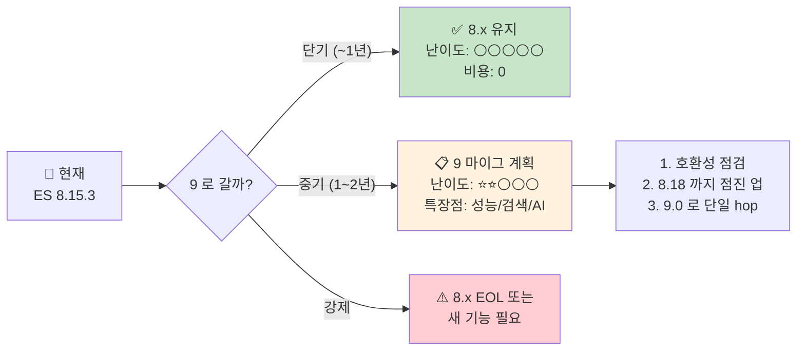
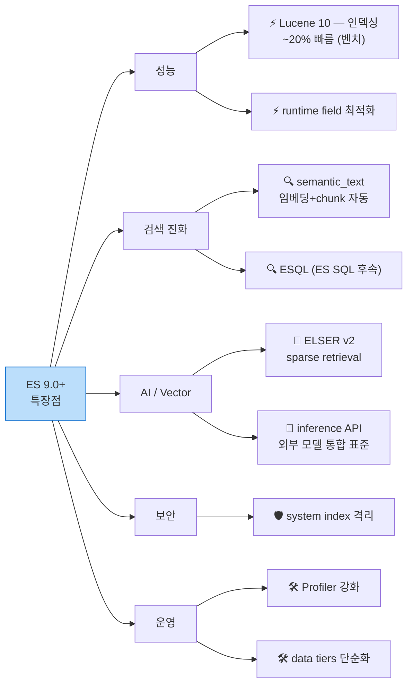
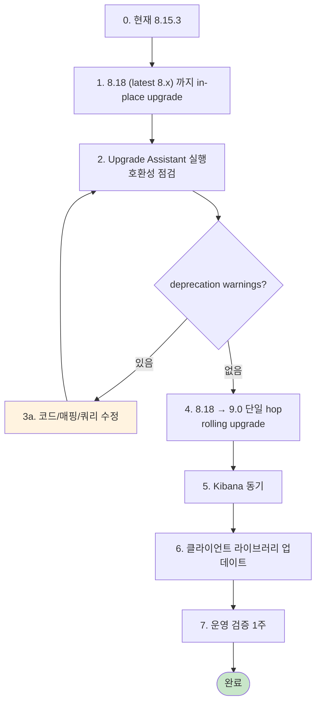
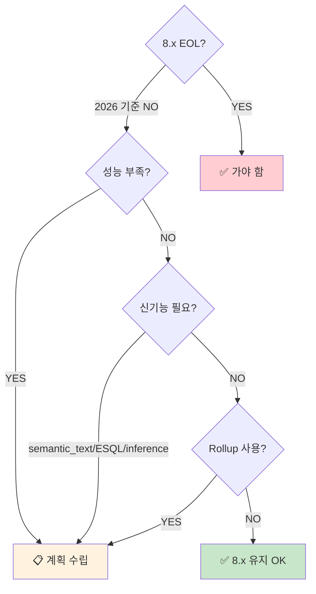

# 99. Elasticsearch 8 vs 9 — 변화 / 난이도 / 특장점 / 필요성

> **목적**: 의사결정용 short summary. ES 8.x → 9.x 마이그레이션을 **언제, 어떻게, 꼭 해야 하나** 판단.
> **현재 환경**: 8.15.3 (8.x 후반)
> **소요**: 통독 10분

---

## 한 화면 요약



**TL;DR**:
- ES 9.0 이 2025년에 GA. 큰 break change 는 적음 (의도적으로 호환성 유지).
- **꼭 가야 하는가?** 1년 안엔 NO. 8.x 가 충분히 안정적.
- **언제 가나?** 8.x EOL 또는 9.x 의 신기능 (벡터 검색 / ELSER / Search AI) 이 필요할 때.
- **난이도?** 8 → 9 는 **5점 만점에 2점** (Java 의존성 정리 / deprecated API 제거 / X-Pack license tier 영향).
- **10 은?** 미발표 (2026 기준).

---

## 1. 버전 흐름

```
2022   ES 8.0 GA              주요: 보안 기본 ON, X-Pack 통합, REST API 정리
2023   ES 8.5 ~ 8.10           ELSER (sparse vector), kNN search, 검색 모듈 강화
2024   ES 8.13 ~ 8.16          search application API, semantic_text 도입
2024   ES 9.0 announced (Q4)
2025   ES 9.0 GA               주요: SUM/MV 정리, runtime 성능 ↑, retiring legacy
2026   ES 9.x 후반             현재 추세
???    ES 10                   미발표
```

📌 **현재(2026.04) 안정 LTS 흐름**: 8.x 후반 (8.15~8.18) 이 가장 보수적 운영. 9.x 는 early adopter.

---

## 2. ES 8.x 의 위치

8.x 가 갑자기 사라지는 게 아니라 보통 **major 가 GA 후 약 18개월 ~ 2년간 활발 지원** + 추가 1년 보안 패치.

| 버전 | 상태 (2026.04 기준) |
|------|----------------|
| 8.0 ~ 8.5 | EOL (보안 패치 종료) |
| 8.6 ~ 8.12 | 보안 패치만 |
| 8.13 ~ 8.18 | active maintenance |
| 8.19+ (있을 시) | 가능성 |
| 9.0+ | 활발 개발 |

→ **ES 8.15.3 (현재) 은 안정. 마이그 강제 압박 없음**.

---

## 3. ES 9.0 의 주요 변화

### 3.1 사용자 영향 큰 것

| 분야 | 8 | 9 |
|------|---|---|
| **Java 호환** | Java 17~21 | Java 21+ (drop 17) |
| **REST 호환 모드** | 7.x compat 가능 | **7.x compat 모드 제거** |
| **Plugin API** | 8 plugins 일부 | **재컴파일 필요** |
| **Rollup** | deprecated, 동작 | **제거 — Transform 사용 강제** |
| **System indices 보호** | 일부 | **강화 — 직접 쓰기 더 어려워짐** |
| **deprecated query DSL** | 동작, 경고 | **제거** (예: 일부 boolean 표기) |
| **X-Pack license** | tier별 | tier 정리 (일부 기능 basic 으로 내려옴) |

### 3.2 사용자 영향 작은 것

| 분야 | 8 | 9 |
|------|---|---|
| Query DSL 문법 | 거의 동일 | 거의 동일 |
| Aggregation | 동일 | 동일 |
| Mapping 타입 | 동일 | 동일 |
| Index 라이프사이클 (ILM) | 동일 | 동일 |
| Kibana 호환 | Kibana 8 | **Kibana 9** 필요 |

→ **일반 query / Lens / Dashboard 사용자에게는 변화 거의 0**.

---

## 4. ES 9 의 특장점



### 4.1 성능 (Lucene 10 기반)

- 인덱싱 throughput **벤치 ~20% 향상** (워크로드 따라 차이 큼)
- 검색 latency **일부 케이스 ~30% 향상** (특히 텀 매칭)
- runtime field 가 더 똑똑하게 (caching / pruning)

📌 **운영 효과**: 같은 ES 클러스터에서 **더 많은 docs 처리 가능** = 비용 절감 또는 capacity headroom.

### 4.2 검색·AI 진화 (가장 큰 마케팅 포인트)

#### `semantic_text` 필드 타입
- 임베딩 자동 생성 + chunk 분할 + 검색까지 자동
- 문서 한 줄 매핑으로 RAG 파이프라인:
```json
"description": { "type": "semantic_text", "inference_id": "elser-2" }
```
→ insert 시 자동 임베딩, 검색 시 자동 시멘틱 매칭. 사용자 코드 0 줄.

#### `ESQL` (Elasticsearch Query Language)
- SQL 과 비슷한 pipe-style 문법
- Kibana **Discover ES|QL mode** 에서 직접 작성

```
FROM api-logs-*
| WHERE log_type == "out" AND data.resultCode != "0000"
| STATS errors = COUNT(*) BY service_name
| SORT errors DESC
| LIMIT 10
```

> **Oracle 사용자 친화도 ↑**. SQL 비유가 더 자연스러움.

#### Inference API 표준화
- OpenAI, Cohere, HuggingFace, Bedrock 등 외부 모델 ES 안에서 통합 호출
- 기업 RAG 의 검색 인프라로

### 4.3 운영 / 보안

- **system indices 격리 강화** — 실수로 `.kibana` 같은 시스템 인덱스 건드리는 위험 ↓
- **data tiers 단순화** (hot/warm/cold/frozen 표준화)
- **Profiler** — 느린 쿼리 진단 도구 강화

### 4.4 license / 가격 정리

일부 Platinum 기능이 **Basic 으로 내려옴** (구체 항목은 9.x 릴리즈 노트 참고). 비용 절감 가능성.

---

## 5. 마이그레이션 난이도 — 5점 척도

```
난이도 1: 거의 무비용 (in-place upgrade)
난이도 5: 대대적 reindex + 코드 변경 + 다운타임
```

### 8.x → 9.x 종합 평가

| 항목 | 난이도 | 설명 |
|------|------|----|
| **데이터 호환성** | ⭐⚪⚪⚪⚪ | 인덱스 거의 그대로, in-place upgrade 가능 |
| **REST API** | ⭐⭐⚪⚪⚪ | 7.x compat 사용 중이면 정리 필요. 일반 사용은 무영향 |
| **Java 의존성** | ⭐⭐⚪⚪⚪ | Java 17 → 21 강제. JVM 버전 정리 |
| **Plugin** | ⭐⭐⭐⚪⚪ | 외부 plugin 쓰면 재컴파일·호환 확인 |
| **Rollup 사용 중** | ⭐⭐⭐⭐⚪ | Transform 으로 마이그레이션 필수 (제거됨) |
| **Kibana** | ⭐⭐⚪⚪⚪ | Kibana 도 9.x 동시 업그레이드 |
| **클라이언트 라이브러리** | ⭐⭐⚪⚪⚪ | `@elastic/elasticsearch ^9.0.0` 으로 업그레이드 (대부분 호환) |
| **운영 모니터링 도구** | ⭐⭐⚪⚪⚪ | Beats / Logstash 도 동기 |

🏆 **종합: ⭐⭐⚪⚪⚪ (5점 만점에 2점)** — 기술적 난이도 중하. **준비/검증 시간이 진짜 비용**.

---

## 6. 마이그 절차 (간이 가이드)



### 6.1 Upgrade Assistant (Kibana 내장)

≡ → Stack Management → **Upgrade Assistant** — deprecation 경고 / 호환성 이슈 자동 점검.

### 6.2 Rolling upgrade (zero downtime)

multi-node 클러스터 한정. 노드 1개씩 stop → upgrade → start → 완료 후 다음 노드.

→ **single-node 클러스터** (우리 학습 환경) 는 ES container image 만 교체:
```yaml
# docker-compose.yml
image: docker.elastic.co/elasticsearch/elasticsearch:9.0.0
```

### 6.3 SpecFromLog client 호환

현재 `@elastic/elasticsearch ^8.13.0` 사용. ES 9 와는:
- ES 9 cluster 에 ES 8 client 로 접속 → 일부 deprecated API 경고만, 핵심 기능 동작
- **권장**: client 도 `^9.0.0` 으로 동기

```bash
npm install @elastic/elasticsearch@^9
```

---

## 7. **꼭 가야 하는가** — 의사결정 매트릭스



### 우리 환경에 적용

| 질문 | 답 (현재 환경) | 결과 |
|------|------------|----|
| 8.x EOL? | NO (8.15.3, 활발 지원) | 강제 X |
| 성능 부족? | NO (10M docs 17초 OK) | 부담 X |
| 신기능 필요? | NO (검색·AI 안 씀, 운영 로그 분석만) | 부담 X |
| Rollup 사용? | NO | 부담 X |

🏆 **결론: 1년 안엔 8.x 유지 권장**. 8.18 GA 시점에 한 번 in-place upgrade 정도.

### 마이그 우선순위 5단계

| 우선순위 | 시나리오 | 권장 |
|----|----|----|
| 🟢 **여유** | 일반 운영 | 1~2년 후 9.x mainstream 시 (9.3+) |
| 🟡 **중간** | 신기능 필요 (semantic_text 등) | 6개월 안에 PoC |
| 🟠 **준비** | Rollup 사용 중 | 9.x 가기 전 Transform 으로 미리 마이그 |
| 🔴 **시급** | 8.x EOL 도래 | 즉시 계획 수립 |

---

## 8. ES 10 은?

**미발표** (2026.04 기준). Elastic 의 major release 주기는 보통 3~4년.

- ES 7 → 8: 2022 (4년)
- ES 8 → 9: 2025 (3년)
- ES 9 → 10: **2028~2029 추정** (4년 가정)

📌 **결론**: 10 을 지금 걱정할 필요 없음.

---

## 9. 폐쇄망 시나리오에서

폐쇄망에서 ES 버전을 결정할 때 추가 고려:

| 항목 | 영향 |
|------|------|
| **이미지 반입** | docker image / RPM 반입 절차 + 보안 점검 시간 |
| **plugin 의존** | 사내 plugin 있으면 재컴파일 부담 |
| **운영 인원 학습 곡선** | Kibana 9 UI 일부 변경 |
| **다른 사내 시스템** | Beats / Logstash / 사내 ETL 동기 필요 |
| **license** | basic vs gold/platinum 결정 |

→ 폐쇄망은 **반입 / 보안 검토 / 동기화** 가 진짜 비용. 기술 자체는 작음.

---

## 10. 최종 권고

```
✅ 단기 (~1년): 8.x 유지 (8.18 까지 in-place upgrade)
✅ 중기 (1~2년): 8.18 안정화 후 9.0 LTS 시점에 마이그 PoC
✅ 장기: 9.x mainstream (9.2~9.3) 시 정식 마이그
```

8.x 의 안정성·생태계가 충분하고, 9.x 의 특장점이 우리 운영 로그 분석엔 결정적이지 않음. **억지로 갈 이유 없음**.

---

## 11. 한 페이지 요약

```
==================  ES 8 vs 9  ==================

현재          : 8.15.3 (8.x 후반, 안정)
ES 9 GA       : 2025
ES 10         : 미발표 (2028~2029 추정)

== 변화 (8 → 9) ==
- 데이터/매핑   : 거의 동일
- REST API      : 7.x compat 제거, 일부 deprecated 정리
- Rollup        : 제거 (Transform 사용)
- Java          : 17 → 21
- Plugin        : 재컴파일 필요
- Kibana        : 동시 9 로

== 특장점 ==
- Lucene 10 → 인덱싱 ~20% 빠름
- semantic_text / ESQL / inference API
- system index 격리 강화
- 일부 X-Pack → basic

== 난이도 ==
종합 ⭐⭐⚪⚪⚪ (5점 만점에 2)
- 일반 사용자엔 거의 무영향
- 운영자/플러그인 사용자엔 점검 필요

== 꼭 가야 하나? ==
운영 로그 분석만 → NO (1년 이상 8.x 안전)
신기능 필요 (벡터검색/RAG) → 6개월 PoC 권장
Rollup 사용 중 → 9.x 가기 전 Transform 으로 미리 마이그 필수
8.x EOL 도래 → 즉시
```

---

## ❓ Self-check

1. **Q.** 우리 환경에서 ES 9 로 갈 가장 큰 트리거는?
   <details><summary>A</summary>(1) 8.x EOL (보안 패치 종료) — 가장 강제. (2) Rollup 을 쓰고 있으면 9.x 에서 제거되므로 그 전에 Transform 으로 마이그. (3) semantic_text / ESQL 같은 신기능이 비즈니스 가치가 있을 때.</details>

2. **Q.** ES 9 에서 7.x compat 제거의 영향은?
   <details><summary>A</summary>코드에서 `?include_type_name=true` 같은 7.x 호환 옵션 사용 중이면 제거됨. 일반적으로 8.x 부터 쓰던 코드라면 영향 없음.</details>

3. **Q.** Rollup 을 쓰는 시스템은 ES 9 마이그 어떻게?
   <details><summary>A</summary>9.x 가기 전에 모든 Rollup job 을 Transform 으로 다시 작성. 결과 인덱스 매핑/이름 정합 확인. dashboard 가 결과 인덱스를 가리키므로 alias 전환으로 zero-downtime 가능.</details>

4. **Q.** 마이그레이션 비용 중 가장 큰 부분?
   <details><summary>A</summary>기술 자체보다 (1) 검증/테스트 시간, (2) 운영자 재학습, (3) 폐쇄망의 반입/보안 검토, (4) Beats/Logstash 등 부가 시스템 동기화. "테크 5%, 정책 95%" 라는 농담이 나올 정도.</details>

---

## 다음

이 문서가 학습 가이드의 마지막 reference. **운영 1주차 회고** + 임계 조정 + 팀 공유로 학습 사이클 마무리.

[← README](README.md)
