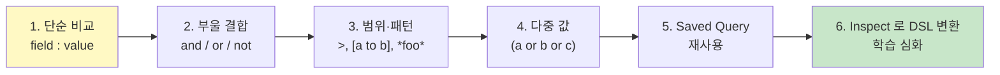

# 99. KQL 한 페이지 cheatsheet

> **KQL** (Kibana Query Language) — Discover / Lens / Dashboard 검색창에서 사용.
> 이 페이지만 옆에 두면 90% 케이스 해결.

---

## 기본 구조

```
<field> : <value>
```

**모든** KQL 표현은 위 형태의 조합. `:` 가 SQL 의 `=`.

---

## 비교 연산자

| KQL | 의미 | Oracle 등가 |
|-----|------|------------|
| `field : "value"` | 정확히 일치 | `field = 'value'` |
| `field : value` | 위와 동일 (인용 없으면 자동 처리) | 같음 |
| `field > 100` | 큼 | `field > 100` |
| `field >= 100` | 크거나 같음 | `field >= 100` |
| `field < 100` | 작음 | `field < 100` |
| `field <= 100` | 작거나 같음 | `field <= 100` |
| `field : [100 to 500]` | 범위 (inclusive) | `field BETWEEN 100 AND 500` |
| `field : {100 to 500}` | 범위 (exclusive) | `field > 100 AND field < 500` |

---

## 와일드카드 / 패턴

| KQL | 의미 |
|-----|------|
| `field : *foo*` | LIKE '%foo%' |
| `field : foo*` | LIKE 'foo%' (시작) |
| `field : *foo` | LIKE '%foo' (끝) |
| `field : *` | exists (any value) |
| `not field : *` | NOT exists / IS NULL |

⚠️ 와일드카드 `*` 는 `*foo*` 처럼 양 끝 사용 시 느려질 수 있음 (운영 시 신중히).

---

## 논리 연산자

| KQL | 의미 |
|-----|------|
| `a and b` | AND |
| `a or b` | OR |
| `not a` | NOT |
| `(a or b) and c` | 괄호 우선순위 |

대소문자 무관 (`AND`, `and` 모두 OK), 그러나 **소문자 권장**.

---

## 다중 값 (IN)

```
service_name : ("account-service" or "user-service" or "payment-service")
```

= Oracle `IN ('a','b','c')`

---

## Dotted path (중첩 객체)

```
data.resultCode : "9999"
header.uri : "/api/v1/legacy/inquiry"
kafka.partition : 0
```

→ JSON 경로를 점으로 연결. 자동으로 ES 가 인식.

---

## 자주 쓰는 패턴 (복붙용)

### 정상/에러 분리

```
log_type : "out" and data.resultCode : "0000"          # 정상 응답만
log_type : "out" and not data.resultCode : "0000"       # 에러 응답만
```

### 시간 + 서비스 + 에러

```
service_name : "payment-service"
  and not data.resultCode : "0000"
```
+ 시간 피커로 범위 (KQL 에 시간 직접 쓰기보다 Discover 시간 피커 권장)

### Latency 임계 초과

```
log_type : "out" and elapsed_ms > 1000
```

### Path 부분 일치

```
api_path : *transfer*
```

### 특정 trace_id

```
trace_id : "TRC000000123456"
```

### 다중 서비스 + 다중 메소드

```
service_name : ("account-service" or "user-service")
  and http_method : ("POST" or "PUT")
```

### 필드 미존재 (NULL)

```
not header.resultCode : *
```

### 음수 값 / 빈 문자열

```
elapsed_ms : 0                # 정확히 0
data.errorDetail : ""         # 빈 문자열
not data.errorDetail : *       # 필드 자체 없음
```

---

## KQL ↔ ES Query DSL 변환 (Inspect)

Discover 의 좌측 위 **`Inspect` → `Request`** 클릭하면 KQL 이 어떻게 DSL 로 변환됐는지 볼 수 있음. 학습에 매우 유용.

예: `service_name : "x" and elapsed_ms > 500` 입력 후 Inspect →

```json
{
  "bool": {
    "filter": [
      { "match_phrase": { "service_name": "x" } },
      { "range": { "elapsed_ms": { "gt": 500 } } }
    ]
  }
}
```

---

## 흔한 함정

| 함정 | 해결 |
|------|------|
| `service_name : account-service` (인용 없음) | `account` 와 `service` 가 token 분리되어 의도 다름. **`"account-service"` 인용 필수** |
| `not field : "value"` 가 의도와 다름 | `not (field : "value")` 처럼 괄호로 명시 권장 |
| KQL 에 시간 직접 입력 | Discover 시간 피커 사용 권장. KQL 에서는 `@timestamp >= "2026-04-25T00:00"` 로 가능하지만 timezone 명시 어렵 |
| 대소문자 차이 | KQL 의 비교는 ES field 의 정의에 따름. keyword 는 case-sensitive, text 는 analyzer 따라 |
| `field : null` | KQL 에 `null` 키워드 없음. `not field : *` 사용 |

---

## Saved Query

자주 쓰는 KQL 은 저장해서 재사용:

1. Discover 검색창 우측 디스크 아이콘 → **Save current query**
2. 이름 + 설명
3. 다른 dashboard / Discover 에서 **Load query** 로 불러오기

---

## 권장 학습 순서



---

## 한 페이지 요약 (인쇄용)

```
== 비교 ==
field : "v"          정확히 일치
field > 100          크다
field : [a to b]     범위 (inclusive)

== 와일드카드 ==
field : *foo*        포함
field : *            존재
not field : *        미존재 (NULL)

== 부울 ==
a and b              AND
a or b               OR
not a                NOT
(a or b) and c       괄호

== 다중 ==
field : ("a" or "b")  IN

== 중첩 ==
data.resultCode : "9999"

== 흔한 패턴 ==
log_type : "out" and not data.resultCode : "0000"
service_name : "x" and elapsed_ms > 1000
api_path : *accounts* and http_method : ("GET" or "POST")
```

→ 폐쇄망에서도 그대로.
