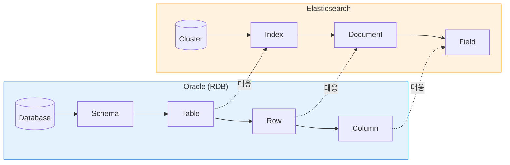

# 99. Oracle SQL → Elasticsearch 매핑 cheatsheet

> **목적**: Oracle SQL 사용자가 ES 쿼리를 **익숙한 개념으로** 빠르게 이해.
> **사용법**: 처음 1번 통독 → 이후 reference 로 펼쳐 보기.

---

## 큰 그림 — 모델 비교



| Oracle | Elasticsearch | 비고 |
|--------|---------------|------|
| Database | Cluster | 클러스터당 여러 인덱스 |
| Schema | (없음) | ES 는 schema 라는 분리 개념 약함 |
| Table | Index | 1:1 대응 |
| View / Synonym | **Data View** (alias) | Kibana 의 핵심 개념 |
| Row | Document (`_source`) | JSON 으로 저장 |
| Column | Field | dotted path 가능 (`data.resultCode`) |
| ROWID | `_id` | 자동/명시 |
| Sequence | (없음) | application 측에서 처리 |
| PK | `_id` (unique) | 강제 unique 단일 키 |
| Index (column) | (자동) | ES 는 모든 필드 자동 indexed |
| 파티션 (range partition) | 인덱스 분리 (`api-logs-2026.04.25`) | 일반적 패턴 |

**핵심 차이**: Oracle 은 schema-on-write (column 미리 정의), ES 는 schema-on-read 우선 + dynamic mapping (자동 추론). ES 는 정렬/집계용 doc_values 가 keyword 타입에만 자동 생성됨.

---

## 1. SELECT — 데이터 가져오기

### 1.1 기본 SELECT

```sql
-- Oracle
SELECT * FROM api_logs FETCH FIRST 10 ROWS;
```

```
GET api-logs-*/_search
{
  "size": 10
}
```

> 둘 다 모든 컬럼/필드 + 10건. ES 는 `"size": 10` 이 LIMIT 역할.

### 1.2 특정 컬럼만

```sql
SELECT api_path, http_method, ts FROM api_logs FETCH FIRST 5 ROWS;
```

```
GET api-logs-*/_search
{
  "size": 5,
  "_source": ["api_path", "http_method", "@timestamp"]
}
```

> `_source` 가 `SELECT` 의 컬럼 목록. 이걸로 네트워크 절약 가능.

### 1.3 정렬 + LIMIT

```sql
SELECT * FROM api_logs ORDER BY ts DESC FETCH FIRST 1 ROW;
```

```
GET api-logs-*/_search
{
  "size": 1,
  "sort": [{"@timestamp": "desc"}]
}
```

---

## 2. WHERE — 필터

### 2.1 단순 비교

| Oracle SQL | ES Query DSL |
|------------|--------------|
| `WHERE service_name = 'account-service'` | `"term": { "service_name": "account-service" }` |
| `WHERE elapsed_ms > 500` | `"range": { "elapsed_ms": { "gt": 500 } }` |
| `WHERE elapsed_ms BETWEEN 100 AND 500` | `"range": { "elapsed_ms": { "gte": 100, "lte": 500 } }` |
| `WHERE service_name <> 'legacy-gateway'` | `"bool": { "must_not": { "term": { ... } } }` |
| `WHERE api_path LIKE '%accounts%'` | `"wildcard": { "api_path": "*accounts*" }` |
| `WHERE service_name IN ('a','b','c')` | `"terms": { "service_name": ["a","b","c"] }` |
| `WHERE service_name IS NULL` | `"bool": { "must_not": { "exists": { "field": "service_name" }}}` |
| `WHERE service_name IS NOT NULL` | `"exists": { "field": "service_name" }` |

📌 **`term` vs `match`**:
- `term` = 정확히 일치 (analyzed 안 함). keyword 필드용.
- `match` = full-text 검색 (analyzed). text 필드용.
- 우리 데이터처럼 `keyword` 라면 `term` 사용.

### 2.2 AND / OR / NOT

```sql
WHERE log_type = 'out' AND data.resultCode <> '0000'
   OR elapsed_ms > 1000
```

```
"bool": {
  "should": [
    {
      "bool": {
        "must": [
          { "term": { "log_type": "out" } },
          { "bool": { "must_not": { "term": { "data.resultCode": "0000" } } } }
        ]
      }
    },
    { "range": { "elapsed_ms": { "gt": 1000 } } }
  ],
  "minimum_should_match": 1
}
```

| Oracle | ES `bool` |
|--------|----------|
| AND | `must` (또는 `filter` — score 계산 안 함) |
| OR | `should` + `minimum_should_match: 1` |
| NOT | `must_not` |

📌 **`must` vs `filter`**: 둘 다 AND 효과. `filter` 는 relevance score 계산 안 해 약간 빠름. **로그 분석엔 거의 항상 `filter` 사용**.

### 2.3 KQL (Kibana Discover 검색창)

ES Query DSL JSON 은 길어서, Kibana 는 KQL 이라는 단축 문법 제공:

| KQL | 의미 |
|-----|-----|
| `service_name : "account-service"` | term match |
| `elapsed_ms > 500` | range gt |
| `elapsed_ms : [100 to 500]` | range between (inclusive) |
| `service_name : ("a" or "b")` | terms in |
| `not data.resultCode : "0000"` | not equal |
| `api_path : *accounts*` | wildcard |
| `data.resultCode : *` | exists (any value) |
| `not data.resultCode : *` | does NOT exist |
| `log_type : "out" and elapsed_ms > 1000` | AND |
| `* : *` | match all |

📌 **KQL ↔ DSL 변환**: 검색창의 ⚙️ 또는 Inspect 로 자동 변환된 DSL 확인 가능.

---

## 3. GROUP BY — 집계

### 3.1 COUNT / SUM / AVG / MIN / MAX

```sql
SELECT COUNT(*) FROM api_logs;
```

```
GET api-logs-*/_count
```

또는

```
GET api-logs-*/_search
{ "size": 0, "aggs": { "n": { "value_count": { "field": "api_path" }}} }
```

```sql
SELECT
  MIN(elapsed_ms) AS min_ms,
  AVG(elapsed_ms) AS avg_ms,
  MAX(elapsed_ms) AS max_ms,
  SUM(elapsed_ms) AS sum_ms
FROM api_logs
WHERE log_type = 'out';
```

```
GET api-logs-*/_search
{
  "size": 0,
  "query": { "term": { "log_type": "out" } },
  "aggs": {
    "min_ms": { "min": { "field": "elapsed_ms" } },
    "avg_ms": { "avg": { "field": "elapsed_ms" } },
    "max_ms": { "max": { "field": "elapsed_ms" } },
    "sum_ms": { "sum": { "field": "elapsed_ms" } }
  }
}
```

> 집계는 모두 `aggs` 안에 이름 붙여 정의 → 응답의 `aggregations.<이름>` 으로 받음.

### 3.2 GROUP BY 단일 컬럼

```sql
SELECT service_name, COUNT(*) AS calls
FROM api_logs
GROUP BY service_name
ORDER BY calls DESC
FETCH FIRST 10 ROWS ONLY;
```

```
GET api-logs-*/_search
{
  "size": 0,
  "aggs": {
    "by_service": {
      "terms": {
        "field": "service_name",
        "size": 10,
        "order": { "_count": "desc" }
      }
    }
  }
}
```

응답:
```json
"aggregations": {
  "by_service": {
    "buckets": [
      { "key": "account-service", "doc_count": 1707356 },
      { "key": "user-service",    "doc_count": 1463448 },
      ...
    ]
  }
}
```

📌 **`terms` aggregation 의 `size`** = 반환할 group 수 (Oracle 의 LIMIT). 정확한 top N 이 필요하면 충분히 큰 값 (또는 composite aggregation).

### 3.3 GROUP BY 다중 컬럼 (중첩)

```sql
SELECT service_name, http_method, COUNT(*)
FROM api_logs
GROUP BY service_name, http_method
ORDER BY service_name, http_method;
```

```
GET api-logs-*/_search
{
  "size": 0,
  "aggs": {
    "by_service": {
      "terms": { "field": "service_name", "size": 100 },
      "aggs": {
        "by_method": {
          "terms": { "field": "http_method", "size": 10 }
        }
      }
    }
  }
}
```

> 중첩 `aggs` 가 다중 GROUP BY. 응답도 트리 구조.

### 3.4 HAVING (그룹 후 필터)

```sql
SELECT service_name, COUNT(*) AS n
FROM api_logs
GROUP BY service_name
HAVING COUNT(*) > 1000000;
```

```
"by_service": {
  "terms": {
    "field": "service_name",
    "size": 100,
    "min_doc_count": 1000000
  }
}
```

> 또는 `bucket_selector` 를 써서 더 복잡한 HAVING.

### 3.5 GROUP BY 시간 (date_histogram)

```sql
SELECT TRUNC(ts, 'HH24') AS hr, COUNT(*)
FROM api_logs
GROUP BY TRUNC(ts, 'HH24')
ORDER BY hr;
```

```
GET api-logs-*/_search
{
  "size": 0,
  "aggs": {
    "by_hour": {
      "date_histogram": {
        "field": "@timestamp",
        "calendar_interval": "1h",
        "time_zone": "Asia/Seoul"
      }
    }
  }
}
```

📌 **`time_zone`** 안 주면 UTC. KST 기준 일/시 그루핑 원하면 명시 필요.

---

## 4. PERCENTILE / 통계

```sql
SELECT
  PERCENTILE_DISC(0.50) WITHIN GROUP (ORDER BY elapsed_ms) AS p50,
  PERCENTILE_DISC(0.95) WITHIN GROUP (ORDER BY elapsed_ms) AS p95,
  PERCENTILE_DISC(0.99) WITHIN GROUP (ORDER BY elapsed_ms) AS p99
FROM api_logs WHERE log_type = 'out';
```

```
GET api-logs-*/_search
{
  "size": 0,
  "query": { "term": { "log_type": "out" } },
  "aggs": {
    "lat": {
      "percentiles": {
        "field": "elapsed_ms",
        "percents": [50, 95, 99]
      }
    }
  }
}
```

---

## 5. DISTINCT / COUNT DISTINCT

```sql
SELECT COUNT(DISTINCT api_path) FROM api_logs;
```

```
GET api-logs-*/_search
{
  "size": 0,
  "aggs": { "uniq": { "cardinality": { "field": "api_path" } } }
}
```

📌 **`cardinality`** 는 근사값 (HyperLogLog). 정확하지 않을 수 있음. 정확값이 필요하면 `precision_threshold` 를 max 40000 까지.

```sql
SELECT DISTINCT api_path FROM api_logs ORDER BY api_path;
```

```
"aggs": {
  "uniq": { "terms": { "field": "api_path", "size": 1000 } }
}
```

---

## 6. JOIN

⚠️ ES 는 **JOIN 이 없습니다** (denormalize 가 원칙). 대안:

| Oracle JOIN | ES 대안 |
|-------------|---------|
| INNER JOIN | denormalize (저장 시 합쳐서 저장) |
| LEFT JOIN | 동일 (denormalize) |
| Self join | parent-child 관계 (`join` 필드 타입, 비추) |
| Nested 데이터 | `nested` 필드 타입 + `nested` query |

**우리 데이터 예**: traceId 매칭 (in/out 페어) 은 application 단에서 처리 (specfromlog 가 그렇게 함). 또는 ES `terms_lookup` / runtime field 로 우회 가능.

---

## 7. ORDER BY

```sql
ORDER BY ts DESC, service_name ASC
```

```
"sort": [
  {"@timestamp": "desc"},
  {"service_name": "asc"}
]
```

---

## 8. LIMIT / OFFSET (페이징)

```sql
OFFSET 100 ROWS FETCH FIRST 20 ROWS ONLY;
```

```
{ "from": 100, "size": 20 }
```

⚠️ 깊은 페이징 (from + size > 10000) 은 ES 에서 권장 안 함. **`search_after`** (sort 기반) 또는 **`scroll`** API 사용.

---

## 9. 흔한 패턴 — 1:1 변환 예시

### 9.1 "지난 1시간 에러 응답 top 10"

```sql
SELECT api_path, COUNT(*) AS errors
FROM api_logs
WHERE log_type = 'out'
  AND data.resultCode <> '0000'
  AND ts >= SYSDATE - INTERVAL '1' HOUR
GROUP BY api_path
ORDER BY errors DESC
FETCH FIRST 10 ROWS ONLY;
```

```
GET api-logs-*/_search
{
  "size": 0,
  "query": {
    "bool": {
      "filter": [
        { "term": { "log_type": "out" } },
        { "bool": { "must_not": { "term": { "data.resultCode": "0000" } } } },
        { "range": { "@timestamp": { "gte": "now-1h" } } }
      ]
    }
  },
  "aggs": {
    "top_errors": {
      "terms": { "field": "api_path", "size": 10 }
    }
  }
}
```

📌 ES 의 `now-1h`, `now-7d/d`, `now/d` 등 날짜 math 표현 — Oracle 의 `SYSDATE - INTERVAL` 과 등가.

### 9.2 "서비스별 평균/p95 latency"

```sql
SELECT service_name,
  AVG(elapsed_ms) AS avg_ms,
  PERCENTILE_DISC(0.95) WITHIN GROUP (ORDER BY elapsed_ms) AS p95_ms
FROM api_logs
WHERE log_type = 'out'
GROUP BY service_name;
```

```
GET api-logs-*/_search
{
  "size": 0,
  "query": { "term": { "log_type": "out" } },
  "aggs": {
    "by_svc": {
      "terms": { "field": "service_name", "size": 20 },
      "aggs": {
        "avg_ms": { "avg": { "field": "elapsed_ms" } },
        "p95_ms": { "percentiles": { "field": "elapsed_ms", "percents": [95] } }
      }
    }
  }
}
```

### 9.3 "어제 오후 3시 결제 실패 traceId"

```sql
SELECT trace_id, api_path, data.resultCode
FROM api_logs
WHERE service_name = 'payment-service'
  AND data.resultCode <> '0000'
  AND ts BETWEEN TO_DATE('2026-04-25 15:00','YYYY-MM-DD HH24:MI')
             AND TO_DATE('2026-04-25 16:00','YYYY-MM-DD HH24:MI');
```

KQL (Discover):
```
service_name : "payment-service"
  and not data.resultCode : "0000"
```
+ 시간 피커 = `Apr 25, 2026 @ 15:00 ~ 16:00`

DSL (Dev Tools):
```
GET api-logs-*/_search
{
  "_source": ["trace_id", "api_path", "data.resultCode"],
  "query": {
    "bool": {
      "filter": [
        { "term": { "service_name": "payment-service" } },
        { "bool": { "must_not": { "term": { "data.resultCode": "0000" } } } },
        { "range": {
            "@timestamp": {
              "gte": "2026-04-25T15:00:00",
              "lt":  "2026-04-25T16:00:00",
              "time_zone": "+09:00"
        }}}
      ]
    }
  }
}
```

---

## 10. 성능·운영 관련 차이

| 주제 | Oracle | ES |
|------|--------|----|
| 인덱스 생성 | 명시 (CREATE INDEX) | 자동 (모든 필드) |
| 인덱스 종류 | B-tree, bitmap | inverted index + doc_values |
| 트랜잭션 | ACID 강함 | 단일 doc 만 atomic |
| schema 변경 | DDL (lock 위험) | 새 필드 자동 (호환되면) |
| 통계 갱신 | `DBMS_STATS` | 자동 (refresh, default 1초) |
| EXPLAIN | `EXPLAIN PLAN` | `_search?explain=true` 또는 Inspect |
| 백업 | RMAN, expdp | snapshot to S3/disk |
| 파티션 정리 | `ALTER TABLE ... DROP PARTITION` | 인덱스 자체 삭제 (`DELETE /index`) — ILM 자동화 |

---

## 11. ❌ ES 에 없는 것 / 주의할 것

- **JOIN** (대안: denormalize)
- **복잡한 SUBQUERY** (대안: nested aggregation, `pipeline aggregation`)
- **트랜잭션** (대안: 단일 document 단위로)
- **UPDATE 효율** (변경 시 사실상 reindex — 자주 변하는 테이블 ES 부적합)
- **DELETE 효율** (mark for deletion → segment merge 시 실삭제)
- **NULL 처리**: ES 는 missing field 와 explicit null 이 살짝 다름. `exists` query 사용 권장.

---

## 12. ES 만의 강점

- **Full-text 검색** — analyzer, fuzzy, suggest
- **모든 필드 자동 indexed** — 어느 필드로 검색해도 빠름
- **scale-out** — shards/replicas
- **flexible schema** — 새 필드 즉시 추가
- **Time-series 친화** — `date_histogram`, `now-7d/d`

---

## ❓ Self-check

1. **Q.** Oracle 의 `SELECT COUNT(*) FROM t WHERE x = 'a' GROUP BY y ORDER BY COUNT(*) DESC LIMIT 5` 를 ES DSL 한 덩어리로 짜 보세요.
   <details><summary>A</summary>

   ```
   GET t-*/_search
   {
     "size": 0,
     "query": { "term": { "x": "a" } },
     "aggs": {
       "by_y": {
         "terms": { "field": "y", "size": 5, "order": { "_count": "desc" } }
       }
     }
   }
   ```
   </details>

2. **Q.** ES 에 JOIN 이 없는데 "user 테이블 + order 테이블" 같은 조인이 필요하면?
   <details><summary>A</summary>(1) 저장 시 user 정보를 order document 안에 함께 저장 (denormalize) — 가장 흔함. (2) `nested` 타입. (3) parent-child (비추, 성능 낮음). (4) application 측에서 두 번 쿼리 후 합치기.</details>

3. **Q.** Oracle 의 `LIKE '%foo%'` 와 같은 KQL?
   <details><summary>A</summary>`field : *foo*` (와일드카드 양쪽 `*`)</details>

4. **Q.** 시간 그루핑 `GROUP BY TRUNC(ts,'HH24')` 등가 ES 표현?
   <details><summary>A</summary>`date_histogram` with `calendar_interval: "1h"`. KST 기준이면 `time_zone: "Asia/Seoul"` 추가.</details>

---

## 더 깊은 학습

- **Elastic 공식 SQL API** — ES 는 `POST _sql` 로 SQL 일부 지원:
  ```
  POST _sql
  { "query": "SELECT service_name, COUNT(*) FROM \"api-logs-*\" GROUP BY service_name" }
  ```
  → 학습 곡선 줄여줌. 대신 모든 SQL 기능은 아님.

- 다음: **[99-kql-cheatsheet.md](99-kql-cheatsheet.md)** — KQL 만 한 페이지로
- **[99-troubleshooting.md](99-troubleshooting.md)** — 자주 만나는 문제
