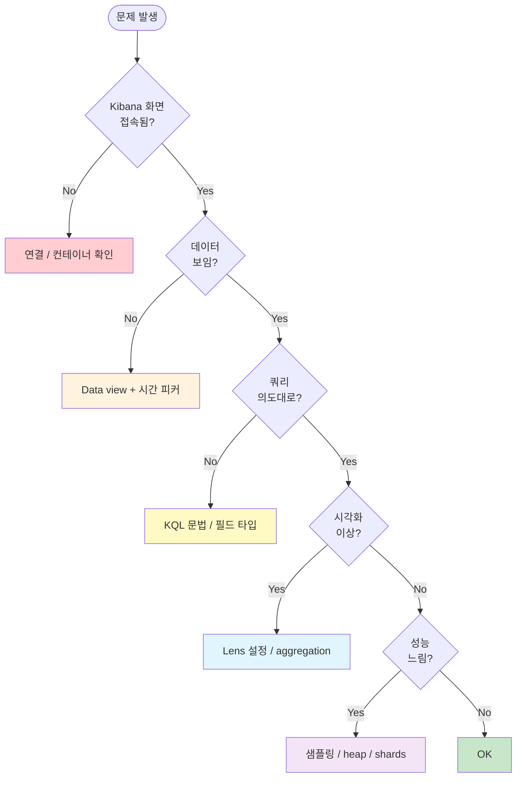

# 99. 자주 만나는 문제 해결

> 실습 중 / 폐쇄망에서 반복적으로 부딪치는 문제 모음. 증상 → 원인 → 해결 순.

---

## 진단 흐름



---

## 카테고리

1. [접속·인증](#1-접속인증)
2. [데이터 안 보임](#2-데이터-안-보임)
3. [KQL·검색 문제](#3-kql검색-문제)
4. [Lens·시각화 문제](#4-lens시각화-문제)
5. [Dashboard·필터 충돌](#5-dashboard필터-충돌)
6. [성능·응답 느림](#6-성능응답-느림)
7. [Time / Timezone](#7-time--timezone)
8. [Permission·API Key](#8-permissionapi-key)

---

## 1. 접속·인증

### 1.1 Kibana 가 열리지 않음

**증상**: http://localhost:5601 → connection refused 또는 "Kibana server is not ready yet"

**진단**:
```bash
docker compose -f /home/ubuntu/workspace/specfromlog/elastic/docker-compose.yml ps
```

**해결**:
- 컨테이너 정지면: `docker compose up -d`
- "not ready" 면: ES 가 아직 부팅 중. `./scripts/wait-for-es.sh` → 다시 접속
- 30초 이상 안 뜨면: `docker compose logs kibana | tail -30` 으로 에러 확인

### 1.2 로그인 401 / 비밀번호 모름

```bash
grep ELASTIC_PASSWORD /home/ubuntu/workspace/specfromlog/elastic/.env
```

비밀번호를 잊었거나 분실하면 ES 컨테이너 내에서:
```bash
docker exec specfromlog-es01 bin/elasticsearch-reset-password -u elastic -i
```

### 1.3 SSH 터널이 끊어짐 (원격 호스트)

```bash
ssh -L 5601:localhost:5601 -L 9200:localhost:9200 ubuntu@<host>
# 끊기지 않게 keep-alive:
ssh -o ServerAliveInterval=60 -L 5601:localhost:5601 ubuntu@<host>
```

---

## 2. 데이터 안 보임

### 2.1 Discover 에서 "No results"

**원인 후보**:
- 시간 피커가 데이터 범위 밖
- Data view 의 인덱스 패턴 매칭 안 됨
- KQL 필터가 너무 좁음

**해결 순서**:
1. 시간 피커 → **Last 30 days** (또는 더 넓게)
2. KQL 검색창 비우기
3. Data view 선택 다시 확인 (`api-logs` vs `legacy-api-logs`)
4. Stack Management → Data Views → 인덱스 매칭 수 0 이면 패턴 오타

```bash
# ES 에 실제 데이터 있는지 확인
curl -u elastic:$PW http://localhost:9200/_cat/indices/api-logs-*?v
```

### 2.2 Data View 생성 시 "No matching indices"

- 인덱스 패턴 끝에 `*` 빼먹음 (`api-logs` → `api-logs-*`)
- 시스템 인덱스 (`.kibana`) 보려면 "Allow hidden and system indices" 체크
- 권한 부족 (API Key 라면 view_index_metadata 권한 필요)

### 2.3 필드 사이드바에 보고 싶은 필드가 없음

- 화면 새로고침 → 필드 캐시 갱신
- Stack Management → Data Views → 해당 view → ↻ **Refresh field list**
- Mapping 자체에 없으면 (dynamic 매핑이 인식 못함): runtime field 추가 또는 reindex

---

## 3. KQL·검색 문제

### 3.1 `service_name : account-service` 가 결과 0

**원인**: KQL token 분리 — `account` 와 `service` 가 따로 검색됨.

**해결**: **인용** 필수
```
service_name : "account-service"
```

### 3.2 `not field : "value"` 가 의도와 다른 결과

**원인**: 우선순위 모호.

**해결**: 괄호로 명시
```
not (data.resultCode : "0000")
```

### 3.3 keyword vs text 차이로 검색 안 됨

**증상**: `match` 는 되는데 `term` 은 안 됨 (또는 반대).

**원인**: 필드가 text(analyzed) 인지 keyword 인지에 따라 동작 다름.

**해결**:
- Discover 사이드바에서 필드 옆 아이콘으로 타입 확인
- text 필드면 `field : "value"` (KQL은 자동 처리)
- keyword 보조 필드가 있으면 `field.keyword : "value"`

### 3.4 한글 검색이 이상함

- 한글 analyzer 가 기본은 standard analyzer (단순 분리)
- 정확 매칭이면 `keyword` 필드 사용
- 한글 검색 분석 필요 시 nori analyzer (Elastic 한국어) 설치

---

## 4. Lens·시각화 문제

### 4.1 차트가 빈 화면

**원인 후보**:
- Date histogram 의 시간 범위 ≠ 데이터 범위
- breakdown 카디널리티 너무 큼 (Top N 잘림)
- KQL 필터가 너무 좁음

**해결**:
1. 시간 피커 넓히기
2. 좌측 위 "Inspect" → "Request" / "Response" 로 실제 query 와 결과 확인
3. breakdown 의 size 늘리기

### 4.2 percentile / avg 가 0 으로 나옴

**원인**: in 로그에는 elapsed_ms 가 없는데 필터 안 함.

**해결**: KQL 또는 차트 filter 에 `log_type : "out"` 추가.

### 4.3 Formula 가 NaN 또는 Infinity

- 분모가 0 인 경우 (`count(...)` 가 0)
- 시간 구간에 데이터 0 → 자연스러운 결과
- 시간 피커 넓히거나 interval 키우기

### 4.4 "Field is not aggregatable"

**원인**: text 필드는 직접 집계 불가 (doc_values 없음).

**해결**:
- `.keyword` 보조 필드 사용 (`api_path.keyword`)
- 또는 reindex 시 mapping 변경

---

## 5. Dashboard·필터 충돌

### 5.1 dashboard 의 한 패널만 필터가 안 먹음

**원인**: 패널 자체에 own filter 가 있음.

**해결**: 패널 ⋮ → **Edit visualization** → 좌측 위 own filter 확인 / 제거.

### 5.2 dashboard 가 자동 새로고침 안 됨

**원인**: refresh interval off.

**해결**: 시간 피커 옆 → **Refresh every N seconds** ON.

### 5.3 다른 사용자에게 dashboard 가 안 보임

**원인**: Kibana spaces / 권한.

**해결**:
- Saved Object 의 sharing 옵션 확인
- 권한 — Stack Management → Roles 확인
- Spaces 분리되어 있으면 import 필요

---

## 6. 성능·응답 느림

### 6.1 dashboard 로딩 30초+

**원인 후보**:
1. 시간 범위 너무 넓음
2. 패널 너무 많음
3. ES heap 부족
4. 쓸데없이 큰 size / cardinality

**해결**:
1. 시간 피커 좁히기 (Last 1d / 1h)
2. 패널 6개 이하 권장
3. ES container 메모리 / heap 증설:
   ```yaml
   # docker-compose.yml
   environment:
     - ES_JAVA_OPTS=-Xms4g -Xmx4g
   mem_limit: 5g
   ```
4. terms aggregation size 줄이기

### 6.2 ES 응답이 504 / Timeout

```bash
docker stats --no-stream specfromlog-es01
```

heap 90%+ 면 OOM 위험. 한 번 재시작 + heap 증설.

### 6.3 검색이 갑자기 느려짐

- segment merge 중 (ES 자동) — 잠시 후 다시 시도
- 인덱스가 너무 많이 (수백+) → 통합 / 삭제 / shrink
- shard 너무 작음 (수십 MB) → reindex 로 큰 단위 통합

---

## 7. Time / Timezone

### 7.1 Discover 의 시간이 이상함 (9시간 차이)

**원인**: ES 는 UTC 저장, Kibana 는 브라우저 timezone (KST) 으로 표시.

**확인**: Stack Management → **Advanced Settings** → `dateFormat:tz`. 기본은 `Browser`. 명시하려면 `Asia/Seoul`.

### 7.2 Lens 차트의 일자 경계가 이상함

**원인**: date_histogram 이 UTC 기준이면 KST 자정과 어긋남.

**해결**: Lens 의 horizontal axis (date histogram) → 옵션 → **Time zone** 명시 (Asia/Seoul).
Dev Tools 라면:
```
"date_histogram": {
  "field": "@timestamp",
  "calendar_interval": "1d",
  "time_zone": "Asia/Seoul"
}
```

### 7.3 timeWindow (sampling) 가 9시간 어긋남

**원인**: 결함 3 (수정됨). 폐쇄망에서 옛 specfromlog 코드 쓰면 발생.

**해결**: `sampling.timeWindow.timezone: "Asia/Seoul"` 추가.

---

## 8. Permission·API Key

### 8.1 "Forbidden" 403

**원인**: API Key 권한 없음.

**해결**:
```bash
# 발급된 API Key 확인
cat /home/ubuntu/workspace/specfromlog/elastic/api-key.txt
```
- 권한 — `monitor` (cluster) + `read, view_index_metadata` (indices)
- 더 필요하면 새 키 발급

### 8.2 인덱스 삭제 권한 없음

API Key 는 read-only 로 발급됨 (안전). 삭제 같은 운영은 elastic 계정으로:
```bash
PW=$(grep ELASTIC_PASSWORD .env | cut -d= -f2)
curl -u elastic:$PW -XDELETE http://localhost:9200/<index>
```

### 8.3 Kibana 로그인은 되는데 Stack Management 못 들어감

**원인**: Kibana 권한.

**해결**: elastic super-user 사용 확인. 다른 계정이면 superuser role 부여.

---

## 9. 폐쇄망 특화 함정

### 9.1 ES 마이너 버전 불일치

**증상**: SpecFromLog 가 "Compatibility error" 반환.

**해결**: ES 8.13~8.17 호환. `@elastic/elasticsearch` client 가 8.13 이상이면 OK. 아니면 client 업그레이드.

### 9.2 자체서명 인증서

**증상**: "self signed certificate" / "unable to verify"

**해결**: SpecFromLog config:
```json
"es": {
  "tlsRejectUnauthorized": false,
  "caFingerprint": "AB:CD:..."  // 가능하면 fingerprint 명시
}
```

### 9.3 Swagger 엔드포인트가 인증 요구

**해결**: swaggerSources 에 headers 추가:
```json
{
  "name": "account-service",
  "url": "https://...",
  "headers": { "Authorization": "Bearer ..." }
}
```

### 9.4 폐쇄망 timezone 설정 확인

```
GET _cluster/settings?include_defaults=true
```
ES 의 default timezone 은 UTC. Painless script 에서 timezone 명시 필요.

---

## 10. 일반 진단 도구 (Dev Tools)

```
# 클러스터 상태
GET _cluster/health

# 인덱스 목록 + 크기
GET _cat/indices?v&s=store.size:desc

# 인덱스 매핑 (필드 타입)
GET api-logs-*/_mapping

# 데이터 1건만 (raw 검사)
GET api-logs-*/_search?size=1

# 누군가의 무거운 쿼리?
GET _tasks?actions=*search*&detailed=true

# 노드 메모리·CPU
GET _nodes/stats/jvm,os
```

---

## 11. "어떻게든 안 됨" 일 때

마지막 수단:
1. **단순화** — KQL 비우기, 시간 피커 30 days, 가장 작은 차트 1개부터
2. **공식 문서** — Kibana docs 의 해당 기능 페이지
3. **Inspect 활용** — 실제 ES query 와 응답 보면 원인 8할 잡힘
4. **Dev Tools 직접 실행** — Kibana 우회해서 query 단독 검증
5. **로그** — `docker compose logs es01 | grep -iE "error|warn"` / kibana 동일

---

## 자주 쓰는 한 줄 명령

```bash
# .env 비밀번호
PW=$(grep ELASTIC_PASSWORD elastic/.env | cut -d= -f2)

# 클러스터 상태
curl -u elastic:$PW http://localhost:9200/_cluster/health?pretty

# 인덱스 목록
curl -u elastic:$PW "http://localhost:9200/_cat/indices/api-logs-*?v"

# 총 문서 수
curl -u elastic:$PW http://localhost:9200/api-logs-*/_count

# 매핑 (필드 타입)
curl -u elastic:$PW http://localhost:9200/api-logs-account-2026.04.20/_mapping?pretty | head -50
```

---

폐쇄망에서도 동일 절차. 컨테이너 / URL / 비밀번호만 바꿔서 사용.
