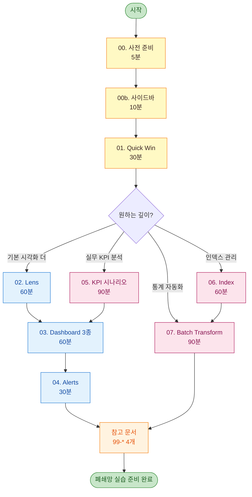
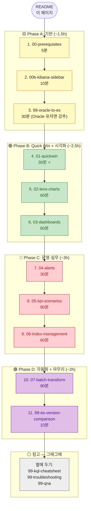

# Kibana 실무 학습 가이드

> **대상**: Elasticsearch / Kibana 를 사용만 해 본 사람이 **실제로 운영에 쓸 view·dashboard 를 만들 수 있는 단계**까지 끌어올리기.
> **데이터**: 본 환경에 적재된 10M docs (8 services × 41 APIs × 7일).
> **언어 anchor**: Oracle SQL — 팀이 익숙한 쿼리 개념을 ES 로 1:1 매핑하며 학습.

---

## 학습 결과물 (You'll be able to)

- [ ] Kibana Discover 에서 **임의의 질문을 KQL/Dev Tools 쿼리로 답할 수 있다**
- [ ] Lens 시각화 **8종을 처음부터 만들 수 있다**
- [ ] 의미 있는 운영 **dashboard 3종을 조립할 수 있다**
- [ ] 에러 / latency 임계치 **알림(alerts)** 을 설정할 수 있다
- [ ] Oracle SQL 사용자에게 ES 쿼리를 **1:1 비유로 설명할 수 있다**

---

## 학습 경로



| # | 문서 | 시간 | 요약 |
|--|------|----|----|
| **00** | [00-prerequisites.md](00-prerequisites.md) | 5분 | Kibana 접속 / Data View 생성 / 첫 데이터 확인 |
| **00b** | [00b-kibana-sidebar.md](00b-kibana-sidebar.md) | 10분 | **사이드바 대분류·소분류 길잡이 (실무 빈도 표기)** ⭐️ |
| **01** | [01-quickwin.md](01-quickwin.md) | **30분** | **첫 dashboard 1개 손에 익히기** ⭐️ |
| 02 | [02-lens-charts.md](02-lens-charts.md) | 60분 | Lens 시각화 8종 레시피 |
| 03 | [03-dashboards.md](03-dashboards.md) | 60분 | 운영/에러/트래픽 dashboard 3종 |
| 04 | [04-alerts.md](04-alerts.md) | 30분 | Observability 알람 (옵션) |
| **05** | [05-kpi-scenarios.md](05-kpi-scenarios.md) | 90분 | **SRE / 비즈니스 KPI · painPoint 분석 · 가치 환산** |
| **06** | [06-index-management.md](06-index-management.md) | 60분 | **신규 index/field 생성·수정 (Oracle DDL anchor)** |
| **07** | [07-batch-transform.md](07-batch-transform.md) | 90분 | **일일 배치 통계 인덱스 — Transform·Rollup·cron 3 방법** |
| **08** | [08-card-platform-payload-strategy.md](08-card-platform-payload-strategy.md) | 30분 | **카드 결제 플랫폼 — `data.*` unindexed 환경 4-Phase 전략** ⭐️실무 |
| 99 | [99-oracle-to-es.md](99-oracle-to-es.md) | 참고 | **Oracle SQL → ES 쿼리 매핑** |
| 99 | [99-kql-cheatsheet.md](99-kql-cheatsheet.md) | 참고 | KQL 문법 한 페이지 |
| 99 | [99-troubleshooting.md](99-troubleshooting.md) | 참고 | 자주 만나는 문제 해결 |
| 99 | [99-es-version-comparison.md](99-es-version-comparison.md) | 참고 | **ES 8 vs 9 — 변화/난이도/특장점/필요성** |
| 99 | [99-qna.md](99-qna.md) | 참고 | **읽다가 막히는 부분 ↔ 답변 핑퐁 기록** |

⭐️ **시간이 없다면 00 + 01 만 하셔도 1개 dashboard 가 손에 남습니다.**

---

## 📖 추천 읽기 순서 (선형, 약 8시간)

처음부터 끝까지 한 번 통독 + 실습한다면 아래 순서. 단계별 진입 장벽 → 응용 → 운영 → 참고 순.



### 한 페이지 step-by-step

| Step | 문서 | Phase | 누적 시간 | 핵심 |
|---:|------|------|----:|------|
| 1 | [00-prerequisites](00-prerequisites.md) | A 기반 | 5m | Kibana 로그인 + Data view 2개 |
| 2 | [00b-kibana-sidebar](00b-kibana-sidebar.md) | A 기반 | 15m | 사이드바 대분류·소분류 |
| 3 | [99-oracle-to-es](99-oracle-to-es.md) | A 기반 | 45m | Oracle SQL ↔ ES anchor (skip 가능) |
| 4 | [01-quickwin](01-quickwin.md) ⭐ | B 시각화 | 1h 15m | 30분 첫 dashboard |
| 5 | [02-lens-charts](02-lens-charts.md) | B 시각화 | 2h 15m | Lens 8종 레시피 |
| 6 | [03-dashboards](03-dashboards.md) | B 시각화 | 3h 15m | 운영/에러/트래픽 dashboard 3종 |
| 7 | [04-alerts](04-alerts.md) | C 운영 | 3h 45m | 알람 룰 |
| 8 | [05-kpi-scenarios](05-kpi-scenarios.md) | C 운영 | 5h 15m | SRE+비즈니스 KPI / painPoint / 가치 환산 |
| 9 | [06-index-management](06-index-management.md) | C 운영 | 6h 15m | 신규 index/field/reindex/ILM/template |
| 10 | [07-batch-transform](07-batch-transform.md) | D 자동화 | 7h 45m | Transform/Rollup/cron 3 방법 |
| 11 | [08-card-platform-payload-strategy](08-card-platform-payload-strategy.md) ⭐ | D 자동화 | 8h 15m | **카드 결제 플랫폼 실무 전략 — data.* unindexed 회복** |
| 12 | [99-es-version-comparison](99-es-version-comparison.md) | D 자동화 | 8h 25m | 8 vs 9 의사결정 |
| ↩ | [99-kql-cheatsheet](99-kql-cheatsheet.md) | 참고 | — | 검색창 옆에 켜 두기 |
| ↩ | [99-troubleshooting](99-troubleshooting.md) | 참고 | — | 막힐 때마다 |
| ↩ | [99-qna](99-qna.md) | 참고 | — | **읽다가 모호한 부분 → 여기 모임** |

### 선택지

- **Quick Win 만 (1시간)**: 00 → 00b → 01 (그 외는 필요 시)
- **시각화 + 운영 핵심 (4시간)**: 위 + 02 + 03 + 05
- **전체 통독 (8시간)**: 위 step 1~11 모두

### 읽으면서

- 막히면 **99-troubleshooting** 먼저 검색
- 모호한 부분은 **99-qna.md** 에 메모 (사용자 ↔ 작성자 핑퐁 기록)
- 각 문서 끝의 **❓ Self-check** 는 직접 답해 보기 (`<details>` 펴서 정답 확인)

---

## 이 가이드가 적용한 학습 원리

```
1. Why → What → How → Verify   각 단계가 "왜 이걸 하는지" 부터 시작
2. Concrete → Abstract          쿼리 먼저, 이론 나중
3. Active learning              "읽으세요" 보다 "해보세요"
4. Verification checkpoints     ✅ 마크로 "여기까지 됐는지" 확인
5. Spaced repetition            핵심 개념(KQL/agg)을 여러 문서에서 반복
6. Anchoring (앵커링)            Oracle SQL 익숙한 개념과 1:1 비유
7. Visualization                중요 흐름은 mermaid / ASCII 그림
```

---

## 핵심 개념 — Oracle 사용자 30초 anchor

```
SELECT * FROM api_logs                       →  GET api-logs-*/_search
WHERE service_name = 'account-service'           "query": { "term": { "service_name": "account-service" } }
ORDER BY ts DESC                                 "sort": [{"@timestamp":"desc"}]
FETCH FIRST 10 ROWS                              "size": 10

SELECT method, COUNT(*)                       →  "size": 0
FROM api_logs                                    "aggs": { "by_method": {
GROUP BY method                                    "terms": { "field": "http_method" } } }
```

상세는 [99-oracle-to-es.md](99-oracle-to-es.md) 한 페이지 cheatsheet.

---

## 환경 정보 (변경 불필요, 참고)

| 항목 | 값 |
|------|----|
| Kibana URL | http://localhost:5601 |
| ES URL | http://localhost:9200 |
| 계정 | `elastic` (비밀번호는 `../​.env` 의 `ELASTIC_PASSWORD`) |
| Data view 패턴 | `api-logs-*`, `legacy-api-logs-*` |
| 데이터 기간 | 2026-04-19 15:00 UTC ~ 2026-04-26 15:00 UTC (= **2026-04-20 ~ 2026-04-26 KST**) |
| 문서 수 | 10,000,228 |

---

## 폐쇄망 가져갈 때

이 디렉토리(`elastic/kibana-views/`) 만 그대로 사내망에 가져가면, 데이터 기간/엔드포인트만 바꾸면 동일 학습 가능:

```diff
- Data view 패턴: api-logs-*
+ Data view 패턴: <폐쇄망 인덱스 패턴>
- @timestamp
+ <필요 시 timestamp 필드명>
```

다음: [00-prerequisites.md](00-prerequisites.md)
