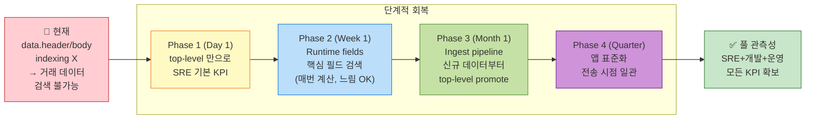
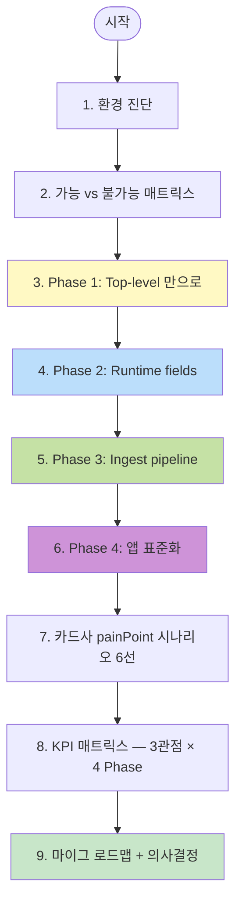
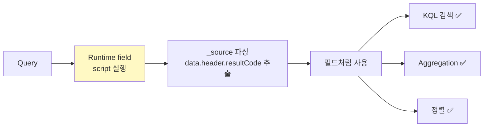
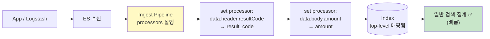
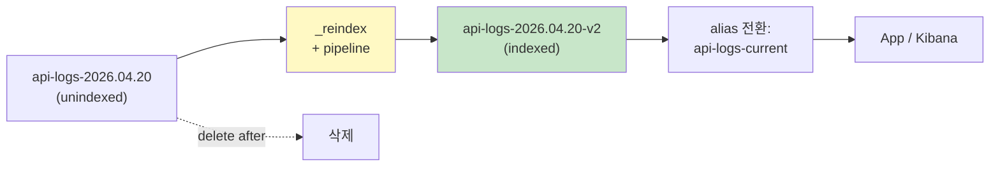
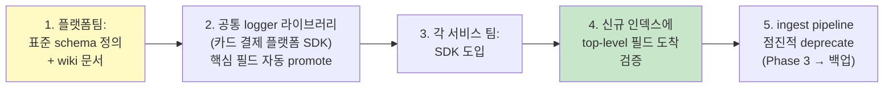
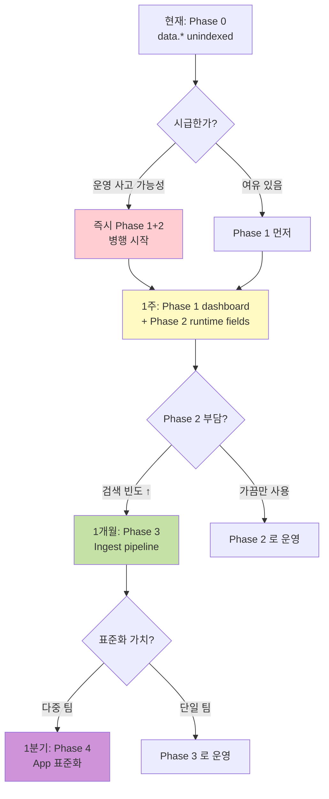
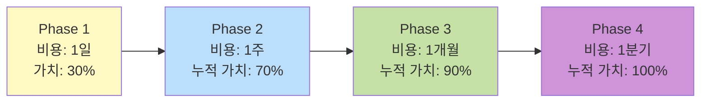

# 08. 카드 결제 플랫폼 — `data` 필드 unindexed 환경의 KPI / 관측성 전략

> **컨텍스트**: 카드사 앱의 FE/BE 플랫폼 운영. 모든 인입 전문이 ES 에 저장되지만 **`data.header`, `data.body`** 의 내부 필드는 indexing 안 됨 → 검색·필터·집계 직접 불가.
> **목표**: 이 제약 하에서 SRE / 개발 / 운영 3 관점의 KPI 와 **관측성(Observability)** 을 단계적으로 확보.
> **선수**: [05-kpi-scenarios.md](05-kpi-scenarios.md) · [06-index-management.md](06-index-management.md) · [07-batch-transform.md](07-batch-transform.md)
> **소요**: 통독 30분 + Phase 별 실행은 각각 별도

---

## Executive Summary — 한 화면



**핵심 메시지**:
- **Phase 1 (오늘부터 가능)** — top-level 필드만으로 SRE 60% 확보
- **Phase 2 (1주 내)** — Runtime fields 로 매핑 변경 없이 핵심 필드 검색 가능. **현재 데이터에도 즉시 적용**
- **Phase 3 (1개월 내)** — Ingest pipeline 으로 신규 인덱스부터 자동 promote. 영구 해결의 시작
- **Phase 4 (분기 내)** — 앱 단 전송 표준화. 가장 깨끗하지만 협업 시간 큼

---

## 학습 로드맵



---

## 1. 환경 진단 — 운영 데이터 구조

### 1.1 전형적 인입 전문 구조 (예시)

```json
{
  "@timestamp": "2026-04-26T12:40:21.000Z",
  "service_name": "card-payment",
  "api_path": "/api/v1/payments/charge",
  "http_method": "POST",
  "log_type": "out",
  "trace_id": "TRC000000123456",
  "elapsed_ms": 412,
  "host": { "name": "api-server-01", "ip": "10.0.1.101" },

  "data": {                           ← ⚠️ data 이하 indexing X
    "header": {                       ← header 내부 필드도 unindexed
      "resultCode": "0000",
      "resultMsg": "정상처리",
      "channel": "MOBILE",
      "deviceType": "iOS",
      "userAgent": "CardApp/3.2.0"
    },
    "body": {                         ← body 내부도 동일
      "merchantId": "M00012345",
      "cardLast4": "1234",
      "amount": 35000,
      "installments": 0,
      "approvedAt": "2026-04-26T12:40:21.456Z",
      "approvalNumber": "12345678"
    }
  }
}
```

### 1.2 ES 매핑 확인 (직접)

```
GET api-logs-*/_mapping/field/data.*
```

응답 예시:
```json
{
  "data": { "type": "object", "enabled": false }  ← 이게 원인
}
```

또는 dynamic mapping 으로 keyword 만 깊은 경로에 자동 생성됐을 수도 있음. **`enabled: false`** 면 **저장만 되고 indexing/search 모두 X**.

### 1.3 가능 vs 불가능

```mermaid
flowchart LR
    subgraph 가능["✅ 가능 — top-level 필드"]
      A1[api_path]
      A2[service_name]
      A3[http_method]
      A4[log_type]
      A5[@timestamp]
      A6[trace_id]
      A7[elapsed_ms]
      A8[host.name]
    end
    subgraph 불가능["❌ 불가능 — data 이하"]
      B1[data.header.resultCode]
      B2[data.header.channel]
      B3[data.body.amount]
      B4[data.body.merchantId]
      B5[data.body.cardLast4]
    end

    style 가능 fill:#c8e6c9
    style 불가능 fill:#ffcdd2
```

| 시도 | 가능? |
|------|----|
| `data.header.resultCode : "9999"` 로 KQL 검색 | ❌ |
| `terms aggregation on data.body.amount` | ❌ |
| `range query on data.body.amount > 100000` | ❌ |
| `count(api_path)` (그냥 호출량) | ✅ |
| `percentile of elapsed_ms` (latency p95) | ✅ |
| `histogram of @timestamp` (트래픽 trend) | ✅ |
| **에러율** = 비-success 응답 비율 | ❌ (resultCode 가 data 안에 있음) |
| **결제 성공률** = 비즈니스 KPI | ❌ |

📌 **충격적 결론**: SRE 의 가장 기본 KPI 인 **에러율** 도 직접은 못 함. 이게 본 문서의 출발점.

---

## 2. KPI 매트릭스 — 3관점 × 4 Phase

| KPI / 관측 | Phase 1<br/>(top-level) | Phase 2<br/>(Runtime field) | Phase 3<br/>(Ingest pipeline) | Phase 4<br/>(App 표준화) |
|---|:--:|:--:|:--:|:--:|
| **🛠️ SRE — 가용성/SLO** | ❌ | ✅ (느림) | ✅✅ | ✅✅ |
| **🛠️ SRE — Latency p95/p99** | ✅ | ✅ | ✅ | ✅ |
| **🛠️ SRE — 트래픽 anomaly** | ✅ | ✅ | ✅ | ✅ |
| **🛠️ SRE — 에러 spike alert** | ❌ | ✅ (느림) | ✅✅ | ✅✅ |
| **🔧 개발 — Dead/Shadow API** | ✅ | ✅ | ✅ | ✅ |
| **🔧 개발 — 배포 회귀 감지** | △ (호출량/lat 만) | ✅ | ✅ | ✅ |
| **🔧 개발 — 신규 API 안정성** | △ | ✅ | ✅ | ✅ |
| **📊 운영 — 시간대 패턴** | ✅ | ✅ | ✅ | ✅ |
| **📊 운영 — 결제 성공률** | ❌ | ✅ (느림) | ✅✅ | ✅✅ |
| **📊 운영 — 채널별 분포 (MOBILE/PC)** | ❌ | ✅ (느림) | ✅✅ | ✅✅ |
| **📊 운영 — 거래액 통계 (sum/avg)** | ❌ | △ (script_score) | ✅✅ | ✅✅ |
| **📊 운영 — 가맹점 Top N** | ❌ | △ | ✅ | ✅ |
| **📊 운영 — 사용자 retry/이탈** | ❌ | △ | ✅ | ✅ |

> ✅✅ = 빠르고 자연. ✅ = 가능 + 운영 부담 적음. △ = 가능하지만 제한 (느림/script). ❌ = 불가능.

**한눈에**: Phase 2 부터 기본기는 갖추고, Phase 3 부터 운영 dashboard 가 진짜 "쓸 만" 해진다.

---

## 3. Phase 1 — Top-level 만으로 (Day 1)

### 3.0 ⭐ 먼저 확인: top-level 에러 플래그 존재 여부

본격적으로 들어가기 전 **5분 사전 점검**. `_source` 의 top-level (data 와 동일 깊이) 에 `isError` / `errorYn` / `error` / `hasError` 같은 에러 플래그가 indexed 되어 있다면 **Phase 2 까지 안 가도 에러 KPI 즉시 가능**.

#### 빠른 확인 (Dev Tools)

```
GET api-logs-*/_field_caps?fields=isError,errorYn,error,hasError,error_yn
```

또는 패턴 매칭:
```
GET api-logs-*/_mapping/field/*error*
```

**판정**:
| `_field_caps` 응답 | 결론 | 다음 단계 |
|---|---|---|
| `searchable: true, aggregatable: true` | ✅ **완전 indexed** | **§3.0.1 즉시 활용** — Phase 2 안 가도 됨 |
| `searchable: true, aggregatable: false` | △ text 만 | `.keyword` 시도 (다음 §3.0.2) |
| `searchable: false` 또는 응답 없음 | ❌ unindexed | Phase 2 (Runtime field) 필요 — §4 로 |

📌 **Q&A 참고**: 자세한 진단 4단계는 [99-qna.md Q-01](99-qna.md#q-01-_source-하위-data-외-에-에러-여부-필드가-있다면-indexed-인지-어떻게-확인) 참고.

#### 3.0.1 indexed 면 — 즉시 KPI 확보

```
KQL:           isError : true                  ← 모든 에러
KQL:           not isError : true              ← 정상만
Lens Formula:  count(kql='isError:true')
                 / count(kql='log_type:"out"')  ← 에러율 %
```

이 한 줄로 **SRE 4 golden signals 의 Errors 채움**. 단계 도약: Phase 1 → Phase 1.5.

#### 3.0.2 text 만 (aggregatable X) 면

```
GET api-logs-*/_field_caps?fields=isError.keyword
```
→ `.keyword` 보조 매핑 있으면 그걸로:
```
KQL: isError.keyword : "true"
```

#### 3.0.3 unindexed 면

§4 (Phase 2 Runtime fields) 로. `isError` 도 함께 runtime 으로 정의:

```json
PUT /api-logs-*/_mapping
{
  "runtime": {
    "is_error": {
      "type": "boolean",
      "script": { "source": """
        if (params._source.isError != null) emit((boolean)params._source.isError);
      """ }
    }
  }
}
```

#### ⚠️ 한계 — indexed 라도 Phase 2+ 가 여전히 필요한 부분

`isError` 만으로는 다음 못 함:
- 어떤 **에러 코드** 가 많은가 (`data.header.resultCode`)
- **채널/가맹점/거래액** 별 분포
- 에러 발생 trace_id 와 함께 메시지 추적

→ 운영 1차 신호 (얼마나 깨졌나) 는 §3.0.1 로 OK, **진단 깊이 (왜)** 는 Phase 2+ 필요.

---

### 3.1 가능한 KPI 7종

#### A. 트래픽 (Traffic)
```
KQL: log_type : "out"
Lens: count(records) over @timestamp, breakdown by service_name
```

#### B. Latency (Golden signal)
```
KQL: log_type : "out"
Lens: percentiles(elapsed_ms, [50, 95, 99]) by api_path
```

#### C. API 호출 빈도 (Top N)
```
Lens: count(records) by api_path, Top 20
```

#### D. 시간대 패턴 (heatmap)
```
Lens: count(records) by @timestamp(hour) × @timestamp(day)
```

#### E. Dead API
```
Swagger 선언 paths - ES 호출 paths = Dead
```

#### F. Shadow API (문서 누락)
```
ES 호출 paths - Swagger 선언 paths = Shadow
```

#### G. 호스트별 부하
```
Lens: count(records) by host.name
```

### 3.2 Phase 1 의 한계

```
❌ "이번 주 결제 거절이 늘었나?" — resultCode 못 봄
❌ "어떤 에러 코드가 가장 많은가?" — 불가
❌ "MOBILE vs PC 채널 비중" — 불가
❌ "10만원 이상 결제 추세" — body.amount 못 봄
```

**SRE 정의 (Google 의 4 golden signals)**:
- Latency ✅
- Traffic ✅
- **Errors ❌** ← 이게 안 되는 게 치명적
- Saturation (별도 metricbeat) — 본 환경 X

→ **에러율 못 보면 운영 못함**. 즉시 Phase 2 로.

### 3.3 Phase 1 dashboard (D5)

```
┌─────────────────────────────────────────────────────────┐
│ 🕒 [Last 24h ▼]   🔎 [filter]                          │
├─────────────────────────────────────────────────────────┤
│ ┌─────┬─────┬─────┬─────┐                                │
│ │호출수│ p95 │APIN │호스트│  ← KPI 4 (Phase 1 가능 항목)   │
│ │ 9.2M│742ms│ 39  │  4  │                                │
│ └─────┴─────┴─────┴─────┘                                │
├─────────────────────────────────────────────────────────┤
│ ┌─────────────┐ ┌─────────────────────────────────────┐ │
│ │📈 트래픽    │ │⏱️ Top API p95 latency                │ │
│ └─────────────┘ └─────────────────────────────────────┘ │
├─────────────────────────────────────────────────────────┤
│ ┌─────────────────────────────────────────────────────┐ │
│ │🔥 시간대 heatmap                                      │ │
│ └─────────────────────────────────────────────────────┘ │
└─────────────────────────────────────────────────────────┘
```

> **에러 KPI 가 빠진 dashboard 는 운영자에게 절반의 정보**. Phase 2 가 필수.

---

## 4. Phase 2 — Runtime Fields (Week 1)

### 4.1 Runtime field 가 무엇인가

**Search-time** 에 정의되는 가상 필드. 매핑은 안 바뀌고, 쿼리할 때 `_source` 에서 값을 추출해 즉석 계산.



**장점**:
- ✅ 매핑 변경 / reindex 불필요 → **현재 모든 데이터에 즉시 적용**
- ✅ 영구 promote 결정 전 시범 단계로 완벽
- ✅ 매핑/index template 변경 권한 없어도 가능

**단점**:
- ⚠️ 매 쿼리마다 _source 파싱 → 인덱싱된 필드보다 **10~100x 느림**
- ⚠️ doc_values 없어 정렬/aggregation 메모리 부담
- ⚠️ 캐싱 부족

→ **PoC + 단기 운영용**. 장기 데이터셋엔 Phase 3 로.

### 4.2 카드 결제 플랫폼 핵심 필드 promote — Runtime 정의

#### 한 번에 정의 (Dev Tools)

```json
PUT /api-logs-*/_mapping
{
  "runtime": {
    "result_code": {
      "type": "keyword",
      "script": {
        "source": """
          def hdr = params._source.data?.header;
          if (hdr != null && hdr.resultCode != null) {
            emit(hdr.resultCode.toString());
          }
        """
      }
    },
    "result_msg": {
      "type": "keyword",
      "script": { "source": """
        def hdr = params._source.data?.header;
        if (hdr != null && hdr.resultMsg != null) emit(hdr.resultMsg.toString());
      """ }
    },
    "channel": {
      "type": "keyword",
      "script": { "source": """
        def hdr = params._source.data?.header;
        if (hdr != null && hdr.channel != null) emit(hdr.channel.toString());
      """ }
    },
    "device_type": {
      "type": "keyword",
      "script": { "source": """
        def hdr = params._source.data?.header;
        if (hdr != null && hdr.deviceType != null) emit(hdr.deviceType.toString());
      """ }
    },
    "amount": {
      "type": "long",
      "script": { "source": """
        def body = params._source.data?.body;
        if (body != null && body.amount != null) emit(((Number)body.amount).longValue());
      """ }
    },
    "merchant_id": {
      "type": "keyword",
      "script": { "source": """
        def body = params._source.data?.body;
        if (body != null && body.merchantId != null) emit(body.merchantId.toString());
      """ }
    }
  }
}
```

📌 **포인트**:
- `params._source.data?.header` — null-safe navigation
- `emit()` — 값 노출 (검색·정렬·집계 가능)
- type 명시 — keyword / long / double / date / boolean

### 4.3 즉시 효과 — KQL 한 줄로 에러 검색

```
result_code : "9999"                       ← 이전엔 불가능
not result_code : "0000"                    ← 모든 에러
channel : "MOBILE" and amount > 100000      ← 비즈니스 검색
result_code : ("E001" or "P001" or "9999")  ← 다중 에러
```

### 4.4 에러율 KPI 즉시 확보

Lens Formula:
```
count(kql='log_type:"out" and not result_code:"0000"')
  / count(kql='log_type:"out"')
```

→ **이제 SRE 4 golden signals 의 Errors 가 채워짐**.

### 4.5 운영 시 주의

#### 4.5.1 성능 측정

```json
GET api-logs-*/_search
{
  "size": 0,
  "query": { "term": { "result_code": "9999" } },
  "profile": true
}
```

응답의 `profile` 섹션에서 `script` 시간 확인. 1000ms+ 면 부담.

#### 4.5.2 큰 인덱스에선 fields parameter 활용

```json
GET api-logs-*/_search
{
  "size": 10,
  "fields": ["result_code", "channel", "amount"],
  "_source": false,
  "query": { "term": { "service_name": "card-payment" } }
}
```

→ runtime field 만 받고 _source 전체는 안 받기 → 네트워크 절감.

#### 4.5.3 limited time window 으로 부담 분산

7일치 전부 query 하지 말고 1일/시간 단위로 좁혀서 사용. 임시 대시보드는 OK, 상시 모니터링은 Phase 3 로 옮기기.

### 4.6 Kibana Discover / Lens 에서 사용

#### Discover

Data view 화면에서 **`Add field`** → "Runtime field" → 위 script 입력. **세션 한정** runtime field 만들 수도 있고, **인덱스 mapping 에 영구 등록** 도 가능 (위 PUT 처럼).

#### Lens

위에서 정의한 runtime fields 가 자동으로 Lens 의 필드 목록에 등장. drag&drop 그대로.

### 4.7 D5 dashboard 보강 (Phase 2)

기존 4개 KPI 에 추가:

```
┌─────┬─────┬─────┬─────┐
│호출수│에러율│ p95 │채널 │  ← 에러율과 채널이 추가됨
│ 9.2M│ 17%🔴│742ms│MOB75%│
└─────┴─────┴─────┴─────┘
```

추가 패널:
- Top 에러 코드 (B7 패턴)
- 채널별 분포 (MOBILE/PC/WEB donut)
- 거래액 분포 histogram

---

## 5. Phase 3 — Ingest Pipeline (Month 1)

### 5.1 Ingest Pipeline 이 무엇인가

**ES 가 doc 을 받기 전에 수행하는 변환 chain**. 매 doc 의 `_source` 를 읽어 새 필드 생성·기존 필드 변환·삭제 가능.



**장점**:
- ✅ 신규 데이터부터 **top-level 영구 필드** → 빠른 검색·집계
- ✅ doc_values 활성화 (정렬·aggregation 비용 ↓)
- ✅ Kibana 의 모든 기능 (Lens / Alerts / Anomaly) 사용 가능

**단점**:
- ⚠️ 신규 데이터부터 적용 — 과거는 reindex 별도 필요
- ⚠️ 인덱스 매핑 변경 권한 필요
- ⚠️ pipeline 변경 시 신규 인덱스 생성 시점부터 반영

### 5.2 Pipeline 정의

```json
PUT /_ingest/pipeline/card-promote-fields
{
  "description": "카드 결제 플랫폼: data.header/body 핵심 필드를 top-level 로 promote",
  "processors": [
    {
      "set": {
        "field": "result_code",
        "value": "{{data.header.resultCode}}",
        "if": "ctx?.data?.header?.resultCode != null",
        "ignore_failure": true
      }
    },
    {
      "set": {
        "field": "result_msg",
        "value": "{{data.header.resultMsg}}",
        "if": "ctx?.data?.header?.resultMsg != null",
        "ignore_failure": true
      }
    },
    {
      "set": {
        "field": "channel",
        "value": "{{data.header.channel}}",
        "if": "ctx?.data?.header?.channel != null",
        "ignore_failure": true
      }
    },
    {
      "set": {
        "field": "device_type",
        "value": "{{data.header.deviceType}}",
        "if": "ctx?.data?.header?.deviceType != null",
        "ignore_failure": true
      }
    },
    {
      "set": {
        "field": "amount",
        "value": "{{data.body.amount}}",
        "if": "ctx?.data?.body?.amount != null",
        "ignore_failure": true
      }
    },
    {
      "set": {
        "field": "merchant_id",
        "value": "{{data.body.merchantId}}",
        "if": "ctx?.data?.body?.merchantId != null",
        "ignore_failure": true
      }
    },
    {
      "convert": {
        "field": "amount",
        "type": "long",
        "ignore_missing": true
      }
    },
    {
      "set": {
        "field": "is_error",
        "value": true,
        "if": "ctx?.result_code != null && ctx.result_code != '0000'"
      }
    }
  ],
  "on_failure": [
    {
      "set": {
        "field": "_ingest.pipeline_error",
        "value": "{{ _ingest.on_failure_message }}"
      }
    }
  ]
}
```

📌 **`on_failure`**: pipeline 실패 시 doc 자체는 살리고 에러 로그 필드 추가. 운영 안전.

### 5.3 Index Template 에 default pipeline 등록

```json
PUT /_index_template/api-logs-template
{
  "index_patterns": ["api-logs-*"],
  "priority": 200,
  "template": {
    "settings": {
      "index.default_pipeline": "card-promote-fields"
    },
    "mappings": {
      "properties": {
        "result_code":  { "type": "keyword" },
        "result_msg":   { "type": "keyword" },
        "channel":      { "type": "keyword" },
        "device_type":  { "type": "keyword" },
        "amount":       { "type": "long" },
        "merchant_id":  { "type": "keyword" },
        "is_error":     { "type": "boolean" }
      }
    }
  }
}
```

→ 이후 생성되는 신규 인덱스 (`api-logs-2026.04.27` 등) 부터 자동 적용.

### 5.4 검증

#### 새 doc 인덱싱 후 매핑 확인

```
GET api-logs-2026.04.27/_mapping/field/result_code
```

응답:
```json
{ "result_code": { "type": "keyword" } }
```

#### 검색 (인덱싱된 필드 — 빠름)

```
GET api-logs-2026.04.27/_search
{
  "query": { "term": { "result_code": "9999" } }
}
```

→ Phase 2 의 runtime field 와 결과 동일하지만 **수십 배 빠름**.

### 5.5 과거 데이터 reindex (선택)

신규 데이터부터만 적용되므로, 과거 데이터도 같이 보고 싶으면 reindex with pipeline:

```json
POST _reindex?wait_for_completion=false
{
  "source": { "index": "api-logs-2026.04.20" },
  "dest":   {
    "index": "api-logs-2026.04.20-v2",
    "pipeline": "card-promote-fields"
  }
}
```

각 일자별 또는 7일치 한꺼번에 (대용량은 chunk 분할 권장).



📌 **운영 안전**: alias 패턴으로 zero-downtime. 과거 reindex 는 한가한 시간대에 천천히.

### 5.6 Phase 3 의 새로운 KPI

이제 영구 필드라서:
- **Alerts** 가능 — "5분간 result_code != 0000 이 100건 초과" rule
- **Anomaly detection** — channel 별 / merchant_id 별 ML 룰
- **Transform** — 일일 통계 (07-batch-transform.md) 가 모두 가능

→ **Phase 3 부터 진짜 production observability**.

---

## 6. Phase 4 — App 표준화 (Quarter 1)

### 6.1 왜 또 한 단계?

Phase 3 도 좋지만:
- pipeline 이 복잡해질수록 **운영 부담** ↑
- 새 필드 추가할 때마다 pipeline 갱신
- 다른 팀이 도입 시 동일 처리 또 함

**가장 깨끗한 답**: App 단에서 처음부터 top-level 로 보낸다.

### 6.2 표준 schema 합의 (예시)

```json
{
  "@timestamp": "...",
  "service_name": "...",
  "api_path": "...",
  "http_method": "...",
  "log_type": "in" | "out",
  "trace_id": "...",
  "elapsed_ms": 412,

  // ── 표준 promoted 필드 ──
  "result_code": "0000",            ← 항상 top-level
  "result_msg": "...",
  "channel": "MOBILE",
  "device_type": "iOS",

  // ── 비즈니스 필드 (선택) ──
  "amount": 35000,
  "merchant_id": "...",
  "card_last4": "1234",
  "user_id_hashed": "...",          ← PII 는 hash

  // ── 원본 (감사·법적 요구 대비) ──
  "data": { "header": {...}, "body": {...} }
}
```

### 6.3 협업 흐름



### 6.4 의사결정 — Phase 3 만으로 끝낼까, Phase 4 까지 갈까?

| 시나리오 | 권장 |
|----|----|
| 단일 서비스 / 작은 팀 | Phase 3 으로 충분 |
| 다중 서비스 / 표준화 가치 큼 | Phase 4 가 ROI 좋음 |
| 외부 의존 (Logstash 등) | Phase 4 어려움, Phase 3 유지 |
| schema 자주 바뀜 | Phase 4 가 결국 답 |

---

## 7. 카드사 painPoint 시나리오 6선

각 시나리오: 어느 Phase 에서 가능한지 + 활용 KQL/DSL.

### 7.1 결제 거절 spike (운영 painPoint)

**상황**: "오후 2시부터 결제 거절(`P001` 한도초과 / `P002` 정지카드) 이 평소의 3배"

**Phase 1**: ❌ 불가능 (resultCode 못 봄, 호출량은 정상으로 보임)
**Phase 2+**: ✅
```
KQL: api_path : "/api/v1/payments/charge" and result_code : ("P001" or "P002")
시간 피커: Last 4 hours
```

**가치 환산**: 거절 1건 평균 30K원 × 추가 거절 N건 = **시간당 손실 액수**

### 7.2 채널별 경험 차이 (사용자 painPoint)

**상황**: "MOBILE 사용자가 PC 보다 인증 실패율이 2배 높다"

**Phase 1**: ❌ (channel 못 봄)
**Phase 2+**:
```
log_type : "out" and api_path : "/api/v1/users/auth"
```
→ Lens 차트, Vertical = `count() by result_code`, Breakdown = `channel`

**가치 환산**: MOBILE 사용자 N명 × 인증 실패 retry 평균 3회 = 사용자 시간 손실

### 7.3 가맹점별 거래량 (비즈니스 painPoint)

**상황**: "어떤 가맹점이 가장 많은 거래?" 또는 "특정 가맹점에서 갑자기 거래 0"

**Phase 1**: ❌
**Phase 2**: △ (느림, 작은 시간대만)
**Phase 3+**: ✅
```
Lens: count() by merchant_id, Top 20
또는: Alert "merchant_id : <key> 의 거래가 30분간 0"
```

### 7.4 거래액 분포 (비즈니스)

**상황**: "10만원 이상 결제가 늘었는지"

**Phase 1**: ❌
**Phase 2**: △
**Phase 3+**:
```
KQL: amount >= 100000
```
→ Lens histogram of `amount`, breakdown by 시간

### 7.5 신규 배포 회귀 (개발 painPoint)

**상황**: "오늘 14:00 배포 후 에러율 회귀"

**Phase 1**: 호출량과 latency 만 비교 가능 — **에러율은 못 봄**
**Phase 2+**: 완전한 회귀 감지
```
시간 피커: 어제 13~17 vs 오늘 13~17
KQL: not result_code : "0000"
Lens timeshift 로 비교
```

### 7.6 사용자 retry 후 이탈 (UX painPoint)

**상황**: "결제 실패 본 사용자가 30분 내 재시도 후 이탈하는 비율"

**Phase 1, 2**: 모두 어려움 (user_id 가 data.body 안)
**Phase 3+**: user_id 도 promote 했으면 가능

```
KQL: not result_code : "0000" and user_id_hashed : *
Lens: count distinct user_id_hashed by hour
+ 사후 application 분석 (또는 transform 으로)
```

---

## 8. 카드 결제 플랫폼 권장 dashboard 5종

### D-CP1. 카드사앱 — SRE 운영 현황 (운영자, 매시간)
- KPI: 가용성 / 에러율 / p95 latency / 활성 API
- 트래픽 trend + 에러율 trend + Top 에러 코드
- **선결조건**: Phase 2+

### D-CP2. 결제 거래 KPI (운영자, 일/주)
- KPI: 결제 성공률 / 평균 거래액 / 일 거래량 / 가맹점 수
- 시간대별 결제 분포 + 거래액 histogram + 채널별 비중
- **선결조건**: Phase 3+

### D-CP3. 인증/세션 (보안+운영)
- KPI: 인증 성공률 / 분당 시도 횟수 / 잠금 카운트
- 시간대 패턴 + 비정상 시간대 시도 alert
- **선결조건**: Phase 2+

### D-CP4. 신규 배포 모니터링 (개발자, 배포 day)
- 배포 시각 vertical line
- 에러율 / latency / 호출량 그 전후 비교 (timeshift)
- **선결조건**: Phase 2+ (에러율)

### D-CP5. 비즈니스 KPI (PM, 주/월)
- 거래액 누적 / Top 가맹점 / 이체 vs 결제 비중
- DAU 추이 (user_id_hashed cardinality)
- **선결조건**: Phase 3+

---

## 9. 마이그레이션 로드맵 — 의사결정 가이드



### 시간대별 산출물

| Phase | 기간 | 산출물 | 운영 효과 |
|-------|----|------|------|
| 1 | Day 1~3 | top-level dashboard 1개 | 트래픽/latency/Dead API 감지 |
| 2 | Day 4~14 | runtime fields 6~10개 등록 | 에러 검색 가능, alert 설정 |
| 3 | Week 3~6 | ingest pipeline + new template | 신규 인덱스 자동 promote, 빠른 검색 |
| 3.5 | Week 4~8 | 과거 인덱스 reindex (선택) | 과거 데이터까지 통합 |
| 4 | Month 3~6 | App SDK + 표준 schema | 영구 깨끗한 매핑 |

### 단계별 ROI



📌 **추천 stop point**: 대부분 팀은 **Phase 3 까지** 가 ROI 최대. Phase 4 는 다중 서비스 표준화 가치 큰 곳만.

---

## 10. 폐쇄망 / 사내 적용 시 추가 고려

### 10.1 권한 분리

| 작업 | 권한 |
|------|------|
| Runtime field 등록 | `manage` index privilege |
| Ingest pipeline 등록 | `cluster: manage_pipeline` |
| Index template 변경 | `cluster: manage_index_templates` |
| Reindex | `read` source + `write` dest |

→ DBA / 플랫폼 팀과 협업 필요. 미리 권한 단계별 합의.

### 10.2 사내 표준 logger SDK

카드 결제 플랫폼의 공통 logger 라이브러리에 promote 로직 박는 것 (Phase 4):
```java
// Java 예시
NhPayLogger.builder()
  .field("result_code", header.getResultCode())  // top-level
  .field("amount",      body.getAmount())         // top-level
  .data(header, body)                              // 원본 보존
  .send();
```

JSON 직렬화 시 자동으로 위 schema 따라감. 모든 카드 결제 플랫폼 서비스에 한 번 도입.

### 10.3 ES 9 마이그 시 영향

이 전략은 ES 8 / 9 모두 동일. Runtime field 와 ingest pipeline 은 양쪽 모두 안정 지원.

> 단 ES 9 의 **`semantic_text`** 가 도입되면 자연어 검색 (예: 에러 메시지 텍스트 매칭) 도 가능 — 별도 활용.

---

## 11. ✅ 단계별 체크리스트

### Phase 1 (Day 1)
- [ ] 현재 매핑 확인 (`GET /api-logs-*/_mapping`)
- [ ] D5 dashboard 만들기 (top-level KPI 4 + 트래픽 + latency + heatmap)
- [ ] Dead/Shadow API 1회 분석

### Phase 2 (Week 1)
- [ ] Runtime field 6개 등록 (result_code, result_msg, channel, device_type, amount, merchant_id)
- [ ] D5 dashboard 에 에러 패널 3개 추가
- [ ] 에러 spike alert rule 1개 등록 (04-alerts.md 참고)
- [ ] 성능 측정 — slow query 가 있나 확인

### Phase 3 (Month 1)
- [ ] Ingest pipeline `card-promote-fields` 등록
- [ ] Index template default_pipeline 적용
- [ ] 신규 인덱스 1일 후 top-level 매핑 검증
- [ ] (선택) 과거 인덱스 reindex 1주 분량
- [ ] Transform 으로 일일 KPI 통계 (07-batch-transform.md)

### Phase 4 (Quarter 1)
- [ ] 표준 schema 문서화 + 팀 합의
- [ ] 공통 logger SDK 1차 버전
- [ ] 1개 서비스 파일럿 도입
- [ ] 전사 롤아웃 계획

---

## ❓ Self-check

1. **Q.** Phase 2 (Runtime field) 와 Phase 3 (Ingest pipeline) 의 본질 차이는?
   <details><summary>A</summary>Runtime field 는 **search-time**, ingest pipeline 은 **index-time**. 전자는 매핑 안 바꾸고 즉시 적용, 매번 _source 파싱 → 느림. 후자는 처음부터 top-level 매핑 → 빠르지만 신규 데이터부터.</details>

2. **Q.** Phase 2 의 runtime field 는 영구 등록 vs 세션 한정 어느 게 좋을까?
   <details><summary>A</summary>운영 표준 KPI 면 **mapping API 로 영구 등록** (`PUT /api-logs-*/_mapping`). 일회성 분석은 Discover 의 세션 limited runtime field. 영구 등록도 매핑 변경에 가깝지 않아 안전.</details>

3. **Q.** Phase 3 도입 후 과거 데이터 reindex 안 하면?
   <details><summary>A</summary>새 인덱스부터만 KPI 가능. 과거 7일치 dashboard 는 여전히 unindexed. 보통 (1) 신규부터만 운영 + 과거는 Phase 2 runtime 으로 일시 조회 / (2) 과거 1~2주만 reindex 후 정리.</details>

4. **Q.** ingest pipeline 에서 `if` 조건 / `ignore_failure` 가 왜 중요한가?
   <details><summary>A</summary>전문 구조가 100% 일관되지 않음. data.header 가 빠진 doc 도 있을 수 있어 그 경우 set processor 가 실패. `if`로 미리 가드 + `ignore_failure`로 doc 자체는 살림. on_failure block 으로 에러도 별도 필드로 캡처.</details>

5. **Q.** "에러율" KPI 를 Phase 1 만으로 (top-level 만으로) 어떻게든 흉내 낼 수 있나?
   <details><summary>A</summary>거의 불가. HTTP status code 가 top-level 에 있으면 부분적으로 (response 200 vs 4xx/5xx) — 하지만 카드 결제 플랫폼 처럼 비즈니스 응답이 항상 200 + 내부 result_code 로 표현되는 구조면 불가능. 즉 Phase 2+ 가 필수.</details>

6. **Q.** Phase 4 (App 표준화) 의 가장 큰 어려움?
   <details><summary>A</summary>기술 아닌 **협업·정책**. 표준 schema 합의 / SDK 채택 / 레거시 마이그 조율 / 변경 거버넌스. 그래서 1분기+ 걸림. Phase 3 으로도 ROI 충분한 케이스 많음.</details>

---

## 12. 한 페이지 요약

```
환경:    카드 결제 플랫폼, data.header/body indexing X
전략:    4-Phase 단계적 회복

Phase 1 (Day 1)        top-level 만으로 SRE 60% (트래픽/latency/Dead API)
                       ❌ 에러율 / 채널 / 거래 정보 모두 못 봄

Phase 2 (Week 1)       Runtime fields 6~10 등록 (result_code, channel, amount, ...)
                       ✅ 에러율 + 비즈니스 검색
                       ⚠️ 매번 _source 파싱 → 10~100x 느림

Phase 3 (Month 1)      Ingest pipeline + index template
                       ✅ 신규 인덱스 자동 top-level 매핑 + 빠름
                       (과거는 reindex 별도)

Phase 4 (Quarter)      App SDK + 표준 schema
                       ✅ 깨끗 + 영구 + 다중 팀 표준
                       ⚠️ 협업 시간 큼

권장 stop:  대부분 팀 Phase 3 에서 충분, Phase 4 는 옵션
```

---

## 다음

- 실제 시작은 **Phase 1 의 dashboard 부터** (위 §3 + [03-dashboards.md](03-dashboards.md))
- Phase 2 시도 — 막히면 [99-troubleshooting.md](99-troubleshooting.md) 의 "Lens·시각화 문제"
- Phase 3 시 매핑·index template 은 [06-index-management.md](06-index-management.md)
- Phase 3 의 일일 통계 인덱스는 [07-batch-transform.md](07-batch-transform.md)

[← README](index.md)
