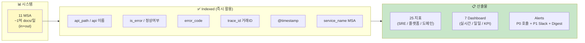
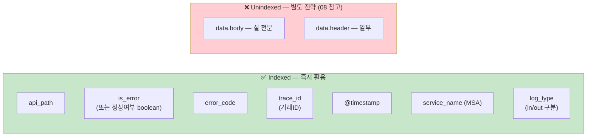
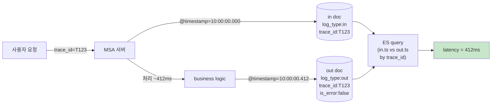
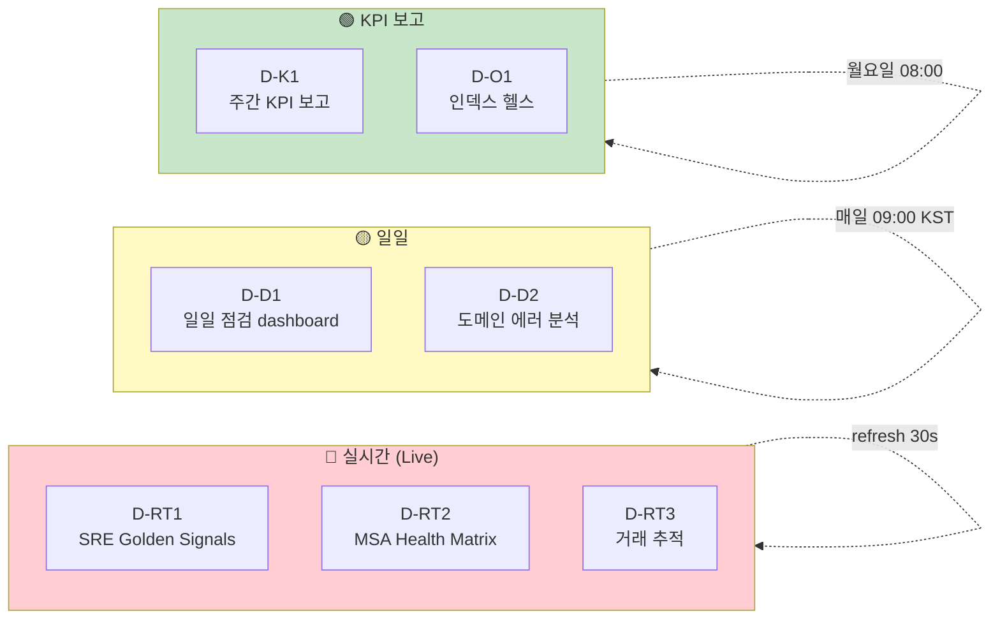
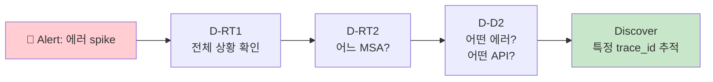
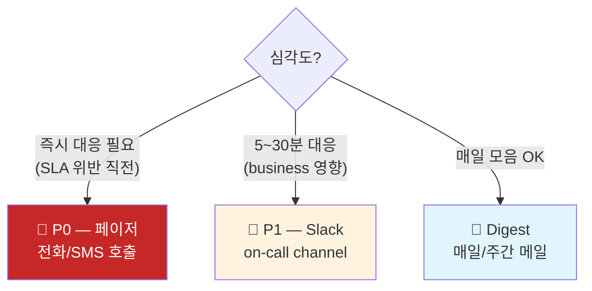
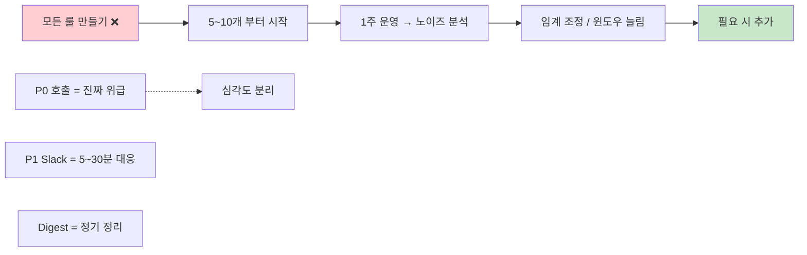
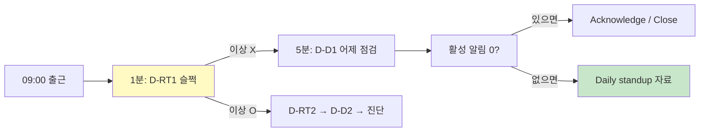
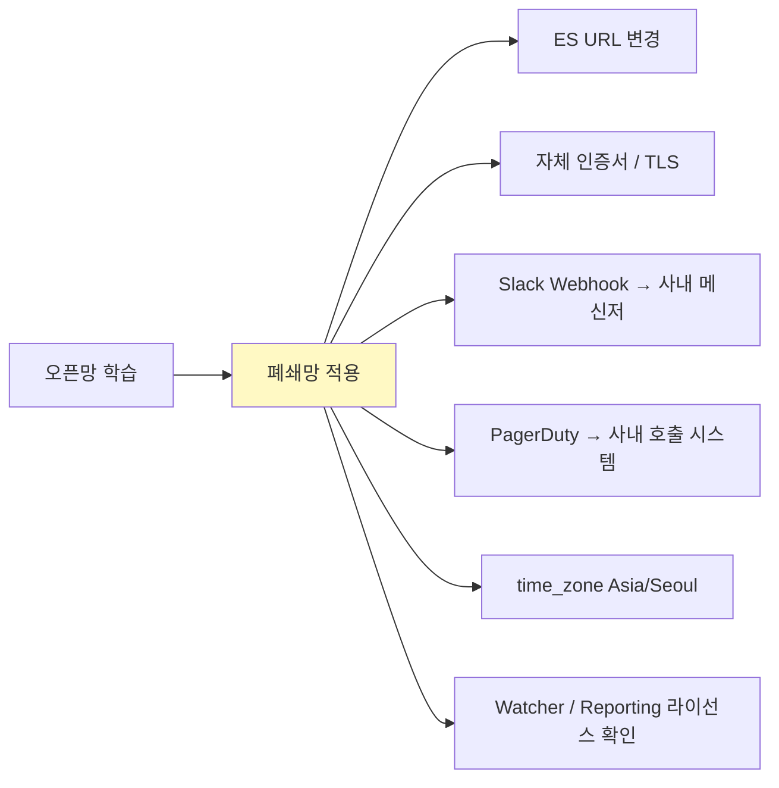
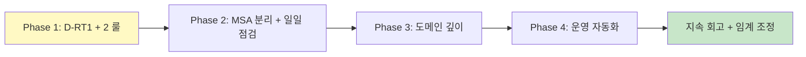

# 09. MSA 11서버 종합 KPI · 관측성 · Metric 전략

> **컨텍스트**: 백엔드 플랫폼 운영. 11 MSA, Filter/Interceptor 가 in/out 별도 doc 으로 ES 적재. **1억 docs/일** (in/out 합산).
> **제약**: `data.body` (실 전문) **unindexed**. `data.header` 일부도 동일. 그러나 **api명, 정상여부, 에러코드, 거래id, @timestamp** 는 **indexed**.
> **목표**: SRE / 백엔드 플랫폼 / 도메인 3관점에서 25 지표 선정 + 7 dashboard + P0/P1/Digest 알림. Google-scale 운영 표준.
> **선수**: [05-kpi-scenarios.md](05-kpi-scenarios.md) · [08-card-platform-payload-strategy.md](08-card-platform-payload-strategy.md)

---

## Executive Summary



**3 관점 × 4 시간대**:

| 관점 \ 주기 | 실시간 (1~5분) | 일일 (아침) | 주간/월간 KPI |
|---|---|---|---|
| **SRE** | Availability · p95 · Error rate · TPS | 어제 SLO · MTTR | SLO 트렌드 · Error budget burn |
| **백엔드/플랫폼** | MSA 헬스 매트릭스 · stuck requests · in/out imbalance | Index health · log lag | Capacity headroom · 비용 |
| **도메인/운영** | 핵심 API 에러 spike · 신규 에러 코드 | Top error codes · Dead API · Shadow API | API 사용 추세 · DAU 추정 |

---

## 학습 트리


---

## 1. 환경 진단

### 1.1 시스템 스케일

| 항목 | 값 | 시사점 |
|------|----|----|
| MSA 수 | **11** | 단일 cluster 로 충분, MSA별 service_name 으로 분리 |
| 일일 docs | **~1억** (in/out 합) | 평균 1,160 docs/sec, peak 5~10K/sec 추정 |
| in:out 비율 | 1:1 (in 마다 out 하나) | latency 측정용 매칭 데이터 풍부 |
| 인덱스 분리 | (가정) MSA × 일자 | 11 × 365 = 4K 인덱스/년 — ILM 필수 |
| 보존 | (가정) 30~90일 | hot+warm 30일, cold 60일 권장 |

> 1억 docs/일 = 어제 어떤 사용자가 무엇을 했는지 단건 추적 가능 + agg 는 sec~min 단위.

### 1.2 indexed vs unindexed (가용 차원)



**핵심 통찰**: `is_error` 가 indexed → **08 의 Phase 1.5 상태 (에러율 KPI 즉시 가능)**. 따라서 본 문서의 25 지표 중 90% 가 **현재 매핑만으로 즉시 구현 가능**. 일부 깊은 도메인 분석 (어떤 거래액에서 에러가 많은가 등) 은 [08 Phase 2~3](08-card-platform-payload-strategy.md) 적용 후.

### 1.3 in/out 짝짓기 — Latency 측정의 핵심



→ trace_id + timestamp 매칭으로 **모든 거래의 정확 latency** 계산 가능. ES 8.x 의 `transform` 또는 application 단 `elapsed_ms` 적재가 가장 효율적. 본 문서는 둘 다 다룸.

---

## 2. 분류 프레임워크

```
┌─────────────────────────────────────────────────────────────┐
│  📈 KPI / Metric / 점검 의 차이                               │
├─────────────────────────────────────────────────────────────┤
│                                                             │
│  Metric    = 측정값 그 자체 (예: p95=742ms)                   │
│              → 매번 측정, 자동 수집                            │
│                                                             │
│  KPI       = 목표값과 비교한 핵심 지표 (예: p95<500ms 달성률)  │
│              → 의사결정의 근거, SLO/OKR                       │
│                                                             │
│  실시간 점검 = "지금 정상인가?" (1~5분 주기)                   │
│              → Alerts 와 dashboard 의 KPI panel               │
│                                                             │
│  일일 점검   = "어제 어땠나, 오늘 봐야 할 것" (매일 1회)        │
│              → 매일 아침 dashboard 한 화면                    │
│                                                             │
│  주간/월간   = "추세는? 다음 분기 capacity?"                  │
│              → 스프린트/회의 자료                             │
└─────────────────────────────────────────────────────────────┘
```

| 시간대 | 청중 | 도구 | 응답 시간 |
|---|---|---|---|
| **실시간 (1~5min)** | SRE on-call | Alerts + Live Dashboard | 분 단위 |
| **일일 (1d)** | 운영자, 팀리더 | 일일 점검 dashboard | 시간 단위 |
| **주간 (7d)** | 매니저, PM | 주간 KPI 보고 | 일 단위 |
| **월간/분기** | 임원, capacity 결정 | 월간 보고서 | 주 단위 |

---

## 3. 25 지표 카탈로그

### 3.1 SRE 골든 시그널 (5)

| # | 지표 | 정의 | 핵심 출처 | 권장 임계 |
|---|---|---|---|---|
| **M-S1** | **Availability** (가용성) | `count(is_error:false ∧ log_type:out) / count(log_type:out)` | is_error | ≥ 99.9% (SLO) |
| **M-S2** | **Throughput / TPS** | `count(log_type:out) / window_seconds` | log_type | (capacity 기준 80%) |
| **M-S3** | **Error Rate** | `count(is_error:true) / count(log_type:out)` | is_error | < 0.1% (= 1-SLO) |
| **M-S4** | **Latency p50/p95/p99** | `(out.ts - in.ts) by trace_id` percentile | trace_id, @timestamp | p95<500ms, p99<2s |
| **M-S5** | **Saturation** | host/MSA별 throughput max 대비 비율 | service_name, host | < 80% sustain |

#### M-S1 Availability 구현 (Lens Formula)

```
count(kql='log_type:"out" and is_error:false')
  / count(kql='log_type:"out"')
```
포맷: Percent. 임계 색상: ≥99.9% 🟢 / 99.0~99.9% 🟡 / <99.0% 🔴

#### M-S4 Latency 구현 — 두 가지 방법

**방법 ① — application 측 elapsed_ms 적재 (권장)**

Filter/Interceptor 가 out doc 에 `elapsed_ms` 필드 직접 기록:
```
KQL:    log_type : "out"
Lens:   percentile(elapsed_ms, [50, 95, 99]) by api_path
```

**방법 ② — ES Transform 으로 in/out 매칭 (이미 운영 시작이라 ① 불가하면)**

[07-batch-transform.md](07-batch-transform.md) 의 transform pivot 을 trace_id 그루핑으로:
```json
"pivot": {
  "group_by": {
    "trace_id": { "terms": { "field": "trace_id" } }
  },
  "aggregations": {
    "in_ts":  { "min": { "field": "@timestamp" } },
    "out_ts": { "max": { "field": "@timestamp" } },
    "elapsed": { "bucket_script": {
      "buckets_path": { "out": "out_ts", "in": "in_ts" },
      "script": "params.out - params.in"
    }}
  }
}
```

### 3.2 백엔드 / 플랫폼 (7)

| # | 지표 | 정의 | 가치 |
|---|---|---|---|
| **M-P1** | **MSA 헬스 매트릭스** | 11 MSA × {availability, p95, tps} grid | 어느 MSA 가 문제인지 한눈에 |
| **M-P2** | **In/Out Imbalance** | `\|count(in) - count(out)\| by api` (5min window) | 누락 / 행(hang) 감지 |
| **M-P3** | **Stuck Requests** | in 만 있고 out 없음 (10분 경과) | 데드락/타임아웃 의심 |
| **M-P4** | **Inter-Service Latency** | A→B 호출 trace_id 체인 시간 | 분산 추적, bottleneck |
| **M-P5** | **Top API by Traffic** | 호출 수 상위 20 | capacity·캐시 우선순위 |
| **M-P6** | **Error Bursting API** | 에러 spike 가 큰 API top 10 | 즉시 대응 우선순위 |
| **M-P7** | **Index Ingestion Lag** | `now() - max(@timestamp)` | 로그 지연 감지 (Kafka/Logstash 문제) |

#### M-P1 MSA 헬스 매트릭스 (DSL)

```json
GET api-logs-*/_search
{
  "size": 0,
  "query": { "term": { "log_type": "out" } },
  "aggs": {
    "by_msa": {
      "terms": { "field": "service_name", "size": 11 },
      "aggs": {
        "tps":           { "value_count": { "field": "@timestamp" } },
        "errors":        { "filter": { "term": { "is_error": true } } },
        "p95":           { "percentiles": { "field": "elapsed_ms", "percents": [95] } },
        "availability":  {
          "bucket_script": {
            "buckets_path": { "ok": "tps._count", "err": "errors._count" },
            "script": "1 - (params.err / params.ok)"
          }
        }
      }
    }
  }
}
```

→ 11개 MSA 의 4개 KPI 한 번에. dashboard heatmap 또는 metric grid 로.

#### M-P2 In/Out Imbalance (DSL)

```json
{
  "size": 0,
  "aggs": {
    "by_api": {
      "terms": { "field": "api_path", "size": 1000 },
      "aggs": {
        "ins":  { "filter": { "term": { "log_type": "in" } } },
        "outs": { "filter": { "term": { "log_type": "out" } } },
        "imbalance": {
          "bucket_script": {
            "buckets_path": { "i": "ins._count", "o": "outs._count" },
            "script": "Math.abs(params.i - params.o) / Math.max(params.i, 1)"
          }
        },
        "alarm": {
          "bucket_selector": {
            "buckets_path": { "ratio": "imbalance" },
            "script": "params.ratio > 0.05"
          }
        }
      }
    }
  }
}
```

→ 5% 이상 불일치 API 만. 의미: 응답 누락/네트워크 단절/log adapter 결함.

### 3.3 도메인 / 비즈니스 (7)

| # | 지표 | 정의 | 가치 |
|---|---|---|---|
| **M-D1** | **Top Error Codes** | error_code 빈도 top 20 | 우선 대응 코드 |
| **M-D2** | **New Error Code Detection** | 어제까지 없던 코드 등장 (cardinality 증가) | 신규 결함 조기 발견 |
| **M-D3** | **Critical API Error Rate** | 결제/인증 등 핵심 API 의 에러율 | 비즈니스 임팩트 큰 부분 우선 |
| **M-D4** | **Error Code by MSA** | 각 MSA 의 top 5 에러 코드 분포 | 책임 영역 명확화 |
| **M-D5** | **거래 성공률 (Critical Path)** | 전체 시도 중 정상 종료 비율 | 비즈니스 KPI |
| **M-D6** | **고유 거래 수 (DAU 추정)** | `cardinality(trace_id)` | 사용량 추세 |
| **M-D7** | **Funnel Drop-off** | 인증→조회→결제 flow 의 단계별 dropout | UX painPoint 진단 |

#### M-D2 New Error Code Detection — 7일 window

```json
{
  "size": 0,
  "query": {
    "bool": {
      "filter": [
        { "term": { "is_error": true } },
        { "range": { "@timestamp": { "gte": "now-1h" } } }
      ]
    }
  },
  "aggs": {
    "today_codes": {
      "terms": { "field": "error_code", "size": 100 }
    }
  }
}
```
→ 그 결과를 **7일 누적 코드 목록과 차집합** (application 측 또는 transform 으로 사전 계산).

### 3.4 운영 / Capacity (4)

| # | 지표 | 정의 | 가치 |
|---|---|---|---|
| **M-O1** | **Time-of-Day Pattern** | 시간대별 호출량 (heatmap) | peak / off-peak |
| **M-O2** | **Day-of-Week** | 요일별 트래픽 | 주말/평일 차이 |
| **M-O3** | **Dead API** | 24h 호출 0인 swagger 선언 path | 정리 후보 |
| **M-O4** | **Shadow API** | swagger 미선언인데 호출되는 path | 보안/문서 누락 |

### 3.5 Operational Excellence (2)

| # | 지표 | 정의 | 가치 |
|---|---|---|---|
| **M-X1** | **Logging Pipeline Lag** | Kafka offset → ES 인덱싱 lag (sec) | 데이터 정합 |
| **M-X2** | **Index Storage Health** | 일자별 인덱스 size, shard 수, replica | 용량/성능 사전 대응 |

**총 25 지표** ✅

---

## 4. 시간대 매핑

### 4.1 실시간 점검 (1~5분, 알람 + Live dashboard)

P0 우선순위:
- **M-S1** Availability — 1분
- **M-S3** Error Rate — 1분 (5min window)
- **M-S4** Latency p95 — 5분
- **M-S2** Throughput / 평소 대비 anomaly — 5분
- **M-P1** MSA 헬스 매트릭스 — 5분
- **M-P3** Stuck Requests — 5분
- **M-D3** Critical API 에러 spike — 1분

### 4.2 일일 점검 (매일 아침 09:00)

- **M-D1** 어제 Top Error Codes
- **M-D2** New error code 등장
- **M-D4** MSA 별 에러 분포
- **M-O3** Dead API
- **M-O4** Shadow API
- **M-P5** Top API by Traffic (어제)
- **M-P6** Error Bursting API
- **M-X1** Pipeline lag 평균/최대
- **M-S1** 어제 SLO 달성 여부

### 4.3 주간 KPI (월요일)

- **M-S1** 주간 평균 가용성 + Error budget 잔여
- **M-S4** Latency 트렌드 (이번주 vs 지난주)
- **M-D5** 거래 성공률 추세
- **M-O1** Time-of-Day 패턴 변화
- **M-O2** Day-of-Week 비교
- **M-D6** DAU 추정 추세

### 4.4 월간 / 분기 (PM 보고)

- **M-S1, M-S4** SLO 누적 + 월별 비교
- **M-D5** 비즈니스 KPI
- **M-X2** Capacity headroom (인덱스 증가율, 예측)
- **M-D6** 활성 trace_id (월간 unique)

---

## 5. Dashboard 7종

### 5.0 Dashboard 분류 한눈에



| Dashboard | 청중 | 새로고침 | 주요 패널 |
|-----------|----|----|----|
| **D-RT1** SRE Golden Signals | SRE on-call | 30s | M-S1, S2, S3, S4 + alert status |
| **D-RT2** MSA Health Matrix | SRE/플랫폼 | 30s | 11 MSA × {availability, p95, tps, error} |
| **D-RT3** 거래 추적 | SRE/도메인 | 30s | M-P2, P3, in/out chart, top stuck trace |
| **D-D1** 일일 점검 | 매일 아침 / 운영 리더 | 1h | M-D1, M-O3/O4, M-P5/P6, S1 어제 |
| **D-D2** 도메인 에러 분석 | 도메인 리드, 개발 | drill-down | M-D1, D2, D4, error funnel |
| **D-K1** 주간 KPI | PM/매니저 | 1d | SLO, 트렌드, DAU, error budget |
| **D-O1** 인덱스 헬스 | 플랫폼/DBA | 5m | M-X1, X2, ingestion lag, shard size |

---

### 5.1 D-RT1 — SRE Golden Signals (실시간)

**용도**: on-call 이 매 시간 한 번 슬쩍 보면 정상 여부 1초 안에 판단.

```
┌─ 🕒 Last 1 hour (자동 30s refresh) ─────────────────────────────────┐
│ 🔎 [filter: env=prod] 🔔 [active alerts: 0]                        │
├──────────────────────────────────────────────────────────────────────┤
│ ┌────────┬────────┬────────┬────────┐                                │
│ │ M-S1   │ M-S3   │ M-S4   │ M-S2   │  ← KPI 4 (큰 metric, 색상)      │
│ │가용 99.97│에러 0.03%│p95 412ms│TPS 1.18K│                                │
│ │  🟢    │  🟢    │  🟢    │  🟢    │                                │
│ └────────┴────────┴────────┴────────┘                                │
├──────────────────────────────────────────────────────────────────────┤
│ ┌─────────────────────────┐ ┌──────────────────────────────────────┐ │
│ │ 📈 Availability % trend │ │ 📊 TPS by MSA (stacked)              │ │
│ │ (Lens line, 1h)        │ │ (Lens area, 1h, breakdown=service)   │ │
│ └─────────────────────────┘ └──────────────────────────────────────┘ │
├──────────────────────────────────────────────────────────────────────┤
│ ┌──────────────────────┐ ┌─────────────────────────────────────────┐ │
│ │ ⏱️ Latency p50/p95/p99│ │ 📋 활성 알림 (P0/P1)                     │ │
│ │ (line, 1h)           │ │ (Alerts table, status=active)           │ │
│ └──────────────────────┘ └─────────────────────────────────────────┘ │
└──────────────────────────────────────────────────────────────────────┘
```

#### Lens 패널 정의 (KPI 1 — Availability)

```
Type:           Metric
KQL filter:     log_type : "out"
Primary metric: Formula
  count(kql='is_error:false') / count()
Format:         Percent (decimal 2)
Conditional color:
  >= 99.9%   green
  99.0~99.9  amber
  < 99.0     red
Show trend line: 1h moving (compare to 1h ago)
```

#### Refresh 자동화

상단 Refresh every → **30 seconds**. (30s 미만은 부담)

---

### 5.2 D-RT2 — MSA Health Matrix (실시간)

**용도**: 11 MSA 의 4 KPI 를 한 화면에. heatmap-grid 형태.

```
┌─ MSA Health Matrix — 11 services × 4 KPI ──────────────────────────────────┐
│                                                                             │
│  ┌─────────────────┬──────────┬──────────┬──────────┬──────────┐           │
│  │ MSA             │ Availab. │ p95 (ms) │ TPS      │ Errors/m │           │
│  ├─────────────────┼──────────┼──────────┼──────────┼──────────┤           │
│  │ payment-svc     │ 🟢 99.99 │ 🟢 380   │ 280      │ 🟢 1     │           │
│  │ user-svc        │ 🟢 99.95 │ 🟡 720   │ 410      │ 🟢 5     │           │
│  │ account-svc     │ 🟢 99.98 │ 🟢 290   │ 320      │ 🟢 2     │           │
│  │ card-svc        │ 🔴 99.20 │ 🔴 1850  │ 95       │ 🔴 47    │ ← 주목   │
│  │ ⋯ (11개)        │          │          │          │          │           │
│  └─────────────────┴──────────┴──────────┴──────────┴──────────┘           │
│                                                                             │
│  📊 시간별 MSA 부하 분포 (heatmap)                                            │
│  ┌─────────────────────────────────────────────────────────────────┐       │
│  │ 11 MSA × 24 hours, color = error count                          │       │
│  └─────────────────────────────────────────────────────────────────┘       │
└─────────────────────────────────────────────────────────────────────────────┘
```

#### Lens 구현 — 핵심 패널

**Table** chart:
```
Rows:        service_name (Top 11)
Metrics:
  - Availability: 1 - count(is_error:true) / count()
  - p95:          percentile(elapsed_ms, 95)  filter log_type:"out"
  - TPS:          count() / window_seconds
  - Errors/min:   count(is_error:true) / window_minutes
Conditional color: 각 컬럼별 임계
```

#### Drill-down 패턴

특정 행 클릭 → "View in Discover" 또는 D-D2 dashboard 로 jump (dashboard drilldown).

---

### 5.3 D-RT3 — 거래 추적 (실시간)

**용도**: in/out 불일치 / 행(hang) / stuck request 즉시 발견.

```
┌─ 거래 추적 ─────────────────────────────────────────────────────────────┐
│                                                                         │
│ ┌───────────────────────────────────┐ ┌───────────────────────────────┐ │
│ │ 📊 In vs Out 카운트 trend (15min) │ │ ⚠️ In/Out Imbalance API top 10│ │
│ │ 두 라인이 일치해야 정상            │ │ (M-P2)                          │ │
│ └───────────────────────────────────┘ └───────────────────────────────┘ │
├─────────────────────────────────────────────────────────────────────────┤
│ ┌─────────────────────────────────────────────────────────────────────┐ │
│ │ 📋 Stuck Requests (in 만 있고 10분 내 out 없는 trace_id)             │ │
│ │ trace_id | service | api_path | started_at | wait_time              │ │
│ └─────────────────────────────────────────────────────────────────────┘ │
└─────────────────────────────────────────────────────────────────────────┘
```

#### Stuck Requests 쿼리 (transform 또는 application)

직접 쿼리는 ES 의 anti-join 한계로 어려움. 권장 패턴:
1. **Transform** 으로 매 5분 trace_id 별 in/out flag 집계
2. `out_ts == null AND in_ts < now-10m` 조건으로 stuck 인덱스에 적재
3. Dashboard 가 stuck 인덱스를 가리킴

또는 application 측에서 timeout 감지 시 별도 로그.

---

### 5.4 D-D1 — 일일 점검 dashboard (매일 아침)

**용도**: 운영 리더가 매일 9시에 한 화면. 회의 전 상태 파악.

```
┌─ 일일 점검 — 어제 (Last 24h) ────────────────────────────────────────────┐
│ 🕒 Yesterday (00:00 ~ 23:59 KST)                                         │
├──────────────────────────────────────────────────────────────────────────┤
│ ┌──────┬──────┬──────┬──────┐                                             │
│ │SLO달성│ 총트래픽│ 에러건수│MTT R│  ← 어제 핵심 KPI 4                     │
│ │ 99.97%│ 100M   │ 30K  │ 12분 │                                          │
│ └──────┴──────┴──────┴──────┘                                             │
├──────────────────────────────────────────────────────────────────────────┤
│ ┌────────────────────────┐ ┌─────────────────────────────────────────┐   │
│ │ 📊 Top 10 에러 코드 (M-D1)│ │📊 Top 10 트래픽 API (M-P5)              │   │
│ └────────────────────────┘ └─────────────────────────────────────────┘   │
├──────────────────────────────────────────────────────────────────────────┤
│ ┌───────────────────┐ ┌───────────────────┐ ┌───────────────────────┐    │
│ │ 💀 Dead API (M-O3) │ │ 👻 Shadow (M-O4)   │ │ 🆕 New Error Code     │   │
│ │ 12개               │ │ 3개                │ │ (M-D2)                │   │
│ └───────────────────┘ └───────────────────┘ └───────────────────────┘    │
├──────────────────────────────────────────────────────────────────────────┤
│ ┌──────────────────────────────────────────────────────────────────────┐ │
│ │ 📊 MSA 별 어제 Availability + 에러 분포 (heatmap)                    │ │
│ └──────────────────────────────────────────────────────────────────────┘ │
└──────────────────────────────────────────────────────────────────────────┘
```

#### "Yesterday" 상대 시간

Lens / 패널 시간 옵션에 **`now-1d/d` ~ `now/d`** 표기. 자정 기준 (KST 기준 timezone 필요 — `time_zone: "Asia/Seoul"`).

---

### 5.5 D-D2 — 도메인 에러 분석 (drill-down)

**용도**: 알람 / D-D1 의 에러가 발견되면 여기로 점프 → 깊은 진단.

```
┌─ 도메인 에러 분석 ────────────────────────────────────────────────────┐
│ 🕒 [Last 4h ▼]  🔎 [filter: error_code 또는 api 또는 MSA]              │
├──────────────────────────────────────────────────────────────────────┤
│ ┌─────────────────────────┐ ┌──────────────────────────────────────┐ │
│ │ 📊 Top Error Codes      │ │ 📊 MSA별 에러 분포 (M-D4 stacked)     │ │
│ │ 빈도 + 메시지 (M-D1)    │ │                                       │ │
│ └─────────────────────────┘ └──────────────────────────────────────┘ │
├──────────────────────────────────────────────────────────────────────┤
│ ┌─────────────────────────┐ ┌──────────────────────────────────────┐ │
│ │ 📈 에러 spike trend     │ │ 📋 최근 100 에러 (saved search)       │ │
│ │ (M-S3 last 4h)          │ │ trace_id, ts, service, api, code, msg│ │
│ └─────────────────────────┘ └──────────────────────────────────────┘ │
└──────────────────────────────────────────────────────────────────────┘
```

#### Drill-down chain



---

### 5.6 D-K1 — 주간 KPI 보고

**용도**: 매주 월요일 회의 자료 그대로.

```
┌─ 주간 KPI ─ Last 7 days ───────────────────────────────────────────┐
│                                                                    │
│ ┌──────────┬──────────┬──────────┬──────────┐                      │
│ │ 주간 SLO │ p95 trend │ 총 거래 │ DAU 추정 │  ← 4 KPI              │
│ │ 99.96%   │ 412→398   │ 700M    │ 2.1M     │                      │
│ │  🟢 달성 │  ↓ 좋음   │  ↑ 5%   │  ↑ 3%    │                      │
│ └──────────┴──────────┴──────────┴──────────┘                      │
├────────────────────────────────────────────────────────────────────┤
│ ┌─────────────────────────────────┐ ┌────────────────────────────┐ │
│ │ 📈 가용성 (이번주 vs 지난주)      │ │ 💰 Error Budget burn rate  │ │
│ │ (Lens timeshift)                │ │ 남은 budget: 67%            │ │
│ └─────────────────────────────────┘ └────────────────────────────┘ │
├────────────────────────────────────────────────────────────────────┤
│ ┌────────────────────────┐ ┌──────────────────────────────────────┐│
│ │📊 요일별 트래픽 (M-O2)  │ │📊 일자별 에러 추세                    ││
│ └────────────────────────┘ └──────────────────────────────────────┘│
└────────────────────────────────────────────────────────────────────┘
```

#### Error Budget 계산

```
SLO 99.9% → 한 달 허용 실패 0.1% × 30B docs = 30M 실패 허용
이번주 누적 실패 = 10M
남은 budget = (30M - 10M) / 30M = 67%
```

Lens metric 으로 표시 + Conditional formatting (남은 < 30% → 빨강 → 신규 배포 동결).

---

### 5.7 D-O1 — 인덱스 헬스 (플랫폼)

**용도**: 플랫폼팀이 ES 자체의 건강 상태 점검.

```
┌─ 인덱스 헬스 ─────────────────────────────────────────────────────┐
│                                                                   │
│ ┌──────┬──────┬──────┬──────┐                                    │
│ │ Lag  │ shard│ size │indexs│  ← M-X1, X2                          │
│ │ 2.3s │ 24   │ 380GB│  90  │                                    │
│ └──────┴──────┴──────┴──────┘                                    │
├───────────────────────────────────────────────────────────────────┤
│ ┌──────────────────────────────────────────────────────────────┐ │
│ │ 📈 Ingestion lag trend (M-X1)                                  │ │
│ │ Lens: now() - max(@timestamp), 5m bucket                       │ │
│ └──────────────────────────────────────────────────────────────┘ │
├───────────────────────────────────────────────────────────────────┤
│ ┌──────────────────────────────────────────────────────────────┐ │
│ │ 📋 Top 10 인덱스 (M-X2) — size, docs, shards                   │ │
│ │ GET _cat/indices?bytes=b&format=json 결과 시각화                │ │
│ └──────────────────────────────────────────────────────────────┘ │
└───────────────────────────────────────────────────────────────────┘
```

#### M-X1 Ingestion Lag 구현

`ingest_time` 필드를 application 측에서 추가 적재해야 측정 가능. 또는 **Logstash event timestamp** 와 ES `@timestamp` 차이 비교. 둘 다 어려우면 last-doc 시간 기반 SLO:

```
GET api-logs-*/_search
{
  "size": 0,
  "aggs": { "max_ts": { "max": { "field": "@timestamp" } } }
}
```

`now() - max_ts` 가 5분 넘어가면 alert.

---

## 6. Alerting 룰 — P0 / P1 / Digest

### 6.1 우선순위 정의



### 6.2 P0 — 즉시 호출 (페이저)

| 룰 | 조건 | 임계 |
|---|---|---|
| **R-P0-1** 전체 가용성 폭락 | M-S1 | < 99.0% in last 5min |
| **R-P0-2** Error Rate spike | M-S3 | > 5% in last 5min |
| **R-P0-3** Latency 폭증 | M-S4 (p95) | > 5초 in last 5min |
| **R-P0-4** MSA 완전 단절 | TPS by MSA | = 0 for any MSA in last 10min (정상 시간대) |
| **R-P0-5** Ingestion lag 심각 | M-X1 | > 10분 (로그 손실 위험) |

#### R-P0-1 Kibana 룰 정의

```
Rule type:    Elasticsearch query
Index:        api-logs-*
Time field:   @timestamp
Query (DSL):
  {
    "bool": {
      "filter": [
        { "term": { "log_type": "out" } }
      ]
    }
  }

Condition:
  WHEN  count of is_error:true / count of all
  IS ABOVE 0.01    (= 1%)
  FOR THE LAST 5 minutes
  Check every 1 minute

Action:
  Connector: PagerDuty / Webhook
  Severity: critical
  Body: |
    🚨 P0 — 가용성 폭락
    - 시각: {{date}}
    - 가용성: {{context.value}}
    - Dashboard: https://kibana/.../D-RT1
    - Runbook: https://wiki/runbooks/availability-drop
```

📌 **Runbook 링크 필수** — on-call 이 새벽에 깨도 무엇을 할지.

### 6.3 P1 — Slack 채널

| 룰 | 조건 | 임계 |
|---|---|---|
| **R-P1-1** Critical API 에러 spike | M-D3 (결제/인증 등) | > 10건 in 5min |
| **R-P1-2** 신규 에러 코드 등장 | M-D2 | unique error_code 어제까지 없던 것 |
| **R-P1-3** Stuck Requests 누적 | M-P3 | > 100 |
| **R-P1-4** In/Out Imbalance | M-P2 | any API 5% 이상 imbalance |
| **R-P1-5** 단일 MSA error spike | M-P1 | 단일 MSA error rate >2% |
| **R-P1-6** Latency 회귀 | M-S4 | p95 increase >50% vs last hour |

#### R-P1-2 New Error Code Detection

ES 단독으로 어려움. 권장 구현:
1. 매시간 transform 으로 "지난 7일 unique error_code" 인덱스 (`error-code-history`) 갱신
2. 룰: 현재 1시간 unique error_code 중 history 에 없는 것이 있으면 트리거
3. 또는 application 단에서 Slack webhook 호출

또는 **간이 룰**: `error_code : *` 에 `cardinality` 가 평소 대비 +1 이상 → 알림.

### 6.4 Digest — 매일/주간 메일

매일 09:00 KST 자동 발송:

```
[Subject] 일일 운영 점검 — 2026-04-26

📊 어제 KPI
  - 가용성:    99.97% (목표 99.9% 🟢)
  - p95:       412ms  (어제 대비 +5ms)
  - 총 거래:   100M
  - 활성 MSA: 11/11

🔴 주의 필요
  - card-service 에러율 0.8% (평소 0.1%)
  - Dead API 신규 3건: /api/v1/legacy/old-endpoint, ...
  - Shadow API 1건: /api/v1/admin/internal/...
  - 신규 에러 코드 2건: P999, U888

📈 트렌드
  - 7일 평균 가용성: 99.96% (선주 99.94%, 개선)
  - Error budget 잔여: 73%

🔗 상세: https://kibana/.../D-D1
```

#### 자동 발송 구현

- **Watcher** (라이선스 필요) 또는
- **Reporting plugin** (Pages / 이메일 자동 발송)
- **외부 cron + Reporting API** 호출

### 6.5 Alert fatigue 방지 원칙



원칙:
- **P0 는 SLO 위반 직전만** — 자주 울리면 무시당함
- **Cool-down** — 같은 룰 30분 내 재트리거 안 함
- **자동 closure** — 조건 해제 시 자동 resolved
- **runbook** 매 룰에 첨부

---

## 7. 운영 절차

### 7.1 Daily — 운영자 09:00 루틴



### 7.2 Weekly — 매주 월요일

- D-K1 dashboard 한 화면 캡처 → 매니저 보고
- Error budget burn rate 검토
- Top 5 painPoint API 우선순위 회의
- 룰 임계 조정 (false-positive 분석)

### 7.3 Monthly — 월말/월초

- SLO/SLA 보고서 작성
- Capacity 예측 (인덱스 size 증가율 → ES heap/disk 증설 검토)
- Error budget reset
- Dashboard 정비 (사용 안 하는 패널 제거)

---

## 8. 폐쇄망 적용 시 추가 고려



| 항목 | 변경 |
|---|---|
| ES URL | 사내 endpoint |
| 인증 | Basic / API Key / OIDC |
| Slack Webhook | 사내 메신저 / 카톡 봇 |
| PagerDuty | 사내 호출 시스템 (예: 직접 SMS 게이트웨이) |
| Reporting 자동 메일 | SMTP 사내 메일 서버 |
| 라이선스 | Watcher (Gold+) / Anomaly (Platinum) 활성 여부 확인 |
| 사용자 권한 | spaces 분리, role 별 dashboard 제한 |

---

## 9. ✅ 단계별 체크리스트

### Phase 1 (Day 1~7) — 기반
- [ ] Data view 생성 (api-logs-*)
- [ ] D-RT1 (Golden Signals) dashboard 1개 완성
- [ ] R-P0-1 (가용성), R-P0-2 (에러율) 룰 활성
- [ ] Slack/메신저 connector 1개

### Phase 2 (Week 2) — MSA 분리
- [ ] D-RT2 (MSA Health Matrix)
- [ ] D-D1 (일일 점검)
- [ ] R-P1-1 (Critical API spike), R-P1-3 (Stuck) 룰

### Phase 3 (Week 3~4) — 도메인 깊이
- [ ] D-D2 (도메인 에러 분석)
- [ ] M-D2 (신규 에러 코드 감지) — transform / application
- [ ] R-P1-2 (New error code) 룰

### Phase 4 (Month 2) — 운영 자동화
- [ ] D-K1 (주간 KPI)
- [ ] D-O1 (인덱스 헬스)
- [ ] Digest 메일 자동화
- [ ] Latency 측정 정합화 (elapsed_ms 적재 또는 transform)

### 지속 운영
- [ ] 매주 룰 임계 조정 (false-positive 분석)
- [ ] 매월 SLO 보고
- [ ] 분기 dashboard 정비
- [ ] 분기 capacity 예측

---

## 10. 25 지표 한 페이지 요약

```
══ SRE Golden Signals (5) ══
M-S1  Availability               1 - errors/total  (실시간 + 일일 + 주간)
M-S2  Throughput / TPS           count / time       (실시간)
M-S3  Error Rate                 errors/total       (실시간)
M-S4  Latency p50/p95/p99       elapsed_ms perc    (실시간)
M-S5  Saturation                 host CPU/mem (별도) (실시간)

══ 백엔드 / 플랫폼 (7) ══
M-P1  MSA Health Matrix          11 MSA × 4 KPI    (실시간)
M-P2  In/Out Imbalance           |in - out| / api  (실시간)
M-P3  Stuck Requests             in only, no out   (실시간)
M-P4  Inter-Service Latency      A→B trace_id chain (일일)
M-P5  Top API by Traffic         count by api      (일일)
M-P6  Error Bursting API         spike score       (실시간)
M-P7  Index Ingestion Lag        now - max ts      (실시간)

══ 도메인 / 비즈니스 (7) ══
M-D1  Top Error Codes            code 빈도         (일일)
M-D2  New Error Code Detection   yesterday-vs-today (일일)
M-D3  Critical API Error Rate    결제/인증 에러     (실시간)
M-D4  Error Code by MSA          msa × code grid   (일일)
M-D5  거래 성공률                 정상/시도          (주간)
M-D6  고유 거래 수 (DAU)          cardinality(trace) (주간/월간)
M-D7  Funnel Drop-off            단계별 dropout    (주간)

══ 운영 / Capacity (4) ══
M-O1  Time-of-Day Pattern        hour heatmap      (주간)
M-O2  Day-of-Week                요일별            (주간)
M-O3  Dead API                   호출 0 24h        (일일)
M-O4  Shadow API                 swagger 미선언    (일일)

══ Operational Excellence (2) ══
M-X1  Logging Pipeline Lag       Kafka → ES        (실시간)
M-X2  Index Storage Health       size, shards      (일일/주간)
```

---

## ❓ Self-check

1. **Q.** 25 지표 중 가장 먼저 셋업해야 할 5개는?
   <details><summary>A</summary>M-S1 (가용성), M-S3 (에러율), M-S4 (latency p95), M-P1 (MSA matrix), M-D3 (critical API). SRE golden signals + 비즈니스 영향 가장 큰 critical API.</details>

2. **Q.** P0 와 P1 의 본질 차이는?
   <details><summary>A</summary>P0 = SLA 위반 직전 / 새벽 깨워야 하는 수준 / 고객 영향 즉시. P1 = 업무 시간 내 대응으로 충분 / 영향 제한적. 잘못 분류하면 alert fatigue 또는 사고 누락.</details>

3. **Q.** "1억 docs/일" 환경에서 dashboard query 가 느릴 때 가장 먼저 시도?
   <details><summary>A</summary>(1) 시간 범위 좁히기 (Last 24h → Last 1h), (2) Transform 으로 사전 집계 인덱스 만들고 dashboard 가 거기를 가리키게 (07-batch-transform 참고), (3) interval 굵게, (4) breakdown size 줄이기.</details>

4. **Q.** trace_id 매칭으로 latency 계산할 때의 한계?
   <details><summary>A</summary>(1) trace_id 가 일치하지 않거나 누락된 doc 은 매칭 실패, (2) ES 의 anti-join 부재로 stuck (in only) 직접 query 어려움 — transform 또는 별도 stuck 인덱스 필요, (3) 클라이언트 측에서 elapsed_ms 적재가 더 효율적.</details>

5. **Q.** Error Budget burn 을 dashboard 에 어떻게 표시?
   <details><summary>A</summary>SLO 정의 (예: 99.9%) 기준 한 달 허용 실패 N건 산출 → 누적 실패 / N 의 비율로 "남은 budget %" metric. < 30% 시 빨강 + 신규 배포 동결 정책 자동 안내.</details>

6. **Q.** Daily Digest 에 들어가면 좋은 항목 5개를 한 줄씩?
   <details><summary>A</summary>(1) 어제 가용성 / SLO 달성 여부, (2) 평소 대비 변화 큰 KPI, (3) 신규 에러 코드 / Dead API / Shadow API, (4) Top 3 painPoint, (5) Error Budget 잔여 + 다음 주 영향 예측.</details>

7. **Q.** D-RT2 (MSA Health Matrix) 가 다른 dashboard 와 다른 점?
   <details><summary>A</summary>D-RT1 은 전체 합 KPI, D-RT2 는 MSA 별 분리 매트릭스. 단일 MSA 가 죽어도 전체 평균이 정상으로 보이는 함정 방지. "어느 MSA 가 문제?" 질문에 즉답.</details>

---

## 11. 다음 액션



| 우선 작업 | 시간 |
|---|---|
| 1. Data view + D-RT1 | 1일 |
| 2. P0 룰 2개 (가용성, 에러율) + Slack/PagerDuty connector | 0.5일 |
| 3. D-RT2 + D-D1 | 1일 |
| 4. P1 룰 5개 | 1일 |
| 5. Latency 정합화 (elapsed_ms 적재 합의 + transform) | 1주 |
| 6. M-D2 신규 에러 코드 감지 transform | 0.5일 |
| 7. Digest 자동 메일 | 0.5일 |

**총 ~2주에 11 MSA / 1억 docs 환경의 production-grade 관측성 + 알림** 확보 가능.

---

## 다음 학습 / 참고
- 일일 통계 인덱스 자동화 → [07-batch-transform.md](07-batch-transform.md)
- payload unindexed 환경에서의 KPI 회복 → [08-card-platform-payload-strategy.md](08-card-platform-payload-strategy.md)
- 알람 룰 셋업 상세 → [04-alerts.md](04-alerts.md)
