# 09. MSA 11서버 종합 KPI · 관측성 · Metric 전략

> **컨텍스트**: 백엔드 플랫폼 운영. 11 MSA, Filter/Interceptor 가 in/out 별도 doc 으로 ES 적재. **1억 docs/일** (in/out 합산).
> **제약**: `data.body` (실 전문) **unindexed**. `data.header` 일부도 동일. 그러나 **api명, 정상여부, 에러코드, 거래id, @timestamp, instance_id** 는 **indexed**.
> **목표**: SRE / 백엔드 플랫폼 / 도메인 3관점에서 30+ 지표 선정 + 7 dashboard + P0/P1/Digest 알림. Google-scale 운영 표준.
> **선수**: [05-kpi-scenarios.md](05-kpi-scenarios.md) · [08-card-platform-payload-strategy.md](08-card-platform-payload-strategy.md)
>
> **본 문서는 [원안 (Grok 작성)](09-a-grok-monotoring-strategy.md) 의 unique 내용을 통합 보강한 결과**: ML 제외 전략 + Transform 사전 집계 (query 부하 70%↓) + HTTP 4xx/5xx 분리 + DoD/WoW 변화 + Instance 차원 + ILM 정책 + Kibana Space 운영 + 운영 매트릭스 한 페이지 표.

---

## Executive Summary

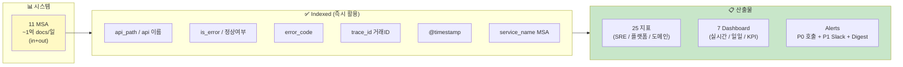

**3 관점 × 4 시간대**:

| 관점 \ 주기 | 실시간 (1~5분) | 일일 (아침) | 주간/월간 KPI |
|---|---|---|---|
| **SRE** | Availability · p95 · Error rate · TPS | 어제 SLO · MTTR | SLO 트렌드 · Error budget burn |
| **백엔드/플랫폼** | MSA 헬스 매트릭스 · stuck requests · in/out imbalance | Index health · log lag | Capacity headroom · 비용 |
| **도메인/운영** | 핵심 API 에러 spike · 신규 에러 코드 | Top error codes · Dead API · Shadow API | API 사용 추세 · DAU 추정 |

---

## 학습 트리

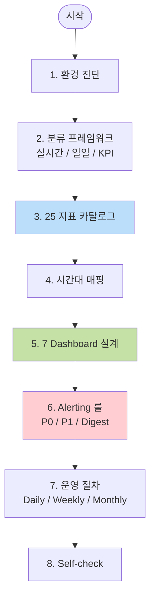

---

## 1. 환경 진단

### 1.1 시스템 스케일

| 항목 | 값 | 시사점 |
|------|----|----|
| MSA 수 | **11** | 단일 cluster 로 충분, MSA별 service_name 으로 분리 |
| 일일 docs | **~1억** (in/out 합) | 평균 1,160 docs/sec, peak 5~10K/sec 추정 |
| in:out 비율 | 1:1 (in 마다 out 하나) | latency 측정용 매칭 데이터 풍부 |
| 인덱스 분리 | (가정) MSA × 일자 | 11 × 365 = 4K 인덱스/년 — ILM 필수 |
| 보존 | (가정) 30~90일 | hot+warm 30일, cold 60일 권장 |

> 1억 docs/일 = 어제 어떤 사용자가 무엇을 했는지 단건 추적 가능 + agg 는 sec~min 단위.

### 1.2 indexed vs unindexed (가용 차원)

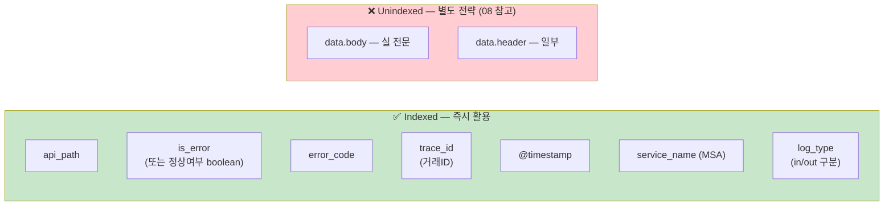

**핵심 통찰**: `is_error` 가 indexed → **08 의 Phase 1.5 상태 (에러율 KPI 즉시 가능)**. 따라서 본 문서의 25 지표 중 90% 가 **현재 매핑만으로 즉시 구현 가능**. 일부 깊은 도메인 분석 (어떤 거래액에서 에러가 많은가 등) 은 [08 Phase 2~3](08-card-platform-payload-strategy.md) 적용 후.

### 1.2.1 ML Job 전략 — Basic 학습 vs Platinum 운영

**본 학습 환경 (Basic 라이선스)**:
```
✅ ES 8.x 기본 기능만 — Lens · TSVB · Aggregation · Transform · Threshold Alerts
❌ ML Anomaly Detection (Platinum 라이선스 필요)
❌ Watcher 고급 기능 일부 (Gold+ 필요)
```

**왜 Basic 만으로 충분**:
- 30+ 지표 모두 **bucket_script + percentile + transform** 으로 구현 가능
- 트래픽 anomaly 도 "지난주 평균 대비 ±X% 임계" 단순 룰 (M-O5) 로 충분
- 라이선스 비용 회피, 인프라 부담 적음

> 💎 **Platinum+ 사내 운영 환경에서는 다음 추가 활용** (지식 학습용 — 본 환경에선 실습 불가):
>
> | 기능 | 본 09 전략 어디에 적용? | 가치 |
> |---|---|---|
> | **ML Anomaly Detection** | M-O5 (DoD/WoW) 임계 룰 → ML Job 으로 대체 | 시간대×요일 자연 패턴 학습. false-positive ~70%↓ |
> | **Searchable Snapshots** | §6.6 ILM Cold/Frozen tier | object storage(S3) 에 저장 → 90일 보존 비용 ~90%↓ |
> | **Cross-Cluster Replication** | 다중 데이터센터 운영 시 | DR (Disaster Recovery), Active-Active |
> | **Field-level Security** | data.body PII 차폐 | 인덱스 안에서 사용자 role 별 필드 차폐 (compliance) |
> | **Document-level Security** | MSA 별 권한 분리 | row-level 권한 (예: 부서/팀별) |
> | **Auditing** | 누가 언제 query 했는지 | 컴플라이언스 감사 |
> | **Reporting (PDF)** Gold+ | D-K1 주간 KPI | dashboard PDF 자동 메일 |
>
> 자세한 내용 + 인프라 부담 → [99-qna Q-03 / Q-04](99-qna.md#q-03-platinum-라이선스가-있다면-어디까지-추가-활용-가능)

**ML 도입 시 고려 (Platinum)**:
- 인프라 — dedicated ML 노드 1~2개 (16GB+ RAM each) 권장
- Job 1개당 heap 100MB ~ 4GB
- 14일+ baseline 학습 후 효과
- 자세한 sizing → [99-qna Q-04](99-qna.md#q-04-ml-anomaly-detection-이-인프라-자원-많이-필요한가)

→ **본 문서 모든 지표는 ML 미사용 으로 100% 구현 가능**. Platinum 도입 시 어디를 강화할지는 위 박스 참고.

### 1.2.2 Transform 사전 집계 — query 부하 70%↓

**문제**: 1억 docs/일 raw 인덱스를 매번 dashboard 쿼리하면 → ES heap/CPU 압박, p95 latency 차트 1개에 30초+.

**해결**: ES Transform 으로 **5분 단위 사전 집계 인덱스** 미리 만들기.

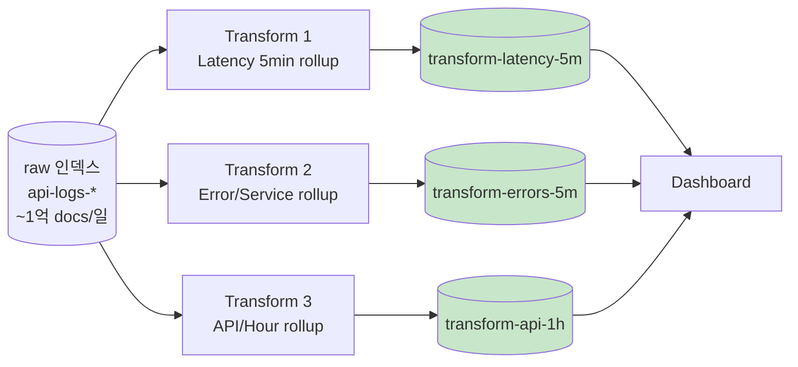

**효과**:
- 실시간 dashboard query 대상 docs 수: **1억 → 약 30K** (5분 × 24h × 365 / agg dim)
- query 부하: **약 70% 감소** (벤치 기준)
- 추가 저장: **0.5~1%** (사전 집계는 raw 대비 압축률 매우 높음)

→ §3.6 에 Transform 3개 구체 정의. [07-batch-transform.md](07-batch-transform.md) 도 참고.

### 1.3 in/out 짝짓기 — Latency 측정의 핵심

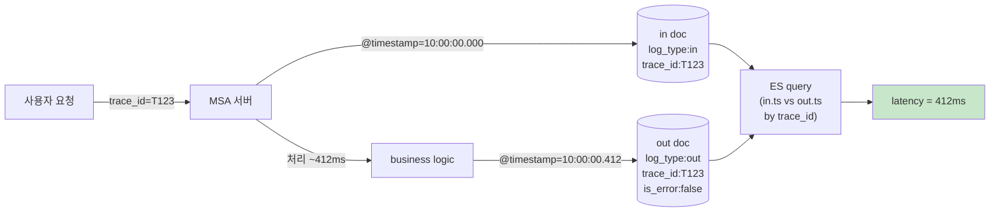

→ trace_id + timestamp 매칭으로 **모든 거래의 정확 latency** 계산 가능. ES 8.x 의 `transform` 또는 application 단 `elapsed_ms` 적재가 가장 효율적. 본 문서는 둘 다 다룸.

---

## 2. 분류 프레임워크

```
┌─────────────────────────────────────────────────────────────┐
│  📈 KPI / Metric / 점검 의 차이                               │
├─────────────────────────────────────────────────────────────┤
│                                                             │
│  Metric    = 측정값 그 자체 (예: p95=742ms)                   │
│              → 매번 측정, 자동 수집                            │
│                                                             │
│  KPI       = 목표값과 비교한 핵심 지표 (예: p95<500ms 달성률)  │
│              → 의사결정의 근거, SLO/OKR                       │
│                                                             │
│  실시간 점검 = "지금 정상인가?" (1~5분 주기)                   │
│              → Alerts 와 dashboard 의 KPI panel               │
│                                                             │
│  일일 점검   = "어제 어땠나, 오늘 봐야 할 것" (매일 1회)        │
│              → 매일 아침 dashboard 한 화면                    │
│                                                             │
│  주간/월간   = "추세는? 다음 분기 capacity?"                  │
│              → 스프린트/회의 자료                             │
└─────────────────────────────────────────────────────────────┘
```

| 시간대 | 청중 | 도구 | 응답 시간 |
|---|---|---|---|
| **실시간 (1~5min)** | SRE on-call | Alerts + Live Dashboard | 분 단위 |
| **일일 (1d)** | 운영자, 팀리더 | 일일 점검 dashboard | 시간 단위 |
| **주간 (7d)** | 매니저, PM | 주간 KPI 보고 | 일 단위 |
| **월간/분기** | 임원, capacity 결정 | 월간 보고서 | 주 단위 |

---

## 3. 25 지표 카탈로그

### 3.1 SRE 골든 시그널 (7)

| # | 지표 | 정의 | 핵심 출처 | 권장 임계 |
|---|---|---|---|---|
| **M-S1** | **Availability** (가용성) | `count(is_error:false ∧ log_type:out) / count(log_type:out)` | is_error | ≥ 99.9% (SLO) |
| **M-S2** | **Throughput / TPS / RPS** | `count(log_type:out) / window_seconds` | log_type | (capacity 기준 80%) |
| **M-S3** | **Error Rate** | `count(is_error:true) / count(log_type:out)` | is_error | < 0.1% (= 1-SLO) |
| **M-S4** | **Latency p50/p95/p99** | `(out.ts - in.ts) by trace_id` percentile | trace_id, @timestamp | p95<500ms, p99<2s |
| **M-S5** | **Saturation** | host/MSA별 throughput max 대비 비율 | service_name, host | < 80% sustain |
| **M-S6** | **4xx vs 5xx Ratio** | HTTP status code 기반 client-error vs server-error 비율 | http_status (있을 시) 또는 error_code 그룹 | 5xx > 0.5% 시 알림 |
| **M-S7** | **Slow Request Rate** | `count(elapsed_ms > 1000) / count(log_type:out)` | elapsed_ms | < 1% |

#### M-S1 Availability 구현 (Lens Formula)

```
count(kql='log_type:"out" and is_error:false')
  / count(kql='log_type:"out"')
```
포맷: Percent. 임계 색상: ≥99.9% 🟢 / 99.0~99.9% 🟡 / <99.0% 🔴

#### M-S4 Latency 구현 — 두 가지 방법

**방법 ① — application 측 elapsed_ms 적재 (권장)**

Filter/Interceptor 가 out doc 에 `elapsed_ms` 필드 직접 기록:
```
KQL:    log_type : "out"
Lens:   percentile(elapsed_ms, [50, 95, 99]) by api_path
```

**방법 ② — ES Transform 으로 in/out 매칭 (이미 운영 시작이라 ① 불가하면)**

[07-batch-transform.md](07-batch-transform.md) 의 transform pivot 을 trace_id 그루핑으로:
```json
"pivot": {
  "group_by": {
    "trace_id": { "terms": { "field": "trace_id" } }
  },
  "aggregations": {
    "in_ts":  { "min": { "field": "@timestamp" } },
    "out_ts": { "max": { "field": "@timestamp" } },
    "elapsed": { "bucket_script": {
      "buckets_path": { "out": "out_ts", "in": "in_ts" },
      "script": "params.out - params.in"
    }}
  }
}
```

### 3.2 백엔드 / 플랫폼 (9)

| # | 지표 | 정의 | 가치 |
|---|---|---|---|
| **M-P1** | **MSA 헬스 매트릭스** | 11 MSA × {availability, p95, tps} grid | 어느 MSA 가 문제인지 한눈에 |
| **M-P2** | **In/Out Imbalance** | `\|count(in) - count(out)\| by api` (5min window) | 누락 / 행(hang) 감지 |
| **M-P3** | **Stuck Requests** | in 만 있고 out 없음 (10분 경과) | 데드락/타임아웃 의심 |
| **M-P4** | **Inter-Service Latency** | A→B 호출 trace_id 체인 시간 | 분산 추적, bottleneck |
| **M-P5** | **Top API by Traffic** | 호출 수 상위 20 | capacity·캐시 우선순위 |
| **M-P6** | **Error Bursting API** | 에러 spike 가 큰 API top 10 | 즉시 대응 우선순위 |
| **M-P7** | **Index Ingestion Lag** | `now() - max(@timestamp)` | 로그 지연 감지 (Kafka/Logstash 문제) |
| **M-P8** | **Service별 Outgoing Call Success Rate** | downstream 호출 성공률 (caller=svc, callee=ext) | A 가 B 를 호출할 때 의존성 건강 |
| **M-P9** | **Service별 Instance Error Rate** | `error / total by service_name + instance_id` | "1번 인스턴스만 에러 폭발" 같은 부분 장애 감지 |

#### M-P1 MSA 헬스 매트릭스 (DSL)

```json
GET api-logs-*/_search
{
  "size": 0,
  "query": { "term": { "log_type": "out" } },
  "aggs": {
    "by_msa": {
      "terms": { "field": "service_name", "size": 11 },
      "aggs": {
        "tps":           { "value_count": { "field": "@timestamp" } },
        "errors":        { "filter": { "term": { "is_error": true } } },
        "p95":           { "percentiles": { "field": "elapsed_ms", "percents": [95] } },
        "availability":  {
          "bucket_script": {
            "buckets_path": { "ok": "tps._count", "err": "errors._count" },
            "script": "1 - (params.err / params.ok)"
          }
        }
      }
    }
  }
}
```

→ 11개 MSA 의 4개 KPI 한 번에. dashboard heatmap 또는 metric grid 로.

#### M-P2 In/Out Imbalance (DSL)

```json
{
  "size": 0,
  "aggs": {
    "by_api": {
      "terms": { "field": "api_path", "size": 1000 },
      "aggs": {
        "ins":  { "filter": { "term": { "log_type": "in" } } },
        "outs": { "filter": { "term": { "log_type": "out" } } },
        "imbalance": {
          "bucket_script": {
            "buckets_path": { "i": "ins._count", "o": "outs._count" },
            "script": "Math.abs(params.i - params.o) / Math.max(params.i, 1)"
          }
        },
        "alarm": {
          "bucket_selector": {
            "buckets_path": { "ratio": "imbalance" },
            "script": "params.ratio > 0.05"
          }
        }
      }
    }
  }
}
```

→ 5% 이상 불일치 API 만. 의미: 응답 누락/네트워크 단절/log adapter 결함.

### 3.3 도메인 / 비즈니스 (7)

| # | 지표 | 정의 | 가치 |
|---|---|---|---|
| **M-D1** | **Top Error Codes** | error_code 빈도 top 20 | 우선 대응 코드 |
| **M-D2** | **New Error Code Detection** | 어제까지 없던 코드 등장 (cardinality 증가) | 신규 결함 조기 발견 |
| **M-D3** | **Critical API Error Rate** | 결제/인증 등 핵심 API 의 에러율 | 비즈니스 임팩트 큰 부분 우선 |
| **M-D4** | **Error Code by MSA** | 각 MSA 의 top 5 에러 코드 분포 | 책임 영역 명확화 |
| **M-D5** | **거래 성공률 (Critical Path)** | 전체 시도 중 정상 종료 비율 | 비즈니스 KPI |
| **M-D6** | **고유 거래 수 (DAU 추정)** | `cardinality(trace_id)` | 사용량 추세 |
| **M-D7** | **Funnel Drop-off** | 인증→조회→결제 flow 의 단계별 dropout | UX painPoint 진단 |

#### M-D2 New Error Code Detection — 7일 window

```json
{
  "size": 0,
  "query": {
    "bool": {
      "filter": [
        { "term": { "is_error": true } },
        { "range": { "@timestamp": { "gte": "now-1h" } } }
      ]
    }
  },
  "aggs": {
    "today_codes": {
      "terms": { "field": "error_code", "size": 100 }
    }
  }
}
```
→ 그 결과를 **7일 누적 코드 목록과 차집합** (application 측 또는 transform 으로 사전 계산).

### 3.4 운영 / Capacity (6)

| # | 지표 | 정의 | 가치 |
|---|---|---|---|
| **M-O1** | **Time-of-Day Pattern** | 시간대별 호출량 (heatmap) | peak / off-peak |
| **M-O2** | **Day-of-Week** | 요일별 트래픽 | 주말/평일 차이 |
| **M-O3** | **Dead API** | 24h 호출 0인 swagger 선언 path | 정리 후보 |
| **M-O4** | **Shadow API** | swagger 미선언인데 호출되는 path | 보안/문서 누락 |
| **M-O5** | **DoD / WoW Traffic Change %** | 어제 대비, 지난주 같은 요일 대비 변화율 | 비정상 트래픽 자동 감지 (ML 대안) |
| **M-O6** | **Peak RPS + 발생 시간대** | 일/주 peak 값 + 그 시간 | capacity planning 기초 |

### 3.5 Operational Excellence (2)

| # | 지표 | 정의 | 가치 |
|---|---|---|---|
| **M-X1** | **Logging Pipeline Lag** | Kafka offset → ES 인덱싱 lag (sec) | 데이터 정합 |
| **M-X2** | **Index Storage Health** | 일자별 인덱스 size, shard 수, replica | 용량/성능 사전 대응 |

**총 30 지표** ✅ (SRE 7 + 플랫폼 9 + 도메인 7 + 운영 6 + Op-Excellence 2 — 11 MSA × 1억 docs/일 환경 종합 커버)

### 3.6 Transform 사전 집계 — 구체 정의 3개

§1.2.2 의 query 부하 70%↓ 전략. Kibana → Stack Management → Transforms 또는 Dev Tools.

#### Transform 1: Latency 5분 rollup (M-S4, M-S7, M-P4 용)

```json
PUT _transform/latency-5m
{
  "source": { "index": "api-logs-*" },
  "dest": { "index": "transform-latency-5m" },
  "pivot": {
    "group_by": {
      "ts":      { "date_histogram": { "field": "@timestamp", "calendar_interval": "5m", "time_zone": "Asia/Seoul" } },
      "service": { "terms": { "field": "service_name" } },
      "api":     { "terms": { "field": "api_path" } }
    },
    "aggregations": {
      "p50":      { "percentiles": { "field": "elapsed_ms", "percents": [50] } },
      "p95":      { "percentiles": { "field": "elapsed_ms", "percents": [95] } },
      "p99":      { "percentiles": { "field": "elapsed_ms", "percents": [99] } },
      "tps":      { "value_count": { "field": "trace_id" } },
      "slow":     { "filter": { "range": { "elapsed_ms": { "gt": 1000 } } } }
    }
  },
  "frequency": "5m",
  "sync": { "time": { "field": "@timestamp", "delay": "60s" } }
}
```

#### Transform 2: Error 5분 rollup (M-S1, M-S3, M-D1, M-P9 용)

```json
PUT _transform/errors-5m
{
  "source": {
    "index": "api-logs-*",
    "query": { "term": { "log_type": "out" } }
  },
  "dest": { "index": "transform-errors-5m" },
  "pivot": {
    "group_by": {
      "ts":          { "date_histogram": { "field": "@timestamp", "calendar_interval": "5m" } },
      "service":     { "terms": { "field": "service_name" } },
      "instance":    { "terms": { "field": "instance_id", "missing_bucket": true } },
      "error_code":  { "terms": { "field": "error_code", "missing_bucket": true } }
    },
    "aggregations": {
      "total":  { "value_count": { "field": "@timestamp" } },
      "errors": { "filter": { "term": { "is_error": true } } },
      "rate":   {
        "bucket_script": {
          "buckets_path": { "ok": "total", "err": "errors._count" },
          "script": "params.err / params.ok"
        }
      }
    }
  },
  "frequency": "5m",
  "sync": { "time": { "field": "@timestamp", "delay": "60s" } }
}
```

#### Transform 3: API/시간 1시간 rollup (M-P5, M-O1, M-O2, M-O5 용)

```json
PUT _transform/api-1h
{
  "source": { "index": "api-logs-*" },
  "dest": { "index": "transform-api-1h" },
  "pivot": {
    "group_by": {
      "ts":      { "date_histogram": { "field": "@timestamp", "calendar_interval": "1h", "time_zone": "Asia/Seoul" } },
      "service": { "terms": { "field": "service_name" } },
      "api":     { "terms": { "field": "api_path" } },
      "method":  { "terms": { "field": "http_method", "missing_bucket": true } }
    },
    "aggregations": {
      "calls":  { "value_count": { "field": "@timestamp" } },
      "errors": { "filter": { "term": { "is_error": true } } },
      "unique_traces": { "cardinality": { "field": "trace_id" } }
    }
  },
  "frequency": "1h",
  "sync": { "time": { "field": "@timestamp", "delay": "5m" } }
}
```

#### 시작 + 검증

```
POST _transform/latency-5m/_start
POST _transform/errors-5m/_start
POST _transform/api-1h/_start

GET _transform/latency-5m/_stats
```

dashboard 의 data view 를 raw `api-logs-*` 가 아니라 `transform-*` 로 가리키면 query 가 30K docs 수준으로 가벼워짐.

---

## 4. 시간대 매핑

### 4.1 실시간 점검 (1~5분, 알람 + Live dashboard)

P0 우선순위:
- **M-S1** Availability — 1분
- **M-S3** Error Rate — 1분 (5min window)
- **M-S4** Latency p95 — 5분
- **M-S2** Throughput / 평소 대비 anomaly — 5분
- **M-P1** MSA 헬스 매트릭스 — 5분
- **M-P3** Stuck Requests — 5분
- **M-D3** Critical API 에러 spike — 1분

### 4.2 일일 점검 (매일 아침 09:00)

- **M-D1** 어제 Top Error Codes
- **M-D2** New error code 등장
- **M-D4** MSA 별 에러 분포
- **M-O3** Dead API
- **M-O4** Shadow API
- **M-P5** Top API by Traffic (어제)
- **M-P6** Error Bursting API
- **M-X1** Pipeline lag 평균/최대
- **M-S1** 어제 SLO 달성 여부

### 4.3 주간 KPI (월요일)

- **M-S1** 주간 평균 가용성 + Error budget 잔여
- **M-S4** Latency 트렌드 (이번주 vs 지난주)
- **M-D5** 거래 성공률 추세
- **M-O1** Time-of-Day 패턴 변화
- **M-O2** Day-of-Week 비교
- **M-D6** DAU 추정 추세

### 4.4 월간 / 분기 (PM 보고)

- **M-S1, M-S4** SLO 누적 + 월별 비교
- **M-D5** 비즈니스 KPI
- **M-X2** Capacity headroom (인덱스 증가율, 예측)
- **M-D6** 활성 trace_id (월간 unique)

---

## 5. Dashboard 7종

### 5.0 운영 매트릭스 — Dashboard × 지표 × Alert × 채널 한 페이지

```
┌────────────────────────────┬──────────────────────────┬─────────────────────────────────┬────────────┐
│ Dashboard                  │ 포함 지표                 │ Alerting 룰 (요약)              │ 알림 채널   │
├────────────────────────────┼──────────────────────────┼─────────────────────────────────┼────────────┤
│ D-RT1 SRE Golden Signals  │ M-S1, S2, S3, S4, S6, S7 │ Error rate >1% (5m)             │ PagerDuty  │
│  (실시간, 30s refresh)      │                          │ p95 >800ms (5m) Critical        │  + Slack   │
│                            │                          │ Error budget burn >50% (1h)      │            │
│                            │                          │ RPS drop >30% (15m)              │            │
├────────────────────────────┼──────────────────────────┼─────────────────────────────────┼────────────┤
│ D-RT2 MSA Health Matrix   │ M-P1, P9 + 11 MSA × 4 KPI│ MSA error rate >2% (10m)         │ Slack      │
│  (실시간)                   │                          │ MSA p95 > SLO (10m) High         │  + Email   │
├────────────────────────────┼──────────────────────────┼─────────────────────────────────┼────────────┤
│ D-RT3 거래 추적             │ M-P2, P3, P4             │ Stuck >100 (10m)                 │ Slack      │
│  (실시간)                   │                          │ In/Out imbalance >5%             │            │
├────────────────────────────┼──────────────────────────┼─────────────────────────────────┼────────────┤
│ D-D1 일일 점검              │ M-D1,D4 / M-O3,O4 / M-P5 │ DoD traffic ±40% (일일)           │ Email      │
│  (매일 09:00)               │ M-S1 어제                 │ Error budget consumption >30%    │  Digest    │
├────────────────────────────┼──────────────────────────┼─────────────────────────────────┼────────────┤
│ D-D2 도메인 에러 분석       │ M-D1, D2, D3, D4         │ 특정 코드 Top1 >500건 (15m)       │ Slack      │
│  (drill-down)              │                          │ 5xx ratio >0.5% (15m)            │            │
│                            │                          │ Trace completion rate <98%       │            │
├────────────────────────────┼──────────────────────────┼─────────────────────────────────┼────────────┤
│ D-K1 주간 KPI 보고          │ M-S1, M-D5, M-D6, M-O1   │ 매주 월 09:00 자동 발송            │ Email      │
│                            │ M-O2, Error budget       │  + 매니저 보고                    │  주간      │
├────────────────────────────┼──────────────────────────┼─────────────────────────────────┼────────────┤
│ D-O1 인덱스 헬스             │ M-X1, X2, M-P7           │ Ingestion lag >5m (P0)           │ Slack      │
│                            │                          │ Index size 평소 +20% (15m)        │  + DBA     │
└────────────────────────────┴──────────────────────────┴─────────────────────────────────┴────────────┘
```

### 5.0.1 Dashboard 분류 한눈에

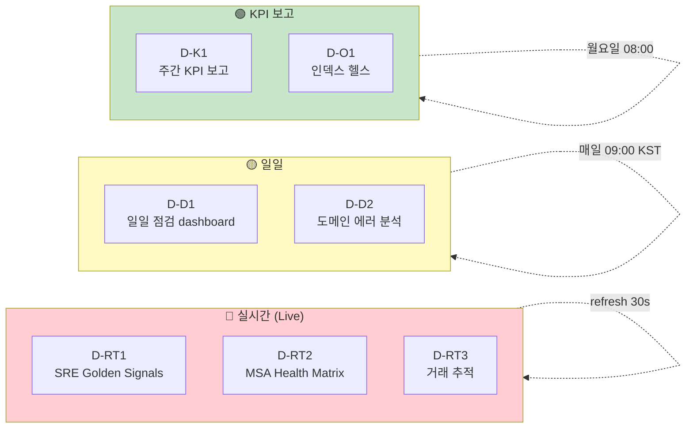

| Dashboard | 청중 | 새로고침 | 주요 패널 |
|-----------|----|----|----|
| **D-RT1** SRE Golden Signals | SRE on-call | 30s | M-S1, S2, S3, S4 + alert status |
| **D-RT2** MSA Health Matrix | SRE/플랫폼 | 30s | 11 MSA × {availability, p95, tps, error} |
| **D-RT3** 거래 추적 | SRE/도메인 | 30s | M-P2, P3, in/out chart, top stuck trace |
| **D-D1** 일일 점검 | 매일 아침 / 운영 리더 | 1h | M-D1, M-O3/O4, M-P5/P6, S1 어제 |
| **D-D2** 도메인 에러 분석 | 도메인 리드, 개발 | drill-down | M-D1, D2, D4, error funnel |
| **D-K1** 주간 KPI | PM/매니저 | 1d | SLO, 트렌드, DAU, error budget |
| **D-O1** 인덱스 헬스 | 플랫폼/DBA | 5m | M-X1, X2, ingestion lag, shard size |

---

### 5.1 D-RT1 — SRE Golden Signals (실시간)

**용도**: on-call 이 매 시간 한 번 슬쩍 보면 정상 여부 1초 안에 판단.

```
┌─ 🕒 Last 1 hour (자동 30s refresh) ─────────────────────────────────┐
│ 🔎 [filter: env=prod] 🔔 [active alerts: 0]                        │
├──────────────────────────────────────────────────────────────────────┤
│ ┌────────┬────────┬────────┬────────┐                                │
│ │ M-S1   │ M-S3   │ M-S4   │ M-S2   │  ← KPI 4 (큰 metric, 색상)      │
│ │가용 99.97│에러 0.03%│p95 412ms│TPS 1.18K│                                │
│ │  🟢    │  🟢    │  🟢    │  🟢    │                                │
│ └────────┴────────┴────────┴────────┘                                │
├──────────────────────────────────────────────────────────────────────┤
│ ┌─────────────────────────┐ ┌──────────────────────────────────────┐ │
│ │ 📈 Availability % trend │ │ 📊 TPS by MSA (stacked)              │ │
│ │ (Lens line, 1h)        │ │ (Lens area, 1h, breakdown=service)   │ │
│ └─────────────────────────┘ └──────────────────────────────────────┘ │
├──────────────────────────────────────────────────────────────────────┤
│ ┌──────────────────────┐ ┌─────────────────────────────────────────┐ │
│ │ ⏱️ Latency p50/p95/p99│ │ 📋 활성 알림 (P0/P1)                     │ │
│ │ (line, 1h)           │ │ (Alerts table, status=active)           │ │
│ └──────────────────────┘ └─────────────────────────────────────────┘ │
└──────────────────────────────────────────────────────────────────────┘
```

#### Lens 패널 정의 (KPI 1 — Availability)

```
Type:           Metric
KQL filter:     log_type : "out"
Primary metric: Formula
  count(kql='is_error:false') / count()
Format:         Percent (decimal 2)
Conditional color:
  >= 99.9%   green
  99.0~99.9  amber
  < 99.0     red
Show trend line: 1h moving (compare to 1h ago)
```

#### Refresh 자동화

상단 Refresh every → **30 seconds**. (30s 미만은 부담)

---

### 5.2 D-RT2 — MSA Health Matrix (실시간)

**용도**: 11 MSA 의 4 KPI 를 한 화면에. heatmap-grid 형태.

```
┌─ MSA Health Matrix — 11 services × 4 KPI ──────────────────────────────────┐
│                                                                             │
│  ┌─────────────────┬──────────┬──────────┬──────────┬──────────┐           │
│  │ MSA             │ Availab. │ p95 (ms) │ TPS      │ Errors/m │           │
│  ├─────────────────┼──────────┼──────────┼──────────┼──────────┤           │
│  │ payment-svc     │ 🟢 99.99 │ 🟢 380   │ 280      │ 🟢 1     │           │
│  │ user-svc        │ 🟢 99.95 │ 🟡 720   │ 410      │ 🟢 5     │           │
│  │ account-svc     │ 🟢 99.98 │ 🟢 290   │ 320      │ 🟢 2     │           │
│  │ card-svc        │ 🔴 99.20 │ 🔴 1850  │ 95       │ 🔴 47    │ ← 주목   │
│  │ ⋯ (11개)        │          │          │          │          │           │
│  └─────────────────┴──────────┴──────────┴──────────┴──────────┘           │
│                                                                             │
│  📊 시간별 MSA 부하 분포 (heatmap)                                            │
│  ┌─────────────────────────────────────────────────────────────────┐       │
│  │ 11 MSA × 24 hours, color = error count                          │       │
│  └─────────────────────────────────────────────────────────────────┘       │
└─────────────────────────────────────────────────────────────────────────────┘
```

#### Lens 구현 — 핵심 패널

**Table** chart:
```
Rows:        service_name (Top 11)
Metrics:
  - Availability: 1 - count(is_error:true) / count()
  - p95:          percentile(elapsed_ms, 95)  filter log_type:"out"
  - TPS:          count() / window_seconds
  - Errors/min:   count(is_error:true) / window_minutes
Conditional color: 각 컬럼별 임계
```

#### Drill-down 패턴

특정 행 클릭 → "View in Discover" 또는 D-D2 dashboard 로 jump (dashboard drilldown).

---

### 5.3 D-RT3 — 거래 추적 (실시간)

**용도**: in/out 불일치 / 행(hang) / stuck request 즉시 발견.

```
┌─ 거래 추적 ─────────────────────────────────────────────────────────────┐
│                                                                         │
│ ┌───────────────────────────────────┐ ┌───────────────────────────────┐ │
│ │ 📊 In vs Out 카운트 trend (15min) │ │ ⚠️ In/Out Imbalance API top 10│ │
│ │ 두 라인이 일치해야 정상            │ │ (M-P2)                          │ │
│ └───────────────────────────────────┘ └───────────────────────────────┘ │
├─────────────────────────────────────────────────────────────────────────┤
│ ┌─────────────────────────────────────────────────────────────────────┐ │
│ │ 📋 Stuck Requests (in 만 있고 10분 내 out 없는 trace_id)             │ │
│ │ trace_id | service | api_path | started_at | wait_time              │ │
│ └─────────────────────────────────────────────────────────────────────┘ │
└─────────────────────────────────────────────────────────────────────────┘
```

#### Stuck Requests 쿼리 (transform 또는 application)

직접 쿼리는 ES 의 anti-join 한계로 어려움. 권장 패턴:
1. **Transform** 으로 매 5분 trace_id 별 in/out flag 집계
2. `out_ts == null AND in_ts < now-10m` 조건으로 stuck 인덱스에 적재
3. Dashboard 가 stuck 인덱스를 가리킴

또는 application 측에서 timeout 감지 시 별도 로그.

---

### 5.4 D-D1 — 일일 점검 dashboard (매일 아침)

**용도**: 운영 리더가 매일 9시에 한 화면. 회의 전 상태 파악.

```
┌─ 일일 점검 — 어제 (Last 24h) ────────────────────────────────────────────┐
│ 🕒 Yesterday (00:00 ~ 23:59 KST)                                         │
├──────────────────────────────────────────────────────────────────────────┤
│ ┌──────┬──────┬──────┬──────┐                                             │
│ │SLO달성│ 총트래픽│ 에러건수│MTT R│  ← 어제 핵심 KPI 4                     │
│ │ 99.97%│ 100M   │ 30K  │ 12분 │                                          │
│ └──────┴──────┴──────┴──────┘                                             │
├──────────────────────────────────────────────────────────────────────────┤
│ ┌────────────────────────┐ ┌─────────────────────────────────────────┐   │
│ │ 📊 Top 10 에러 코드 (M-D1)│ │📊 Top 10 트래픽 API (M-P5)              │   │
│ └────────────────────────┘ └─────────────────────────────────────────┘   │
├──────────────────────────────────────────────────────────────────────────┤
│ ┌───────────────────┐ ┌───────────────────┐ ┌───────────────────────┐    │
│ │ 💀 Dead API (M-O3) │ │ 👻 Shadow (M-O4)   │ │ 🆕 New Error Code     │   │
│ │ 12개               │ │ 3개                │ │ (M-D2)                │   │
│ └───────────────────┘ └───────────────────┘ └───────────────────────┘    │
├──────────────────────────────────────────────────────────────────────────┤
│ ┌──────────────────────────────────────────────────────────────────────┐ │
│ │ 📊 MSA 별 어제 Availability + 에러 분포 (heatmap)                    │ │
│ └──────────────────────────────────────────────────────────────────────┘ │
└──────────────────────────────────────────────────────────────────────────┘
```

#### "Yesterday" 상대 시간

Lens / 패널 시간 옵션에 **`now-1d/d` ~ `now/d`** 표기. 자정 기준 (KST 기준 timezone 필요 — `time_zone: "Asia/Seoul"`).

---

### 5.5 D-D2 — 도메인 에러 분석 (drill-down)

**용도**: 알람 / D-D1 의 에러가 발견되면 여기로 점프 → 깊은 진단.

```
┌─ 도메인 에러 분석 ────────────────────────────────────────────────────┐
│ 🕒 [Last 4h ▼]  🔎 [filter: error_code 또는 api 또는 MSA]              │
├──────────────────────────────────────────────────────────────────────┤
│ ┌─────────────────────────┐ ┌──────────────────────────────────────┐ │
│ │ 📊 Top Error Codes      │ │ 📊 MSA별 에러 분포 (M-D4 stacked)     │ │
│ │ 빈도 + 메시지 (M-D1)    │ │                                       │ │
│ └─────────────────────────┘ └──────────────────────────────────────┘ │
├──────────────────────────────────────────────────────────────────────┤
│ ┌─────────────────────────┐ ┌──────────────────────────────────────┐ │
│ │ 📈 에러 spike trend     │ │ 📋 최근 100 에러 (saved search)       │ │
│ │ (M-S3 last 4h)          │ │ trace_id, ts, service, api, code, msg│ │
│ └─────────────────────────┘ └──────────────────────────────────────┘ │
└──────────────────────────────────────────────────────────────────────┘
```

#### Drill-down chain

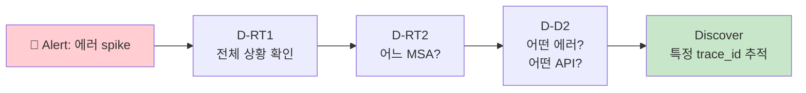

---

### 5.6 D-K1 — 주간 KPI 보고

**용도**: 매주 월요일 회의 자료 그대로.

```
┌─ 주간 KPI ─ Last 7 days ───────────────────────────────────────────┐
│                                                                    │
│ ┌──────────┬──────────┬──────────┬──────────┐                      │
│ │ 주간 SLO │ p95 trend │ 총 거래 │ DAU 추정 │  ← 4 KPI              │
│ │ 99.96%   │ 412→398   │ 700M    │ 2.1M     │                      │
│ │  🟢 달성 │  ↓ 좋음   │  ↑ 5%   │  ↑ 3%    │                      │
│ └──────────┴──────────┴──────────┴──────────┘                      │
├────────────────────────────────────────────────────────────────────┤
│ ┌─────────────────────────────────┐ ┌────────────────────────────┐ │
│ │ 📈 가용성 (이번주 vs 지난주)      │ │ 💰 Error Budget burn rate  │ │
│ │ (Lens timeshift)                │ │ 남은 budget: 67%            │ │
│ └─────────────────────────────────┘ └────────────────────────────┘ │
├────────────────────────────────────────────────────────────────────┤
│ ┌────────────────────────┐ ┌──────────────────────────────────────┐│
│ │📊 요일별 트래픽 (M-O2)  │ │📊 일자별 에러 추세                    ││
│ └────────────────────────┘ └──────────────────────────────────────┘│
└────────────────────────────────────────────────────────────────────┘
```

#### Error Budget 계산

```
SLO 99.9% → 한 달 허용 실패 0.1% × 30B docs = 30M 실패 허용
이번주 누적 실패 = 10M
남은 budget = (30M - 10M) / 30M = 67%
```

Lens metric 으로 표시 + Conditional formatting (남은 < 30% → 빨강 → 신규 배포 동결).

---

### 5.7 D-O1 — 인덱스 헬스 (플랫폼)

**용도**: 플랫폼팀이 ES 자체의 건강 상태 점검.

```
┌─ 인덱스 헬스 ─────────────────────────────────────────────────────┐
│                                                                   │
│ ┌──────┬──────┬──────┬──────┐                                    │
│ │ Lag  │ shard│ size │indexs│  ← M-X1, X2                          │
│ │ 2.3s │ 24   │ 380GB│  90  │                                    │
│ └──────┴──────┴──────┴──────┘                                    │
├───────────────────────────────────────────────────────────────────┤
│ ┌──────────────────────────────────────────────────────────────┐ │
│ │ 📈 Ingestion lag trend (M-X1)                                  │ │
│ │ Lens: now() - max(@timestamp), 5m bucket                       │ │
│ └──────────────────────────────────────────────────────────────┘ │
├───────────────────────────────────────────────────────────────────┤
│ ┌──────────────────────────────────────────────────────────────┐ │
│ │ 📋 Top 10 인덱스 (M-X2) — size, docs, shards                   │ │
│ │ GET _cat/indices?bytes=b&format=json 결과 시각화                │ │
│ └──────────────────────────────────────────────────────────────┘ │
└───────────────────────────────────────────────────────────────────┘
```

#### M-X1 Ingestion Lag 구현

`ingest_time` 필드를 application 측에서 추가 적재해야 측정 가능. 또는 **Logstash event timestamp** 와 ES `@timestamp` 차이 비교. 둘 다 어려우면 last-doc 시간 기반 SLO:

```
GET api-logs-*/_search
{
  "size": 0,
  "aggs": { "max_ts": { "max": { "field": "@timestamp" } } }
}
```

`now() - max_ts` 가 5분 넘어가면 alert.

---

## 6. Alerting 룰 — P0 / P1 / Digest

### 6.1 우선순위 정의

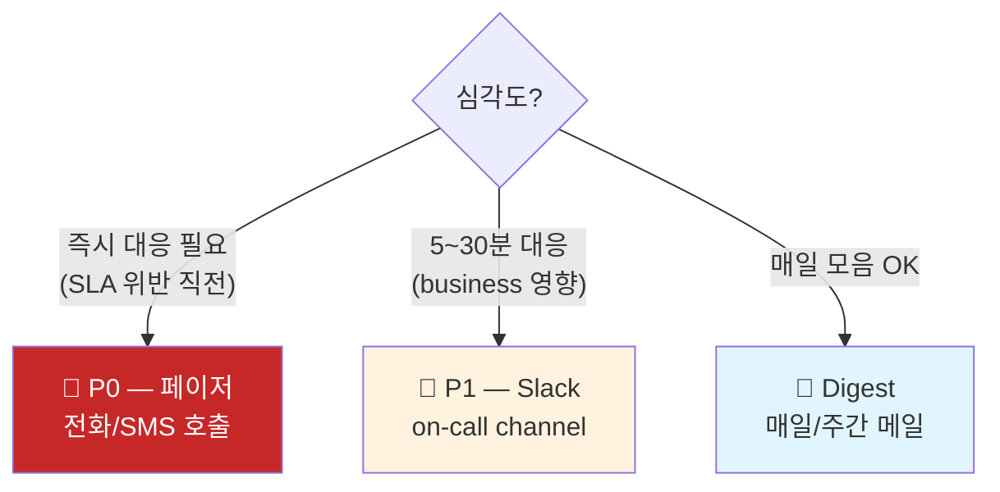

### 6.2 P0 — 즉시 호출 (페이저)

| 룰 | 조건 | 임계 |
|---|---|---|
| **R-P0-1** 전체 가용성 폭락 | M-S1 | < 99.0% in last 5min |
| **R-P0-2** Error Rate spike | M-S3 | > 5% in last 5min |
| **R-P0-3** Latency 폭증 | M-S4 (p95) | > 5초 in last 5min |
| **R-P0-4** MSA 완전 단절 | TPS by MSA | = 0 for any MSA in last 10min (정상 시간대) |
| **R-P0-5** Ingestion lag 심각 | M-X1 | > 10분 (로그 손실 위험) |

#### R-P0-1 Kibana 룰 정의

```
Rule type:    Elasticsearch query
Index:        api-logs-*
Time field:   @timestamp
Query (DSL):
  {
    "bool": {
      "filter": [
        { "term": { "log_type": "out" } }
      ]
    }
  }

Condition:
  WHEN  count of is_error:true / count of all
  IS ABOVE 0.01    (= 1%)
  FOR THE LAST 5 minutes
  Check every 1 minute

Action:
  Connector: PagerDuty / Webhook
  Severity: critical
  Body: |
    🚨 P0 — 가용성 폭락
    - 시각: {{date}}
    - 가용성: {{context.value}}
    - Dashboard: https://kibana/.../D-RT1
    - Runbook: https://wiki/runbooks/availability-drop
```

📌 **Runbook 링크 필수** — on-call 이 새벽에 깨도 무엇을 할지.

### 6.3 P1 — Slack 채널

| 룰 | 조건 | 임계 |
|---|---|---|
| **R-P1-1** Critical API 에러 spike | M-D3 (결제/인증 등) | > 10건 in 5min |
| **R-P1-2** 신규 에러 코드 등장 | M-D2 | unique error_code 어제까지 없던 것 |
| **R-P1-3** Stuck Requests 누적 | M-P3 | > 100 |
| **R-P1-4** In/Out Imbalance | M-P2 | any API 5% 이상 imbalance |
| **R-P1-5** 단일 MSA error spike | M-P1 | 단일 MSA error rate >2% |
| **R-P1-6** Latency 회귀 | M-S4 | p95 increase >50% vs last hour |

#### R-P1-2 New Error Code Detection

ES 단독으로 어려움. 권장 구현:
1. 매시간 transform 으로 "지난 7일 unique error_code" 인덱스 (`error-code-history`) 갱신
2. 룰: 현재 1시간 unique error_code 중 history 에 없는 것이 있으면 트리거
3. 또는 application 단에서 Slack webhook 호출

또는 **간이 룰**: `error_code : *` 에 `cardinality` 가 평소 대비 +1 이상 → 알림.

### 6.4 Digest — 매일/주간 메일

매일 09:00 KST 자동 발송:

```
[Subject] 일일 운영 점검 — 2026-04-26

📊 어제 KPI
  - 가용성:    99.97% (목표 99.9% 🟢)
  - p95:       412ms  (어제 대비 +5ms)
  - 총 거래:   100M
  - 활성 MSA: 11/11

🔴 주의 필요
  - card-service 에러율 0.8% (평소 0.1%)
  - Dead API 신규 3건: /api/v1/legacy/old-endpoint, ...
  - Shadow API 1건: /api/v1/admin/internal/...
  - 신규 에러 코드 2건: P999, U888

📈 트렌드
  - 7일 평균 가용성: 99.96% (선주 99.94%, 개선)
  - Error budget 잔여: 73%

🔗 상세: https://kibana/.../D-D1
```

#### 자동 발송 구현

- **Watcher** (라이선스 필요) 또는
- **Reporting plugin** (Pages / 이메일 자동 발송)
- **외부 cron + Reporting API** 호출

### 6.5 Alert fatigue 방지 원칙

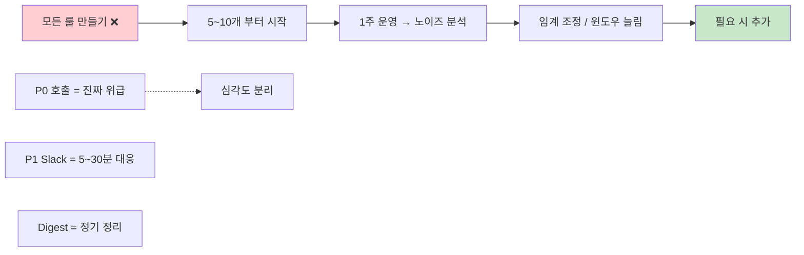

원칙:
- **P0 는 SLO 위반 직전만** — 자주 울리면 무시당함
- **Cool-down** — 같은 룰 30분 내 재트리거 안 함
- **자동 closure** — 조건 해제 시 자동 resolved
- **runbook** 매 룰에 첨부

---

## 6.6 ILM 정책 — 데이터 보존 + 비용

1억 docs/일 × 90일 = 90억 docs → ILM 으로 자동 라이프사이클 관리 필수.

```json
PUT _ilm/policy/api-logs-policy
{
  "policy": {
    "phases": {
      "hot": {
        "min_age": "0ms",
        "actions": {
          "set_priority": { "priority": 100 },
          "rollover": {
            "max_age": "1d",
            "max_primary_shard_size": "50gb"
          }
        }
      },
      "warm": {
        "min_age": "7d",
        "actions": {
          "set_priority": { "priority": 50 },
          "shrink": { "number_of_shards": 1 },
          "forcemerge": { "max_num_segments": 1 },
          "allocate": { "include": { "data": "warm" } }
        }
      },
      "cold": {
        "min_age": "30d",
        "actions": {
          "set_priority": { "priority": 0 },
          "allocate": { "include": { "data": "cold" } }
        }
      },
      "delete": {
        "min_age": "90d",
        "actions": { "delete": {} }
      }
    }
  }
}
```

| Phase | 기간 | 용도 | 데이터 위치 |
|-------|----|----|-----|
| **HOT**  | 0~7일  | 활발 read+write (실시간 dashboard, 에러 진단) | SSD, 빠른 노드 |
| **WARM** | 7~30일 | 읽기 위주 (D-K1 주간 KPI, 회귀 분석) | shrink + merge, 보통 노드 |
| **COLD** | 30~90일 | 가끔 조회 (월간 보고, 사후 분석) | 저비용 노드 / searchable snapshot |
| **DELETE** | 90일+ | 자동 삭제 | (압축 보관 정책 따라) |

> **transform 인덱스는 별도 정책** — 사전 집계니 1년+ 보존 가능 (저장 비용 매우 적음).

## 6.7 Kibana Spaces — 권한 분리

11 MSA + 다양한 청중 (SRE / 개발 / PM / DBA) → Kibana Space 로 시야 분리.

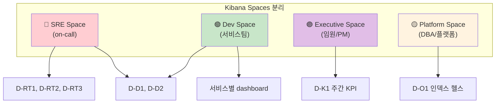

| Space | 청중 | 보이는 dashboard | 추가 권한 |
|-------|----|----|----|
| **SRE** | on-call, SRE 리드 | D-RT1, D-RT2, D-RT3, D-D1, D-D2 | Alert 관리, runbook 편집 |
| **Dev (per service)** | 각 서비스 팀 | 본인 서비스 dashboard, D-D2 | 본인 서비스 인덱스 한정 |
| **Executive** | 임원, PM | D-K1 만 | read-only |
| **Platform** | DBA, ES 운영자 | D-O1 + Stack Management | 인덱스/transform/ILM 관리 |

설정: Stack Management → Spaces → Create. 각 space 의 features 토글로 보이는 메뉴 제한 가능.

## 7. 운영 절차

### 7.1 Daily — 운영자 09:00 루틴

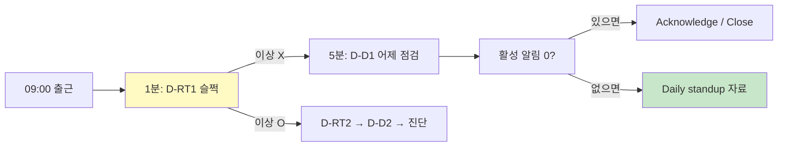

### 7.2 Weekly — 매주 월요일

- D-K1 dashboard 한 화면 캡처 → 매니저 보고
- Error budget burn rate 검토
- Top 5 painPoint API 우선순위 회의
- 룰 임계 조정 (false-positive 분석)

### 7.3 Monthly — 월말/월초

- SLO/SLA 보고서 작성
- Capacity 예측 (인덱스 size 증가율 → ES heap/disk 증설 검토)
- Error budget reset
- Dashboard 정비 (사용 안 하는 패널 제거)

---

## 8. 폐쇄망 적용 시 추가 고려

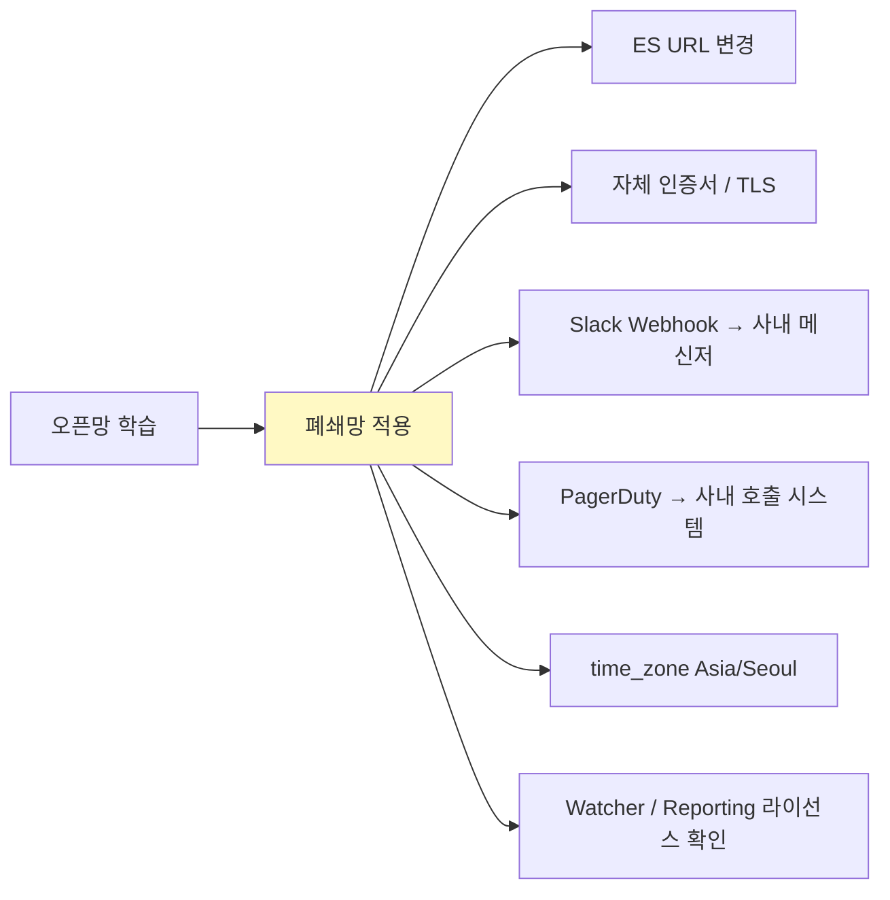

| 항목 | 변경 |
|---|---|
| ES URL | 사내 endpoint |
| 인증 | Basic / API Key / OIDC |
| Slack Webhook | 사내 메신저 / 카톡 봇 |
| PagerDuty | 사내 호출 시스템 (예: 직접 SMS 게이트웨이) |
| Reporting 자동 메일 | SMTP 사내 메일 서버 |
| 라이선스 | Watcher (Gold+) / Anomaly (Platinum) 활성 여부 확인 |
| 사용자 권한 | spaces 분리, role 별 dashboard 제한 |

---

## 9. ✅ 단계별 체크리스트

### Phase 1 (Day 1~7) — 기반
- [ ] Data view 생성 (api-logs-*)
- [ ] D-RT1 (Golden Signals) dashboard 1개 완성
- [ ] R-P0-1 (가용성), R-P0-2 (에러율) 룰 활성
- [ ] Slack/메신저 connector 1개

### Phase 2 (Week 2) — MSA 분리
- [ ] D-RT2 (MSA Health Matrix)
- [ ] D-D1 (일일 점검)
- [ ] R-P1-1 (Critical API spike), R-P1-3 (Stuck) 룰

### Phase 3 (Week 3~4) — 도메인 깊이
- [ ] D-D2 (도메인 에러 분석)
- [ ] M-D2 (신규 에러 코드 감지) — transform / application
- [ ] R-P1-2 (New error code) 룰

### Phase 4 (Month 2) — 운영 자동화
- [ ] D-K1 (주간 KPI)
- [ ] D-O1 (인덱스 헬스)
- [ ] Digest 메일 자동화
- [ ] Latency 측정 정합화 (elapsed_ms 적재 또는 transform)

### 지속 운영
- [ ] 매주 룰 임계 조정 (false-positive 분석)
- [ ] 매월 SLO 보고
- [ ] 분기 dashboard 정비
- [ ] 분기 capacity 예측

---

## 10. 25 지표 한 페이지 요약

```
══ SRE Golden Signals (5) ══
M-S1  Availability               1 - errors/total  (실시간 + 일일 + 주간)
M-S2  Throughput / TPS           count / time       (실시간)
M-S3  Error Rate                 errors/total       (실시간)
M-S4  Latency p50/p95/p99       elapsed_ms perc    (실시간)
M-S5  Saturation                 host CPU/mem (별도) (실시간)

══ 백엔드 / 플랫폼 (7) ══
M-P1  MSA Health Matrix          11 MSA × 4 KPI    (실시간)
M-P2  In/Out Imbalance           |in - out| / api  (실시간)
M-P3  Stuck Requests             in only, no out   (실시간)
M-P4  Inter-Service Latency      A→B trace_id chain (일일)
M-P5  Top API by Traffic         count by api      (일일)
M-P6  Error Bursting API         spike score       (실시간)
M-P7  Index Ingestion Lag        now - max ts      (실시간)

══ 도메인 / 비즈니스 (7) ══
M-D1  Top Error Codes            code 빈도         (일일)
M-D2  New Error Code Detection   yesterday-vs-today (일일)
M-D3  Critical API Error Rate    결제/인증 에러     (실시간)
M-D4  Error Code by MSA          msa × code grid   (일일)
M-D5  거래 성공률                 정상/시도          (주간)
M-D6  고유 거래 수 (DAU)          cardinality(trace) (주간/월간)
M-D7  Funnel Drop-off            단계별 dropout    (주간)

══ 운영 / Capacity (4) ══
M-O1  Time-of-Day Pattern        hour heatmap      (주간)
M-O2  Day-of-Week                요일별            (주간)
M-O3  Dead API                   호출 0 24h        (일일)
M-O4  Shadow API                 swagger 미선언    (일일)

══ Operational Excellence (2) ══
M-X1  Logging Pipeline Lag       Kafka → ES        (실시간)
M-X2  Index Storage Health       size, shards      (일일/주간)
```

---

## ❓ Self-check

1. **Q.** 25 지표 중 가장 먼저 셋업해야 할 5개는?
   <details><summary>A</summary>M-S1 (가용성), M-S3 (에러율), M-S4 (latency p95), M-P1 (MSA matrix), M-D3 (critical API). SRE golden signals + 비즈니스 영향 가장 큰 critical API.</details>

2. **Q.** P0 와 P1 의 본질 차이는?
   <details><summary>A</summary>P0 = SLA 위반 직전 / 새벽 깨워야 하는 수준 / 고객 영향 즉시. P1 = 업무 시간 내 대응으로 충분 / 영향 제한적. 잘못 분류하면 alert fatigue 또는 사고 누락.</details>

3. **Q.** "1억 docs/일" 환경에서 dashboard query 가 느릴 때 가장 먼저 시도?
   <details><summary>A</summary>(1) 시간 범위 좁히기 (Last 24h → Last 1h), (2) Transform 으로 사전 집계 인덱스 만들고 dashboard 가 거기를 가리키게 (07-batch-transform 참고), (3) interval 굵게, (4) breakdown size 줄이기.</details>

4. **Q.** trace_id 매칭으로 latency 계산할 때의 한계?
   <details><summary>A</summary>(1) trace_id 가 일치하지 않거나 누락된 doc 은 매칭 실패, (2) ES 의 anti-join 부재로 stuck (in only) 직접 query 어려움 — transform 또는 별도 stuck 인덱스 필요, (3) 클라이언트 측에서 elapsed_ms 적재가 더 효율적.</details>

5. **Q.** Error Budget burn 을 dashboard 에 어떻게 표시?
   <details><summary>A</summary>SLO 정의 (예: 99.9%) 기준 한 달 허용 실패 N건 산출 → 누적 실패 / N 의 비율로 "남은 budget %" metric. < 30% 시 빨강 + 신규 배포 동결 정책 자동 안내.</details>

6. **Q.** Daily Digest 에 들어가면 좋은 항목 5개를 한 줄씩?
   <details><summary>A</summary>(1) 어제 가용성 / SLO 달성 여부, (2) 평소 대비 변화 큰 KPI, (3) 신규 에러 코드 / Dead API / Shadow API, (4) Top 3 painPoint, (5) Error Budget 잔여 + 다음 주 영향 예측.</details>

7. **Q.** D-RT2 (MSA Health Matrix) 가 다른 dashboard 와 다른 점?
   <details><summary>A</summary>D-RT1 은 전체 합 KPI, D-RT2 는 MSA 별 분리 매트릭스. 단일 MSA 가 죽어도 전체 평균이 정상으로 보이는 함정 방지. "어느 MSA 가 문제?" 질문에 즉답.</details>

---

## 11. 다음 액션

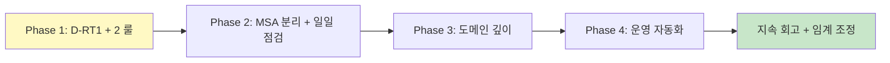

| 우선 작업 | 시간 |
|---|---|
| 1. Data view + D-RT1 | 1일 |
| 2. P0 룰 2개 (가용성, 에러율) + Slack/PagerDuty connector | 0.5일 |
| 3. D-RT2 + D-D1 | 1일 |
| 4. P1 룰 5개 | 1일 |
| 5. Latency 정합화 (elapsed_ms 적재 합의 + transform) | 1주 |
| 6. M-D2 신규 에러 코드 감지 transform | 0.5일 |
| 7. Digest 자동 메일 | 0.5일 |

**총 ~2주에 11 MSA / 1억 docs 환경의 production-grade 관측성 + 알림** 확보 가능.

---

## 다음 학습 / 참고
- 일일 통계 인덱스 자동화 → [07-batch-transform.md](07-batch-transform.md)
- payload unindexed 환경에서의 KPI 회복 → [08-card-platform-payload-strategy.md](08-card-platform-payload-strategy.md)
- 알람 룰 셋업 상세 → [04-alerts.md](04-alerts.md)

---

## 부록 A. Lens 패널 구체 정의 (Real-time Global Overview 핵심)

### Lens A1: RPS (Time Series)

```
Type:           Line / Area
Horizontal:     Date Histogram (@timestamp, 5m bucket, time_zone Asia/Seoul)
Vertical:       Unique count(trace_id) / 300    ← 5분 = 300초
Filter:         service_name : * (Control 로 동적)
Source:         transform-latency-5m (사전 집계 인덱스)
```

### Lens A2: Error Rate (%)

```
Type:           Line
Horizontal:     Date Histogram (@timestamp, 5m)
Vertical:       Formula:
                count(kql='is_error:true') / count()
                Format: Percent
Source:         transform-errors-5m
```

### Lens A3: P95 Latency

```
Type:           Line (multi-metric)
Horizontal:     Date Histogram (@timestamp, 5m)
Vertical:       Percentile(elapsed_ms, 95) / Median / Percentile 99
Filter:         log_type : "out"
Source:         transform-latency-5m  ← 매번 raw 1억 docs 안 봐도 됨
```

### Lens A4: 4xx vs 5xx Ratio (M-S6)

```
Type:           Donut 또는 Stacked area over time
Slice:          Filter ratio, 분류:
                - 4xx: error_code 가 "4xx*" 또는 http_status: [400 to 499]
                - 5xx: error_code 가 "5xx*" 또는 http_status: [500 to 599]
                - success: is_error: false
```

> 우리 환경에 `http_status` 필드가 없으면 application 측 수정 (filter 에서 추출) 또는 error_code prefix 약속 필요.

---

## 부록 B. Watcher / Alerting Rule Query 예시

### B1. Error Rate Threshold (P0)

```json
PUT _watcher/watch/error-rate-p0
{
  "trigger": { "schedule": { "interval": "1m" } },
  "input": {
    "search": {
      "request": {
        "indices": ["transform-errors-5m"],
        "body": {
          "size": 0,
          "query": { "range": { "ts": { "gte": "now-5m" } } },
          "aggs": {
            "agg_total":  { "sum": { "field": "total" } },
            "agg_errors": { "sum": { "field": "errors._count" } },
            "rate": {
              "bucket_script": {
                "buckets_path": { "ok": "agg_total", "err": "agg_errors" },
                "script": "params.err / Math.max(params.ok, 1)"
              }
            }
          }
        }
      }
    }
  },
  "condition": {
    "compare": { "ctx.payload.aggregations.rate.value": { "gt": 0.01 } }
  },
  "actions": {
    "notify-pagerduty": {
      "webhook": {
        "url": "https://events.pagerduty.com/v2/enqueue",
        "body": "{ \"severity\":\"critical\", \"summary\":\"Error rate {{ctx.payload.aggregations.rate.value}}\" }"
      }
    }
  }
}
```

### B2. Stuck Requests (P1)

```json
GET transform-errors-5m/_search
{
  "size": 0,
  "query": {
    "bool": {
      "filter": [
        { "range": { "ts": { "gte": "now-10m" } } }
      ]
    }
  },
  "aggs": {
    "stuck_total": {
      "sum": { "field": "stuck_count" }   ← Transform 에 stuck 필드 추가 시
    }
  }
}
```

> Stuck 정확 구현은 별도 transform 또는 application 단 (in 만 있고 timeout 후 out 없는 trace_id 카운트). raw 1억 docs anti-join 은 비효율.

---

## 부록 C. 통합 산출물 매트릭스 (한 페이지)

```
═══════════ 30 지표 × 7 Dashboard × Alert ═══════════

SRE Golden Signals (7)
  M-S1 Availability            → D-RT1, D-D1, D-K1  → R-P0-1
  M-S2 TPS/RPS                 → D-RT1, D-D1        → R-P0-2 (RPS drop)
  M-S3 Error Rate              → D-RT1, D-D2        → R-P0-2
  M-S4 Latency p50/p95/p99    → D-RT1, D-D1        → R-P0-3
  M-S5 Saturation              → D-RT1, D-O1        → (host metric)
  M-S6 4xx vs 5xx Ratio        → D-D2               → R-P1-7 (5xx >0.5%)
  M-S7 Slow Request Rate       → D-RT1, D-D2        → R-P1-8

플랫폼 (9)
  M-P1 MSA Health Matrix       → D-RT2              → R-P1-5
  M-P2 In/Out Imbalance        → D-RT3              → R-P1-4
  M-P3 Stuck Requests          → D-RT3              → R-P1-3
  M-P4 Inter-Service Latency   → D-D2               → -
  M-P5 Top API by Traffic      → D-D1               → -
  M-P6 Error Bursting API      → D-D2               → R-P1-1
  M-P7 Index Ingestion Lag     → D-O1               → R-P0-5
  M-P8 Outgoing Call Success   → D-RT2              → R-P1-9
  M-P9 Instance Error Rate     → D-RT2              → R-P1-10

도메인 (7)
  M-D1 Top Error Codes         → D-D1, D-D2         → R-P1-1 (Top1 spike)
  M-D2 New Error Code          → D-D1, D-D2         → R-P1-2
  M-D3 Critical API Error      → D-RT1, D-D2        → R-P0-2 (Critical)
  M-D4 Error by MSA            → D-D2               → -
  M-D5 거래 성공률              → D-K1               → digest
  M-D6 DAU 추정 (cardinality)  → D-K1               → -
  M-D7 Funnel Drop-off         → D-K1               → -

운영 (6)
  M-O1 Time-of-Day             → D-K1               → -
  M-O2 Day-of-Week             → D-K1               → -
  M-O3 Dead API                → D-D1               → digest
  M-O4 Shadow API              → D-D1               → digest
  M-O5 DoD/WoW Change          → D-K1               → R-P1-11 (>±40%)
  M-O6 Peak RPS                → D-K1               → -

Op-Excellence (2)
  M-X1 Logging Pipeline Lag    → D-O1               → R-P0-5
  M-X2 Index Storage Health    → D-O1               → R-P1-12 (size +20%)
```

→ 운영자가 "어느 dashboard 에서 어떤 지표를 보고 어떤 알람을 받는지" 한 페이지로 추적 가능.

---

## 부록 D. 8단계 셋업 — 2주 production-grade 관측성

### D.0 전체 Timeline

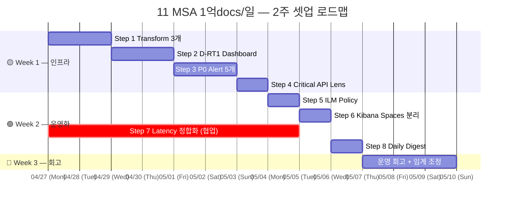

> 💡 **병렬 가능**: Step 7 (Latency 정합화) 은 application 팀 협업이라 별도 트랙. Step 1~6, 8 은 ES/Kibana 측 단독 작업. 동시 진행.

### D.1 Step 1 — Transform 3개 즉시 생성 (Day 1~2)

#### 목표
1억 docs/일의 raw 인덱스 위 dashboard query 가 30초+ 걸리는 것을 0.X초로 줄임. **가장 큰 효과**.

#### 사전 조건
- ES 8.x 클러스터 + write 권한
- `manage_ingest_pipelines`, `manage_transform`, `manage_index_templates` 클러스터 권한
- raw 인덱스 매핑에 `service_name`, `api_path`, `is_error`, `elapsed_ms`, `trace_id` keyword 형 확인

#### 절차

##### D.1.1 결과 인덱스 매핑 미리 박기 (Index Template)

```json
PUT _index_template/transform-monitoring-template
{
  "index_patterns": ["transform-latency-5m", "transform-errors-5m", "transform-api-1h"],
  "priority": 200,
  "template": {
    "settings": {
      "number_of_shards": 1,
      "number_of_replicas": 1,
      "index.lifecycle.name": "transform-stats-policy"
    },
    "mappings": {
      "properties": {
        "ts":             { "type": "date" },
        "service_name":   { "type": "keyword" },
        "api_path":       { "type": "keyword" },
        "instance_id":    { "type": "keyword" },
        "error_code":     { "type": "keyword" },
        "calls":          { "type": "long" },
        "errors":         { "type": "long" },
        "rate":           { "type": "float" },
        "p50":            { "type": "float" },
        "p95":            { "type": "float" },
        "p99":            { "type": "float" },
        "unique_traces":  { "type": "long" }
      }
    }
  }
}
```

##### D.1.2 Transform 3개 등록

[§3.6](#36-transform-사전-집계--구체-정의-3개) 의 JSON 그대로 PUT.

##### D.1.3 시작 + 즉시 검증

```
POST _transform/latency-5m/_start
POST _transform/errors-5m/_start
POST _transform/api-1h/_start

# 30초 후 확인
GET _transform/latency-5m/_stats
```

응답 `state: "started"`, `pages_processed > 0`, `documents_indexed > 0` 면 정상.

##### D.1.4 사이트 query 재라우팅

기존 dashboard 의 data view 가 `api-logs-*` 를 가리켰다면, 일부 패널을 `transform-*` 로 변경. 방법:
- 새 Data view `transform-monitoring` (패턴: `transform-*`) 생성
- D-RT1 의 latency / error rate 패널 우상단 ⋮ → Edit → data view 교체

#### 검증

- ✅ `transform-latency-5m` 인덱스에 5분 후 docs 적재
- ✅ 같은 dashboard 의 latency 차트 응답 30초 → 0.5초 확인
- ✅ `_transform/_stats` 의 `health: green`

#### 시간 / 함정

- 소요: **2일** (1일 등록 + 1일 검증)
- 함정 1: source 매핑이 dynamic 이라 elapsed_ms 가 text 면 percentile 실패 → keyword/long 으로 매핑 명시
- 함정 2: continuous mode 는 `sync.delay` 가 너무 짧으면 late-arriving doc 누락 → 60s 권장
- 함정 3: cardinality 큰 group_by (예: trace_id) 직접 group → ES heap 부담. 5분 bucket × service × api 정도가 안전

---

### D.2 Step 2 — D-RT1 Real-time Global Overview (Day 3~4)

#### 목표
on-call 이 매 시간 한 번 슬쩍 보면 정상 여부 1초 안에 판단할 수 있는 dashboard.

#### 사전 조건
- Step 1 의 Transform 3개 active
- Data view `transform-monitoring` 생성됨

#### 절차

##### D.2.1 KPI 패널 4개

≡ → Analytics → Dashboard → Create dashboard → Add new visualization → Lens.

각 KPI 별로:

**KPI 1 — Availability**
```
Type:           Metric
Data view:      transform-errors-5m
Primary metric: Formula
  1 - (sum(errors) / sum(calls))
Format:         Percent (decimals: 3)
Conditional formatting:
  >= 0.999: green
  0.99~0.999: amber
  < 0.99: red
Title: "🟢 Availability"
```

**KPI 2 — Error Rate**: 위와 비슷, formula 가 `sum(errors) / sum(calls)`. 임계 반대로 (낮을수록 좋음).

**KPI 3 — p95 Latency**: data view `transform-latency-5m`, metric `avg(p95)` (5분 bucket 의 p95 평균).

**KPI 4 — TPS**: `sum(calls) / 300` (5분=300초).

##### D.2.2 Trend 패널 3개

- **Availability % trend**: Line chart, X=ts, Y=Formula, 1h window
- **TPS by MSA**: Stacked area, X=ts, Y=sum(calls)/300, breakdown=service_name
- **Latency trend**: Line, multi-metric (p50/p95/p99)

##### D.2.3 Active Alerts 패널

Lens Markdown 또는 Alerts dashboard panel embed. 활성 알람 0 / 1 / 2 카운트 + 링크.

##### D.2.4 Refresh 자동화

상단 **Refresh every 30 seconds**.

##### D.2.5 저장

이름 `D-RT1 SRE Golden Signals`, description "on-call 1차 확인용".

#### 검증

- ✅ http://kibana/.../D-RT1 200 응답
- ✅ KPI 4 모두 숫자 표시 (NaN 없음)
- ✅ 30초마다 시간 인디케이터 갱신

#### 시간 / 함정

- 소요: **2일**
- 함정 1: 임계 conditional 색상이 percent 단위 아닌 0~1 단위일 수 있음 → 매번 미리보기로 확인
- 함정 2: Live (30s refresh) 시 패널 8개 넘으면 ES 부담 → 본 D-RT1 은 4 KPI + 3 trend = 7로 제한
- 함정 3: 시간 피커 default 가 전체 dashboard 에 적용 — `Last 1 hour` 가 가장 자연스러움

---

### D.3 Step 3 — P0 Alerting Rule 5개 등록 (Day 5~6)

#### 목표
SRE 가 **새벽에 깨야 하는 진짜 위급** 5가지를 자동 감지·알림.

#### 사전 조건
- D-RT1 active (사람이 볼 수 있는 곳)
- Slack / PagerDuty / Email connector 1개 이상 등록
- Runbook URL 4개 이상 (각 룰별)

#### 절차

##### D.3.1 Connector 등록

≡ → Stack Management → **Connectors** → Create.

```
Type: Slack (Webhook URL) 또는 PagerDuty (Routing key)
이름: oncall-primary
테스트 메시지 발송 → 도착 확인
```

##### D.3.2 P0 룰 5개 — 본 09 문서 §6.2 정의 기반

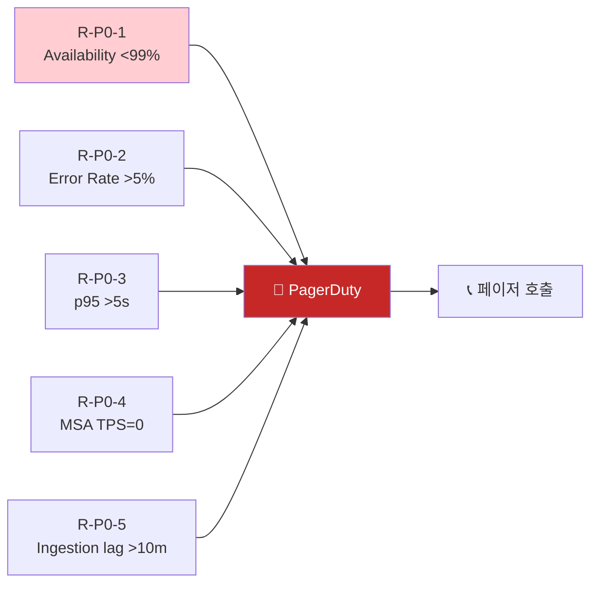

각 룰의 단계:

1. ≡ → Observability → Alerts → **Manage rules** → Create rule
2. Rule type: **Elasticsearch query**
3. Index: `transform-errors-5m` (Step 1 결과)
4. Time field: `ts`
5. Query (예시 — R-P0-1):
   ```
   { "query": { "match_all": {} } }
   ```
6. Condition (Lens-style): **Custom Query Threshold**
   - WHEN: count
   - IS ABOVE: 0  (그냥 데이터 있는지 확인용 base)
   - 또는 metric aggregation 으로 직접 정의

> 💡 **고급**: Threshold rule 로 표현 어려우면 **Watcher** 사용. Q-04 또는 [부록 B](#부록-b-watcher--alerting-rule-query-예시) 의 JSON 참고.

##### D.3.3 각 룰의 Action 템플릿

```yaml
PagerDuty:
  Severity: critical
  Summary: |
    🚨 [{{rule.name}}]
    Service: {{context.alerts.[0].service_name}}
    Value: {{context.value}}
    Time: {{date}}
  Custom details:
    runbook: https://wiki.example.com/runbooks/{{rule.id}}
    dashboard: https://kibana/.../D-RT1
```

##### D.3.4 Runbook 작성

각 룰별로 1페이지 runbook:
- 첫 5분: 무엇을 확인 (D-RT1, D-RT2, D-D2 순서)
- 가능한 원인 3가지
- 즉각 대응 (예: 긴급 rollback, traffic 차단)
- escalation (1시간 미해결 시)

#### 검증

- ✅ 일부러 임계 낮춰서 강제 트리거 → PagerDuty 알람 도착
- ✅ Runbook URL 클릭 → 도착 (404 없음)
- ✅ 임계 복원 → "resolved" 알림도 자동 도착

#### 시간 / 함정

- 소요: **2일** (룰 등록 0.5일 + 테스트/runbook 1.5일)
- 함정 1: false-positive 시 alert fatigue → 1주 운영 후 임계 조정
- 함정 2: cooldown 없으면 같은 사고에 50번 알람 → throttling 5min 설정
- 함정 3: PagerDuty escalation chain 미설정 → on-call 부재 시 다른 사람 미호출 위험

---

### D.4 Step 4 — Critical API 전용 Lens 추가 (Day 7)

#### 목표
**결제, 인증, 이체 같은 비즈니스 핵심 API** 는 일반 KPI 와 별도로 전용 panel 로 강조.

#### 정의 — Critical API 분류
사내 합의 필요. 예시:
- Tier 0 (즉시 영향): `/api/v1/payments/charge`, `/api/v1/users/auth`, `/api/v1/accounts/transfer`
- Tier 1 (영업 영향): `/api/v1/cards/issue`, `/api/v1/payments/refund`
- Tier 2 (운영 영향): 그 외

#### 절차

##### D.4.1 Critical API filter 정의

```json
{
  "terms": {
    "api_path": [
      "/api/v1/payments/charge",
      "/api/v1/users/auth",
      "/api/v1/accounts/transfer"
    ]
  }
}
```

##### D.4.2 D-RT1 에 Critical API 패널 추가

```
패널: Critical API 의 Availability + Error Rate (별도 Tier 0)
Type: Lens Metric
Filter: api_path : ("/api/v1/payments/charge" or "/api/v1/users/auth" or "/api/v1/accounts/transfer")
```

##### D.4.3 Critical API 전용 Alert (R-P0-2 강화)

```
Critical API error rate > 1% (5min window)
→ Severity: critical
→ Action: PagerDuty + Slack #ops + 도메인 리드 직접 호출
```

#### 시간 / 함정
- 소요: **1일**
- 함정 1: Tier 0 정의가 자주 변함 → saved query `critical-api-tier0` 로 모든 룰/dashboard 가 reference
- 함정 2: Tier 0 만 보고 Tier 1 무시 → 별도 D-RT1.5 또는 D-D2 에 Tier 1 도 표시

---

### D.5 Step 5 — ILM Policy 적용 (Day 9)

#### 목표
1억 docs/일 × 90일 = 90억 docs 의 자동 라이프사이클. 사람이 손대지 않아도 cold/delete 자동.

#### 사전 조건
- ES cluster 가 hot/warm/cold tier node 분리 구성? (단일 노드면 phase 별 priority 만)
- 보존 정책 합의 (90일? 180일?)

#### 절차

##### D.5.1 정책 등록 — §6.6 의 정책 그대로

```json
PUT _ilm/policy/api-logs-policy
{ "policy": { "phases": { ... } } }
```

(정책 본문은 §6.6 참고)

##### D.5.2 Index Template 에 적용

```json
PUT _index_template/api-logs-template
{
  "index_patterns": ["api-logs-*"],
  "template": {
    "settings": {
      "index.lifecycle.name": "api-logs-policy",
      "index.lifecycle.rollover_alias": "api-logs-current"
    }
  }
}
```

##### D.5.3 기존 인덱스에 적용

```json
PUT api-logs-*/_settings
{ "index.lifecycle.name": "api-logs-policy" }
```

##### D.5.4 검증

```
GET api-logs-2026.04.20/_ilm/explain
```
응답에 `phase: "hot"`, `policy: "api-logs-policy"` 확인.

#### 시간 / 함정
- 소요: **1일** (등록은 30분, 검증 + 테스트가 시간)
- 함정 1: tier node 분리 안 된 환경에서 `allocate.include.data: warm` 같은 phase 동작이 노드 부족으로 stuck → priority 만 사용
- 함정 2: 운영 중인 인덱스에 갑자기 적용 → rollover 가 즉시 발동될 수 있음, **업무 시간 외 적용 권장**
- 함정 3: snapshot 사전 백업 안 하면 delete phase 가 데이터 영구 삭제

> 💎 **Platinum+**: cold/frozen tier 를 searchable snapshots 로 → object storage(S3) 비용 ~90%↓ ([Q-03](99-qna.md#q-03-platinum-라이선스가-있다면-어디까지-추가-활용-가능))

---

### D.6 Step 6 — Kibana Spaces 4개 분리 (Day 10~11)

#### 목표
SRE / Dev / Executive / Platform 4 청중에 맞게 **시야 격리**. 사고 시 잘못된 dashboard 편집 방지 + 임원에게 깨끗한 화면.

#### 절차

##### D.6.1 Space 4개 생성

≡ → Stack Management → **Spaces** → Create.

```
Spaces:
1. SRE          features: Discover, Dashboard, Alerts, Dev Tools
2. Dev (per service)  features: Discover, Dashboard
3. Executive    features: Dashboard 만 (다른 메뉴 hidden)
4. Platform     features: Discover, Dashboard, Stack Mgmt, Dev Tools
```

##### D.6.2 Saved Object 복사

기존 dashboard 들을 각 space 에 복사 (또는 share to spaces).

```
Stack Management → Saved Objects → 선택 → ⋮ → Share to space
```

| Space | 보이는 dashboard |
|-------|----|
| SRE | D-RT1, D-RT2, D-RT3, D-D1, D-D2 |
| Dev | 본인 서비스 + D-D2 |
| Executive | D-K1 |
| Platform | D-O1 + Stack Management |

##### D.6.3 Role 정의

≡ → Stack Management → **Roles**:

```
Role: sre_user
  Kibana spaces: SRE
  Cluster: monitor
  Indices: api-logs-*, transform-* (read)

Role: dev_payment_user
  Kibana spaces: Dev
  Indices: api-logs-payment-*, transform-* (read)
```

> 💎 **Platinum+ Field-level / Document-level Security**: 같은 인덱스 안에서 Dev 가 PII 필드 못 보게 차폐. ([Q-03](99-qna.md#q-03-platinum-라이선스가-있다면-어디까지-추가-활용-가능))

##### D.6.4 사용자 매핑

각 사용자에게 적절한 role 부여. SSO/SAML 통합 시 group → role mapping.

#### 검증
- ✅ 임원 계정 로그인 → D-K1 만 보임, Discover/Dev Tools 안 보임
- ✅ Dev (payment) 계정 → 결제 인덱스만 검색 가능
- ✅ SRE 계정 → 모든 dashboard + alert 관리

#### 시간 / 함정
- 소요: **2일**
- 함정 1: SSO 그룹 → role 매핑이 잘 안 되면 사용자 일일이 추가 부담 → 시작 시 SSO 설정 확인
- 함정 2: Saved object share 안 하고 복사하면 원본 변경이 다른 space 반영 안 됨 → "Share to spaces" 권장 (single source of truth)

---

### D.7 Step 7 — Latency 정합화 (Week 1~2 병렬, application 협업)

#### 목표
in/out 매칭 latency 가 ES 만으로는 어려움. application 측에서 **`elapsed_ms` 를 out doc 에 직접 적재** 합의.

#### Why
- ES anti-join 부재 → trace_id 매칭이 ES 단독으로 비싼 연산
- application 의 filter/interceptor 는 in→out 시간 차이를 자체적으로 알고 있음
- 그 차이를 그냥 doc 에 박으면 → ES 는 단순 percentile 만 하면 됨

#### 절차

##### D.7.1 application 팀과 협의

11 MSA 의 공통 logger 라이브러리 (예: NhPayLogger SDK) 에 다음 추가:

```java
// Filter / Interceptor 의 afterCompletion / postHandle
long startedAt = (long) request.getAttribute("started_at");
long elapsed = System.currentTimeMillis() - startedAt;

logger.outLog(
  Map.of(
    "service_name", serviceName,
    "api_path", request.getRequestURI(),
    "trace_id", traceId,
    "elapsed_ms", elapsed,           // ← 핵심 추가
    "is_error", responseCode != 200,
    "data", { header, body }
  )
);
```

##### D.7.2 ES 매핑 추가

```json
PUT api-logs-*/_mapping
{
  "properties": {
    "elapsed_ms": { "type": "long" }
  }
}
```

##### D.7.3 신규 인덱스부터 적용 + 기존 데이터 처리

| 옵션 | 설명 |
|---|---|
| **(a) 신규부터만** | 가장 안전. 점진적 (1~2주 후 전체 데이터 elapsed_ms 보유) |
| **(b) Transform 으로 매칭** | 기존 데이터에도 trace_id 매칭으로 elapsed 계산 → transform-latency-5m 인덱스에 별도 적재 |
| **(c) 과거 reindex** | 비용 큼, 보통 안 함 |

권장: **(a) + (b) 병행**.

##### D.7.4 검증

```
GET api-logs-*/_search?size=1
{
  "query": { "exists": { "field": "elapsed_ms" } },
  "_source": ["elapsed_ms", "trace_id"]
}
```

`elapsed_ms` 값 존재 + 0 < value < 60000 (60초) 확인.

#### 시간 / 함정
- 소요: **1주** (협의 0.5일 + 개발 2~3일 + 점진 배포 + 검증)
- 함정 1: 11 MSA 동시 배포 어려움 → 1 MSA 먼저 + 1주 안정화 후 확장
- 함정 2: filter 가 jersey/JAX-RS / Spring 등 framework 다르면 라이브러리도 분기 처리
- 함정 3: clock skew (서버 간 시간 차) → in_ts 와 out_ts 차이 음수 가능성 — application 단에서 nanoTime() 사용 권장

---

### D.8 Step 8 — Daily Digest 자동 메일 (Day 12)

#### 목표
매일 09:00 KST 운영 리더에게 **어제 점검 결과 메일 자동 발송**. 사람이 dashboard 안 봐도 핵심 사실 손에.

#### 절차

##### D.8.1 Reporting connector 등록

≡ → Stack Management → **Connectors** → Email.

```
SMTP host:    smtp.example.com
Sender:       monitoring@example.com
Recipients:   ops-leads@example.com, sre-team@example.com
```

##### D.8.2 D-D1 dashboard PDF generation

≡ → Dashboard → D-D1 → 우상단 share → **Generate PDF report**. 한 번 수동 실행해 PDF 도착 확인.

##### D.8.3 Scheduled report

```
Stack Management → Reporting → Create scheduled report:
  Dashboard: D-D1
  Format: PDF
  Schedule: Daily at 09:00 KST
  Recipients: ops-leads@example.com
```

> 💎 **Gold+ 라이선스 필요** (Reporting plugin 의 schedule). Basic 은 수동 export 만 가능.

##### D.8.4 대안 — 외부 cron

Gold+ 가 없으면 외부 cron job 으로:

```bash
#!/bin/bash
# /etc/cron.d/daily-digest
# 0 0 * * * 1 root /opt/monitoring/digest.sh

# Kibana Reporting API 직접 호출 (POST /api/reporting/generate/printablePdf)
curl -X POST -u kibana:$KEY \
  -H 'kbn-xsrf: true' \
  https://kibana/api/reporting/generate/printablePdfV2 \
  -d @body.json

# 결과 PDF 받아서 SMTP 로 발송
sendmail -t < message.txt
```

##### D.8.5 Digest 내용 합의

매니저와 한 번 합의:

```
Subject: [일일 운영] 2026-04-26 점검 결과

📊 어제 SLO
  - 가용성: 99.97% (목표 99.9% 🟢)
  - p95: 412ms
  - 총 거래: 100M
  - 활성 MSA: 11/11 정상

🔴 주의
  - card-service 에러율 0.8% (평소 0.1%)
  - Dead API 신규 3건
  - Shadow API 1건
  - 신규 에러 코드 2건

📈 트렌드
  - 7일 평균 가용성: 99.96% (선주 99.94%, 개선)
  - Error budget 잔여: 73%

🔗 상세: https://kibana/.../D-D1
```

#### 검증
- ✅ 다음 날 09:00 메일 도착
- ✅ PDF 첨부 + 인라인 요약 둘 다
- ✅ "Reply" 시 운영팀 메일링 리스트로 전송됨

#### 시간 / 함정
- 소요: **1일** (Gold+) / 2~3일 (외부 cron 구현)
- 함정 1: SMTP relay 사내 정책 → 방화벽/포트 사전 확인
- 함정 2: PDF 가 깨지면 수신자 신뢰 ↓ → 처음 2주는 수신자에게 매일 confirm

---

### D.9 운영 1주차 회고 + 임계 조정 (Week 3)

#### 목표
실제 운영 1주 후 **false-positive / 누락 / noise** 분석 → 임계 조정.

#### 절차

##### D.9.1 Alert log 분석

```
GET .kibana_alerting-*-events/_search
{
  "query": {
    "range": { "@timestamp": { "gte": "now-7d" } }
  },
  "size": 1000
}
```

또는 Stack Management → Alerts → Execution log.

##### D.9.2 분류

| 분류 | 의미 | 액션 |
|---|---|---|
| **True Positive** | 진짜 사고 → 알람 잘 갔다 | 좋음, 유지 |
| **False Positive** | 알람 갔는데 진짜 사고 아님 | 임계 상향, 윈도우 늘림 |
| **False Negative** | 사고였는데 알람 안 감 | 임계 하향 또는 새 룰 |
| **Noise (반복)** | 같은 사고에 알람 50번 | cooldown / dedup 강화 |

##### D.9.3 임계 조정 예시

```
R-P0-2 Error Rate > 5%  →  > 3% (1주에 false-negative 2건 발견)
R-P1-1 Critical API spike > 10건  →  > 25건 (false-positive 너무 많음)
```

##### D.9.4 운영자 피드백 수집

- on-call 에게 "지난 7일 가장 신뢰 안 가는 alert 3개?" 질문
- "있어야 했는데 없었던 alert 는?"
- 매주 30분 리뷰 미팅 정착화

##### D.9.5 Alert fatigue index 측정

```
Fatigue index = (False Positive + Noise) / Total Alerts
```

| Index | 상태 |
|:-:|---|
| < 0.2 | 🟢 건강 |
| 0.2~0.4 | 🟡 주의 |
| > 0.4 | 🔴 심각 — 사람이 무시 시작 |

#### 시간
- 소요: **3일** (분석 1일 + 조정 1일 + 리뷰 0.5일)
- **반복 주기**: 매주 (처음 1달), 매달 (안정화 후)

---

### D.10 종합 체크리스트 (8단계)

```
Week 1
[ ] D.1 Transform 3개 등록 + active 확인
[ ] D.2 D-RT1 dashboard live + 30s refresh
[ ] D.3 P0 alert 5개 + Connector + Runbook
[ ] D.4 Critical API Tier 0 정의 + 전용 panel/alert

Week 2
[ ] D.5 ILM policy 적용 + 기존 인덱스 검증
[ ] D.6 Kibana Spaces 4개 + Role 정의
[ ] D.7 Latency 정합화 — application elapsed_ms 적재 (1 MSA 시작)
[ ] D.8 Daily Digest 자동 메일 (또는 외부 cron)

Week 3 — 회고
[ ] D.9 Alert log 분석 + 임계 조정 + Fatigue index < 0.2
```

### D.11 8단계 종료 후 — 운영 정착 6단계

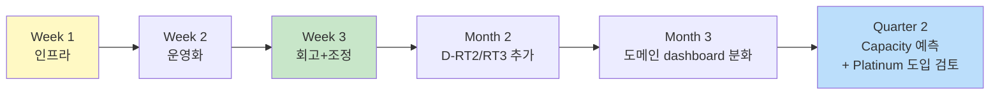

| 시점 | 추가 작업 |
|---|---|
| Month 2 | D-RT2 (MSA Health Matrix), D-RT3 (거래 추적) 추가 |
| Month 2 | M-D2 (New Error Code) — Watcher 또는 application 측 구현 |
| Month 3 | 서비스별 dashboard 분화 (각 서비스 팀 자가 운영) |
| Month 3 | D-K1 주간 KPI 보고 정착화 + Error budget 의사결정 적용 |
| Quarter 2 | Capacity 예측 (인덱스 증가율 → 클러스터 확장 시점) |
| Quarter 2 | 💎 Platinum 도입 검토 — ML / Searchable Snapshots / Field Security |

→ **2주 production 진입 + 분기마다 진화**.
