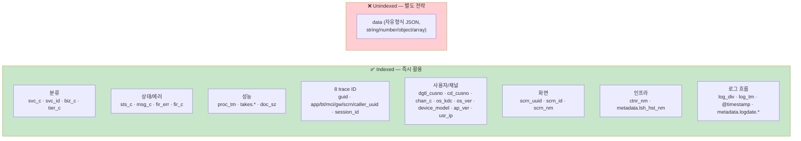
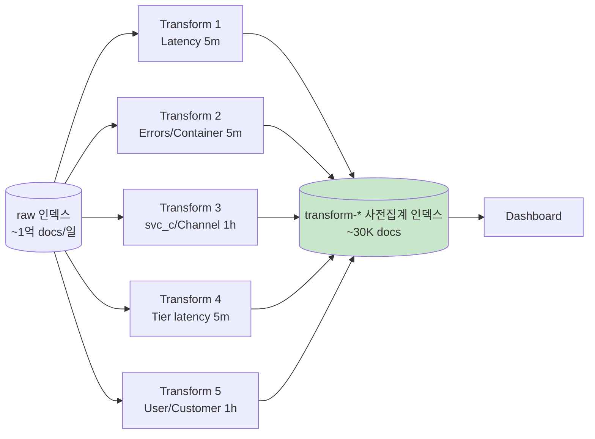
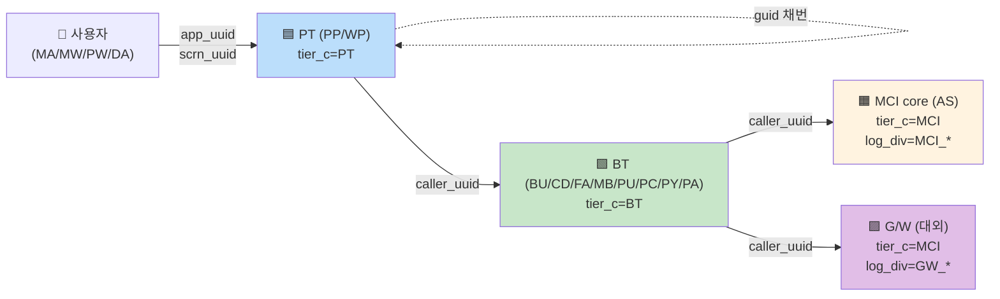
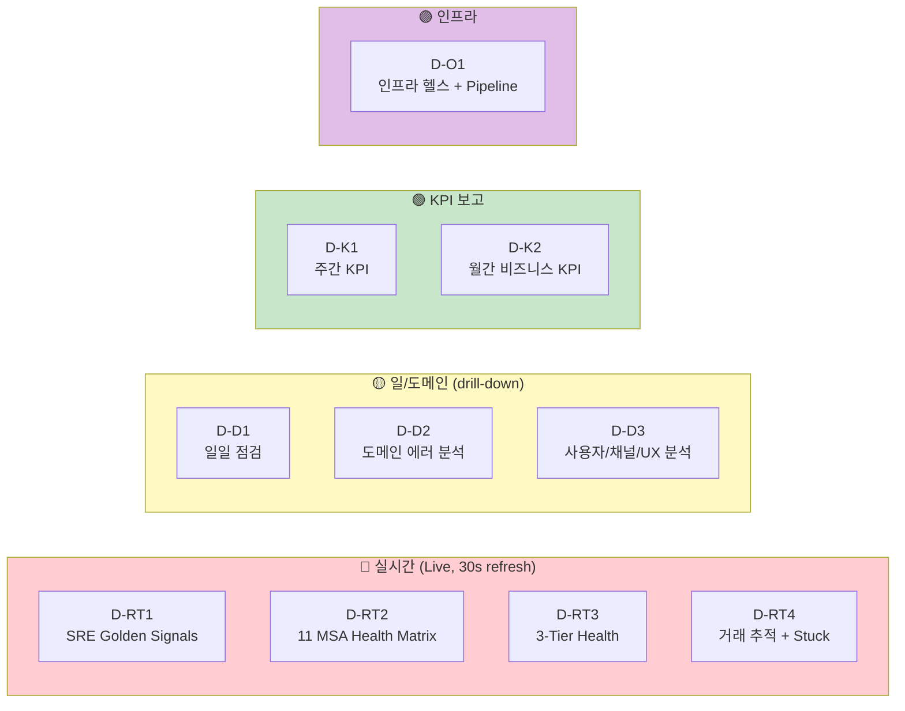
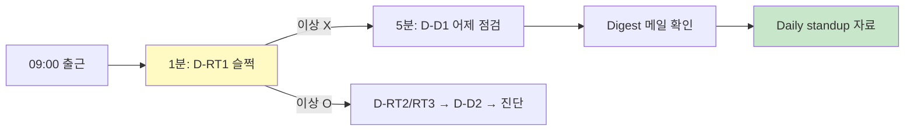
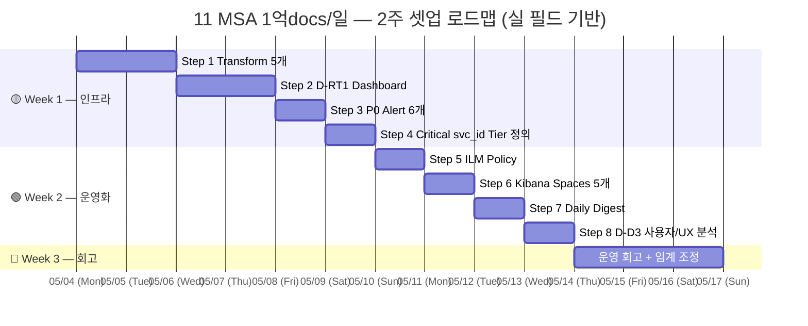
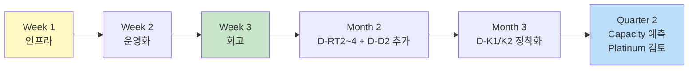

# 09. 실 운영 환경 — 종합 KPI · 관측성 · Metric 전략

> **컨텍스트**: 11 MSA × 3-tier (PT/BT/MCI) × 채널 4종 (MA/MW/PW/DA), 일 1억 docs+ 규모.
> **가정**: `data` 필드 (자유형식 JSON) 만 unindexed, 그 외 모든 업무 필드 (svc_c / msg_c / sts_c / proc_tm / guid / chan_c / os_kdc / scrn_uuid / dgtl_cusno 등) 는 indexed.
> **목표**: SRE / 개발 / 운영 3 관점 + 4 시간대 (실시간 / 일 / 주 / 월) 으로 **50+ 실무 메트릭** 선정 + 10 dashboard + Alerting 룰 + 운영 절차.
> **선수**: [09a-real-field-mapping.md](09a-real-field-mapping.md) (실 필드 cheatsheet), [99-real-document.md](99-real-document.md) (필드 정의), [99-tier-tracing.md](99-tier-tracing.md) (3-tier 추적).
>
> 🔄 **2026-04-30 전면 재작성** — 09a 기반으로 실 필드명 적용 + 신규 카테고리 (사용자/UX) 추가. 기존 mock 기반 09 의 좋은 구조 (3 관점·4 시간대·8단계 셋업) 유지.

---

## 0. Executive Summary

```mermaid
flowchart LR
    subgraph Sys["📊 시스템"]
      M["11 MSA<br/>3 Tier (PT/BT/MCI)<br/>채널 4종 (MA/MW/PW/DA)<br/>~1억 docs/일"]
    end
    subgraph Inputs["✅ Indexed (data 제외 모두)"]
      direction TB
      I1["📋 분류<br/>svc_c, svc_id, biz_c, tier_c"]
      I2["✅ 상태<br/>sts_c, msg_c, fir_err, fir_c"]
      I3["⏱️ 성능<br/>proc_tm, takes.*, doc_sz"]
      I4["🆔 추적<br/>guid + bt/mci/gw/scrn/app_uuid"]
      I5["👤 사용자<br/>dgtl_cusno, chan_c, os_kdc, device_model"]
      I6["🖥️ 화면/인프라<br/>scrn_uuid/scrn_id, ctnr_nm"]
    end
    subgraph Out["📋 산출물"]
      O1["**52 메트릭**<br/>(SRE / 개발 / 운영 / 사용자 / Op-Excellence)"]
      O2["**10 Dashboard**<br/>(실시간 / 일 / 주 / 월)"]
      O3["**Alerting**<br/>P0 페이저 + P1 Slack + Digest 메일"]
    end

    M --> Inputs
    Inputs --> Out
    style M fill:#fff9c4
    style Out fill:#c8e6c9
```



### 3 관점 × 4 시간대 매트릭스

| 관점 \ 주기 | 실시간 (1~5분) | 일단위 | 주단위 | 월단위 |
|---|---|---|---|---|
| **🛠️ SRE** | Availability · TPS · p95 · 에러율 · Tier 별 latency | 어제 SLO · MTTR · 외부 의존성 latency | SLO 트렌드 · Error Budget 잔여 | SLA 보고 · Capacity 예측 |
| **🔧 개발** | Critical svc_id 에러 spike · 신규 msg_c · 배포 회귀 감지 | Top 에러 코드 · Dead/Shadow svc_id · fir_c (root cause) | 신규 배포 안정성 · 호출 hop 패턴 | API 진화 · 사용 추세 |
| **📊 운영** | 결제/인증 funnel · 채널별 추세 · Stuck 거래 | DAU · 채널 분포 · OS/기기 painPoint · 화면 retry | WAU · 코호트 비교 · 사용자 retry 분석 | MAU · 비즈니스 KPI · UX 회고 |

---

## 1. 환경 진단

### 1.1 시스템 스케일

| 항목 | 값 | 시사점 |
|------|----|----|
| MSA 수 | **11** (BU/CD/FA/MB/PU/PC/PY/PP/WP/PA/AS) | svc_c 차원으로 분리 가능 |
| Tier | **3** (PT/BT/MCI) — 모든 거래가 통과 | tier_c 별 분석 강력 |
| 일 docs | ~1억+ | 평균 1.2K/sec, peak 5~10K/sec |
| in:out 비율 | 1:1+ (PT/BT/MCI 각 in/out) | 한 거래 = 6~8 docs |
| 채널 | **4종** (MA/MW/PW/DA) | 사용자 segment 분석 |
| 보존 | (가정) 30~90일 | ILM 필수 |

> 1억+ docs/일 = sec~min 단위 aggregation 충분. 단건 추적도 가능.

### 1.2 활용 가능 indexed 필드 (data 제외 모두)



**핵심 통찰**: `data` 외 거의 모든 정보가 indexed → 09 의 50+ 메트릭 **거의 전부 즉시 구현 가능**. 비즈니스 데이터 (거래액, 가맹점 등) 만 [08 의 Phase 2~3](08-card-platform-payload-strategy.md) 전략 필요.

### 1.2.1 ML Job — Basic 학습 vs Platinum 운영

본 학습 환경 (Basic):
- ✅ Lens · TSVB · Aggregation · Transform · Threshold Alerts
- ❌ ML Anomaly Detection (Platinum 필요)

> 💎 **Platinum+ 사내 운영에서 추가 활용** ([Q-03](99-qna.md#q-03)):
>
> | 기능 | 09 전략 어디에 적용? | 가치 |
> |---|---|---|
> | **ML Anomaly Detection** | M-O5 (DoD/WoW) → ML | 시간대×요일×채널 자연 패턴 학습 |
> | **Searchable Snapshots** | ILM Cold/Frozen | object storage 90% 비용 절감 |
> | **Field-level Security** | data PII 차폐 | 사용자 role 별 필드 차폐 |
> | **CCR** | 다중 데이터센터 | DR Active-Active |
> | **Reporting (Gold+)** | D-K1 주간 보고 | PDF 자동 메일 |
>
> ML 인프라 부담 → [Q-04](99-qna.md#q-04). dedicated 노드 1~2개 (16GB+ each) 권장.

본 09 의 모든 메트릭은 **Basic 으로 100% 구현 가능**.

### 1.2.2 Transform 사전 집계 — query 부하 70%↓

1억 docs/일 raw 인덱스 위에 dashboard 가 매번 query 하면 → ES heap/CPU 압박, 차트 1개 30초+. 해결: ES Transform 으로 **5분/1시간 단위 사전 집계 인덱스**.



→ §3.7 에 5 Transform 구체 정의 (channel·tier·user 추가). 자세한 Transform 패턴 → [07-batch-transform.md](07-batch-transform.md).

### 1.3 In/Out 짝짓기 + 8 Trace ID 활용



**핵심 사실**:
- 모든 doc 은 같은 `guid` (root) 공유
- 각 layer 자체 guid: PT=`guid`, BT=`bt_uuid`, MCI=`mci_uuid`, GW=`gw_uuid`
- `caller_uuid` 로 호출 chain 복원
- `proc_tm` 으로 각 doc 의 처리 시간 직접
- 자세한 추적 → [99-tier-tracing.md](99-tier-tracing.md)

> ⚠️ **`log_div` 6종**: `*_IN`, `*_OUT`, `MCI_SEND`, `MCI_RECV`, `GW_SEND`, `GW_RECV`. 단순 `*_OUT` query 는 MCI/GW 누락. KQL 정확:
> ```
> log_div : (*_OUT or MCI_RECV or GW_RECV)   # 모든 응답
> log_div : (*_IN or MCI_SEND or GW_SEND)    # 모든 요청
> ```

---

## 2. 분류 프레임워크

### 2.1 시간대별 의미

```
┌────────────────────────────────────────────────────────────────────┐
│ 실시간 (1~5분)   "지금 정상인가?" — Alerts + Live Dashboard         │
│ 일단위 (매일)    "어제 어땠나, 오늘 봐야 할 것"                    │
│ 주단위 (월요일)  "추세는? 비교는?" — 매니저 보고                   │
│ 월단위 (월말)    "비즈니스 KPI 보고 + capacity 예측"               │
└────────────────────────────────────────────────────────────────────┘
```

### 2.2 5 카테고리 — 50+ 메트릭

| 카테고리 | 개수 | 출처 필드 |
|---|:--:|---|
| 🛠️ SRE Golden Signals | 10 | sts_c, msg_c, proc_tm, log_div, tier_c |
| 🔧 백엔드 / 플랫폼 | 12 | svc_c, svc_id, ctnr_nm, takes.*, caller_uuid, guid |
| 📊 도메인 / 비즈니스 | 12 | msg_c, biz_c, scrn_uuid, fir_err, dgtl_cusno |
| 👤 사용자 / UX (신규) | 12 | chan_c, os_kdc, device_model, ap_ver, scrn_id, dgtl_cusno |
| 🛠️ 운영 / Capacity | 6 | @timestamp, ctnr_nm, doc_sz |

**총 52 메트릭**. 모두 Basic 라이선스로 구현 가능.

---

## 3. 메트릭 카탈로그

### 3.1 SRE Golden Signals (M-S1 ~ M-S10)

| # | 지표 | 정의 | 임계 / 시간대 |
|---|---|---|---|
| **M-S1** | **Availability** | `count(sts_c:"OK") / count(log_div:(*_OUT or MCI_RECV or GW_RECV))` | ≥ 99.9% (실시간) |
| **M-S2** | **TPS / RPS** | `count(log_div:(*_OUT or MCI_RECV or GW_RECV)) / window_sec` | (capacity 80%) (실시간) |
| **M-S3** | **Error Rate** | `count(sts_c:"ERROR") / count(...)` | < 0.1% (실시간) |
| **M-S4** | **Latency p50/p95/p99** | `percentile(proc_tm, [50,95,99]) filter log_div:*_OUT` | p95<500ms, p99<2s (실시간) |
| **M-S5** | **Slow Request Rate** | `count(proc_tm > 1000) / count()` | < 1% (실시간) |
| **M-S6** | **Saturation (인스턴스 부하)** | `count() by ctnr_nm` 분포 (max/avg ratio) | < 1.5 (실시간) |
| **M-S7** | **Tier 별 Availability** | sts_c:"OK" / total **by tier_c** | PT≥99.95, BT≥99.9, MCI≥99.5 (일) |
| **M-S8** | **외부 의존성 (G/W) Latency** | `percentile(proc_tm, 95) filter log_div:(GW_SEND or GW_RECV)` | p95 < 2s (실시간) |
| **M-S9** | **코어 의존성 (MCI) Latency** | `percentile(proc_tm, 95) filter log_div:(MCI_SEND or MCI_RECV)` | p95 < 1s (실시간) |
| **M-S10** | **Error Budget Burn Rate** | (1 - Availability) / (1 - SLO) — 30일 rolling | < 1.0 (= budget 다 안 씀) (주/월) |

**M-S1 Lens Formula**:
```
1 - count(kql='log_div:(*_OUT or MCI_RECV or GW_RECV) and sts_c:"ERROR"')
  / count(kql='log_div:(*_OUT or MCI_RECV or GW_RECV)')
```

**M-S10 Error Budget**:
```
SLO 99.9% → 한 달 허용 실패 = 0.1% × 1억×30 = 30M
누적 실패 = count(sts_c:"ERROR") in last 30d
잔여 = (30M - 누적) / 30M
< 30% 시 → 신규 배포 동결 + 안정화
```

### 3.2 백엔드 / 플랫폼 (M-P1 ~ M-P12)

| # | 지표 | 정의 | 가치 |
|---|---|---|---|
| **M-P1** | **MSA Health Matrix** | 11 svc_c × {availability, p95, tps, error/min} | 전체 서비스 1초 진단 |
| **M-P2** | **Tier Health Matrix** | 3 tier_c × 동일 KPI | 어느 layer 가 문제? |
| **M-P3** | **In/Out Imbalance** | `\|count(*_IN) - count(*_OUT)\| / count(*_IN) by svc_id` | 누락 / 행 감지 |
| **M-P4** | **Stuck Requests** | guid 단위 *_IN 만 있고 *_OUT 없음 (10분+) | 데드락/타임아웃 |
| **M-P5** | **Inter-Tier Latency** | 같은 guid 의 PT→BT, BT→MCI, BT→GW 시간 차 | bottleneck 식별 |
| **M-P6** | **Top svc_id by Traffic** | `count() by svc_id, Top 20` | capacity 우선순위 |
| **M-P7** | **Top svc_id by Error** | `count(sts_c:"ERROR") by svc_id, Top 10` | 즉시 대응 우선 |
| **M-P8** | **Container Error Rate** | `count(sts_c:"ERROR") / count() by ctnr_nm` | 단일 인스턴스 장애 |
| **M-P9** | **Container Throughput 분포** | `count() by ctnr_nm` (load balance) | 부하 균형 |
| **M-P10** | **Pipeline Lag** | `now() - max(@timestamp)` + `avg(takes.*)` | 로그 적재 지연 |
| **M-P11** | **Inter-Service Call Success** | caller_uuid 기반 callee success rate | 의존성 건강 |
| **M-P12** | **호출 Hop 분포** | 한 guid 의 PT/BT/MCI/GW doc 개수 분포 | N+1 / 비정상 패턴 |

**M-P5 Inter-Tier Latency** — 99-tier-tracing §2.2 의 Transform 등록 결과 활용:
```
transform-tier-latency-5m 인덱스에서:
  pt_to_bt_ms     - PT→BT 호출 시간
  bt_to_mci_ms    - BT→MCI 호출 시간
  bt_to_gw_ms     - BT→GW 호출 시간
```

**M-P10 Pipeline Lag**:
```
takes.ap_logstash_takes        # ap → logstash 도달 시간 (network)
takes.logstash_process_takes   # logstash 처리 시간 (capacity)
metadata.logdate.ap_out_time   # ap 측 발생 시각
metadata.logdate.logstash_in_time  # logstash 도착
metadata.logdate.logstash_out_time # logstash 처리 끝
```
→ 차이 = pipeline 단계별 lag.

### 3.3 도메인 / 비즈니스 (M-D1 ~ M-D12)

| # | 지표 | 정의 | 가치 |
|---|---|---|---|
| **M-D1** | **Top msg_c** | `count() by msg_c, Top 20` filter sts_c:"ERROR" | 우선 대응 코드 |
| **M-D2** | **신규 msg_c 감지** | unique(msg_c, today) - unique(msg_c, last 7d) | 새 결함 조기 발견 |
| **M-D3** | **Critical svc_id Error Rate** | 결제/인증/이체 svc_id 의 error rate | 비즈니스 임팩트 큰 부분 |
| **M-D4** | **MSA × msg_c Heatmap** | svc_c × msg_c grid | 책임 영역 명확화 |
| **M-D5** | **결제 Funnel (PY)** | scrn_uuid 단위 단계별 reach rate | 결제 UX painPoint |
| **M-D6** | **인증 성공률 (MB)** | sts_c:"OK" / total filter svc_c:"MB" | 보안/UX KPI |
| **M-D7** | **카드 거래 추세 (CD)** | count() by hour filter svc_c:"CD" | 카드 사용 패턴 |
| **M-D8** | **이체 성공률 (FA)** | sts_c:"OK" / total filter svc_c:"FA" + biz_c:"transfer*" | 핵심 거래 KPI |
| **M-D9** | **fir_c 분포 (root cause)** | `count(fir_err:"Y") by fir_c` | 어느 tier 에서 첫 에러? |
| **M-D10** | **거래량 추세 (svc_c 별)** | count() by svc_c, daily/weekly | 서비스 사용 추세 |
| **M-D11** | **동시 활성 거래** | `cardinality(guid) in 5min window` | concurrency |
| **M-D12** | **biz_c 별 분포** | 동일 svc_c 내부 업무 분포 | 도메인 painPoint |

**M-D5 결제 Funnel**:
```kql
# 결제 화면 진입 (scrn_uuid 채번)
svc_c : "PY" and tier_c : "PT" and log_div : *_IN

# 결제 단계별 svc_id 시퀀스 분석 (사내 약속 기반)
group by scrn_uuid, sort by @timestamp
```

**M-D9 fir_c 분포**:
```kql
log_div : (*_OUT or MCI_RECV or GW_RECV) and fir_err : "Y"
```
→ Lens: `count() by fir_c` (PT/BT/MCI 분포) — "첫 에러가 어디서 시작?"

### 3.4 사용자 / UX (M-U1 ~ M-U12) — **신규 카테고리**

실 운영 환경의 차별화 — **사용자 segment 분석**.

| # | 지표 | 정의 | 가치 |
|---|---|---|---|
| **M-U1** | **채널별 Traffic Share** | count() by chan_c (MA/MW/PW/DA) | 모바일 vs 웹 비중 |
| **M-U2** | **채널별 Error Rate** | sts_c:"ERROR" rate by chan_c | 어느 채널이 problematic |
| **M-U3** | **채널별 Latency 비교** | percentile(proc_tm, 95) by chan_c | 채널별 UX |
| **M-U4** | **OS 별 분포** | count() by os_kdc (I/A/W) | iOS vs Android 비중 |
| **M-U5** | **OS 버전별 Error Rate** | sts_c:"ERROR" by os_ver | 호환성 이슈 감지 |
| **M-U6** | **기기 모델별 painPoint** | sts_c:"ERROR" by device_model, Top 20 | 특정 기기 한정 버그 |
| **M-U7** | **앱 버전 분포** | count() by ap_ver | 강제 업데이트 검토 |
| **M-U8** | **신 앱 버전 안정성** | timeshift: 신 ver vs 이전 ver error rate | 배포 회귀 감지 |
| **M-U9** | **화면별 Funnel (scrn_id)** | scrn_uuid 단위 svc_id 시퀀스 분석 | UX 진단 |
| **M-U10** | **사용자 retry 패턴** | dgtl_cusno + scrn_uuid 단위 sts_c:"ERROR" 반복 | 알림 fatigue / 이탈 위험 |
| **M-U11** | **DAU / WAU / MAU** | cardinality(dgtl_cusno) — 1d/7d/30d | 활성 사용자 추세 |
| **M-U12** | **IP 대역별 분포** | usr_ip class C 분포 | 비정상 트래픽 / 지역 |

**M-U1 채널별 Traffic** (Lens):
```
Type:    Donut
Slice:   chan_c (MA/MW/PW/DA)
Size:    count()
Filter:  log_div : *_IN and tier_c : "PT"
```

**M-U6 기기 모델 painPoint**:
```kql
chan_c : "MA" and tier_c : "PT" and sts_c : "ERROR"
```
**Lens**: `count() by device_model, Top 20`

**M-U8 신 앱 버전 회귀**:
```
KQL filter:  ap_ver : "5.0.0"           # 신 버전
Compare:     ap_ver : "4.5.1"           # 이전 (timeshift)
Metric:      Error rate 차이 > 50% 감지
```

**M-U11 DAU**:
```kql
log_div : *_IN and tier_c : "PT"
```
**Lens**: `cardinality(dgtl_cusno) by day`

### 3.5 운영 / Capacity (M-O1 ~ M-O6)

| # | 지표 | 정의 |
|---|---|---|
| **M-O1** | Time-of-Day Pattern | hour heatmap — peak / off-peak |
| **M-O2** | Day-of-Week Pattern | 요일별 분포 |
| **M-O3** | Dead svc_id | Spring Mapping 선언 ∧ ES 호출 0인 svc_id (24h) |
| **M-O4** | Shadow svc_id | ES 호출 ∧ Spring Mapping 미선언 svc_id |
| **M-O5** | DoD/WoW Traffic Change | 어제 / 지난주 같은 요일 대비 % |
| **M-O6** | Peak RPS + 시간대 | 일/주 peak 값 + 발생 시각 |

### 3.6 Op-Excellence (M-X1 ~ M-X4)

| # | 지표 | 정의 | 출처 |
|---|---|---|---|
| **M-X1** | Pipeline Stage Lag | takes.ap_logstash_takes / takes.logstash_process_takes | takes.* |
| **M-X2** | Index Storage Health | 일자별 인덱스 size, shard 수, segment | _cat/indices |
| **M-X3** | doc_sz 분포 | 평균 / p95 doc 크기 (큰 doc = 비용) | doc_sz |
| **M-X4** | Schema Stability | 신규 필드 자동 매핑 빈도 (mapping 폭발 감시) | _mapping snapshot |

---

## 3.7 Transform 사전 집계 — 5종 정의

### Transform 1: Latency 5분 rollup

```json
PUT _transform/latency-5m
{
  "source": {
    "index": "<real-index-pattern>",
    "query": {
      "wildcard": { "log_div": { "value": "*_OUT" } }
    }
  },
  "dest": { "index": "transform-latency-5m" },
  "pivot": {
    "group_by": {
      "ts":      { "date_histogram": { "field": "@timestamp", "calendar_interval": "5m", "time_zone": "Asia/Seoul" } },
      "svc_c":   { "terms": { "field": "svc_c" } },
      "svc_id":  { "terms": { "field": "svc_id" } },
      "tier_c":  { "terms": { "field": "tier_c" } }
    },
    "aggregations": {
      "p50":  { "percentiles": { "field": "proc_tm", "percents": [50] } },
      "p95":  { "percentiles": { "field": "proc_tm", "percents": [95] } },
      "p99":  { "percentiles": { "field": "proc_tm", "percents": [99] } },
      "tps":  { "value_count": { "field": "guid" } },
      "slow": { "filter": { "range": { "proc_tm": { "gt": 1000 } } } }
    }
  },
  "frequency": "5m",
  "sync": { "time": { "field": "@timestamp", "delay": "60s" } }
}
```

### Transform 2: Errors / Container 5분 rollup

```json
PUT _transform/errors-5m
{
  "source": {
    "index": "<real-index-pattern>",
    "query": { "bool": { "filter": [
      { "wildcard": { "log_div": "*_OUT" } }
    ]}}
  },
  "dest": { "index": "transform-errors-5m" },
  "pivot": {
    "group_by": {
      "ts":       { "date_histogram": { "field": "@timestamp", "calendar_interval": "5m" } },
      "svc_c":    { "terms": { "field": "svc_c" } },
      "ctnr_nm":  { "terms": { "field": "ctnr_nm", "missing_bucket": true } },
      "msg_c":    { "terms": { "field": "msg_c", "missing_bucket": true } },
      "fir_c":    { "terms": { "field": "fir_c", "missing_bucket": true } }
    },
    "aggregations": {
      "total":   { "value_count": { "field": "@timestamp" } },
      "errors":  { "filter": { "term": { "sts_c": "ERROR" } } },
      "fir_errors": { "filter": { "term": { "fir_err": "Y" } } },
      "rate":    {
        "bucket_script": {
          "buckets_path": { "ok": "total", "err": "errors._count" },
          "script": "params.err / params.ok"
        }
      }
    }
  },
  "frequency": "5m",
  "sync": { "time": { "field": "@timestamp", "delay": "60s" } }
}
```

### Transform 3: Tier Latency (M-P5 핵심)

[99-tier-tracing.md §2.2](99-tier-tracing.md#22-시나리오-b-pt--bt-평균-latency) 의 Transform 정의 그대로.
```
group_by: ts (5m), guid
aggs:
  pt_out_ts, bt_in_ts, bt_out_ts, mci_in_ts, gw_in_ts
  pt_to_bt_ms, bt_to_mci_ms, bt_to_gw_ms (bucket_script)
```

### Transform 4: 채널 / 사용자 1시간 rollup (신규)

```json
PUT _transform/user-channel-1h
{
  "source": {
    "index": "<real-index-pattern>",
    "query": { "bool": { "filter": [
      { "term": { "tier_c": "PT" } },
      { "wildcard": { "log_div": "*_IN" } }
    ]}}
  },
  "dest": { "index": "transform-user-channel-1h" },
  "pivot": {
    "group_by": {
      "ts":       { "date_histogram": { "field": "@timestamp", "calendar_interval": "1h", "time_zone": "Asia/Seoul" } },
      "chan_c":   { "terms": { "field": "chan_c" } },
      "os_kdc":   { "terms": { "field": "os_kdc", "missing_bucket": true } },
      "ap_ver":   { "terms": { "field": "ap_ver", "missing_bucket": true } }
    },
    "aggregations": {
      "calls":        { "value_count": { "field": "@timestamp" } },
      "errors":       { "filter": { "term": { "sts_c": "ERROR" } } },
      "unique_users": { "cardinality": { "field": "dgtl_cusno" } },
      "unique_screens": { "cardinality": { "field": "scrn_uuid" } }
    }
  },
  "frequency": "1h",
  "sync": { "time": { "field": "@timestamp", "delay": "5m" } }
}
```

### Transform 5: svc_c × biz_c 1시간 rollup

```json
PUT _transform/svc-biz-1h
{
  "source": { "index": "<real-index-pattern>" },
  "dest": { "index": "transform-svc-biz-1h" },
  "pivot": {
    "group_by": {
      "ts":     { "date_histogram": { "field": "@timestamp", "calendar_interval": "1h", "time_zone": "Asia/Seoul" } },
      "svc_c":  { "terms": { "field": "svc_c" } },
      "svc_id": { "terms": { "field": "svc_id" } },
      "biz_c":  { "terms": { "field": "biz_c", "missing_bucket": true } }
    },
    "aggregations": {
      "calls":        { "value_count": { "field": "@timestamp" } },
      "errors":       { "filter": { "term": { "sts_c": "ERROR" } } },
      "unique_traces":{ "cardinality": { "field": "guid" } },
      "unique_users": { "cardinality": { "field": "dgtl_cusno" } }
    }
  },
  "frequency": "1h",
  "sync": { "time": { "field": "@timestamp", "delay": "5m" } }
}
```

→ 5 transform 모두 active 시 **dashboard query 부하 70%↓**, 사용자/채널 분석도 즉시 가능.

---

## 4. 시간대 매핑

### 4.1 실시간 (1~5분, P0/P1 alerts)

P0 우선:
- M-S1 가용성 / M-S3 에러율 / M-S4 p95 / M-S2 TPS — 1~5분
- M-P2 Tier health (PT/BT/MCI 매트릭스) — 1분
- M-P4 Stuck (10분 윈도우)
- M-D3 Critical svc_id error spike — 1분
- M-S8/S9 G/W·MCI 외부 의존성 latency — 5분
- M-P10 Pipeline Lag — 5분 (P0 — 데이터 손실 위험)

### 4.2 일단위 (매일 09:00 KST)

- M-S1 어제 SLO + MTTR
- M-D1/D2 Top msg_c + 신규 msg_c
- M-D9 fir_c 분포 (root cause 분석)
- M-D4 MSA × msg_c heatmap
- M-O3/O4 Dead/Shadow svc_id
- M-U1 채널별 분포 (어제)
- M-U6 기기 모델별 painPoint top 5
- M-X1 Pipeline lag 평균/최대

### 4.3 주단위 (월요일 08:00)

- M-S10 Error Budget 잔여
- M-S4 Latency 트렌드 (이번주 vs 지난주, timeshift)
- M-D8 이체/M-D6 인증 성공률 추세
- M-O1/O2 Time-of-Day / Day-of-Week 패턴 변화
- M-U11 DAU / WAU 추세
- M-U7/U8 앱 버전 분포 + 신 버전 회귀
- M-D5 결제 Funnel — 단계별 reach rate 변화

### 4.4 월단위 (월말/월초)

- SLA 보고서 (M-S1, M-S4, M-S10)
- M-U11 MAU + 코호트
- M-D10 svc_c 별 거래량 월간 trend
- M-X2 Capacity 예측 (인덱스 증가율 → 클러스터 확장)
- M-D7 카드/M-D8 이체 비즈니스 KPI
- 채널별 사용자 분포 변화 (모바일 vs 웹)

---

## 5. Dashboard 10종



| Dashboard | 청중 | refresh | 핵심 패널 |
|-----------|----|----|----|
| **D-RT1** SRE Golden Signals | SRE on-call | 30s | M-S1, S2, S3, S4, S8, S9 |
| **D-RT2** 11 MSA Health Matrix | SRE/플랫폼 | 30s | M-P1 (svc_c × KPI) + M-P8 (container) |
| **D-RT3** 3-Tier Health | SRE/플랫폼 | 30s | M-P2 (tier_c × KPI) + M-P5 inter-tier latency |
| **D-RT4** 거래 추적 | SRE/도메인 | 30s | M-P3, P4, P11, P12 + Top stuck guid |
| **D-D1** 일일 점검 | 운영 리더 | 1h | M-D1, D9, M-O3/O4, M-P5 어제 |
| **D-D2** 도메인 에러 분석 | 도메인/개발 | drill | M-D1, D2, D4, D9, fir_err 추적 |
| **D-D3** 사용자/UX 분석 | 운영/PM | drill | M-U1~12 (채널/OS/기기/화면) |
| **D-K1** 주간 KPI | 매니저 | 1d | M-S1, S10, D5, D6, U11, U7/U8 |
| **D-K2** 월간 비즈니스 KPI | 임원/PM | 1w | M-D5/D6/D7/D8 funnel + M-U11 MAU + capacity |
| **D-O1** 인프라 헬스 | 플랫폼/DBA | 5m | M-X1, X2, X3, M-P10 pipeline |

### 5.1 D-RT1 — SRE Golden Signals (실시간)

**용도**: on-call 이 매 시간 1초 슬쩍 → 정상 여부 즉답.

```
┌─ 🕒 [Last 1h]   🔄 30s refresh   🔔 active alerts: 0 ─────────────────┐
│ ┌─────────┬─────────┬─────────┬─────────┐                            │
│ │ 가용성  │ 에러율  │ p95 ms  │ TPS     │  ← KPI 4 (M-S1/S3/S4/S2)    │
│ │ 99.97% │ 0.03%   │  412   │ 1.18K   │                              │
│ │  🟢    │  🟢    │  🟢    │  🟢    │                              │
│ └─────────┴─────────┴─────────┴─────────┘                            │
│ ┌──────────────────────────┐ ┌──────────────────────────────────────┐ │
│ │📈 Availability % trend   │ │📊 TPS by tier_c (PT/BT/MCI stacked)  │ │
│ └──────────────────────────┘ └──────────────────────────────────────┘ │
│ ┌──────────────────────────┐ ┌──────────────────────────────────────┐ │
│ │⏱️ Latency p50/p95/p99    │ │📊 외부/코어 의존성 latency             │ │
│ │ (line, multi-metric)     │ │ MCI vs GW p95 (M-S8 / M-S9)         │ │
│ └──────────────────────────┘ └──────────────────────────────────────┘ │
│ ┌────────────────────────────────────────────────────────────────────┐│
│ │📋 Active Alerts (P0/P1 — saved alert table)                        ││
│ └────────────────────────────────────────────────────────────────────┘│
└────────────────────────────────────────────────────────────────────────┘
```

**Source**: `transform-latency-5m`, `transform-errors-5m` (사전 집계 → 빠름).

### 5.2 D-RT2 — 11 MSA Health Matrix

```
┌─ MSA Health Matrix — 11 svc_c × 5 KPI ───────────────────────────────┐
│ ┌──────┬───────┬─────┬──────┬────────┬──────────┐                     │
│ │ svc_c │ 가용성│ p95 │ TPS  │ Err/min │ Top msg_c │                  │
│ ├──────┼───────┼─────┼──────┼────────┼──────────┤                     │
│ │ FA   │ 99.99 │ 280 │ 320  │   2     │ -        │                  │
│ │ PY   │ 99.95 │ 580 │ 410  │   8     │ P001 (5)│                  │
│ │ MB   │ 99.92 │ 420 │ 280  │   5     │ E501 (3)│                  │
│ │ CD   │ 99.20 │1850 │  95  │  47    │ 9999 (30)│ ← 주목            │
│ │ ⋯ (11)│       │     │      │        │          │                   │
│ └──────┴───────┴─────┴──────┴────────┴──────────┘                     │
│                                                                       │
│ ┌────────────────────────────────────────────────────────────────────┐│
│ │📊 Container 부하 분포 (M-P9) — 11 MSA × N container                ││
│ │ heatmap 또는 bar — 단일 인스턴스 spike 감지                        ││
│ └────────────────────────────────────────────────────────────────────┘│
└────────────────────────────────────────────────────────────────────────┘
```

**Lens Table**:
```
Rows:    svc_c (Top 11)
Metrics:
  - 가용성:     1 - count(sts_c:"ERROR") / count()
  - p95:       percentile(proc_tm, 95)
  - TPS:       count() / window_sec
  - Errors/min: count(sts_c:"ERROR") / window_min
  - Top msg_c:  terms(msg_c filter sts_c:"ERROR", size=1)
```

### 5.3 D-RT3 — 3-Tier Health

3 tier × KPI 매트릭스 + inter-tier latency trend. 자세한 패널 정의 → [99-tier-tracing §3](99-tier-tracing.md#3-tier_c-별-kpi-dashboard-설계).

```
┌─ 3-Tier Health ────────────────────────────────────────────────────────┐
│ ┌──────┬────────┬──────┬──────┬─────────┐                              │
│ │ tier │ 가용성 │ p95  │ TPS  │ Top msg_c│                              │
│ │ PT   │ 99.95 │ 120  │ 3.2K │   -      │                              │
│ │ BT   │ 99.92 │ 280  │ 3.0K │ E102(3)  │                              │
│ │ MCI  │ 99.85 │ 450  │ 2.1K │ 9999(8)  │ ← MCI 가 약점               │
│ └──────┴────────┴──────┴──────┴─────────┘                              │
│ ┌──────────────────────────┐ ┌──────────────────────────────────────┐ │
│ │📈 PT→BT inter-latency    │ │📈 BT→MCI / BT→GW inter-latency        │ │
│ │ p50/p95 over time        │ │ MCI core vs G/W 분리 (5.5)            │ │
│ └──────────────────────────┘ └──────────────────────────────────────┘ │
└────────────────────────────────────────────────────────────────────────┘
```

### 5.4 D-RT4 — 거래 추적

- M-P3 In/Out Imbalance by svc_id (Top 10)
- M-P4 Stuck Requests 표 (guid, scrn_uuid, 대기 시간)
- M-P12 호출 hop 분포 (1/2/3/4+ hops)
- M-D9 fir_c 분포 (실시간 root cause)

### 5.5 D-D1 — 일일 운영 점검 (매일 09:00 KST 자동 보고)

```
┌─ 어제 (Yesterday KST) — Daily 점검 ─────────────────────────────────┐
│ ┌──────┬──────┬──────┬──────┐                                       │
│ │SLO달성│총거래│ 에러건 │MTTR │  ← 어제 핵심 KPI 4                   │
│ │99.97% │100M │ 30K  │12분 │                                       │
│ └──────┴──────┴──────┴──────┘                                       │
│ ┌─────────────────┐ ┌────────────────────────────────────────────┐  │
│ │📊 Top 10 msg_c  │ │📊 Top 10 svc_id (M-P5 Traffic + M-P6 Error)│  │
│ └─────────────────┘ └────────────────────────────────────────────┘  │
│ ┌──────────────┐ ┌──────────────┐ ┌─────────────────────────┐       │
│ │💀 Dead svc_id│ │👻 Shadow     │ │🆕 New msg_c (M-D2)      │       │
│ │  12개         │ │  3개         │ │   2건 신규               │       │
│ └──────────────┘ └──────────────┘ └─────────────────────────┘       │
│ ┌─────────────────────────────────────────────────────────────────┐ │
│ │📊 11 MSA × msg_c heatmap (M-D4)                                 │ │
│ └─────────────────────────────────────────────────────────────────┘ │
│ ┌─────────────────────────────────────────────────────────────────┐ │
│ │📊 fir_c 분포 (M-D9) — 어제 첫 에러 발생 tier                      │ │
│ │ MCI: 60% / BT: 35% / PT: 5%                                       │ │
│ └─────────────────────────────────────────────────────────────────┘ │
└─────────────────────────────────────────────────────────────────────┘
```

### 5.6 D-D2 — 도메인 에러 분석 (drill-down)

- M-D1 Top msg_c trend (4h window)
- M-D4 MSA × msg_c heatmap
- M-D9 fir_err 추적 (어디서 첫 에러 시작?)
- 최근 100 에러 표 (guid / scrn_id / svc_c / svc_id / msg_c / fir_c)

### 5.7 D-D3 — **사용자/UX 분석** (신규)

```
┌─ 사용자 / 채널 / 기기 분석 ─────────────────────────────────────────┐
│ ┌────────────────────────┐ ┌──────────────────────────────────────┐ │
│ │🍩 채널 분포 (M-U1)     │ │📊 채널별 에러율 (M-U2)               │ │
│ │ MA 65% / MW 20% /      │ │ MA: 0.5% / MW: 0.8% / PW: 0.2% /    │ │
│ │ PW 12% / DA 3%         │ │ DA: 1.5% ← DA 주목                   │ │
│ └────────────────────────┘ └──────────────────────────────────────┘ │
│ ┌────────────────────────┐ ┌──────────────────────────────────────┐ │
│ │🍩 OS 분포 (M-U4)       │ │📊 OS 버전별 에러율 (M-U5)            │ │
│ │ I 45% / A 50% / W 5%   │ │ Top 호환성 이슈 ver 식별             │ │
│ └────────────────────────┘ └──────────────────────────────────────┘ │
│ ┌─────────────────────────────────────────────────────────────────┐ │
│ │📊 Top 20 기기 모델별 painPoint (M-U6)                            │ │
│ │ iPhone 12 Pro Max: 0.3% / Galaxy S22: 0.5% / iPhone X: 2.1% ← │ │
│ └─────────────────────────────────────────────────────────────────┘ │
│ ┌────────────────────────┐ ┌──────────────────────────────────────┐ │
│ │📊 앱 버전 분포 (M-U7)  │ │📈 신 버전 회귀 (M-U8 timeshift)      │ │
│ │ 4.5.1: 70%             │ │ 4.5.0 → 4.5.1: 에러율 +12%           │ │
│ │ 4.5.0: 25% (구)        │ │                                       │ │
│ └────────────────────────┘ └──────────────────────────────────────┘ │
│ ┌─────────────────────────────────────────────────────────────────┐ │
│ │📊 Top 10 화면별 진입률 (M-U9) + 에러율                           │ │
│ │ FN1000000F (금융메인): DAU 12K / 0.5%                            │ │
│ │ PY1000000P (결제):     DAU 8K  / 1.2% ← 주목                      │ │
│ └─────────────────────────────────────────────────────────────────┘ │
│ ┌─────────────────────────────────────────────────────────────────┐ │
│ │📊 사용자 retry 패턴 (M-U10)                                      │ │
│ │ "scrn_uuid 안 sts_c:ERROR ≥ 3회" 사용자 수: 240명/시간             │ │
│ └─────────────────────────────────────────────────────────────────┘ │
└─────────────────────────────────────────────────────────────────────┘
```

→ 운영팀이 "어떤 segment 에 문제가 집중되는지" 1초 진단.

### 5.8 D-K1 — 주간 KPI

```
┌─ 주간 KPI ─ Last 7 days ───────────────────────────────────────────┐
│ ┌──────────┬──────────┬──────────┬──────────┐                      │
│ │ 주간 SLO │ p95 trend │ DAU      │ 결제성공 │                      │
│ │ 99.96%   │ 412→398   │ 2.1M     │ 96.2%    │                      │
│ │ 🟢 달성  │ ↓ 좋음   │ ↑ 3%     │ ↑ 0.4%   │                      │
│ └──────────┴──────────┴──────────┴──────────┘                      │
│ ┌──────────────────────────┐ ┌────────────────────────────────────┐ │
│ │📈 가용성 timeshift        │ │💰 Error Budget 잔여 67%             │ │
│ └──────────────────────────┘ └────────────────────────────────────┘ │
│ ┌──────────────────────────┐ ┌────────────────────────────────────┐ │
│ │📊 요일별 트래픽 패턴      │ │📊 채널별 비중 변화                   │ │
│ │  (M-O2)                   │ │  MA ↑ 2% / MW ↓ 1%                  │ │
│ └──────────────────────────┘ └────────────────────────────────────┘ │
└─────────────────────────────────────────────────────────────────────┘
```

### 5.9 D-K2 — 월간 비즈니스 KPI (PM)

- M-D5 결제 Funnel 단계별 trend
- M-D6/D7/D8 비즈니스 KPI (인증/카드/이체)
- M-U11 MAU 추세
- M-D11 동시 활성 거래 peak
- 채널/OS/기기 분포 월간 변화
- Capacity 예측 (M-X2 인덱스 증가율)

### 5.10 D-O1 — 인프라 헬스 + Pipeline

- M-P10 Pipeline lag (takes.* 시계열)
- M-X2 인덱스 size / shard
- M-X3 doc_sz 분포
- M-P9 Container 부하 균형 + 단일 spike 감지
- M-P11 Inter-Service call success
- _cluster/health 상태

---

## 6. Alerting 룰 — P0 / P1 / Digest

### 6.1 P0 — 페이저 호출

| ID | 룰 | KQL/조건 | 임계 |
|---|---|---|---|
| **R-P0-1** | 가용성 폭락 | `log_div:(*_OUT or MCI_RECV or GW_RECV)` | sts_c:"ERROR" 비율 > 1% in 5min |
| **R-P0-2** | Error Rate spike | 동일 | > 5% in 5min |
| **R-P0-3** | Latency 폭증 | 동일 | p95(proc_tm) > 5000 in 5min |
| **R-P0-4** | MSA 단절 | `svc_c:"<X>" and log_div:*_OUT` | count = 0 for 10min (정상 시간대) |
| **R-P0-5** | Pipeline lag 심각 | `takes.ap_logstash_takes` | avg > 30s for 5min |
| **R-P0-6** | Critical svc_id 폭락 | 결제/인증/이체 svc_id error rate | > 2% in 5min |

### 6.2 P1 — Slack 채널

| ID | 룰 | 임계 |
|---|---|---|
| **R-P1-1** | 신규 msg_c 등장 | M-D2 — 7일 base 외 |
| **R-P1-2** | Stuck Requests 누적 | M-P4 — 100건 초과 |
| **R-P1-3** | In/Out Imbalance | M-P3 — 5% 초과 svc_id |
| **R-P1-4** | 단일 MSA error spike | M-P1 — svc_c 별 error rate >2% |
| **R-P1-5** | G/W p95 회귀 | M-S8 — p95 +50% vs 1h ago |
| **R-P1-6** | MCI core p95 회귀 | M-S9 — 동일 |
| **R-P1-7** | fir_c MCI 폭증 | `fir_err:"Y" and fir_c:"MCI"` count > 100 in 5min |
| **R-P1-8** | 신 앱 버전 회귀 | M-U8 — 신 ver error rate vs 이전 +50% |
| **R-P1-9** | 채널 한정 painPoint | M-U2 — 단일 chan_c error rate > 1% |
| **R-P1-10** | OS 호환성 spike | M-U5 — os_kdc + os_ver 조합 error rate spike |
| **R-P1-11** | 사용자 retry 폭주 | M-U10 — same dgtl_cusno + scrn_uuid sts_c:"ERROR" ≥3 |
| **R-P1-12** | Container 단일 spike | M-P8 — 단일 ctnr_nm error rate >5% |

### 6.3 Action 템플릿 (실 필드 인용)

```yaml
PagerDuty:
  Severity: critical
  Summary: |
    🚨 [{{rule.name}}]
    MSA (svc_c):  {{context.alerts.[0].svc_c}}
    Tier:         {{context.alerts.[0].tier_c}}
    msg_c:        {{context.alerts.[0].msg_c}}
    fir_c (root): {{context.alerts.[0].fir_c}}
    Channel:      {{context.alerts.[0].chan_c}}
    Container:    {{context.alerts.[0].ctnr_nm}}
    guid (root):  {{context.alerts.[0].guid}}
    Time:         {{date}}
  Custom:
    runbook: https://wiki/.../runbooks/{{rule.id}}
    dashboard: https://kibana/.../D-RT1
```

### 6.4 Digest 메일 (매일 09:00 KST)

```
[Subject] 일일 운영 점검 — 2026-04-30

📊 어제 KPI
  - SLO:        99.97% (목표 99.9% 🟢)
  - p95:        412ms
  - 총 거래:    100M
  - DAU:        2.1M
  - 결제 성공률: 96.2%

🔴 주의
  - card-service (CD) 에러율 0.8% (평소 0.1%)
  - msg_c "9999" 폭증 (어제 30K → 오늘 120K)
  - Dead svc_id 신규 3건
  - 신 앱 ap_ver 4.5.1 에러율 +12% (M-U8)

📈 트렌드
  - 7일 평균 SLO: 99.96% (선주 99.94%, 개선)
  - DAU 7일 추세: ↑ 3%
  - Error Budget 잔여: 73%
  - 채널 변화: MA ↑ 2%, MW ↓ 1%

🔗 상세: https://kibana/.../D-D1
```

### 6.5 Alert Fatigue 방지


원칙:
- P0 = SLA 위반 직전만 (월 5회 이내 권장)
- Cooldown 30min — 같은 룰 중복 방지
- Runbook URL 매 룰 첨부
- 매주 Fatigue index = (false-positive + noise) / total. > 0.4 시 즉시 조정

---

## 6.6 ILM Policy

```json
PUT _ilm/policy/api-logs-policy
{
  "policy": {
    "phases": {
      "hot":   { "actions": { "set_priority": { "priority": 100 }, "rollover": { "max_age": "1d", "max_primary_shard_size": "50gb" } } },
      "warm":  { "min_age": "7d",  "actions": { "shrink": { "number_of_shards": 1 }, "forcemerge": { "max_num_segments": 1 } } },
      "cold":  { "min_age": "30d" },
      "delete":{ "min_age": "90d", "actions": { "delete": {} } }
    }
  }
}
```

| Phase | 기간 | 용도 |
|---|---|---|
| HOT | 0~7일 | 실시간 dashboard / 에러 진단 |
| WARM | 7~30일 | 주간 KPI / 회귀 분석 |
| COLD | 30~90일 | 월간 보고 / 사후 분석 |
| DELETE | 90일+ | 자동 삭제 |

> 💎 **Platinum**: cold/frozen tier 를 searchable snapshots → 90% 비용 ↓.

## 6.7 Kibana Spaces — 권한 분리

| Space | 보이는 dashboard | 추가 권한 |
|---|---|---|
| **SRE** | D-RT1~4, D-D1, D-D2, D-O1 | Alert 관리, runbook 편집 |
| **Dev (per service)** | 본인 svc_c dashboard, D-D2 | 본인 인덱스 한정 read |
| **Operations** | D-D1, D-D2, D-D3, D-K1 | read-only |
| **Executive** | D-K1, D-K2 | read-only |
| **Platform** | D-O1 + Stack Mgmt | Transform/ILM 관리 |

> 💎 **Platinum**: Field-level Security 로 data PII 차폐, role 별.

---

## 7. 운영 절차

### 7.1 Daily — 운영자 09:00 루틴



### 7.2 Weekly — 매주 월요일

- D-K1 한 화면 캡처 → 매니저 보고
- Error Budget 검토 → 신규 배포 가능 여부
- 채널별 painPoint Top 5 (D-D3) 회의
- 룰 임계 조정 (false-positive 분석, Fatigue index)

### 7.3 Monthly — 월말/월초

- D-K2 비즈니스 KPI 보고서 (임원)
- SLA 보고서 작성 + 갱신
- Capacity 예측 (인덱스 증가율 → 클러스터 확장)
- Dashboard 정비 (사용 안 하는 패널 제거)
- 분기마다: Platinum 도입 검토

---

## 8. 폐쇄망 적용 시 추가 고려

| 항목 | 변경 |
|---|---|
| ES URL / Kibana URL | 사내 endpoint |
| 인증 | API Key (Phase 3 기준) |
| Slack/PagerDuty | 사내 메신저 / 호출 시스템 |
| Reporting 자동 메일 | 사내 SMTP |
| time_zone | 모든 Lens / Transform 에 `Asia/Seoul` 명시 |
| 라이선스 | Platinum 활성화 (사내 확정) — ML / FLS 고려 |
| Spaces | SSO/SAML 통합 |

---

## 9. ✅ 단계별 체크리스트

### Phase 1 (Day 1~7) — 기반
- [ ] Data view 생성 (실 인덱스 패턴)
- [ ] Transform 5개 등록 (latency / errors / tier / channel / svc-biz)
- [ ] D-RT1 (SRE Golden Signals) 1개 완성
- [ ] R-P0-1, R-P0-2 룰 활성

### Phase 2 (Week 2) — MSA + Tier
- [ ] D-RT2 (11 MSA Health Matrix)
- [ ] D-RT3 (3-Tier Health) — 99-tier-tracing 의 Transform 활용
- [ ] D-D1 (일일 점검) + Daily Digest 자동 메일
- [ ] R-P1-1~6 룰

### Phase 3 (Week 3~4) — 도메인 + 사용자
- [ ] D-D2 (도메인 에러)
- [ ] D-D3 (사용자/UX 분석) — 채널/OS/기기 분석
- [ ] R-P1-7~12 룰
- [ ] M-D9 fir_err root cause 추적 패널

### Phase 4 (Month 2) — 운영 자동화
- [ ] D-K1, D-K2 주/월간 KPI
- [ ] D-O1 인프라 헬스
- [ ] ILM policy 적용
- [ ] Kibana Spaces 5개 분리

### 지속
- [ ] 매주 룰 임계 조정 (Fatigue index)
- [ ] 매월 SLA 보고
- [ ] 분기 dashboard 정비
- [ ] 분기 Platinum 도입 검토

---

## 10. 52 메트릭 한 페이지 요약

```
══ SRE Golden Signals (10) ══
M-S1  Availability                 sts_c:"OK" / total          (실시간)
M-S2  TPS / RPS                    count / sec                 (실시간)
M-S3  Error Rate                   sts_c:"ERROR" / total       (실시간)
M-S4  Latency p50/p95/p99         proc_tm percentile          (실시간)
M-S5  Slow Request Rate            proc_tm > 1000              (실시간)
M-S6  Saturation                   ctnr_nm 부하 분포           (실시간)
M-S7  Tier 별 Availability         by tier_c                   (일)
M-S8  G/W Latency                  log_div:GW_*                (실시간)
M-S9  MCI core Latency             log_div:MCI_*               (실시간)
M-S10 Error Budget Burn Rate       SLO 기준 30d                (주/월)

══ 백엔드 / 플랫폼 (12) ══
M-P1  MSA Health Matrix            11 svc_c × KPI              (실시간)
M-P2  Tier Health Matrix           3 tier_c × KPI              (실시간)
M-P3  In/Out Imbalance             |IN-OUT| / svc_id           (실시간)
M-P4  Stuck Requests               guid IN only > 10min        (실시간)
M-P5  Inter-Tier Latency           PT→BT, BT→MCI, BT→GW        (실시간)
M-P6  Top svc_id by Traffic        count by svc_id Top 20      (일)
M-P7  Top svc_id by Error          error count Top 10          (실시간)
M-P8  Container Error Rate         by ctnr_nm                  (실시간)
M-P9  Container Throughput 분포    부하 균형                   (일)
M-P10 Pipeline Lag                 takes.*                     (실시간)
M-P11 Inter-Service Call Success   caller_uuid 기반            (일)
M-P12 호출 Hop 분포                guid PT/BT/MCI/GW 개수      (일)

══ 도메인 / 비즈니스 (12) ══
M-D1  Top msg_c                    빈도 Top 20                 (일)
M-D2  신규 msg_c                   today vs 7d base 차집합     (일)
M-D3  Critical svc_id Error Rate   결제/인증/이체              (실시간)
M-D4  MSA × msg_c Heatmap          svc_c × msg_c               (일)
M-D5  결제 Funnel (PY)             scrn_uuid 단계별            (주)
M-D6  인증 성공률 (MB)             sts_c:"OK" filter           (주)
M-D7  카드 거래 추세 (CD)          시간대 분포                 (주/월)
M-D8  이체 성공률 (FA)             biz_c:transfer*             (주)
M-D9  fir_c 분포 (root cause)      where fir_err:"Y"           (실시간/일)
M-D10 svc_c 별 거래량 추세         일/주/월                     (주/월)
M-D11 동시 활성 거래               cardinality(guid) 5min       (실시간)
M-D12 biz_c 별 분포                서비스 내부 업무 분포        (일)

══ 사용자 / UX (12) — 신규 ══
M-U1  채널별 Traffic Share         chan_c (MA/MW/PW/DA)        (일)
M-U2  채널별 Error Rate            by chan_c                   (일)
M-U3  채널별 Latency 비교          p95 by chan_c               (일)
M-U4  OS 별 분포                   os_kdc (I/A/W)              (주)
M-U5  OS 버전별 Error Rate         os_ver (호환성 이슈)         (주)
M-U6  기기 모델별 painPoint        device_model                (일)
M-U7  앱 버전 분포                 ap_ver                       (주)
M-U8  신 앱 버전 회귀              ap_ver timeshift             (주)
M-U9  화면별 Funnel (scrn_id)      scrn_uuid 진입률             (주)
M-U10 사용자 retry 패턴            dgtl_cusno + scrn_uuid       (실시간)
M-U11 DAU / WAU / MAU              cardinality(dgtl_cusno)      (일/주/월)
M-U12 IP 대역 분포                 usr_ip class C              (월)

══ 운영 / Capacity (6) ══
M-O1  Time-of-Day                  hour heatmap                (주)
M-O2  Day-of-Week                  요일 분포                   (주)
M-O3  Dead svc_id                  Spring 선언 ∧ ES 미호출      (일)
M-O4  Shadow svc_id                ES 호출 ∧ Spring 미선언      (일)
M-O5  DoD/WoW Change               trans % vs base             (주)
M-O6  Peak RPS + 시간대            일/주 peak                  (주/월)

══ Op-Excellence (4) ══
M-X1  Pipeline Stage Lag           takes.* / metadata.logdate.* (실시간)
M-X2  Index Storage Health         size, shard, segment        (주)
M-X3  doc_sz 분포                  doc_sz 평균/p95             (일)
M-X4  Schema Stability             신규 필드 매핑 빈도         (주)
```

→ **52 메트릭 / 10 Dashboard / 18 Alert 룰** 으로 11 MSA × 1억+ docs/일 환경의 production-grade 관측성.

---

## 11. ❓ Self-check

1. **Q.** `log_div : *_OUT` 만으로 KQL 작성하면 어떤 트래픽 누락?
   <details><summary>A</summary>MCI / G/W 트래픽 (`MCI_RECV`, `GW_RECV` 안 잡힘). 정확하게는 `log_div : (*_OUT or MCI_RECV or GW_RECV)`.</details>

2. **Q.** `tier_c:"MCI"` 한 가지로 코어 의존성과 외부 의존성을 구분 못 하는 이유?
   <details><summary>A</summary>G/W 와 MCI core 가 같은 tier_c="MCI" 로 분류됨. 구분은 `log_div` prefix (MCI_* vs GW_*) 로.</details>

3. **Q.** M-U8 (신 앱 버전 회귀) 어떻게 구현?
   <details><summary>A</summary>Lens timeshift 활용. ap_ver 별 sts_c:"ERROR" rate 를 이번 주 vs 지난 주 비교. ratio > 1.5 면 회귀 의심.</details>

4. **Q.** 1억 docs/일 환경에서 dashboard query 가 느릴 때 첫 시도?
   <details><summary>A</summary>(1) Transform 사전 집계 인덱스를 dashboard data view 로 사용. (2) 시간 범위 좁히기 (1d → 1h). (3) breakdown size 줄이기. raw 인덱스 직접 query 는 Discover 의 일회성 분석에만.</details>

5. **Q.** fir_err 와 sts_c 의 차이?
   <details><summary>A</summary>sts_c="ERROR" 는 그 doc 자체가 에러 응답이라는 뜻. fir_err="Y" 는 그 에러가 cascade 의 root (최초 발생) 이라는 뜻. 한 거래의 PT/BT/MCI 모두 sts_c:"ERROR" 라도 fir_err:"Y" 는 1개만 (가장 먼저 에러난 곳).</details>

6. **Q.** DAU 측정 시 `dgtl_cusno` vs `cd_cusno` 어느 게?
   <details><summary>A</summary>둘 다 함께 (복합 키). 하나만 쓰면 동일 사용자 중복 / 누락 가능. 운영 정책 따라 하나만 쓸 수도 있음 — 회사에서 합의 필요.</details>

7. **Q.** Critical svc_id 정의가 자주 변할 때 어떻게 dashboard 와 alert 일관 유지?
   <details><summary>A</summary>Saved query 로 `critical-svc-tier0` 같은 KQL 저장 → 모든 룰/dashboard 가 reference. 변경은 saved query 한 번만.</details>

---

## 부록 D. 8단계 셋업 — 2주 production-grade 관측성

### D.0 전체 Timeline



### D.1 Step 1 — Transform 5개 (Day 1~2)

#### 절차

1. **Index Template** 등록 (transform 결과 인덱스 매핑)
```json
PUT _index_template/transform-monitoring-template
{
  "index_patterns": ["transform-latency-5m", "transform-errors-5m", "transform-tier-latency-5m", "transform-user-channel-1h", "transform-svc-biz-1h"],
  "priority": 200,
  "template": {
    "settings": {
      "number_of_shards": 1,
      "number_of_replicas": 1,
      "index.lifecycle.name": "transform-stats-policy"
    },
    "mappings": {
      "properties": {
        "ts":             { "type": "date" },
        "svc_c":          { "type": "keyword" },
        "svc_id":         { "type": "keyword" },
        "tier_c":         { "type": "keyword" },
        "ctnr_nm":        { "type": "keyword" },
        "msg_c":          { "type": "keyword" },
        "fir_c":          { "type": "keyword" },
        "chan_c":         { "type": "keyword" },
        "os_kdc":         { "type": "keyword" },
        "ap_ver":         { "type": "keyword" },
        "biz_c":          { "type": "keyword" },
        "calls":          { "type": "long" },
        "errors":         { "type": "long" },
        "fir_errors":     { "type": "long" },
        "rate":           { "type": "float" },
        "p50":            { "type": "float" },
        "p95":            { "type": "float" },
        "p99":            { "type": "float" },
        "tps":            { "type": "long" },
        "slow":           { "type": "long" },
        "unique_traces":  { "type": "long" },
        "unique_users":   { "type": "long" },
        "unique_screens": { "type": "long" }
      }
    }
  }
}
```

2. **Transform 5개 등록** (§3.7 참고): latency-5m / errors-5m / tier-latency-5m / user-channel-1h / svc-biz-1h.

3. **시작 + 검증**:
```
POST _transform/latency-5m/_start
POST _transform/errors-5m/_start
POST _transform/tier-latency-5m/_start
POST _transform/user-channel-1h/_start
POST _transform/svc-biz-1h/_start

GET _transform/_stats
```

응답 `state:"started"`, `documents_indexed > 0` 면 정상.

#### 검증 / 함정
- ✅ 5분 후 transform-latency-5m 인덱스에 docs 적재
- ✅ Lens 차트 응답 30초 → 0.5초
- ⚠️ source 매핑이 dynamic 이라 `proc_tm` 이 text 면 percentile 실패 → keyword/long 로 매핑 명시
- ⚠️ continuous mode 의 `sync.delay` 60s 권장 (late-arriving doc 누락 방지)
- ⚠️ Tier latency transform 의 group_by `guid` 카디널리티 큼 → ES heap 부담 모니터링

### D.2 Step 2 — D-RT1 Dashboard (Day 3~4)

§5.1 의 D-RT1 패널 정의 그대로:
1. KPI 4 (M-S1/S3/S4/S2) — Lens Metric, conditional formatting
2. Trend 3 (Availability / TPS by tier_c / Latency multi-metric)
3. Active alerts panel
4. Refresh every 30s

**Source**: `transform-latency-5m` + `transform-errors-5m` (raw 인덱스 직접 query 안 함)

#### 검증
- HTTP 200 + KPI 4 모두 NaN 없이 표시
- 30s 마다 갱신
- 임계 색상 (≥99.9 green / 99.0~99.9 amber / <99.0 red) 작동

### D.3 Step 3 — P0 Alert 6개 (Day 5)

§6.1 의 R-P0-1 ~ R-P0-6 등록:

```
ES Connector:    PagerDuty 또는 사내 호출 시스템
Slack Connector: oncall-primary
```

각 룰별 절차:
1. ≡ → Observability → Alerts → Create rule
2. Rule type: Elasticsearch query
3. Index: `transform-errors-5m` 또는 `transform-latency-5m`
4. 조건 + Action 템플릿 (§6.3)
5. Runbook URL 매 룰 첨부

#### 검증
- 임계 일시 낮춰서 강제 트리거 → PagerDuty 도착 + Runbook URL 작동
- Cooldown 30min 설정

### D.4 Step 4 — Critical svc_id Tier 정의 (Day 6)

#### Tier 분류 (사내 합의)

```
Tier 0 (즉시 페이저):     PY 결제 / MB 인증 / FA 이체
Tier 1 (Slack 알림):     CD 카드 발급 / PU 거래내역
Tier 2 (정기 모니터):     BU 혜택 / PC 공통 / 기타
```

#### Saved query 등록

```
critical-svc-tier0:  svc_id : ("PY_*결제*" or "MB_*auth*" or "FA_*transfer*")
critical-svc-tier1:  svc_id : ("CD_*issue*" or "PU_*history*")
```

→ R-P0-6 (Critical svc_id 폭락) 룰이 이 saved query 활용.

### D.5 Step 5 — ILM Policy (Day 9)

§6.6 의 정책 등록 + 기존 인덱스에 적용:

```
PUT api-logs-*/_settings
{ "index.lifecycle.name": "api-logs-policy" }
```

검증:
```
GET api-logs-2026.04.30/_ilm/explain
```
응답에 `phase:"hot"`, `policy:"api-logs-policy"` 확인.

⚠️ 운영 중 적용 → rollover 즉시 발동 가능 → **업무 시간 외 권장**.

### D.6 Step 6 — Kibana Spaces 5개 (Day 10)

§6.7 의 5 space:

```
Stack Management → Spaces → Create:
1. SRE                  features: Discover, Dashboard, Alerts, Dev Tools
2. Operations           features: Discover, Dashboard
3. Dev (per service)    features: Discover, Dashboard (svc_c filter)
4. Executive            features: Dashboard 만
5. Platform             features: Discover, Dashboard, Stack Mgmt, Dev Tools
```

각 space 에 적절한 dashboard share + role 정의.

### D.7 Step 7 — Daily Digest 자동 메일 (Day 12)

#### Reporting 사용 (Gold+ 라이선스)

```
Stack Management → Reporting → Create scheduled report:
  Dashboard:   D-D1
  Format:      PDF
  Schedule:    Daily at 09:00 KST
  Recipients:  ops-leads@example.com
```

#### 외부 cron 대안 (Basic)

```bash
#!/bin/bash
# /etc/cron.d/daily-digest — 0 0 * * * 1 root ...

# 1. Kibana Reporting API 호출 → PDF 생성
curl -X POST -u kibana:$KEY \
  -H 'kbn-xsrf: true' \
  https://kibana/.../api/reporting/generate/printablePdfV2 \
  -d @body.json

# 2. PDF 다운로드 + SMTP 발송
sendmail -t < message.txt
```

### D.8 Step 8 — D-D3 사용자/UX 분석 dashboard (Day 13)

§5.7 의 신규 dashboard 구성:
1. M-U1 채널 분포 + M-U2 채널별 에러율
2. M-U4 OS 분포 + M-U5 OS 버전별 에러율
3. M-U6 기기 모델 painPoint (Top 20)
4. M-U7 앱 버전 분포 + M-U8 신 버전 회귀 (timeshift)
5. M-U9 화면별 진입률 + 에러율
6. M-U10 retry 패턴

→ 운영팀이 "어떤 segment 에 문제 집중되는지" 1초 진단.

### D.9 Step 9 — 운영 1주차 회고 (Week 3)


#### Alert log 분석

```
GET .kibana_alerting-*-events/_search
{
  "query": { "range": { "@timestamp": { "gte": "now-7d" } } },
  "size": 1000
}
```

#### 분류 + 조정

| 분류 | 액션 |
|---|---|
| **True Positive** | 좋음, 유지 |
| **False Positive** | 임계 상향 또는 윈도우 늘림 |
| **False Negative** | 임계 하향 또는 새 룰 |
| **Noise (반복)** | Cooldown 강화 |

Fatigue Index = (FP + Noise) / Total. > 0.4 시 즉시 조정.

### D.10 종합 체크리스트

```
Week 1
[ ] Transform 5개 등록 + active 확인
[ ] D-RT1 dashboard live + 30s refresh
[ ] P0 alert 6개 + Connector + Runbook
[ ] Critical svc_id Tier 0/1/2 정의 + saved query

Week 2
[ ] ILM policy 적용 + 기존 인덱스 검증
[ ] Kibana Spaces 5개 + Role 정의
[ ] Daily Digest 자동 메일
[ ] D-D3 사용자/UX dashboard

Week 3 — 회고
[ ] Alert log 분석 + 임계 조정 + Fatigue index < 0.2
[ ] 매니저 첫 보고 (D-K1 활용)
```

### D.11 8단계 종료 후 — 운영 정착 6단계



| 시점 | 추가 작업 |
|---|---|
| Month 2 | D-RT2 (MSA), D-RT3 (Tier), D-RT4 (거래 추적) |
| Month 2 | D-D1 일일 점검 + Daily Digest 자동화 |
| Month 2 | M-D2 신규 msg_c 감지 (Watcher 또는 application) |
| Month 3 | 서비스별 dashboard 분화 (각 svc_c 팀 자가 운영) |
| Month 3 | D-K1/K2 정기 보고 정착화 + Error Budget 의사결정 |
| Quarter 2 | Capacity 예측 (인덱스 증가율 → 클러스터 확장) |
| Quarter 2 | 💎 Platinum 도입 검토 (ML / Searchable Snapshots / FLS) |

→ **2주 production 진입 + 분기마다 진화**.

---

## 다음 / 참고

- 회사 적용 cheatsheet → [09a-real-field-mapping.md](09a-real-field-mapping.md)
- 3-Tier 분산 추적 deep-dive → [99-tier-tracing.md](99-tier-tracing.md)
- 일일 배치 통계 인덱스 자동화 → [07-batch-transform.md](07-batch-transform.md)
- payload unindexed 환경 KPI 회복 → [08-card-platform-payload-strategy.md](08-card-platform-payload-strategy.md)
- 실 운영 doc 구조 → [99-real-document.md](99-real-document.md)
- ML / Platinum 인프라 부담 → [Q-04](99-qna.md#q-04)
