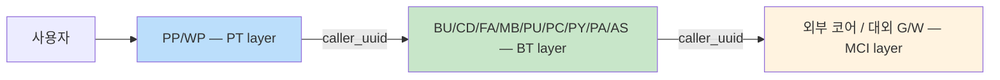

# 09a. 실 운영 필드 매핑 — 회사 환경에서 09 그대로 복붙용

> **목적**: [09. MSA 11서버 종합 KPI 전략](09-monitoring-strategy.md) 의 KPI / Dashboard / Alert / Transform 모두를 **실 운영 인덱스의 필드명** (svc_c, msg_c, sts_c, proc_tm 등) 으로 변환한 cheatsheet.
> **선수**: [99-real-document.md](99-real-document.md) (실 운영 doc 구조)
> **사용법**: 회사 Kibana 에서 옆에 띄워두고 KQL/DSL/Lens 그대로 복붙.
>
> 🔄 **2026-04-30 정정** ([Q-07](99-qna.md#q-07-회사-환경-5가지-검증-결과--정정사항-정리)) — 회사 검증 후 caller_uuid 의미 / log_div 값 4종 추가 / fir_err / data 자유형식 반영.

---

## 0. 한 페이지 매핑 cheatsheet

```
═══ 가이드 (mock) ════════════ 실 운영 ════════════════════════════════
service_name           svc_c       (BU/CD/FA/MB/PU/PC/PY/PP/WP/PA/AS — 11 MSA)
api_path               svc_id      (MCI ID 또는 Spring Mapping)
http_method            (없음 — svc_id 자체가 endpoint identifier)
http_status            (없음 — msg_c 기반 derive)
log_type               log_div     (*_IN/*_OUT/MCI_SEND/MCI_RECV/GW_SEND/GW_RECV — 6종)
trace_id               guid        (BE 전체 root)  + 7개 추가 trace ID
service_name           svc_c
is_error               sts_c       ("OK" / "ERROR")  또는  msg_c == "00000000"
error_code             msg_c       ("00000000" 정상 / 그 외 에러)
error_message          (없음 — data.<svc_id>_OUT 안에 추정)
elapsed_ms             proc_tm     (ms)
instance_id            ctnr_nm     (paas container)
host.name              metadata.lsh_hst_nm  (logstash host)
@timestamp             @timestamp 또는 log_tm

═══ 신규 차원 (실 운영에만) ═══════════════════════════════════════════
tier_c                 PT / BT / MCI 3-tier
chan_c                 MA(앱) / MW(모바일웹) / PW(PC웹) / DA(디지털ARS)
os_kdc                 I(iOS) / A(안드로이드) / W(웹)
device_model           기기 모델
ap_ver                 앱 버전
biz_c                  MSA 내부 업무 코드
dgtl_cusno + cd_cusno  고객 식별 (복합 key)
session_id             WAS 세션
scrn_uuid / scrn_id    화면 단위 거래 묶음
fir_err / fir_c        최초 에러 발생 tier
caller_uuid            호출 관계 (분산 추적)
usr_ip                 사용자 IP
takes.*                Logstash 처리 시간
metadata.logdate.*     ap → logstash 시간 흐름
```

> ✅ **확정 (2026-04-30)**: 정확한 필드명은 **`fir_err`**. 예시 doc 의 `f1r_err` 는 표기 오류였음. 본 문서 모든 곳 `fir_err` 로 정정.

---

## 1. 11 MSA 매핑 (svc_c)

| svc_c | 한국어 이름 | tier | 비고 |
|:-:|---|---|---|
| **BU** | 혜택 | BT | 마일리지/포인트/캐시백 |
| **CD** | 카드 | BT | 발급/관리/한도 |
| **FA** | 금융 | BT | 계좌/이체/잔액 |
| **MB** | 회원 | BT | 인증/회원정보 |
| **PU** | 이용내역 | BT | 거래내역/명세 |
| **PC** | 공통 | BT | 코드/공지/배너 |
| **PY** | 간편결제(페이) | BT | 결제 |
| **PP** | App PT | PT | 앱 프론트 |
| **WP** | Web PT | PT | 웹 프론트 |
| **PA** | 관리자 | BT | 운영 |
| **AS** | ACS(결제시스템) | **BT** | 결제 코어 (사내). MCI 호출 발생 |

> **계층 구조 정정 (2026-04-30)**: 11 MSA 중 **BT 9개 (BU/CD/FA/MB/PU/PC/PY/PA/AS) + PT 2개 (PP/WP)**.
> MCI 계층은 *외부 코어* (계정계 등) 와 *대외 G/W* 만 — MSA 가 아닌 외부 의존성. AS(ACS) 는 사내 결제 코어 BT 서비스로 MCI 를 호출하는 쪽.

**Saved query 후보** (KQL):
```
svc_c : ("BU" or "CD" or "FA" or "MB" or "PU" or "PC" or "PY" or "PA" or "AS")    # BT 9개
svc_c : ("PP" or "WP")                                                              # PT 2개
svc_c : ("PY" or "AS" or "FA")                                                      # 결제 critical path
```

---

## 2. 30 KPI — 모두 실 필드명 변환

### 2.1 SRE Golden Signals (M-S1 ~ M-S7)

#### M-S1 Availability

```kql
log_div : *_OUT and sts_c : "OK"
```
또는 (등가):
```kql
log_div : *_OUT and msg_c : "00000000"
```

**Lens Formula**:
```
count(kql='log_div:*_OUT and sts_c:"OK"')
  / count(kql='log_div:*_OUT')
```

**임계**: ≥ 99.9%

#### M-S2 Throughput / TPS

```
log_div : *_OUT
```
**Lens**: `count() / 300` (5분 = 300초 기준)

#### M-S3 Error Rate

```kql
log_div : *_OUT and (sts_c : "ERROR" or not msg_c : "00000000")
```

**Lens Formula**:
```
count(kql='log_div:*_OUT and sts_c:"ERROR"') / count(kql='log_div:*_OUT')
```

#### M-S4 Latency p50/p95/p99

```kql
log_div : *_OUT
```
**Lens**: `Percentile(proc_tm, [50, 95, 99])` ← `proc_tm` 사용

#### M-S5 Saturation
별도 Beats 메트릭 필요 (ES 로그만으론 X). 우회: 컨테이너별 throughput 대비 비율:
```
log_div : *_OUT
```
Lens: `count() by ctnr_nm` (분포 확인)

#### M-S6 4xx vs 5xx Ratio

`http_status` 가 **없음**. `msg_c` 기반 derive 또는 별도 응답코드 필드 확인 필요.

**Workaround**: client error vs server error 분류 약속 후 KQL:
```kql
log_div : *_OUT and not msg_c : "00000000" and msg_c : (E* or A*)   # 4xx
log_div : *_OUT and not msg_c : "00000000" and msg_c : (9* or P*)   # 5xx
```
(실 운영의 msg_c 코드 체계에 맞춰 조정)

#### M-S7 Slow Request Rate

```kql
log_div : *_OUT and proc_tm > 1000
```

### 2.2 백엔드 / 플랫폼 (M-P1 ~ M-P9)

#### M-P1 MSA Health Matrix

**Lens Table** chart:
```
Rows:     svc_c (Top 11)
Metrics:
  - Availability:  1 - count(sts_c:"ERROR") / count(log_div:*_OUT)
  - p95:           percentile(proc_tm, 95) filter log_div:*_OUT
  - TPS:           count() / window_seconds
  - Errors/min:    count(sts_c:"ERROR") / window_minutes
```

#### M-P2 In/Out Imbalance

```kql
log_div : *_IN
log_div : *_OUT
```
**DSL**: `bucket_script` 로 `|count(IN) - count(OUT)|` 계산. 동일 로직 ([§3.2 M-P2](09-monitoring-strategy.md#32-백엔드--플랫폼-9)) 의 `log_type` → `log_div` 만 교체.

> 단, log_div 가 `*_IN` / `*_OUT` 와일드카드 이므로 wildcard query 필요. KQL: `log_div : *_IN`

#### M-P3 Stuck Requests

`guid` (root trace) 기준 in 만 있고 out 없음 (10분 경과). Transform 으로 사전 집계:
```
group_by: guid
aggs:
  in_ts:  filter log_div:*_IN, min(@timestamp)
  out_ts: filter log_div:*_OUT, max(@timestamp)
filter (post): out_ts == null AND in_ts < now-10m
```

#### M-P4 Inter-Service Latency — **여기서 진짜 차별 가치**



같은 `guid` 의 PT 와 BT 의 시간 차 = inter-tier latency.
```
group_by: guid
aggs:
  pt_ts:  filter tier_c:"PT",  min(@timestamp)
  bt_ts:  filter tier_c:"BT",  min(@timestamp)
  mci_ts: filter tier_c:"MCI", min(@timestamp)
  pt_to_bt:  bt_ts - pt_ts
  bt_to_mci: mci_ts - bt_ts
```
→ 자세한 시나리오는 [99-tier-tracing.md](99-tier-tracing.md).

#### M-P5 Top API by Traffic

```
log_div : *_OUT
```
**Lens**: `count() by svc_id` (api_path 대신)

#### M-P6 Error Bursting API

```
log_div : *_OUT and sts_c : "ERROR"
```
**Lens**: `count() by svc_id, Top 10`

#### M-P7 Index Ingestion Lag

```
GET <real-index>/_search
{"size":0, "aggs":{"max_ts":{"max":{"field":"@timestamp"}}}}
```
응답 비교: `now() - max_ts` 가 5분 초과 시 alert.

추가 — 실 환경엔 `metadata.logdate.*`, `takes.*` 필드 활용:
```
takes.ap_logstash_takes  (ap → logstash 도착 시간)
takes.logstash_process_takes  (logstash 처리 시간)
```
**Lens**: `avg(takes.ap_logstash_takes) over time` — 평균이 ↑ 면 logstash 부하

#### M-P8 Service별 Outgoing Call Success Rate

`caller_uuid` 활용. 같은 caller 의 호출자(보통 PT) 에서 본 callee(BT/MCI) 의 성공률:
```
service_name(caller) → service_name(callee) success rate
```
Transform 으로 사전 매칭 권장.

#### M-P9 Instance Error Rate

```kql
log_div : *_OUT
```
**Lens**: `count(sts_c:"ERROR") / count() by ctnr_nm`

### 2.3 도메인 / 비즈니스 (M-D1 ~ M-D7)

#### M-D1 Top Error Codes

```kql
log_div : *_OUT and not msg_c : "00000000"
```
**Lens**: `count() by msg_c, Top 20`

#### M-D2 New Error Code Detection

```
어제까지 unique msg_c 목록 vs 오늘 unique msg_c → 차집합
```

Transform 으로 일자별 unique msg_c 인덱스 만든 후 비교.

#### M-D3 Critical API Error Rate

Critical svc_id 정의 (예: 결제 / 인증 / 이체):
```kql
svc_id : ("ppmc0408pC*" or "NCDP_NBNC_MIMEINS3810" or ...)
  and log_div : *_OUT
```
**Lens Formula**:
```
count(kql='svc_id:(...) and sts_c:"ERROR"')
  / count(kql='svc_id:(...) and log_div:*_OUT')
```

#### M-D4 Error Code by MSA

```
log_div : *_OUT and sts_c : "ERROR"
```
**Lens** (stacked bar):
- X: svc_c (11 MSA)
- breakdown: msg_c (Top 5 per MSA)

#### M-D5 거래 성공률

```
log_div : *_OUT and tier_c : "PT"          # PT 입장에서 본 거래 (사용자 시각)
```
sts_c:"OK" 비율.

#### M-D6 고유 거래 수 (DAU 추정)

```
cardinality(guid)         # 거래 단위 (root trace)
cardinality(dgtl_cusno)   # 사용자 단위 (실 DAU)
cardinality(scrn_uuid)    # 화면 단위
```

#### M-D7 Funnel Drop-off

`scrn_uuid` 활용 — 같은 scrn_uuid 안에서 진행한 svc_id 의 순서 분석. 화면 진입 → 어디서 이탈:
```
group_by scrn_uuid
collect: list(svc_id sorted by @timestamp)
```
Vega 또는 별도 분석.

### 2.4 운영 / Capacity (M-O1 ~ M-O6)

#### M-O1 Time-of-Day Pattern

표준. `@timestamp` 만 있으면 동일.

#### M-O2 Day-of-Week

표준. 동일.

#### M-O3 Dead API

Swagger 선언 svc_id 와 ES 호출 svc_id 차집합. Swagger 가 회사에 있으면 매일 비교.

#### M-O4 Shadow API

위 차집합 반대 (ES 에 있고 Swagger 에 없음).

#### M-O5 DoD/WoW Change

표준. 서비스별:
```
log_div : *_OUT
```
Lens timeshift: 1d 또는 1w.

#### M-O6 Peak RPS

표준.

### 2.5 추가 — 실 운영 only

#### M-X3 채널별 트래픽 (chan_c)

```
log_div : *_OUT
```
**Lens** (donut):
- Slice: chan_c (MA/MW/PW/DA)
- Size: count

#### M-X4 OS별 에러율 (모바일)

```
log_div : *_OUT and chan_c : "MA"
```
**Lens**: error rate by os_kdc.

#### M-X5 기기 모델별 painPoint

```
log_div : *_OUT and chan_c : "MA" and sts_c : "ERROR"
```
**Lens**: count by device_model, Top 20.

#### M-X6 Tier 별 분포

```
log_div : *_OUT
```
**Lens**: count by tier_c (PT/BT/MCI).

#### M-X7 비즈니스 코드별 (biz_c)

```
log_div : *_OUT
```
**Lens**: 같은 svc_c 안에서 biz_c 분포 — 어떤 업무가 가장 자주.

#### M-X8 첫 에러 위치 (fir_err / fir_c)

```
log_div : *_OUT and fir_err : "Y"
```
**Lens**: count by fir_c — "최초 에러가 어느 tier 에서 발생했나" 추적.

> 09 의 부록 매트릭스에 위 6개 추가 (M-X3~X8) 권장.

---

## 3. Dashboard 7종 — 패널 정의 변환

### D-RT1 SRE Golden Signals (실시간)

| KPI | 정의 (실 필드) |
|---|---|
| Availability | `count(sts_c:"OK") / count(log_div:*_OUT)` |
| Error Rate | `count(sts_c:"ERROR") / count(log_div:*_OUT)` |
| p95 latency | `percentile(proc_tm, 95)` filter `log_div:*_OUT` |
| TPS | `count(log_div:*_OUT) / 300` |

추가 패널: 채널별 트래픽 (M-X3), Tier 분포 (M-X6).

### D-RT2 MSA Health Matrix

```
Rows:        svc_c (11 MSA)
Cols/metrics:
  - Availability:    formula
  - p95:            percentile(proc_tm, 95)
  - TPS:            count / 300
  - Errors/min:     count(sts_c:"ERROR") / 5
  - Top error code: terms(msg_c, size=1)
```

추가: tier 별 분리 (PT/BT/MCI) 3 row 그룹.

### D-RT3 거래 추적

- In/Out Imbalance by svc_id (log_div:*_IN vs *_OUT)
- Stuck Requests (transform 결과)
- Top stuck guid 표
- **추가**: tier 간 latency (M-P4 — caller_uuid 기반)

→ 이 dashboard 의 진짜 가치는 [99-tier-tracing.md](99-tier-tracing.md) 참고.

### D-D1 일일 점검

- 어제 SLO (M-S1)
- Top msg_c (M-D1)
- Dead/Shadow svc_id (M-O3/O4)
- 신규 msg_c (M-D2)
- MSA × msg_c heatmap

### D-D2 도메인 에러 분석

- Top msg_c 시간순 + 메시지
- svc_c 별 분포 (M-D4)
- fir_err 추적 (M-X8) — 어디서 에러 시작
- saved search: 최근 100 에러 (guid, scrn_id, svc_c, msg_c)

### D-K1 주간 KPI

- 가용성 trend (timeshift)
- DAU = `cardinality(dgtl_cusno)` 추세
- 채널별 (chan_c) 비중 변화
- Critical svc_id 결제 성공률 (M-D3)

### D-O1 인덱스 헬스

- Ingestion lag (`takes.ap_logstash_takes`, `takes.logstash_process_takes`)
- 인덱스 size / shard 수
- container (`ctnr_nm`) 분포 — 부하 균형

---

## 4. Alerting 룰 11개 — 실 필드명

### P0 — 페이저

| ID | 룰 | KQL/조건 | 임계 |
|---|---|---|---|
| R-P0-1 | 가용성 폭락 | `log_div:*_OUT` | sts_c:"ERROR" 비율 > 1% in 5min |
| R-P0-2 | Error Rate spike | 동일 | > 5% in 5min |
| R-P0-3 | Latency 폭증 | `log_div:*_OUT` | p95(proc_tm) > 5000 in 5min |
| R-P0-4 | MSA 단절 | `svc_c:"<X>" and log_div:*_OUT` | count = 0 for 10min (정상시간대) |
| R-P0-5 | Pipeline lag | `metadata.logdate.*` 기반 | now - max(@timestamp) > 10min |

### P1 — Slack

| ID | 룰 | KQL/조건 | 임계 |
|---|---|---|---|
| R-P1-1 | Critical svc_id error spike | `svc_id:(critical-list) and sts_c:"ERROR"` | > 10건 in 5min |
| R-P1-2 | New msg_c | unique msg_c diff vs yesterday | new ≥ 1 |
| R-P1-3 | Stuck Requests | transform 결과 | > 100 stuck |
| R-P1-4 | In/Out Imbalance | log_div ratio | any svc_id > 5% |
| R-P1-5 | 단일 MSA error spike | `svc_c:"<X>" and sts_c:"ERROR"` | rate > 2% |
| R-P1-6 | Tier 간 latency 회귀 | M-P4 transform | bt_to_mci p95 +50% vs 1h ago |

### Action 템플릿 (실 필드 인용)

```yaml
PagerDuty:
  Summary: |
    🚨 [{{rule.name}}]
    MSA (svc_c): {{context.alerts.[0].svc_c}}
    Tier:        {{context.alerts.[0].tier_c}}
    msg_c:       {{context.alerts.[0].msg_c}}
    Channel:     {{context.alerts.[0].chan_c}}
    Container:   {{context.alerts.[0].ctnr_nm}}
    guid:        {{context.alerts.[0].guid}}
    Time:        {{date}}
  Custom:
    runbook: https://wiki/.../runbooks/{{rule.id}}
    dashboard: https://kibana/.../D-RT1
```

---

## 5. Transform 3개 — 실 필드 적용

### Transform 1: Latency 5분 rollup

```json
PUT _transform/latency-5m
{
  "source": {
    "index": "<your-real-index-pattern>",
    "query": { "wildcard": { "log_div": { "value": "*_OUT" } } }
  },
  "dest": { "index": "transform-latency-5m" },
  "pivot": {
    "group_by": {
      "ts":      { "date_histogram": { "field": "@timestamp", "calendar_interval": "5m", "time_zone": "Asia/Seoul" } },
      "svc_c":   { "terms": { "field": "svc_c" } },
      "svc_id":  { "terms": { "field": "svc_id" } },
      "tier_c":  { "terms": { "field": "tier_c" } }
    },
    "aggregations": {
      "p50":      { "percentiles": { "field": "proc_tm", "percents": [50] } },
      "p95":      { "percentiles": { "field": "proc_tm", "percents": [95] } },
      "p99":      { "percentiles": { "field": "proc_tm", "percents": [99] } },
      "tps":      { "value_count": { "field": "guid" } },
      "slow":     { "filter": { "range": { "proc_tm": { "gt": 1000 } } } }
    }
  },
  "frequency": "5m",
  "sync": { "time": { "field": "@timestamp", "delay": "60s" } }
}
```

### Transform 2: Error 5분 rollup

```json
PUT _transform/errors-5m
{
  "source": {
    "index": "<your-real-index-pattern>",
    "query": { "wildcard": { "log_div": { "value": "*_OUT" } } }
  },
  "dest": { "index": "transform-errors-5m" },
  "pivot": {
    "group_by": {
      "ts":         { "date_histogram": { "field": "@timestamp", "calendar_interval": "5m" } },
      "svc_c":      { "terms": { "field": "svc_c" } },
      "ctnr_nm":    { "terms": { "field": "ctnr_nm", "missing_bucket": true } },
      "msg_c":      { "terms": { "field": "msg_c", "missing_bucket": true } },
      "chan_c":     { "terms": { "field": "chan_c", "missing_bucket": true } }
    },
    "aggregations": {
      "total":   { "value_count": { "field": "@timestamp" } },
      "errors":  { "filter": { "term": { "sts_c": "ERROR" } } },
      "rate":    {
        "bucket_script": {
          "buckets_path": { "ok": "total", "err": "errors._count" },
          "script": "params.err / params.ok"
        }
      }
    }
  },
  "frequency": "5m",
  "sync": { "time": { "field": "@timestamp", "delay": "60s" } }
}
```

### Transform 3: API/시간 1시간 rollup

```json
PUT _transform/svc-1h
{
  "source": { "index": "<your-real-index-pattern>" },
  "dest": { "index": "transform-svc-1h" },
  "pivot": {
    "group_by": {
      "ts":      { "date_histogram": { "field": "@timestamp", "calendar_interval": "1h", "time_zone": "Asia/Seoul" } },
      "svc_c":   { "terms": { "field": "svc_c" } },
      "svc_id":  { "terms": { "field": "svc_id" } },
      "biz_c":   { "terms": { "field": "biz_c", "missing_bucket": true } }
    },
    "aggregations": {
      "calls":         { "value_count": { "field": "@timestamp" } },
      "errors":        { "filter": { "term": { "sts_c": "ERROR" } } },
      "unique_traces": { "cardinality": { "field": "guid" } },
      "unique_users":  { "cardinality": { "field": "dgtl_cusno" } }
    }
  },
  "frequency": "1h",
  "sync": { "time": { "field": "@timestamp", "delay": "5m" } }
}
```

> 📌 **회사 환경에서**: `<your-real-index-pattern>` 만 실 인덱스 패턴 (예: `test-keep-ing-mcs-*` 또는 운영 패턴) 으로 교체하면 그대로 동작.

---

## 6. KQL Saved Queries — 자주 쓰는 5개

```
# 1. 모든 OUT (응답)
log_div : *_OUT

# 2. 모든 IN (요청)
log_div : *_IN

# 3. 에러만
log_div : *_OUT and (sts_c : "ERROR" or not msg_c : "00000000")

# 4. 정상만
log_div : *_OUT and sts_c : "OK"

# 5. Critical path (결제 + 인증) — svc_id 약속 후
svc_id : ("ppmc*결제*" or "*MIMEINS*" or ...) and log_div : *_OUT
```

각각 Discover → Save current query → 이름 부여.

---

## 7. 함정과 한계 — 가이드 와 다른 점

### 7.1 `data` 가 완전 자유형식 (**가장 큰 함정**)

```json
"data": { "<svc_id>_OUT": { ... } }   ← 키 동적
"data": "string value"                 ← 또는 string
"data": 12345                          ← 또는 number
"data": [ ... ]                        ← 또는 array
"data": { ... arbitrary nested ... }   ← 자유 object
```

**확정 사실 (Q-07)**: data 하위는 **string / number / object / array** 모두 가능. 정해진 schema 없음.

→ **함의**:
- 거의 확실히 `data` 는 매핑 폭발 방지를 위해 **`enabled: false`** 또는 **`flattened`** 로 매핑됨
- 정적 path (`data.body.amount` 같은) 사용 불가
- Runtime field 도 svc_id 마다 path 달라 표현 어려움
- **거의 유일한 해결**: ingest pipeline (또는 app 단) 에서 핵심 비즈니스 필드를 top-level 로 promote 합의 → [08 Phase 3/4](08-card-platform-payload-strategy.md)
- 또는 SpecFromLog 처럼 별도 분석 인덱스 (transform-target) 에 promoted 필드만 적재

**임시 우회**: `wildcard` query 로 string 안 일부 검색은 가능하지만 비용 큼:
```kql
data : *amount*    # 매우 느림 — 운영 권장 X
```

### 7.2 `http_method` / `http_status` 없음

→ 09 의 M-S6 (4xx vs 5xx) 와 method-based 분석은 **`msg_c` 코드 체계 파악 후 derive 또는 새 매핑 합의** 필요.

### 7.3 `log_div` 6종 — 단순 *_IN/*_OUT 가정 X

회사 검증 결과 (Q-07):

| log_div 값 | 의미 |
|---|---|
| `*_IN` | tier 진입 (PT_IN, BT_IN 등) |
| `*_OUT` | tier 종료 (PT_OUT, BT_OUT 등) |
| `MCI_SEND` | MCI 측에 송신 (BT → MCI) |
| `MCI_RECV` | MCI 측에서 수신 (MCI → BT) |
| `GW_SEND` | 대외 G/W 로 송신 (BT → 외부) |
| `GW_RECV` | 대외 G/W 에서 수신 (외부 → BT) |

> 💡 `log_div : *_OUT` 으로만 KQL 작성하면 **MCI/GW 트래픽 누락**.

#### 정확한 KQL 패턴
```
# 응답 (downstream → 우리 시스템 수신)
log_div : (*_OUT or MCI_RECV or GW_RECV)

# 요청 (우리 시스템 → downstream 송신)
log_div : (*_IN or MCI_SEND or GW_SEND)

# 외부 의존성만 (G/W 통과 트래픽)
log_div : (GW_SEND or GW_RECV)

# 코어 의존성만 (MCI 통과)
log_div : (MCI_SEND or MCI_RECV)
```

#### 운영 권장
Runtime field 로 정규화:
```json
PUT <index>/_mapping
{
  "runtime": {
    "log_direction": {
      "type": "keyword",
      "script": { "source": """
        def v = params._source.log_div;
        if (v == null) return;
        if (v.endsWith('_OUT') || v == 'MCI_RECV' || v == 'GW_RECV') emit('out');
        else if (v.endsWith('_IN') || v == 'MCI_SEND' || v == 'GW_SEND') emit('in');
      """ }
    },
    "log_target": {
      "type": "keyword",
      "script": { "source": """
        def v = params._source.log_div;
        if (v == null) return;
        if (v.startsWith('MCI_')) emit('mci');
        else if (v.startsWith('GW_')) emit('gw');
        else emit('internal');
      """ }
    }
  }
}
```
→ KQL: `log_direction : "out"`, `log_target : "gw"` 등 단순화.

### 7.4 G/W 와 MCI 는 **같은 tier** (외부 vs 코어 구분만 다름)

| 구분 | 의미 |
|---|---|
| **MCI** | 사내 **코어 서버** 연동 (계정계 / ACS 결제) |
| **G/W** | **대외** 시스템 연동 |

→ `tier_c` 는 PT/BT/MCI 3종이지만 MCI tier 안에서 코어 vs 대외 구분 시 **`log_div` 의 prefix** (`MCI_*` vs `GW_*`) 사용.

분석 예:
```kql
# MCI 코어 의존성 latency
tier_c : "MCI" and log_div : (MCI_SEND or MCI_RECV)

# 대외 G/W 의존성 latency
tier_c : "MCI" and log_div : (GW_SEND or GW_RECV)
```

### 7.5 `sts_c` vs `msg_c` 중복

`sts_c == "OK"` 와 `msg_c == "00000000"` 가 거의 동치 — 어느 게 master? 일치 안 하는 경우 발생 시 어느 게 표준? **회사에서 합의 필요**. 본 문서는 `sts_c` 우선 사용 (boolean 명확).

### 7.6 trace ID 8종 — 어느 걸 root 로?

| 시나리오 | 추천 |
|---|---|
| BE 전체 거래 묶기 | **`guid`** |
| 사용자 화면 단위 | `scrn_uuid` |
| FE 거래 단위 (axios) | `app_uuid` |
| BT 호출 단위 | `bt_uuid` |
| MCI 코어 연동 | `mci_uuid` |
| 외부 G/W | `gw_uuid` |
| 호출 chain | `caller_uuid` (§7.7 의 정확 의미) |
| WAS 세션 | `session_id` |

→ 09 의 M-P3 (Stuck), M-P4 (Inter-Service Latency) 는 **`guid`** 권장.

### 7.7 `caller_uuid` 의 정확한 의미 (확정 — Q-07)

각 layer 는 자체 guid 를 가짐:

| tier | 자체 guid 필드 | caller_uuid 가 가리키는 값 |
|---|---|---|
| **PT** | `guid` | (없음 — root) |
| **BT** | `bt_uuid` | PT 의 `guid` |
| **MCI (core)** | `mci_uuid` | BT 의 `bt_uuid` |
| **MCI (외부 GW)** | `gw_uuid` | BT 의 `bt_uuid` |

**예시** (한 결제 거래):
```
PT  doc:  guid="A"
BT  doc:  bt_uuid="B",   caller_uuid="A"   ← PT 의 A 호출
MCI doc:  mci_uuid="C",  caller_uuid="B"   ← BT 의 B 호출
```

KQL 로 chain 복원:
```
guid : "A"                # 모든 관련 doc (같은 guid 공유)
bt_uuid : "B"             # BT 한정
caller_uuid : "B"         # B 가 호출한 모든 callee
```

### 7.8 `fir_err` 정확한 필드명 (확정)

→ 회사 검증 결과 **`fir_err`** 가 정확. 예시 doc 의 `f1r_err` 는 표기 오류였음. 본 문서 일괄 정정됨.

---

## 8. 검증 체크리스트 — 회사 환경에서

회사 가서 본 cheatsheet 실효성 검증:

```
[ ] svc_c 11개 모두 데이터에 존재 확인
[ ] sts_c "OK" / "ERROR" 두 값만 있는지
[ ] msg_c "00000000" / 그 외 분포 확인
[ ] proc_tm 단위 ms 인지 (값 분포 확인)
[ ] log_div 가 *_IN / *_OUT 외 다른 값 (예: MCI_RECV) 도 있는지
[ ] tier_c "PT" / "BT" / "MCI" 분포
[ ] guid 가 in/out 모두 채워져 있는지 (M-P4 활용 가능?)
[ ] fir_err vs fir_err 실 필드명 확인
[ ] http_method, http_status 정말 없는지 다시 점검
[ ] Critical svc_id 정의 (결제/인증/이체) 사내 합의
[ ] dgtl_cusno + cd_cusno unique 키 동작 확인
[ ] Critical path D-RT1 패널 한번 만들어 보기 (Availability/Error/p95/TPS)
```

---

## 9. 다음 학습

- [99-tier-tracing.md](99-tier-tracing.md) — 3-tier (PT/BT/MCI) + 다중 trace ID 활용 deep-dive
- [09-monitoring-strategy.md](09-monitoring-strategy.md) — 원본 가이드 (mock 필드명)
- [08-card-platform-payload-strategy.md](08-card-platform-payload-strategy.md) — `data` 동적 키 처리

---

## 한 페이지 요약 (인쇄용)

```
══════════ 실 운영 핵심 매핑 ══════════
service       svc_c            (11 MSA: BU/CD/FA/MB/PU/PC/PY/PP/WP/PA/AS)
api           svc_id           (Spring Mapping or MCI ID)
정상여부      sts_c            ("OK"/"ERROR")
에러코드      msg_c            ("00000000"/그외)
trace root    guid             (BE 전체 거래)
tier          tier_c           (PT/BT/MCI)
channel       chan_c           (MA/MW/PW/DA)
인스턴스      ctnr_nm          (paas container)
응답시간      proc_tm          (ms)
사용자        dgtl_cusno + cd_cusno
화면          scrn_uuid + scrn_id
호출체인      caller_uuid

══════════ KPI 즉시 시작 (Top 5) ══════════
Availability    1 - count(sts_c:"ERROR") / count(log_div:*_OUT)
Error Rate      count(sts_c:"ERROR") / count(log_div:*_OUT)
p95 Latency     percentile(proc_tm, 95) filter log_div:*_OUT
TPS             count(log_div:*_OUT) / 300
MSA Matrix      위 4개 by svc_c, Top 11

══════════ 함정 ══════════
- data 동적 키 (data.<svc_id>_OUT) — 정적 path X
- http_method/status 없음 — svc_id 사용
- log_div 와일드카드 — runtime field 로 정규화 권장
- fir_err 인지 fir_err 인지 회사 확인
- Critical svc_id 정의 사내 합의 필요
```
