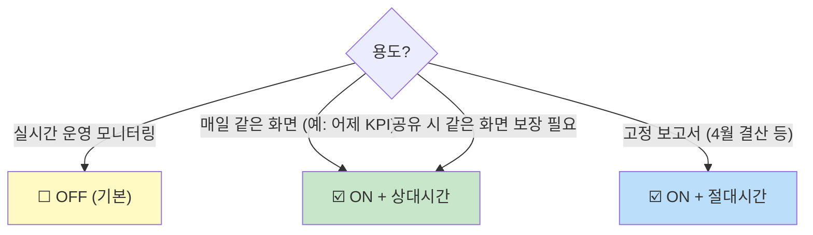
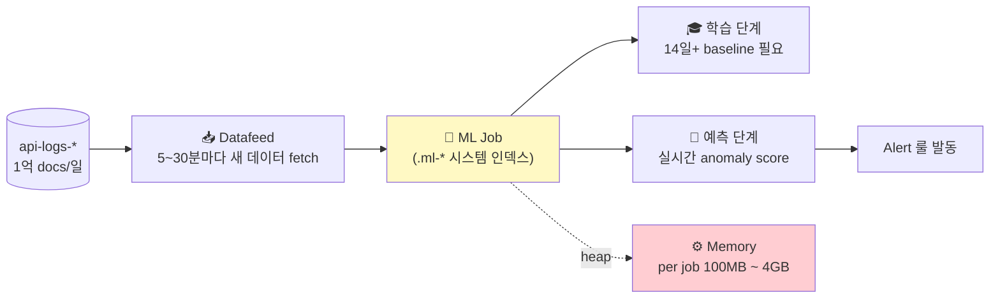
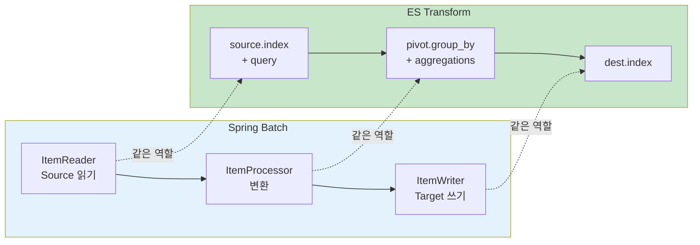

# 99. Q&A — 학습 중 발견한 모호한 점 / 추가 질문

> **사용법**: 다른 문서 읽다가 헷갈리는 곳이 있으면 여기에 모아 답합니다. 사용자 ↔ 작성자 핑퐁 기록.
> **양식**: 한 Q 당 (어느 문서 / 원문 / 질문 / 답 / 보강 여부) 5필드.

---

## 작성 양식

```markdown
## Q-NN. (한 줄 제목)

- **출처**: 어느 문서, 어느 섹션 (가능하면 line 또는 헤더)
- **원문 / 맥락**:
  > 인용

- **Q**: 무엇이 헷갈리나
- **A**: 답변 (가능하면 예시 + Oracle 비유)
- **문서 보강**: 원 문서에 반영함 / 안 함 (사유)
```

---

## Q-01. `_source` 하위 (data 외) 에 에러 여부 필드가 있다면 indexed 인지 어떻게 확인?

- **출처**: 사용자 제기 (08-card-platform-payload-strategy.md 보강 계기)
- **맥락**: 카드 결제 플랫폼 환경에서 `data.header/body` 는 unindexed. 하지만 `_source` 의 top-level (data 와 동일 깊이) 에 `isError` / `errorYn` 같은 에러 플래그 필드가 있는 경우. indexed 여부 확인 + 활용 방법.

### Q
1. 이 필드가 검색·집계에 쓸 수 있는 상태인가?
2. 만약 indexed 면 Phase 2 (runtime field) 까지 안 가도 에러 KPI 가능?

### A

**확인 4 방법** (직접적인 순서):

#### ① 패턴으로 (이름 모를 때)

```
GET api-logs-*/_mapping/field/*error*
```

응답에 매핑 정의가 보이면 → indexed 또는 적어도 매핑됨.
응답이 비어 있으면 → 매핑 자체가 없음.

#### ② 정확한 이름 알면 (`_field_caps` — 가장 정확)

```
GET api-logs-*/_field_caps?fields=isError,error,errorYn
```

응답:
```json
{
  "fields": {
    "isError": {
      "boolean": {
        "type": "boolean",
        "searchable": true,    ← KQL/필터 가능
        "aggregatable": true   ← 집계 가능
      }
    }
  }
}
```

| `searchable` | `aggregatable` | 결론 |
|:-:|:-:|---|
| ✅ | ✅ | **완전 indexed** — 즉시 KPI 사용 가능 |
| ✅ | ❌ | text 만 — `.keyword` 시도 |
| ❌ | ❌ | unindexed (`enabled: false` 등) — runtime field 필요 |

#### ③ 실제 aggregation 로 검증

```json
GET api-logs-*/_search
{
  "size": 0,
  "aggs": { "by_error": { "terms": { "field": "isError" } } }
}
```

성공 응답 → indexed. `illegal_argument_exception` → text 거나 unindexed.

#### ④ Discover UI

좌측 사이드바에서 필드 검색 → 클릭 → "Top values" popup 즉시 뜸 → indexed. "field is not aggregatable" → text/unindexed.

### indexed 인 경우 즉시 활용

```
KQL: isError : true                                       ← 모든 에러
Lens Formula: count(kql='isError:true') / count(kql='log_type:"out"')   ← 에러율
Alert: count(isError:true) > 100 in 5min                  ← 알림 룰
```

→ **Phase 2 (runtime field) 안 가도** Phase 1 에서 SRE 4 golden signals 의 Errors 채워짐.

### 한계 (그래도 Phase 2+ 가 필요한 부분)

`isError` 만으로는 다음 못 함:
- 어떤 **에러 코드** 가 많은가 (`data.header.resultCode`)
- **채널/가맹점/거래액** 별 분포

→ 운영 1차 신호는 OK, 진단 깊이는 Phase 2+ 필요.

### 문서 보강
- ✅ 본 99-qna 에 정식 등록
- ✅ 08-card-platform-payload-strategy.md §3 (Phase 1) 의 첫 단계로 "**top-level 에러 플래그 존재 확인**" 추가

---

## Q-02. Dashboard 저장 시 "Store time with dashboard" 옵션은 무엇?

- **출처**: 사용자 제기 (03-dashboards 실습 중)
- **맥락**: Kibana 에서 dashboard 저장(Save) 다이얼로그에 체크박스 옵션 "Store time with dashboard". 켜기/끄기 차이가 헷갈림.

### Q
체크 vs 미체크 동작 차이는? 어떤 경우에 어느 쪽?

### A

| 옵션 | 의미 | 동작 |
|---|----|----|
| ☑️ **ON** | dashboard 와 **시간 범위 함께 저장** | 누가 언제 열어도 저장한 그 시간 범위로 자동 |
| ☐ **OFF (기본)** | 시간 범위 저장 X | 사용자의 현재 시간 피커 유지 (또는 브라우저 default) |

#### 저장되는 시간의 종류 (ON 일 때)

- **상대 시간** (`Last 7 days` 등) → 열 때마다 "지금 기준 -7일" 자동 계산. 가장 흔히 ON 으로 사용.
- **절대 시간** (`2026-04-01 ~ 2026-04-07`) → 영구 고정. 결산 보고서 용.

#### 의사결정



#### Dashboard 별 권장 (예시)

| Dashboard | 권장 | 이유 |
|-----------|----|----|
| D1 API 운영 현황 | OFF | 운영자가 그때그때 1h/24h/7d 자유 조정 |
| D2 에러 진단 | OFF | 사고 발생 시 임의 시간대 분석 |
| D3 트래픽 패턴 | **ON + Last 7 days** | "주간 트렌드" 가 정체성 |
| 월간 결산 | **ON + 절대시간** | 그 달 고정 보고서 |

#### 흔한 함정

- ON + 절대시간 → 한 달 후 보면 옛날 데이터만 (의도였지만 모르고 보면 혼란)
- OFF + 사용자 default `Last 15 min` → "데이터 없음" 함정 (시간 피커 안 만진 채 데이터 범위 밖)
- 같은 dashboard 를 두 그룹이 다른 시간대로 본다면 OFF 가 안전

### 문서 보강
- ✅ 본 99-qna 에 정식 등록
- 🔄 [03-dashboards.md](03-dashboards.md) §"Save 시 옵션" 에 추후 인라인 추가 가능

---

## Q-03. Platinum 라이선스가 있다면 어디까지 추가 활용 가능?

- **출처**: 사용자 제기 (사내 라이선스 = Platinum 확인)
- **맥락**: 본 학습 환경(로컬, free tier) 은 Basic 만 사용. 실 운영(폐쇄망) 은 Platinum. Free 에서 실습 안 되는 기능은 지식 학습으로만.

### A — Platinum 에서만 풀리는 운영 가치 큰 기능

| 기능 | 라이선스 | 활용도 | 우리 환경 적용 시 |
|---|---|---|---|
| **ML Anomaly Detection** | Platinum | ⭐⭐⭐ | M-O5 (DoD/WoW) 임계 룰 대신 자동 anomaly. 시간대/요일 자연 패턴 학습 |
| **Searchable Snapshots** | Enterprise | ⭐⭐⭐ | ILM cold/frozen 데이터를 S3-like 에 저장 (90% 비용 절감) |
| **Cross-Cluster Search/Replication** | Platinum | ⭐⭐ | 다중 데이터센터 / DR (Disaster Recovery) |
| **Field-level Security** | Platinum | ⭐⭐ | 같은 인덱스에서 사용자별 보이는 필드 다르게 (예: PII 차폐) |
| **Document-level Security** | Platinum | ⭐⭐ | 같은 인덱스에서 행 단위 권한 (예: 부서별) |
| **Auditing** | Platinum | ⭐⭐ | 누가 언제 무엇을 query 했는지 기록 (compliance) |
| **Customizable Kibana Branding** | Platinum | ⭐ | 사내 로고 / 색상 / 도메인 (cosmetic) |
| **Watcher (advanced)** | Gold+ | ⭐⭐ | (이미 Gold 부터) 복잡한 alert 체인 |
| **Reporting (PDF/CSV)** | Gold+ | ⭐⭐ | dashboard PDF 자동 발송 (D-K1 주간 보고 자동화) |

### Platinum 활용 시나리오 — 우리 09 전략 강화

**1. ML Anomaly Detection 도입**
- 현재: M-O5 (DoD/WoW) 단순 임계로 anomaly 감지 → false-positive 가끔
- Platinum: ML Job 이 시간대 × 요일 × 서비스 자연 패턴 학습 → "월요일 9시는 평소 +50%, 화요일 9시는 평소 +20%" 같이 정밀 base line
- 결과: alert noise 70%↓, 진짜 anomaly 잡기 ↑

**2. Searchable Snapshots — Cold Tier 비용 절감**
- 현재 ILM: Hot (7d) → Warm (30d) → Cold (60d) → Delete (90d)
- Platinum: Cold/Frozen 을 S3 / Azure Blob 에 snapshot 저장. ES 노드 디스크 대신 object storage. **90일 데이터 보존 비용 ~90% ↓**
- 1억 docs/일 × 90일 = 9TB 규모에서 큰 절감

**3. Field-level Security**
- 우리 PII 마스킹 정책 (08 §3.0 의 fieldPolicy 활용) 보다 ES 자체에서 처리
- 사용자 role 별로 `data.body.cardNumber`, `data.body.juminNo` 차폐
- 로그 분석가는 보지만 운영자는 못 봄 — 라이선스/감사 강력

**4. Cross-Cluster Replication (CCR)**
- 1 cluster down → 자동 failover
- 다중 데이터센터 운영 시 필수

### 본 가이드 내 Platinum 마킹 정책

각 문서에서 Platinum 전용 부분은 다음 박스로 표시:

> 💎 **Platinum+ 기능** — 본 학습 환경(Basic) 에선 실습 불가. 사내 운영 환경에서 활용 가능.

### 문서 보강
- ✅ 본 99-qna 에 정식 등록
- ✅ [09-monitoring-strategy.md](09-monitoring-strategy.md) 에 Platinum 박스 추가 (다음 push)

---

## Q-04. ML Anomaly Detection 이 인프라 자원 많이 필요한가?

- **출처**: 사용자 제기 (Q-03 의 후속)
- **맥락**: ML Job 운영을 결정하기 전 인프라 부담 평가.

### A — 결론: **꽤 큼. dedicated 노드 권장**.



### 자원 부담 — 우리 환경 (11 MSA / 1억 docs/일)

| 항목 | 추정 부담 |
|---|---|
| **ML 노드** | 권장: 1~2개 dedicated (16GB+ RAM each) |
| **Job 1개당 heap** | 단순 (count anomaly): 100~512MB / 복잡 (multi-metric): 1~4GB |
| **권장 jobs 수** | 5~10개 (서비스별 + critical API 별) → **합 5~25GB heap** |
| **Datafeed 부하** | 5분마다 raw 인덱스 query → ES heap +CPU. transform 인덱스 가리키면 부담 ↓ |
| **저장 공간** | `.ml-*` 시스템 인덱스 — 모델 저장 보통 1~5GB / job |
| **학습 기간** | 14일+ baseline 필요. 그 전엔 false-positive 많음 |
| **CPU** | predict 단계 지속 (ML 노드 평균 30~50% 사용 가정) |

### 3가지 deployment 패턴

#### Pattern 1: 스파르탄 (별도 노드 X)

기존 데이터 노드 위에 ML 띄우기.
- ✅ 인프라 추가 0
- ❌ 검색 성능 영향 ↑, ES heap 압박 위험
- 🟡 PoC / 작은 규모만

#### Pattern 2: Dedicated ML 노드 1개

ML 전용 노드 1개 (16GB+ RAM).
- ✅ 검색 노드 분리 보호
- ✅ 5~10 jobs 수용
- 🟢 **본 환경 권장 시작점**

#### Pattern 3: ML 노드 2~3개 클러스터링

대규모 jobs (50+) / 다중 cluster.
- 비용 ↑↑
- 우리 규모엔 과함

### Spring Boot 비유

| ES | Spring Boot |
|---|---|
| ML Job | `@Scheduled` 잡 + 통계학 모델 (예: ARIMA) 라이브러리 |
| Datafeed | `@Scheduled(fixedDelay)` |
| .ml-* 시스템 인덱스 | 모델 weight 저장하는 별도 DB 테이블 |
| Anomaly score | application 이 계산해서 metric 으로 발행 |

→ 직접 Spring Batch + Smile/Apache Commons Math 같이 짜면 비슷한 효과 가능. 다만 ES ML 은 데이터 위치 (이미 ES 안) + 통합 GUI + multi-bucket 자동 관리 등이 큰 장점.

### 권장 시작

1. PoC: 1 job (전체 traffic anomaly) — 노드 추가 없이 7일 운영
2. 효과 좋으면: dedicated ML 노드 1개 추가 + 5~10 jobs 확장
3. 비용 검증: ML 라이선스 + 노드 대비 alert noise 감소 가치

### 문서 보강
- ✅ 본 99-qna 에 정식 등록
- 추후 09 문서에 "ML 도입 시 인프라 sizing" 부록 가능

---

## Q-05. Transform 이 무슨 개념? Spring Batch 와 같나?

- **출처**: 사용자 제기 (07 문서 학습 보강)
- **맥락**: Transform 의 정확한 메커니즘 + Java 생태계 비유.

### A — **거의 Spring Batch + Materialized View 의 결합**.

#### 1줄 정의
"ES source 인덱스의 데이터를 group_by + aggregations 으로 사전 집계해서 dest 인덱스에 적재하는 ES 내장 ETL 엔진".

#### Spring Batch 와의 직접 비유



| Spring Batch | ES Transform |
|---|---|
| `JobLauncher` | `_transform/<id>/_start` API |
| `JpaItemReader<Source>` | `source.index` + `query` |
| `ItemProcessor<S, T>` | `pivot.group_by` + `aggregations` |
| `JpaItemWriter<Target>` | `dest.index` |
| `@Scheduled(fixedDelay = 5min)` | `frequency: "5m"` |
| `@StepScope` (chunk-oriented) | continuous mode 의 increment processing |
| Late-arriving data 처리 | `sync.delay` (예: 60s 대기 후 fetch) |
| Failed step retry | task API + 자동 재시도 |
| Job repository | `_transform/_stats` API |

#### 차이점

| 측면 | Spring Batch | ES Transform |
|---|---|---|
| 정의 | Java 코드 (Job/Step bean) | JSON DSL (선언적) |
| 실행 위치 | application JVM | ES 클러스터 자체 |
| 데이터 위치 | RDB ↔ Java ↔ RDB | ES → ES (이동 없음, in-cluster) |
| 모드 | one-shot 또는 cron | one-shot 또는 **continuous** (실시간 점진) |
| GUI | (없음, 코드 작성) | Kibana Stack Management → Transforms |
| 라이선스 | OSS | Basic (free) |

#### 우리 환경 적용 예

[07-batch-transform.md](07-batch-transform.md) §7.3 의 Transform 정의 = Spring Batch 의 다음과 같은 잡을 ES 내장으로:

```java
// Spring Batch 등가 의사코드
@Bean
public Job apiStatsDailyJob() {
  return jobBuilder
    .start(step("read-out-logs")
      .reader(esReader.query(termQuery("log_type", "out")))
      .processor((doc) -> aggregateBy(doc.serviceName, doc.apiPath, doc.timestamp))
      .writer(esWriter.toIndex("api-stats-daily")))
    .build();
}
```

→ Java 코드 없이 ES 내부에서 동일 효과 + 5분마다 자동 점진.

#### Materialized View 와도 비유 가능

Oracle / PostgreSQL 의 materialized view = 사전 계산된 query 결과 저장. Transform 의 dest 인덱스 = 그것과 거의 동일 컨셉. 차이는 **자동 점진 갱신** 까지 ES 가 해줌.

### 문서 보강
- ✅ 본 99-qna 에 정식 등록
- ✅ [07-batch-transform.md](07-batch-transform.md) 에 Spring Batch 비유 추가 (다음 push)

---

## Q-06. Rollup 무슨 개념? Java 비유?

- **출처**: 사용자 제기
- **맥락**: 07 문서에 Rollup 도 언급되지만 deprecated 라고만 — 정확한 개념 + 비유 필요.

### A — **Transform 의 단순화 ancestor (시계열 합산 전용)**.

#### 1줄 정의
"시계열 데이터를 시간 bucket × terms 로 사전 집계하는 ES 내장 잡 — Transform 의 limited 버전".

#### Spring Batch / Java 비유

```java
// Rollup 등가 — Spring 의 매우 단순한 시계열 sum 잡
@Scheduled(cron = "0 0 1 * * ?")  // 매일 01:00
public void hourlyAggregate() {
  for (each hour in last 1d) {
    for (each service) {
      long count = countLogs(hour, service);
      double avg  = avgDuration(hour, service);
      saveToTable(hour, service, count, avg);   // 단순 sum/avg/count/min/max만
    }
  }
}
```

→ **percentile, cardinality, formula 등 복잡한 aggregation 못 함**. count/sum/avg/min/max 기본 5개만.

#### Transform vs Rollup 차이

| 기능 | Rollup (legacy) | Transform |
|---|:---:|:---:|
| count | ✅ | ✅ |
| sum / avg / min / max | ✅ | ✅ |
| percentile (p50/p95/p99) | ❌ | ✅ |
| cardinality (DISTINCT) | ❌ | ✅ |
| formula / bucket_script | ❌ | ✅ |
| GUI 친화도 | △ 일부 | ✅ Kibana Stack Mgmt |
| Continuous mode | ❌ batch only | ✅ 점진 갱신 |
| 결과 조회 API | `_rollup_search` 전용 | 일반 `_search` |
| ES 8.x 상태 | **deprecated** | ✅ 권장 |
| ES 9.x | **제거됨** | ✅ 유지 |

#### 학습 가치

- 신규 시스템: **Rollup 사용하지 마**. Transform 으로
- 레거시 마이그: 기존 Rollup job 을 Transform 으로 다시 정의 (계산 결과 동일 + percentile 추가 가능)
- 면접/이론 학습 정도

#### Java 비유 종합

| ES 개념 | Java 생태계 비유 | 비고 |
|---|---|---|
| **Index** | DB Table, JPA `@Entity` | row = document |
| **Mapping** | DB schema (DDL) | `@Column(columnDefinition=...)` |
| **Document** | Row, JPA Entity 인스턴스 | `_source` = 직렬화된 JSON |
| **Data View (Kibana)** | JPA Repository scope 또는 SQL VIEW | 여러 인덱스 묶기 |
| **Field** | Column | dotted path (`data.header.x`) |
| **Aggregation** | JPQL `GROUP BY` + 집계 함수 | nested = 중첩 group by |
| **Query DSL** | JPA Criteria API / QueryDSL | bool/filter/must = predicate 조합 |
| **KQL** | Spring Data 메서드 명 (간단 query) | `findByServiceAndIsErrorTrue` |
| **Transform** | **Spring Batch + Continuous streaming** | 사전 집계 ETL |
| **Rollup** | **Spring Batch (단순 sum/avg 잡)** | legacy, 단순 시계열만 |
| **Ingest Pipeline** | JPA `@PrePersist` EntityListener | doc 받기 전 변환 |
| **Runtime field** | Hibernate `@Formula` (계산 컬럼) | search-time 계산 |
| **ILM Policy** | DB partition + 자동 archive 잡 | hot/warm/cold 라이프사이클 |
| **Reindex** | JPA + Spring Batch 데이터 마이그 | 인덱스 통째 복사 + 변환 |
| **Alias** | DB synonym 또는 view | 가상 핸들 |
| **Snapshot** | DB dump (`expdp` / `pg_dump`) | S3/disk 저장 |
| **Watcher / Alerts** | Spring Boot `@Scheduled` + Slack notifier | cron + alert 발송 |
| **Dashboard** | Spring Actuator + Grafana | 시각화 |

### 문서 보강
- ✅ 본 99-qna 에 정식 등록
- ✅ [99-oracle-to-es.md](99-oracle-to-es.md) 에 Java 생태계 매핑 부록 추가 권장
- ✅ [07-batch-transform.md](07-batch-transform.md) Rollup 섹션 보강 권장

---

## (이후 등록될 Q 자리)

학습 진행하시며 막히는 지점 알려 주시면 여기에 추가합니다.

---

## 자주 묻는 질문 시드 (예시)

문서를 읽기 전에 통상적으로 자주 나오는 질문 모음. 답이 이미 본 문서에 없을 때만 정식 Q-NN 으로 격상.

### S1. KQL 의 `:` 와 SQL 의 `=` 가 정말 같은가?
- 거의 같지만, KQL 의 `:` 는 텍스트 검색의 경우 **analyzer 적용** 결과와 매칭. keyword 필드면 1:1, text 필드면 token 매칭.
- 정확 매칭이 필요하면 keyword 필드 사용 또는 `match_phrase` (DSL).

### S2. 매번 데이터 조회할 때 `_search` 가 헤비하다는데?
- ES `_search` 는 cache·shard 조회 모두 거치는 가장 일반화된 API. 가벼움.
- "헤비" 는 잘못된 query (`size: 10000`, 와일드카드 `*foo*` 등) 가 무거운 것. query 가 가벼우면 `_search` 자체는 ms 단위.

### S3. ES 에서 transaction (커밋/롤백) 이 정말 안 되나?
- 단일 document 의 read/update 는 atomic.
- 여러 document 에 걸친 transaction 은 없음. application 측 saga / compensating transaction 패턴.
- **대안**: bulk API 의 single batch 는 부분 실패 가능 (전부/전무 보장 없음). 결과의 `errors` 플래그 확인 필수.

### S4. 매핑이 폭발한다는 게 무슨 말?
- Dynamic 매핑이 ON 인 상태에서 schema 가 매번 다른 JSON (예: `data.123`, `data.124`, ... 변동 키) 이 들어오면 ES 가 자동으로 모든 키를 매핑.
- 결과: 인덱스의 매핑이 수만 개 필드로 폭증 → 메모리/디스크/검색 모두 느려짐.
- **방어**: `dynamic: strict` 또는 `flattened` 타입 사용.

### S5. "근사값" 이라는 aggregation 이 실제 비즈니스에 문제 되나?
- `cardinality` (HyperLogLog) — 0.5% 오차 (precision_threshold 기본 3000). 100K 까지는 거의 정확.
- `terms` aggregation — shard 별 top → coordinator 합산 방식. 전체 cardinality 가 size 보다 훨씬 크면 누락 가능.
- **언제 문제**: 결제 합산 같이 정확값 필수면 부적합. 운영 모니터링은 99% 케이스 OK.

### S6. ES 인덱스 1개에 1억 docs 들어가면 안전한가?
- 단일 shard 의 권장 크기: **20~50GB** 또는 **2~5억 docs** (워크로드 따라).
- 1억 docs 면 single shard 도 OK. 단 검색 latency 가 늘 수 있음.
- 더 크면 shard 수 늘리거나 시간 기반 인덱스 분리.

### S7. Dashboard 에서 시간 피커가 모든 패널에 적용되는데, 한 패널만 다른 시간을 보고 싶다면?
- 패널 ⋮ → Edit → 좌측 위 시간 옵션 → "Use a custom time range" 활성화.
- 또는 패널 자체에 KQL 의 `@timestamp >= "..."` 를 넣을 수 있지만 추천 X.

### S8. transformation 결과 인덱스의 매핑을 미리 정의하지 않으면?
- ES 가 dynamic 매핑으로 추론. percentile aggregation 결과가 nested object 로 매핑되는 등 의도와 다를 수 있음.
- **권장**: transform 만들기 전 `_index_template` 으로 결과 인덱스의 매핑 미리 박아두기.

---

## 보강 정책

새 Q-NN 이 등록되면:

1. 답변을 여기 (99-qna.md) 에 명시
2. **만약 원 문서에 빠져 있는 정보**라면 → 원 문서에도 추가 (cross-reference)
3. 동일 질문이 두 번 이상 나오면 → 원 문서의 ❓ Self-check 에도 합류

이렇게 하면 다음 학습자는 같은 질문 안 할 가능성 ↑.
