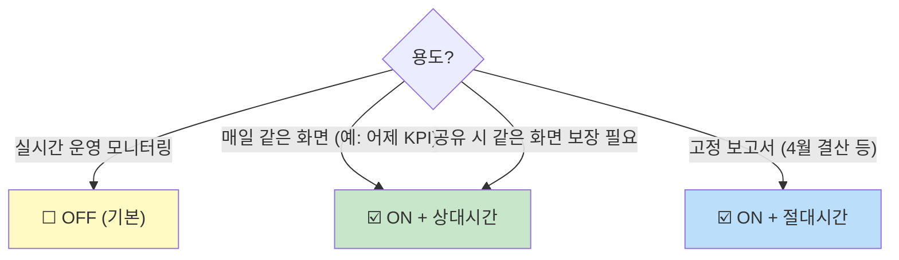

# 99. Q&A — 학습 중 발견한 모호한 점 / 추가 질문

> **사용법**: 다른 문서 읽다가 헷갈리는 곳이 있으면 여기에 모아 답합니다. 사용자 ↔ 작성자 핑퐁 기록.
> **양식**: 한 Q 당 (어느 문서 / 원문 / 질문 / 답 / 보강 여부) 5필드.

---

## 작성 양식

```markdown
## Q-NN. (한 줄 제목)

- **출처**: 어느 문서, 어느 섹션 (가능하면 line 또는 헤더)
- **원문 / 맥락**:
  > 인용

- **Q**: 무엇이 헷갈리나
- **A**: 답변 (가능하면 예시 + Oracle 비유)
- **문서 보강**: 원 문서에 반영함 / 안 함 (사유)
```

---

## Q-01. `_source` 하위 (data 외) 에 에러 여부 필드가 있다면 indexed 인지 어떻게 확인?

- **출처**: 사용자 제기 (08-card-platform-payload-strategy.md 보강 계기)
- **맥락**: 카드 결제 플랫폼 환경에서 `data.header/body` 는 unindexed. 하지만 `_source` 의 top-level (data 와 동일 깊이) 에 `isError` / `errorYn` 같은 에러 플래그 필드가 있는 경우. indexed 여부 확인 + 활용 방법.

### Q
1. 이 필드가 검색·집계에 쓸 수 있는 상태인가?
2. 만약 indexed 면 Phase 2 (runtime field) 까지 안 가도 에러 KPI 가능?

### A

**확인 4 방법** (직접적인 순서):

#### ① 패턴으로 (이름 모를 때)

```
GET api-logs-*/_mapping/field/*error*
```

응답에 매핑 정의가 보이면 → indexed 또는 적어도 매핑됨.
응답이 비어 있으면 → 매핑 자체가 없음.

#### ② 정확한 이름 알면 (`_field_caps` — 가장 정확)

```
GET api-logs-*/_field_caps?fields=isError,error,errorYn
```

응답:
```json
{
  "fields": {
    "isError": {
      "boolean": {
        "type": "boolean",
        "searchable": true,    ← KQL/필터 가능
        "aggregatable": true   ← 집계 가능
      }
    }
  }
}
```

| `searchable` | `aggregatable` | 결론 |
|:-:|:-:|---|
| ✅ | ✅ | **완전 indexed** — 즉시 KPI 사용 가능 |
| ✅ | ❌ | text 만 — `.keyword` 시도 |
| ❌ | ❌ | unindexed (`enabled: false` 등) — runtime field 필요 |

#### ③ 실제 aggregation 로 검증

```json
GET api-logs-*/_search
{
  "size": 0,
  "aggs": { "by_error": { "terms": { "field": "isError" } } }
}
```

성공 응답 → indexed. `illegal_argument_exception` → text 거나 unindexed.

#### ④ Discover UI

좌측 사이드바에서 필드 검색 → 클릭 → "Top values" popup 즉시 뜸 → indexed. "field is not aggregatable" → text/unindexed.

### indexed 인 경우 즉시 활용

```
KQL: isError : true                                       ← 모든 에러
Lens Formula: count(kql='isError:true') / count(kql='log_type:"out"')   ← 에러율
Alert: count(isError:true) > 100 in 5min                  ← 알림 룰
```

→ **Phase 2 (runtime field) 안 가도** Phase 1 에서 SRE 4 golden signals 의 Errors 채워짐.

### 한계 (그래도 Phase 2+ 가 필요한 부분)

`isError` 만으로는 다음 못 함:
- 어떤 **에러 코드** 가 많은가 (`data.header.resultCode`)
- **채널/가맹점/거래액** 별 분포

→ 운영 1차 신호는 OK, 진단 깊이는 Phase 2+ 필요.

### 문서 보강
- ✅ 본 99-qna 에 정식 등록
- ✅ 08-card-platform-payload-strategy.md §3 (Phase 1) 의 첫 단계로 "**top-level 에러 플래그 존재 확인**" 추가

---

## Q-02. Dashboard 저장 시 "Store time with dashboard" 옵션은 무엇?

- **출처**: 사용자 제기 (03-dashboards 실습 중)
- **맥락**: Kibana 에서 dashboard 저장(Save) 다이얼로그에 체크박스 옵션 "Store time with dashboard". 켜기/끄기 차이가 헷갈림.

### Q
체크 vs 미체크 동작 차이는? 어떤 경우에 어느 쪽?

### A

| 옵션 | 의미 | 동작 |
|---|----|----|
| ☑️ **ON** | dashboard 와 **시간 범위 함께 저장** | 누가 언제 열어도 저장한 그 시간 범위로 자동 |
| ☐ **OFF (기본)** | 시간 범위 저장 X | 사용자의 현재 시간 피커 유지 (또는 브라우저 default) |

#### 저장되는 시간의 종류 (ON 일 때)

- **상대 시간** (`Last 7 days` 등) → 열 때마다 "지금 기준 -7일" 자동 계산. 가장 흔히 ON 으로 사용.
- **절대 시간** (`2026-04-01 ~ 2026-04-07`) → 영구 고정. 결산 보고서 용.

#### 의사결정



#### Dashboard 별 권장 (예시)

| Dashboard | 권장 | 이유 |
|-----------|----|----|
| D1 API 운영 현황 | OFF | 운영자가 그때그때 1h/24h/7d 자유 조정 |
| D2 에러 진단 | OFF | 사고 발생 시 임의 시간대 분석 |
| D3 트래픽 패턴 | **ON + Last 7 days** | "주간 트렌드" 가 정체성 |
| 월간 결산 | **ON + 절대시간** | 그 달 고정 보고서 |

#### 흔한 함정

- ON + 절대시간 → 한 달 후 보면 옛날 데이터만 (의도였지만 모르고 보면 혼란)
- OFF + 사용자 default `Last 15 min` → "데이터 없음" 함정 (시간 피커 안 만진 채 데이터 범위 밖)
- 같은 dashboard 를 두 그룹이 다른 시간대로 본다면 OFF 가 안전

### 문서 보강
- ✅ 본 99-qna 에 정식 등록
- 🔄 [03-dashboards.md](03-dashboards.md) §"Save 시 옵션" 에 추후 인라인 추가 가능

---

## (이후 등록될 Q 자리)

학습 진행하시며 막히는 지점 알려 주시면 여기에 추가합니다.

---

## 자주 묻는 질문 시드 (예시)

문서를 읽기 전에 통상적으로 자주 나오는 질문 모음. 답이 이미 본 문서에 없을 때만 정식 Q-NN 으로 격상.

### S1. KQL 의 `:` 와 SQL 의 `=` 가 정말 같은가?
- 거의 같지만, KQL 의 `:` 는 텍스트 검색의 경우 **analyzer 적용** 결과와 매칭. keyword 필드면 1:1, text 필드면 token 매칭.
- 정확 매칭이 필요하면 keyword 필드 사용 또는 `match_phrase` (DSL).

### S2. 매번 데이터 조회할 때 `_search` 가 헤비하다는데?
- ES `_search` 는 cache·shard 조회 모두 거치는 가장 일반화된 API. 가벼움.
- "헤비" 는 잘못된 query (`size: 10000`, 와일드카드 `*foo*` 등) 가 무거운 것. query 가 가벼우면 `_search` 자체는 ms 단위.

### S3. ES 에서 transaction (커밋/롤백) 이 정말 안 되나?
- 단일 document 의 read/update 는 atomic.
- 여러 document 에 걸친 transaction 은 없음. application 측 saga / compensating transaction 패턴.
- **대안**: bulk API 의 single batch 는 부분 실패 가능 (전부/전무 보장 없음). 결과의 `errors` 플래그 확인 필수.

### S4. 매핑이 폭발한다는 게 무슨 말?
- Dynamic 매핑이 ON 인 상태에서 schema 가 매번 다른 JSON (예: `data.123`, `data.124`, ... 변동 키) 이 들어오면 ES 가 자동으로 모든 키를 매핑.
- 결과: 인덱스의 매핑이 수만 개 필드로 폭증 → 메모리/디스크/검색 모두 느려짐.
- **방어**: `dynamic: strict` 또는 `flattened` 타입 사용.

### S5. "근사값" 이라는 aggregation 이 실제 비즈니스에 문제 되나?
- `cardinality` (HyperLogLog) — 0.5% 오차 (precision_threshold 기본 3000). 100K 까지는 거의 정확.
- `terms` aggregation — shard 별 top → coordinator 합산 방식. 전체 cardinality 가 size 보다 훨씬 크면 누락 가능.
- **언제 문제**: 결제 합산 같이 정확값 필수면 부적합. 운영 모니터링은 99% 케이스 OK.

### S6. ES 인덱스 1개에 1억 docs 들어가면 안전한가?
- 단일 shard 의 권장 크기: **20~50GB** 또는 **2~5억 docs** (워크로드 따라).
- 1억 docs 면 single shard 도 OK. 단 검색 latency 가 늘 수 있음.
- 더 크면 shard 수 늘리거나 시간 기반 인덱스 분리.

### S7. Dashboard 에서 시간 피커가 모든 패널에 적용되는데, 한 패널만 다른 시간을 보고 싶다면?
- 패널 ⋮ → Edit → 좌측 위 시간 옵션 → "Use a custom time range" 활성화.
- 또는 패널 자체에 KQL 의 `@timestamp >= "..."` 를 넣을 수 있지만 추천 X.

### S8. transformation 결과 인덱스의 매핑을 미리 정의하지 않으면?
- ES 가 dynamic 매핑으로 추론. percentile aggregation 결과가 nested object 로 매핑되는 등 의도와 다를 수 있음.
- **권장**: transform 만들기 전 `_index_template` 으로 결과 인덱스의 매핑 미리 박아두기.

---

## 보강 정책

새 Q-NN 이 등록되면:

1. 답변을 여기 (99-qna.md) 에 명시
2. **만약 원 문서에 빠져 있는 정보**라면 → 원 문서에도 추가 (cross-reference)
3. 동일 질문이 두 번 이상 나오면 → 원 문서의 ❓ Self-check 에도 합류

이렇게 하면 다음 학습자는 같은 질문 안 할 가능성 ↑.
