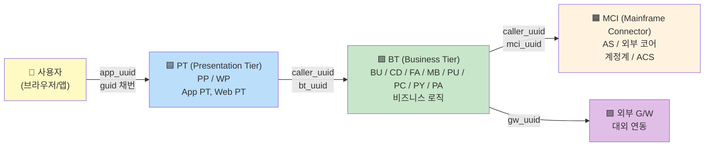
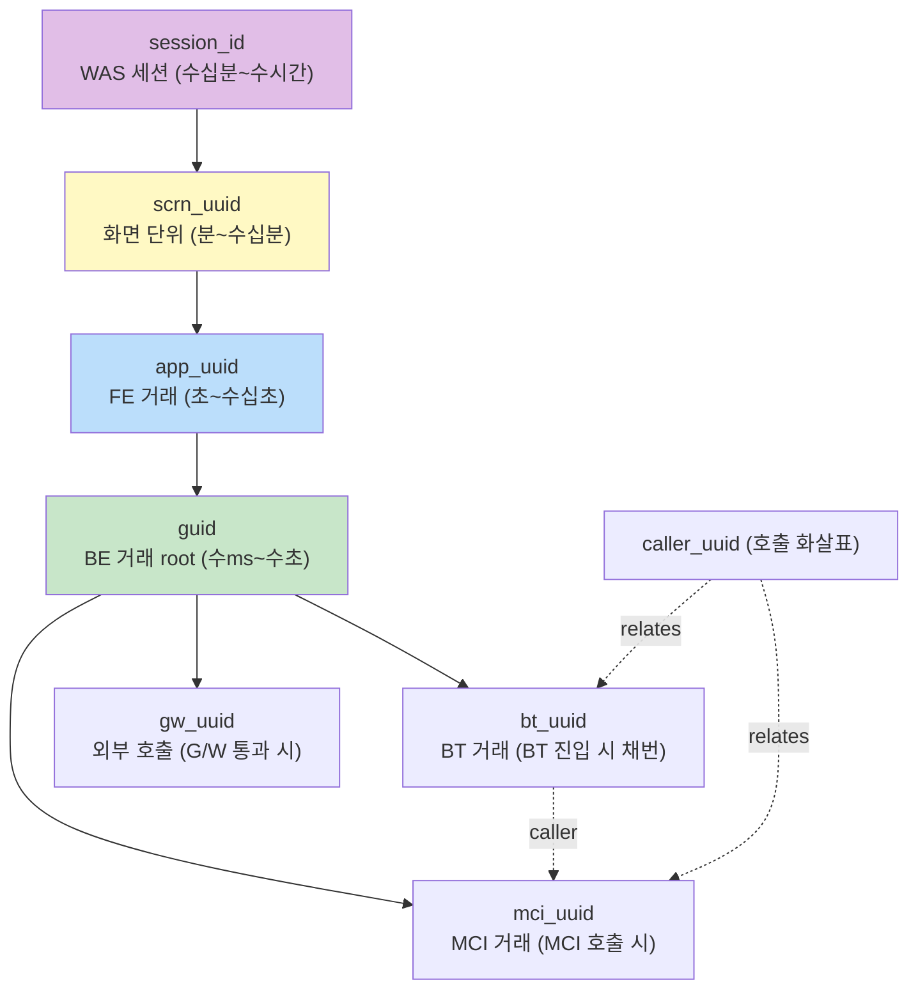
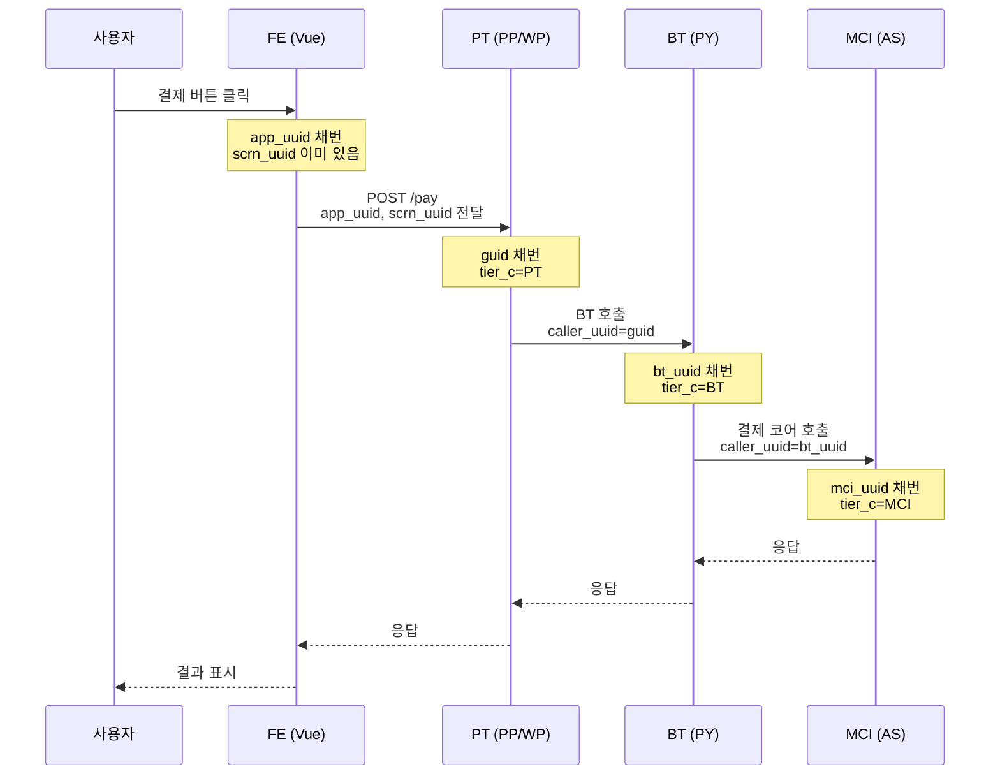

# 99. 3-Tier 분산 추적 (PT / BT / MCI) 가이드

> **목적**: 실 운영 환경의 **3-tier 아키텍처** + **8종 trace ID** 를 활용한 분산 추적·KPI 분석. 09 문서의 M-P4 (Inter-Service Latency) 의 진짜 구현체.
> **선수**: [99-real-document.md](99-real-document.md), [09a-real-field-mapping.md](09a-real-field-mapping.md)

---

## Executive Summary



**왜 이게 가치 큰가**:
- 일반 ECS 단일 trace_id 보다 **풍부한 인과 관계** — "PT 가 느렸나? BT 가 느렸나? MCI 가 느렸나?" 를 한 화면에서 분리
- 사용자 화면 단위 묶음 (`scrn_uuid`) 으로 UX painPoint 직접 추적
- 같은 `guid` 의 sub-trace (app/bt/mci/gw) 로 분산 호출 graph 시각화

---

## 1. 8종 Trace ID 매트릭스

### 1.1 정체와 채번 시점

| ID | 채번 시점 | 위치 | 단위 |
|---|---|---|---|
| **`guid`** | 사용자 액션 → BE 진입 시 | PT (최초) | **BE 전체 거래** (root) |
| `app_uuid` | FE axios 호출 시 | 브라우저/앱 | FE 거래 |
| `scrn_uuid` | 화면 진입 (router) 시 | FE | 화면 단위 (그 화면의 모든 거래 포함) |
| `bt_uuid` | BT MSA 진입 시 | BT layer | BT 거래 |
| `mci_uuid` | MCI 호출 시 | BT → MCI | MCI 거래 |
| `gw_uuid` | 대외 G/W 호출 시 | BT → 외부 | 외부 호출 |
| `caller_uuid` | 호출 관계 | 호출자가 callee 에 전달 | **호출 chain** |
| `session_id` | WAS 세션 생성 | WAS | 사용자 세션 |

### 1.2 포함 관계 (가장 큰 → 작은 단위)



### 1.3 어느 ID 를 언제?

| 분석 목적 | 사용할 ID |
|---|---|
| BE end-to-end 거래 추적 | **`guid`** |
| FE → BE 연결 | `app_uuid` ↔ `guid` (in 시점 매칭) |
| 사용자 화면 funnel 분석 | `scrn_uuid` (그 화면의 모든 svc_id 시퀀스) |
| 사용자 세션 분석 | `session_id` 또는 `dgtl_cusno + cd_cusno` |
| PT → BT latency 측정 | `guid` 같은 doc 의 `tier_c:PT` vs `tier_c:BT` 시간 차 |
| BT → MCI latency 측정 | `guid` 같은 doc 의 `tier_c:BT` vs `tier_c:MCI` 시간 차 |
| 호출 graph 시각화 | `caller_uuid` 로 이전 호출자 식별 |
| 외부 의존성 (G/W) 영향 | `gw_uuid` 존재 여부 + 그 doc 의 proc_tm |
| stuck request 감지 | `guid` 단위 *_IN 만 있고 *_OUT 없음 |

---

## 2. 호출 Chain 추적 — 시나리오 4종

### 2.1 시나리오 A: 사용자 결제 1건의 end-to-end 추적

#### 흐름



#### KQL — 한 거래의 모든 doc

```kql
guid : "2604291607370NCDPOPTP9833096501"
```
→ 그 거래의 PT/BT/MCI doc 모두 (각 in/out 페어 = 6 docs 이상).

#### Lens 시각화 (시계열)

```
Type:           Bar (gantt-like)
X-axis:         @timestamp
Y-axis:         tier_c (3 row: PT/BT/MCI)
Filter (KQL):   guid : "<특정 거래>"
Color:          log_div (in/out 구분)
```

→ tier 별 in/out 시점이 시간순으로 보이며, **어느 tier 에서 시간이 길었는지** 한눈에.

### 2.2 시나리오 B: PT → BT 평균 latency

#### 정의
같은 `guid` 의 PT 의 `*_OUT` 시간 vs BT 의 `*_IN` 시간 차이 = PT→BT 호출 latency.

#### Transform 정의

```json
PUT _transform/tier-latency-5m
{
  "source": {
    "index": "<real-index-pattern>"
  },
  "dest": { "index": "transform-tier-latency-5m" },
  "pivot": {
    "group_by": {
      "ts":   { "date_histogram": { "field": "@timestamp", "calendar_interval": "5m" } },
      "guid": { "terms": { "field": "guid", "size": 1000 } }
    },
    "aggregations": {
      "pt_out_ts":  {
        "filter": { "bool": { "filter": [
          { "term": { "tier_c": "PT" } },
          { "wildcard": { "log_div": "*_OUT" } }
        ]}},
        "aggs": { "ts": { "max": { "field": "@timestamp" } } }
      },
      "bt_in_ts":   {
        "filter": { "bool": { "filter": [
          { "term": { "tier_c": "BT" } },
          { "wildcard": { "log_div": "*_IN" } }
        ]}},
        "aggs": { "ts": { "min": { "field": "@timestamp" } } }
      },
      "bt_out_ts":  {
        "filter": { "bool": { "filter": [
          { "term": { "tier_c": "BT" } },
          { "wildcard": { "log_div": "*_OUT" } }
        ]}},
        "aggs": { "ts": { "max": { "field": "@timestamp" } } }
      },
      "mci_in_ts":  {
        "filter": { "bool": { "filter": [
          { "term": { "tier_c": "MCI" } },
          { "wildcard": { "log_div": "*_IN" } }
        ]}},
        "aggs": { "ts": { "min": { "field": "@timestamp" } } }
      },
      "pt_to_bt_ms":  {
        "bucket_script": {
          "buckets_path": { "out": "pt_out_ts>ts.value", "in": "bt_in_ts>ts.value" },
          "script": "params.in - params.out"
        }
      },
      "bt_to_mci_ms":  {
        "bucket_script": {
          "buckets_path": { "out": "bt_out_ts>ts.value", "in": "mci_in_ts>ts.value" },
          "script": "params.in - params.out"
        }
      }
    }
  },
  "frequency": "5m",
  "sync": { "time": { "field": "@timestamp", "delay": "60s" } }
}
```

→ 결과 인덱스에서 PT→BT, BT→MCI 별 latency p95/p99 시각화 가능.

📌 **주의**: bucket_script 의 timestamp 차이 — `Date#getMillis()` 기반. 실제 단위 ms 확인.

#### Lens 패널

```
Type:    Line (multi-metric)
X:       ts
Y:       avg(pt_to_bt_ms), avg(bt_to_mci_ms)
Source:  transform-tier-latency-5m
```

#### 가치
- "p95 가 1초 → 어느 tier 가 범인?" 즉답
- BT→MCI 가 spike 면 MCI 인프라 문제 → 외부 의존성 협업
- PT→BT 가 spike 면 사내 네트워크 / BT 큐잉 문제

### 2.3 시나리오 C: 화면 단위 (scrn_uuid) Funnel 분석

#### 시나리오
"결제 화면 진입 → 어느 단계에서 사용자가 이탈?"

#### 데이터
- `scrn_uuid`: 그 화면 진입 시 채번
- 그 화면 안의 모든 거래는 같은 `scrn_uuid` 공유
- `svc_id` 의 시퀀스가 사용자 행동의 funnel

#### 추적 query

```json
GET <real-index>/_search
{
  "query": { "term": { "scrn_uuid": "FN1000000F-e83c6eb19cb844076970c744bcae4706d" } },
  "size": 100,
  "_source": ["@timestamp", "tier_c", "log_div", "svc_id", "msg_c", "proc_tm"],
  "sort": [{"@timestamp": "asc"}]
}
```

→ 그 화면의 모든 거래 시간순. svc_id 시퀀스 = funnel.

#### Funnel 정의 예 (결제 화면)

```
1. 화면 진입            (scrn_uuid 채번)
2. 카드 목록 조회       svc_id: PY_GET_CARDS
3. 결제 시도            svc_id: PY_TRY_PAYMENT
4. 결제 인증            svc_id: PY_AUTH_OTP
5. 결제 완료            svc_id: PY_COMPLETE_PAYMENT
```

각 단계 reach rate:
```
total_screens = cardinality(scrn_uuid)
reach_step_2  = cardinality(scrn_uuid where svc_id=PY_GET_CARDS)
reach_step_3  = cardinality(scrn_uuid where svc_id=PY_TRY_PAYMENT)
...
drop_2_to_3   = (reach_step_2 - reach_step_3) / reach_step_2
```

#### Lens / Vega 시각화

Vega 의 funnel chart 로 단계별 절벽 표시. drop-off 가 큰 단계 = UX painPoint.

### 2.4 시나리오 D: 사용자 retry 후 이탈 추적

#### 시나리오
"한 사용자가 결제 시도 → 에러 → 다시 시도 → 또 에러 → 화면 닫음 (이탈)"

#### 추적 단위
- `dgtl_cusno + cd_cusno` (사용자)
- 같은 `scrn_uuid` 안의 시간순 시도

#### 추적 query

```json
GET <real-index>/_search
{
  "query": {
    "bool": {
      "filter": [
        { "term": { "dgtl_cusno": "D17514365" } },
        { "term": { "tier_c": "PT" } },
        { "wildcard": { "log_div": "*_OUT" } },
        { "range": { "@timestamp": { "gte": "now-1h" } } }
      ]
    }
  },
  "size": 200,
  "_source": ["@timestamp", "scrn_uuid", "svc_id", "sts_c", "msg_c"],
  "sort": [{"@timestamp": "asc"}]
}
```

→ 그 사용자의 1시간 내 모든 거래. 같은 scrn_uuid 에서 sts_c:ERROR 가 반복되면 retry. 그 후 로그 끊기면 이탈.

#### Anomaly 룰 (Alert)

```
KQL: tier_c:"PT" and sts_c:"ERROR"
GROUP BY: dgtl_cusno + scrn_uuid
COUNT > 3 in 5min  → "사용자 retry 폭주" alert
```

→ CS / 운영팀에 즉시 안내. 또는 사용자에게 도움말 push.

---

## 3. tier_c 별 KPI Dashboard 설계

### 3.1 D-Tier1: PT/BT/MCI Health 매트릭스

```
┌─────────────────────────────────────────────────────────────────────────┐
│ 🕒 [Last 1h ▼]                                                          │
├─────────────────────────────────────────────────────────────────────────┤
│         | Availability | p95 ms | TPS    | Errors/min | Top error code │
│ ─────── ┼──────────────┼────────┼────────┼────────────┼──────────────── │
│ PT (PP/ │   99.95%     │  120   │  3.2K  │     2      │ -              │
│   WP)   │              │        │        │            │                │
│ ─────── ┼──────────────┼────────┼────────┼────────────┼──────────────── │
│ BT (CD/ │   99.92%     │  280   │  3.0K  │     5      │ E102 (3)       │
│   FA/   │              │        │        │            │                │
│   PY/…) │              │        │        │            │                │
│ ─────── ┼──────────────┼────────┼────────┼────────────┼──────────────── │
│ MCI (AS │   99.85%     │  450   │  2.1K  │    12      │ 9999 (8)       │
│   /외부)│              │        │        │            │                │
└─────────────────────────────────────────────────────────────────────────┘
```

**Lens** (Table):
```
Rows:     tier_c
Cols:
  - Availability:  formula
  - p95:           percentile(proc_tm, 95)
  - TPS:           count() / 60 (1min)
  - Errors:        count(sts_c:"ERROR")
  - Top msg_c:     terms(msg_c, size=1)
```

### 3.2 D-Tier2: Inter-Tier Latency Trend

```
┌──────────────────────────────────────────────────────────────────┐
│ 📈 PT → BT (call latency)                                         │
│ ┌──────────────────────────────────────────────────────────────┐ │
│ │ p50: ━━━━━━━ 30ms                                            │ │
│ │ p95: ━━━━━━━━━━━ 80ms                                        │ │
│ │ p99: ━━━━━━━━━━━━━━━━━━━━━ 200ms                             │ │
│ └──────────────────────────────────────────────────────────────┘ │
│ 📈 BT → MCI (call latency)                                        │
│ ┌──────────────────────────────────────────────────────────────┐ │
│ │ p50: ━━━━━━━━ 50ms                                           │ │
│ │ p95: ━━━━━━━━━━━━━━━━━━━ 180ms                                │ │
│ │ p99: ━━━━━━━━━━━━━━━━━━━━━━━━━━━━━━ 420ms ← 주목              │ │
│ └──────────────────────────────────────────────────────────────┘ │
└──────────────────────────────────────────────────────────────────┘
```

**Lens** (Multi-metric line, source: transform-tier-latency-5m):
```
X:  ts
Y:  avg(pt_to_bt_ms) — series 1
Y:  avg(bt_to_mci_ms) — series 2
```

### 3.3 D-Tier3: 호출 Chain 분포

```
┌──────────────────────────────────────────────────────────────┐
│ 📊 한 거래(guid) 의 hop 수 분포                                │
│ 1 hop (PT only):       ████ 12%                              │
│ 2 hops (PT→BT):        ████████████████ 45%                  │
│ 3 hops (PT→BT→MCI):    ██████████ 28%                        │
│ 4 hops (PT→BT→MCI+GW): ████ 12%                              │
│ ≥5 hops:                ▎ 3%                                 │
└──────────────────────────────────────────────────────────────┘
```

→ 비정상적으로 많은 hop = 이상 패턴 의심 (회귀 호출 등).

#### Vega 시각화 (옵션)

복잡한 호출 graph 는 Kibana Vega plugin 으로 그래프 시각화.

### 3.4 D-Tier4: 화면별 KPI

```
┌──────────────────────────────────────────────────────────────┐
│ 🖥️ Top 10 화면 (scrn_id) — DAU / 에러율 / p95                  │
│ ┌─────────────────┬──────┬──────┬──────────┐                 │
│ │ scrn_id (scrn_nm)│ DAU  │ 에러% │ p95 ms   │                 │
│ ├─────────────────┼──────┼──────┼──────────┤                 │
│ │ FN1000000F (금융)│ 12K  │ 0.5% │  240    │                 │
│ │ PY1000000P (결제)│ 8K   │ 1.2% │  580    │ ← 주목           │
│ │ ⋯               │      │      │          │                 │
│ └─────────────────┴──────┴──────┴──────────┘                 │
└──────────────────────────────────────────────────────────────┘
```

**Lens**:
```
Rows:    scrn_id (Top 10)
Metrics:
  DAU:   cardinality(dgtl_cusno)
  Error%: count(sts_c:"ERROR") / count() filter tier_c:"PT"
  p95:   percentile(proc_tm, 95)
```

---

## 4. f1r_err — 최초 에러 위치 추적

### 4.1 의미

> PT → BT 연동 시 BT 에서 에러 발생 → 그 BT 거래에 `f1r_err: "Y"` 표기.

→ 같은 에러가 여러 tier 에 카스케이드 되는데, **최초 발생 tier** 만 정확히 파악하면 진짜 원인 추적 가능.

### 4.2 활용

#### 어느 tier 에서 에러가 시작되나?

```kql
log_div : *_OUT and f1r_err : "Y"
```
**Lens**: count by `f1r_c` (tier 표시)

```
f1r_c = MCI: 60% ← 외부 코어 의존성이 가장 자주 첫 에러 발생
f1r_c = BT:  35%
f1r_c = PT:   5%
```

→ MCI 안정성 향상이 ROI 가장 큼.

#### 시나리오별 분포

```kql
log_div : *_OUT and f1r_err : "Y" and svc_c : "PY"      # 결제 도메인의 첫 에러
log_div : *_OUT and f1r_err : "Y" and chan_c : "MA"     # 모바일앱 한정
```

#### Alert
```
KQL: f1r_err : "Y" and f1r_c : "MCI"
조건: count > 100 in 5min → MCI 측 장애 가능성 P0
```

---

## 5. caller_uuid — 호출 Graph 시각화

### 5.1 메커니즘

```
caller_uuid = "이 doc 을 호출한 상위 거래 ID"

PT (guid=A) 의 caller_uuid: 없음 또는 같은 A
BT (bt_uuid=B) 의 caller_uuid: A (PT 의 guid)
MCI (mci_uuid=C) 의 caller_uuid: B (BT 의 bt_uuid)
```

→ caller_uuid 따라가면 호출 chain 복원.

### 5.2 호출 chain 추적 query

```json
GET <real-index>/_search
{
  "query": { "term": { "guid": "<root>" } },
  "_source": ["tier_c", "svc_c", "svc_id", "log_div", "@timestamp", "caller_uuid", "bt_uuid", "mci_uuid"],
  "sort": [{"@timestamp": "asc"}],
  "size": 100
}
```

→ 같은 root guid 의 모든 doc, 시간순. caller_uuid 따라 parent 찾으면 트리 구성.

### 5.3 시각화 — Vega 또는 외부 도구

Kibana Vega 로 force-directed graph:
- node = 각 tier 의 거래 (PT/BT/MCI)
- edge = caller_uuid 관계
- color = sts_c (정상/에러)
- size = proc_tm

→ "한 거래의 호출 graph 한눈에" 사고 분석에 강력.

### 5.4 caller_uuid 가 비정상적인 경우

```
Pattern: 같은 caller_uuid 가 짧은 시간에 N+1 회 호출됨
```
→ N+1 query problem 또는 무한 루프 의심. M-P6 (Error Bursting API) 와 결합 분석.

---

## 6. 실 운영 painPoint 시나리오 8선

| # | 시나리오 | 활용 trace ID | KPI |
|---|---|---|---|
| 1 | 결제 거절 spike (특정 가맹점) | `guid` + svc_c:"PY" | M-D3 Critical API |
| 2 | 한 사용자의 로그인 retry 후 이탈 | `dgtl_cusno + scrn_uuid` | M-D7 Funnel |
| 3 | 모바일앱 인증 실패율 | `chan_c:MA + svc_c:MB` | M-X4 OS별 |
| 4 | 특정 기기에서만 발생하는 에러 | `device_model + sts_c:ERROR` | M-X5 |
| 5 | MCI 외부 코어 늦어짐 | `tier_c:MCI` p95 spike | M-P4 Inter-Tier |
| 6 | 신규 배포 후 PT 회귀 | timeshift + tier_c:PT | M-D2 + 배포시각 |
| 7 | 화면 funnel 의 결제 버튼 → 인증 단계 drop | `scrn_uuid` 시퀀스 | 시나리오 C |
| 8 | 첫 에러가 BT 에서 시작 시 cascade | `f1r_err:Y + f1r_c:BT` | M-X8 |

각 시나리오는 위 dashboard 또는 saved query 로 즉시 재현 가능.

---

## 7. 회사 환경에서 시작하는 4단계

### Step 1 (Day 1) — 데이터 검증

```
[ ] guid 가 PT/BT/MCI 모든 doc 에 채워져 있는지
[ ] caller_uuid 의 의미 (parent guid? bt_uuid?) 회사에서 확인
[ ] tier_c 의 PT/BT/MCI 분포
[ ] f1r_err 와 fir_err 정확한 필드명
[ ] log_div 의 *_IN/*_OUT 외 다른 값 (예: MCI_RECV) 의미
```

### Step 2 (Day 2~3) — Transform 등록

[§2.2 의 Transform JSON](#22-시나리오-b-pt--bt-평균-latency) 회사 인덱스 패턴으로 교체 후 등록.

### Step 3 (Week 1) — Dashboard 생성

[§3 의 4 Dashboard](#3-tier_c-별-kpi-dashboard-설계) 차례로:
- D-Tier1 (Health Matrix) — 30분
- D-Tier2 (Inter-Tier Latency) — 1시간
- D-Tier3 (호출 Chain 분포) — 1시간
- D-Tier4 (화면별 KPI) — 1시간

### Step 4 (Week 2) — Alert 룰 + 시나리오 학습

- f1r_err 기반 알림 (MCI 장애 조기 감지)
- 결제 funnel drop-off alert
- 사용자 retry 폭주 alert

---

## 8. 한 페이지 요약 (인쇄용)

```
══════════ 8 Trace ID ══════════
guid          BE 거래 root         → end-to-end 추적
app_uuid      FE 거래               → FE↔BE 연결
scrn_uuid     화면 단위              → UX funnel
session_id    WAS 세션              → 사용자 세션
bt_uuid       BT 거래               → tier 내 추적
mci_uuid      MCI 거래              → 외부 코어 의존성
gw_uuid       대외 G/W              → 외부 호출
caller_uuid   호출 chain (parent)    → 호출 graph

══════════ Tier 별 KPI ══════════
PT (PP/WP):    사용자 시각 — Availability, Error rate, p95
BT (BU/CD/FA/...): 비즈니스 로직 — 같은 항목 + 의존성 관리
MCI (AS/외부): 외부 의존 — Error rate, p95 가 가장 변동성

══════════ 핵심 KQL ══════════
한 거래 추적:        guid : "<id>"
PT 사용자 시각:      tier_c : "PT" and log_div : *_OUT
BT→MCI bottleneck:  tier_c : "MCI" and proc_tm > 1000
첫 에러 발생 tier:   f1r_err : "Y" → group by f1r_c
화면 funnel:        scrn_uuid : "<id>" sort by @timestamp
사용자 retry:        dgtl_cusno : "<id>" and sts_c : "ERROR"

══════════ 흔한 함정 ══════════
- caller_uuid 의 정확한 의미 회사 확인 (parent guid? 아니면 다른?)
- log_div 가 *_IN/*_OUT 외 어떤 값 더 있는지
- guid 가 정말 BE 모든 doc 에 채워지는지 (PT/BT/MCI 다 포함?)
- f1r_err 는 BT 한정인지 다른 tier 에도 적용 가능한지
```

---

## 9. 다음

- [09a-real-field-mapping.md](09a-real-field-mapping.md) — 09 KPI 의 모든 mapping
- [09-monitoring-strategy.md](09-monitoring-strategy.md) — 원본 가이드
- [99-real-document.md](99-real-document.md) — 실 운영 doc 구조
